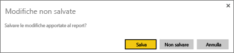
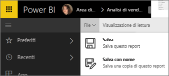
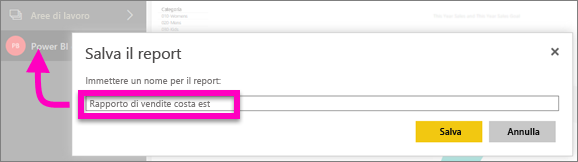

# Salvare un report nel servizio Power BI e in Power BI Desktop
Dopo aver apportato le modifiche a un report in Power BI, è possibile salvarlo con un nuovo nome oppure chiuderlo senza salvare le modifiche. Si supponga di aprire un report, creare una visualizzazione e aggiungerla al dashboard. Se il report viene chiuso senza salvare le modifiche, il riquadro resta nel dashboard, ma la visualizzazione non viene salvata nel report. Quando si fa clic su tale riquadro nel dashboard, il report si apre, ma la visualizzazione non esiste nel report.

> [!TIP]
> Prestare attenzione all'area di lavoro è attiva in modo da trovare il report salvato. Il report viene salvato nell'area di lavoro attiva.
> 
> 

### Per salvare un report:
1. Se si prova a uscire da un report che contiene modifiche, Power BI visualizzerà una richiesta di conferma.
   
   
2. Un altro modo per salvare il report consiste nel selezionare **FILE** \> **Salva** o **Salva con nome**. Nella [Visualizzazione di lettura](service-reading-view-and-editing-view.md) viene visualizzata solo l'opzione Salva con nome. 
   
   
3. Assegnare al report un nome descrittivo, sia che si tratti di un nuovo report (opzione Salva) o di una nuova versione di un report esistente (opzione Salva con nome).  **Il report verrà aggiunto all'area di lavoro attiva**.
   
    

### Passaggi successivi
Altre informazioni sui [report in Power BI](service-reports.md)

[Power BI - Concetti di base](service-basic-concepts.md)

Altre domande? [Provare la community di Power BI](http://community.powerbi.com/)

