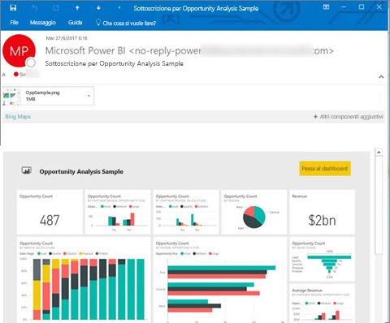
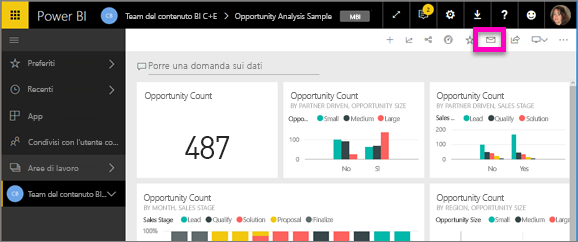
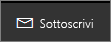
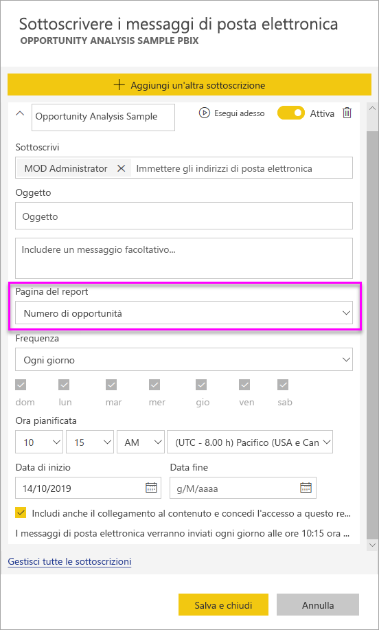
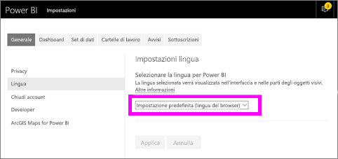
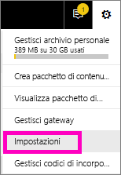
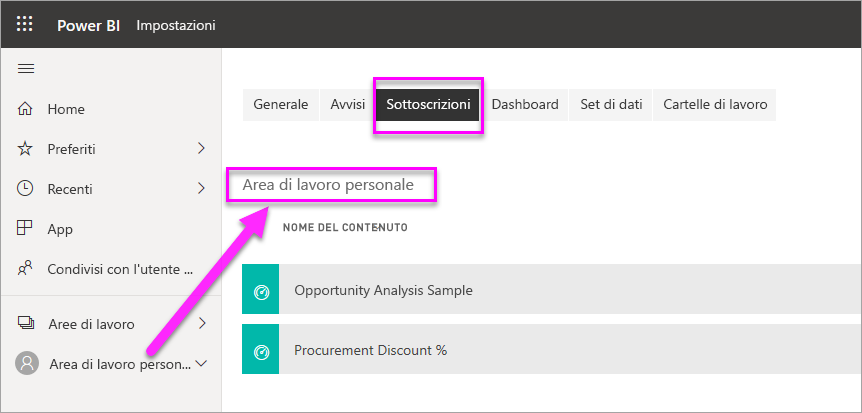

# Sottoscrivere per se stessi e altri utenti report e dashboard nel servizio Power BI

È possibile sottoscrivere autonomamente e i colleghi per le pagine del report, dashboard e report impaginati che più importanti. Power BI via email uno snapshot nella posta in arrivo. Indicare a Power BI con che frequenza si vuole ricevere i messaggi di posta elettronica: giornaliera, settimanale o una volta al giorno dopo l'aggiornamento iniziale dei dati.  Se si sceglie giornaliera o settimanale, è possibile scegliere l'ora si desidera avere la sottoscrizione eseguire.  In tutto, è possibile impostare fino a 24 sottoscrizioni diverse al giorno, per ogni pagina di report e dashboard.

 

È possibile creare sottoscrizioni solo nel servizio Power BI. L'utente riceve un messaggio di posta elettronica con uno snapshot della pagina di report o del dashboard, con un collegamento per aprire il report o il dashboard. Nei dispositivi mobili con app Power BI installate selezionando questo collegamento si avvia l'app Power BI anziché aprire il report o dashboard nel sito Web di Power BI.

## Requisiti

- La **creazione** di una sottoscrizione è una funzionalità di Power BI Pro.
- Non sono necessarie autorizzazioni per la modifica del contenuto (dashboard o report) per creare una sottoscrizione per se stessi, ma tali autorizzazioni sono obbligatorie se si vuole creare una sottoscrizione per altri. 
- A partire da gennaio 2019, non è necessario che sia configurato l'aggiornamento del set di dati per eseguire una sottoscrizione,  che viene eseguita a prescindere da eventuali aggiornamenti pianificati configurati.  

## Sottoscrivere un dashboard, una pagina del report o un report impaginato

Fatto che si sottoscriva un dashboard, report, o report impaginato, il processo è simile. Lo stesso pulsante consente di effettuare la sottoscrizione ai dashboard e ai report del servizio Power BI.

Sottoscrivere i report impaginati è leggermente diverso. Visualizzare [sottoscrivere un report impaginato nel servizio Power BI se stessi e ad altri utenti](paginated-reports-subscriptions.md) per informazioni dettagliate.
 
.

1. Aprire il dashboard o il report.
2. Dalla barra dei menu superiore selezionare **Sottoscrivi** oppure selezionare l'icona a forma di busta .
   
   

3. Usare il dispositivo di scorrimento giallo per attivare e disattivare la sottoscrizione.  Lo spostamento del dispositivo di scorrimento sulla posizione **Disattivato** non comporta l'eliminazione della sottoscrizione. Per eliminare la sottoscrizione, selezionare l'icona a forma di cestino.

4. Il messaggio di posta elettronica è già nella casella **Sottoscrivi**. È possibile aggiungere anche altri indirizzi di posta elettronica alla sottoscrizione, ma solo nello stesso dominio. Se il report o dashboard è ospitato nella [capacità Premium](service-premium-what-is.md), è possibile eseguire la sottoscrizione per altri indirizzi di posta elettronica singoli e alias di gruppi. Se il report o dashboard non è ospitato nella capacità Premium, è possibile eseguire la sottoscrizione per altre persone purché abbiano a loro volta una licenza Power BI Pro. Per maggiori dettagli, vedere [Considerazioni e risoluzione dei problemi](#considerations-and-troubleshooting) più avanti. 

5. Specificare i dettagli dell'**oggetto** e del **messaggio** di posta elettronica. 

5. Selezionare una **frequenza** per la sottoscrizione: **Ogni giorno**, **Ogni settimana** o **Dopo l'aggiornamento dei dati (una volta al giorno)** .  Per ricevere il messaggio della sottoscrizione solo in determinati giorni, selezionare **Ogni settimana** e selezionare i giorni in cui si vuole riceverlo.  Ad esempio, se si vuole ricevere il messaggio della sottoscrizione solo nei giorni feriali, selezionare **Ogni settimana** e deselezionare le caselle **Sab** e **Dom**.  

6. Se si sceglie **Ogni giorno** oppure **Ogni settimana**, è anche possibile scegliere un'**Ora pianificata** per la sottoscrizione.  L'orario può essere l'ora in punto o l'ora e 15, 30 o 45 minuti.  Selezionare mattina (AM) o pomeriggio/sera (PM). È anche possibile specificare il fuso orario.

7. Per impostazione predefinita, la data di inizio per la sottoscrizione è la data in cui viene creata. Si ha la possibilità di selezionare una data di fine. Se non viene impostata, la data di fine è automaticamente un anno dopo la data di inizio. È possibile modificarla impostando una data nel futuro (fino all'anno 9999) in qualsiasi momento prima della scadenza della sottoscrizione. Quando una sottoscrizione raggiunge una data di fine, viene interrotta finché non viene riabilitata. Si riceveranno delle notifiche prima della data di fine pianificata in cui viene chiesto se si intende prorogare la sottoscrizione.    

    Nella schermata riportata di seguito si noti che quando si sottoscrive un report, viene in realtà eseguita una sottoscrizione a una *pagina* di report.  Per sottoscrivere più di una pagina di un report, selezionare **Aggiungi un'altra sottoscrizione** e selezionare una pagina diversa. 
      
     

7. Selezionare **Salva e chiudi**. Gli utenti con sottoscrizione ricevono un messaggio di posta elettronica e uno snapshot della pagina di report o del dashboard per la frequenza e l'ora selezionate. In tutto, si possono creare fino a 24 sottoscrizioni per report o dashboard ed è possibile specificare destinatari, frequenze e orari univoci per ogni sottoscrizione.  Tutte le sottoscrizioni impostate su **Dopo l'aggiornamento dei dati** per il dashboard o report invieranno ancora un messaggio di posta elettronica dopo il primo aggiornamento pianificato.   
      
   > [!TIP]
   > Se si vuole inviare il messaggio di posta elettronica da una sottoscrizione immediatamente o su richiesta in qualsiasi momento, selezionare **Esegui** per le sottoscrizioni per il dashboard o il report da inviare. Verrà visualizzata la notifica dell'invio di un messaggio di posta elettronica a tutti gli utenti per la sottoscrizione specifica.  È possibile farlo con la frequenza nel modo desiderato. dato che non viene conteggiata per il limite di 24 esecuzioni pianificate al giorno per report o dashboard per la sottoscrizione. Non attiva un aggiornamento di dati del set di dati sottostante. 
   > 
   > 
   
## Lingue della posta elettronica

Per il messaggio di posta elettronica e lo snapshot viene usata la lingua specificata nelle impostazioni di Power BI (vedere [Lingue e paesi/aree geografiche supportate per Power BI](supported-languages-countries-regions.md)). Se non è definita alcuna lingua, Power BI usa la lingua in base alle impostazioni internazionali nel browser corrente. Per visualizzare o impostare la preferenza per la lingua, selezionare l'icona a forma di ingranaggio  > **Impostazioni > Generali > Lingua**. 

## Gestire le sottoscrizioni
La sottoscrizione può essere gestita solo dalla persona che l'ha creata.  Per accedere alla schermata per la gestione delle sottoscrizioni, è possibile procedere in due modi.  Selezionare **Gestione di tutte le sottoscrizioni** nella finestra di dialogo **Sottoscrivere i messaggi di posta elettronica** (vedere gli screenshot successivi al passaggio 4). Selezionare l'icona a forma di ingranaggio  di Power BI nella barra dei menu superiore e scegliere **Impostazioni**.

Le sottoscrizioni visualizzate variano in base all'area di lavoro attiva.  Per vedere contemporaneamente tutte le sottoscrizioni per tutte le aree di lavoro, assicurarsi che **Area di lavoro personale** sia attivo. Per altre informazioni sulle aree di lavoro, vedere [Workspaces in Power BI](service-create-workspaces.md) (Aree di lavoro in Power BI).

Una sottoscrizione termina se la licenza Pro scade, il proprietario elimina il dashboard o report o viene eliminato l'account utente usato per creare la sottoscrizione.

## Considerazioni e risoluzione dei problemi

* È possibile che i dashboard con più di 25 riquadri aggiunti o più di 4 pagine report dinamiche aggiunte non vengano visualizzati interamente nei messaggi di posta elettronica della sottoscrizione inviati agli utenti.  Le sottoscrizioni ai dashboard tramite questi numero di riquadri non vengono bloccate. Tuttavia, sono considerate non è supportato se si verificano problemi. È possibile modificare di conseguenza per rientrano in un intervallo supportato.
* Quando si configurano le sottoscrizioni tramite posta elettronica, tenere presente che si verifica un ritardo tra quando viene avviato il processo di sottoscrizione e l'ora esatta che viene inviato il messaggio di posta elettronica.  Per ridurre al minimo il ritardo tra i due, consente di impostare un'ora diversa per l'aggiornamento pianificato dei dati rispetto a quando la sottoscrizione di posta elettronica è pianificata l'esecuzione.
* Per le sottoscrizioni tramite posta elettronica di dashboard, se tutte le sezioni dispone di sicurezza a livello di riga (RLS) applicata, tali riquadri non vengono visualizzati.  
* Per le sottoscrizioni tramite posta elettronica di report, se il set di dati Usa a livello di riga, è possibile creare una sottoscrizione per se stessi. È possibile sottoscrivere altri utenti a un report con sicurezza a livello di riga (RLS) applicata.
* Le sottoscrizioni alle pagine dei report sono associate al nome della pagina del report. Se si sottoscrive una pagina del report e dopo la si rinomina, è necessario ricreare la sottoscrizione.
* L'organizzazione potrebbe configurare determinate impostazioni in Azure Active Directory per limitare la possibilità di usare le sottoscrizioni tramite posta elettronica in Power BI.  Queste limitazioni includono, a titolo di esempio, l'autenticazione a più fattori o la presenza di restrizioni dell'intervallo IP quando si accede alle risorse.
* Attualmente le sottoscrizioni tramite posta elettronica per report e dashboard che usano connessioni dinamiche non sono supportate per le sottoscrizioni di altri utenti.
* Le sottoscrizioni via posta elettronica non supportano la maggior parte degli [oggetti visivi personalizzati](power-bi-custom-visuals.md).  L'unica eccezione è costituita dagli oggetti visivi personalizzati che sono stati [certificati](power-bi-custom-visuals-certified.md).  
* Attualmente le sottoscrizioni via posta elettronica non supportano oggetti visivi R personalizzati.  
* Le sottoscrizioni tramite posta elettronica vengono inviate con gli stati di filtro e filtro dei dati predefinito del report. Eventuali modifiche ai valori predefiniti apportate dopo la sottoscrizione non vengono visualizzate nel messaggio di posta elettronica.    
* Per le sottoscrizioni ai dashboard, in particolare, alcuni tipi di riquadri non sono ancora supportati,  tra cui: riquadri di streaming, riquadri video, riquadri di contenuto Web personalizzato.     
* Se si condivide un dashboard con un collega al di fuori del tenant, non è possibile creare anche una sottoscrizione per il collega. Di conseguenza, se si è aaron@xyz.com è possibile condividere con anyone@ABC.com, ma non è possibile sottoscrivere anyone@ABC.com che non può sottoscrivere contenuto condiviso.      
* Power BI sospende automaticamente l'aggiornamento nei set di dati associati ai dashboard e ai report che non vengono visitati da più di due mesi.  Tuttavia, se si aggiunge una sottoscrizione a un dashboard o un report, l'aggiornamento non viene sospeso anche nel caso in cui non sia stato visitato.    
* Se non si ricevono i messaggi di posta elettronica relativi alla sottoscrizione, assicurarsi che il Nome dell'entità utente sia in grado di ricevere messaggi di posta elettronica. [Il team di Power BI si sta impegnando per rendere meno rigoroso questo requisito](https://community.powerbi.com/t5/Issues/No-Mail-from-Cloud-Service/idc-p/205918#M10163) e fornirà presto notizie in merito. 
* Se il dashboard o il report è nella capacità Premium, è possibile usare alias di posta elettronica di gruppo per le sottoscrizioni anziché eseguire le sottoscrizioni per un indirizzo alla volta. Gli alias sono basati sull'istanza corrente di Active Directory. 

## Passaggi successivi

- [Sottoscrizione di se stessi o altri utenti a un report impaginato nel servizio Power BI](paginated-reports-subscriptions.md)
- Altre domande? [Provare a rivolgersi alla community di Power BI](http://community.powerbi.com/)    
- [Leggere il post di blog](https://powerbi.microsoft.com/blog/introducing-dashboard-email-subscriptions-a-360-degree-view-of-your-business-in-your-inbox-every-day/)
