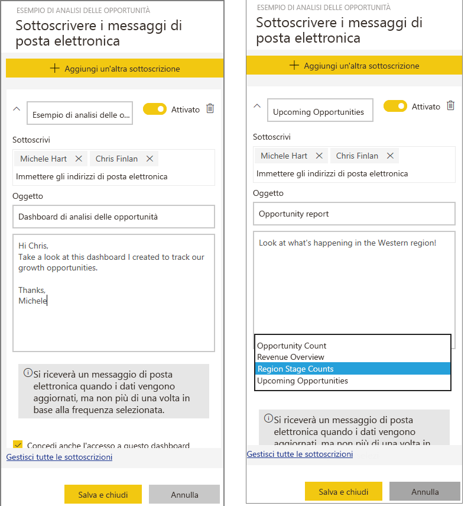
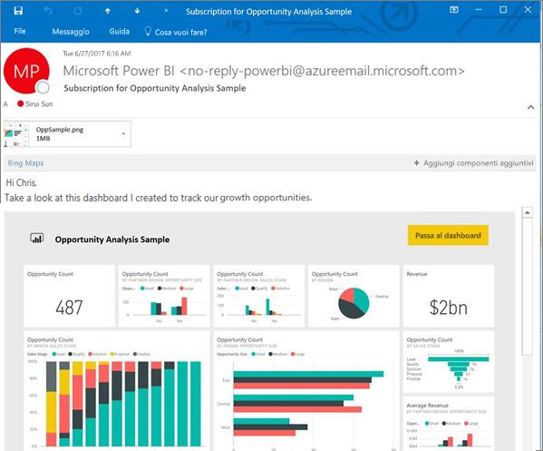

# Sottoscrivere un report o un dashboard nel servizio Power BI (app.powerbi.com)
Rimanere aggiornati sui dashboard e sui report più importanti non è mai stato così facile. Eseguire una sottoscrizione per se stessi e per i propri colleghi alle pagine dei report e dei dashboard più importanti e Power BI invierà uno snapshot nella posta in arrivo. È possibile indicare con quale frequenza si vogliono ricevere i messaggi di posta da Power BI, da una volta al giorno a una volta alla settimana. 

Per il messaggio di posta elettronica e lo snapshot verrà usata la lingua specificata nelle impostazioni di Power BI (vedere [Lingue e paesi/aree geografiche supportate per Power BI](supported-languages-countries-regions.md)). Se non è definita alcuna lingua, Power BI usa la lingua in base alle impostazioni internazionali nel browser corrente. Per visualizzare o impostare la preferenza per la lingua, selezionare l'icona a forma di ingranaggio  > **Impostazioni > Generali > Lingua**. 

È possibile creare sottoscrizioni solo nel servizio Power BI. Il messaggio di posta elettronica ricevuto includerà un collegamento "Passa al report" o "Passa al dashboard". Nei dispositivi mobili con l'app Power BI installata, selezionando questo collegamento si avvia l'app (anziché l'azione predefinita di apertura del report o del +dashboard nel sito Web di Power BI).

## Requisiti
- La **creazione**  di una sottoscrizione è una funzionalità di Power BI Pro ed è necessario avere le autorizzazioni di modifica per il contenuto (dashboard o report) per creare la sottoscrizione. 
- Poiché i messaggi di posta elettronica di sottoscrizione vengono inviati solo quando viene aggiornato un set di dati, le sottoscrizioni non funzionano nei set di dati che non vengono aggiornati.

## Sottoscrivere una pagina di report o dashboard
Il processo di sottoscrizione a un dashboard o un report è molto simile. Lo stesso pulsante consente di effettuare la sottoscrizione per se stessi (e altri) ai dashboard e ai report del servizio Power BI.
 
.

1. Aprire il dashboard o il report.
2. Nella barra dei menu superiore selezionare **Sottoscrivi** oppure l'icona a forma di busta .
   
   

3. Usare il dispositivo di scorrimento giallo per attivare e disattivare la sottoscrizione.  Lo spostamento del dispositivo di scorrimento sulla posizione Disattivato non comporta l'eliminazione della sottoscrizione. Per eliminare la sottoscrizione, selezionare l'icona a forma di cestino.

4. Specificare i dettagli del messaggio di posta elettronica. Il messaggio di posta elettronica è già popolato ma è possibile aggiungere altri utenti alla sottoscrizione. È possibile aggiungere solo indirizzi di posta elettronica dello stesso dominio (per informazioni dettagliate, vedere **Considerazioni e risoluzione dei problemi** più avanti). Se il report o il dashboard è ospitato nella [capacità Premium](service-premium.md), è possibile eseguire la sottoscrizione per altri utenti usando indirizzi di posta elettronica singoli e alias di gruppi. Se il report o il dashboard non è ospitato nella capacità Premium, è comunque possibile eseguire la sottoscrizione per altri utenti usando indirizzi di posta elettronica singoli, ma è necessario che abbiano licenze di Power BI Pro.

    Nelle schermate riportate di seguito si noti che quando si sottoscrive un report, viene in realtà eseguita una sottoscrizione a una *pagina* di report.  Per sottoscrivere più di una pagina di un report, selezionare **Aggiungi un'altra sottoscrizione** e selezionare una pagina diversa. 
      
   

5. Selezionare **Salva e chiudi** per salvare la sottoscrizione. Gli utenti che hanno eseguito la sottoscrizione ricevono un messaggio di posta elettronica e uno snapshot del dashboard o della pagina di report ogni volta che viene apportata una modifica a uno dei set di dati sottostanti. Se il dashboard o il report viene aggiornato più di una volta al giorno, il messaggio di posta elettronica viene inviato solo dopo il primo aggiornamento.  
   
   
   
   > [!TIP]
   > Per visualizzare immediatamente il messaggio di posta elettronica, Attivare un messaggio di posta elettronica aggiornando uno dei set di dati associati al dashboard o al report. Se non si hanno le autorizzazioni di modifica per il set di dati, sarà necessario chiedere a un utente che abbia tali autorizzazioni per eseguire questa operazione. Per scoprire quali set di dati vengono usati, selezionare l'icona **Visualizza elementi correlati**  per aprire **Contenuto correlato** e quindi selezionare l'icona di aggiornamento . 
   > 
   > 
   
   

## Come determinare la pianificazione di posta elettronica
La tabella seguente descrive la frequenza con cui si riceverà un messaggio di posta elettronica. Tutto dipende dal metodo di connessione del set di dati su cui è basato il dashboard o il report (DirectQuery, Live Connect, importato in Power BI o file di Excel in OneDrive o SharePoint Online) e dalle opzioni di sottoscrizione disponibili e selezionate (giornaliera, settimanale o nessuna).

|  | **DirectQuery** | **Live Connect** | **Aggiornamento pianificato (importazione)** | **File di Excel in OneDrive/SharePoint Online** |
| --- | --- | --- | --- | --- |
| **Con quale frequenza viene aggiornato il report/dashboard?** |Ogni 15m |Power BI controlla ogni 15 minuti e, se il set di dati è stato modificato, il report viene aggiornato. |L'utente seleziona nessuna, giornaliera o settimanale. La frequenza giornaliera può essere fino a 8 volte al giorno. La frequenza settimanale è effettivamente una pianificazione settimanale creata dall'utente, in base alla quale viene impostato l'aggiornamento, da una volta alla settimana a una volta al giorno. |Una volta ogni ora |
| **Quale livello di controllo ha l'utente sulla pianificazione di posta elettronica della sottoscrizione?** |Le opzioni sono: giornaliera o settimanale |Nessuna opzione: agli utenti viene inviato un messaggio di posta elettronica se il report viene aggiornato, ma non più di una volta al giorno. |Se la pianificazione dell'aggiornamento è giornaliera, le opzioni sono giornaliera e settimanale.  Se la pianificazione dell'aggiornamento è settimanale, l'unica opzione è settimanale. |Nessuna opzione: all'utente viene inviato un messaggio di posta elettronica ogni volta che il set di dati viene aggiornato, ma non più di una volta al giorno. |

## Gestire le sottoscrizioni
La sottoscrizione può essere gestita solo dalla persona che l'ha creata.  Per accedere alla schermata per la gestione delle sottoscrizioni, è possibile procedere in due modi.  Selezionare **Gestione di tutte le sottoscrizioni** nella finestra di dialogo **Sottoscrivere i messaggi di posta elettronica** (vedere gli screenshot successivi al passaggio 4). Selezionare l'icona a forma di ingranaggio  di Power BI nella barra dei menu superiore e scegliere **Impostazioni**.

Le sottoscrizioni visualizzate variano in base all'area di lavoro attiva.  Per vedere contemporaneamente tutte le sottoscrizioni per tutte le aree di lavoro, assicurarsi che **Area di lavoro personale** sia attivo. Per altre informazioni sulle aree di lavoro, vedere [Workspaces in Power BI](service-create-distribute-apps.md) (Aree di lavoro in Power BI).

Una sottoscrizione termina se la licenza Pro scade, il dashboard o il report viene eliminato dal proprietario o l'account utente usato per creare la sottoscrizione viene eliminato.

## Considerazioni e risoluzione dei problemi
* Per le sottoscrizioni tramite posta elettronica ai dashboard, i riquadri a cui è stata applicata la sicurezza a livello di riga non vengono visualizzati.  Per le sottoscrizioni tramite posta elettronica ai report, non sarà possibile creare una sottoscrizione se il set di dati usa la sicurezza a livello di riga.
* Le sottoscrizioni alle pagine dei report sono associate al nome della pagina del report. Se si sottoscrive una pagina del report e la si rinomina, sarà necessario ricreare la sottoscrizione
* Attualmente le sottoscrizioni tramite posta elettronica per report e dashboard che usano connessioni dinamiche non sono supportate per le sottoscrizioni di altri utenti.
* Per le sottoscrizioni tramite posta elettronica nei set di dati con connessione dinamica, si riceveranno messaggi di posta elettronica solo quando vengono modificati i dati. Quindi, se si verifica un aggiornamento ma nessun dato viene modificato, Power BI non invierà alcun messaggio di posta elettronica.
* Le sottoscrizioni tramite posta elettronica non supportano la maggior parte degli [oggetti visivi personalizzati](power-bi-custom-visuals.md).  L'unica eccezione è costituita dagli oggetti visivi personalizzati che sono stati [certificati](power-bi-custom-visuals-certified.md).  
* Attualmente le sottoscrizioni tramite posta elettronica non supportano oggetti visivi R personalizzati.  
* I riquadri dei dashboard a cui è stata applicata la sicurezza a livello di riga non vengono visualizzati.
* Non è possibile iscrivere altri utenti a un report a cui è stata applicata la sicurezza a livello di riga.
* Le sottoscrizioni tramite posta elettronica vengono inviate con gli stati di filtro e filtro dei dati predefinito del report. Eventuali modifiche ai valori predefiniti apportate dopo la sottoscrizione non vengono visualizzate nel messaggio di posta elettronica.    
* Le sottoscrizioni tramite posta elettronica non sono ancora supportate nelle pagine del report create dalla funzione di connessione al servizio in tempo reale di Power BI Desktop.    
* Per le sottoscrizioni ai dashboard, in particolare, alcuni tipi di riquadri non sono ancora supportati,  tra cui: riquadri di streaming, riquadri video, riquadri di contenuto Web personalizzato.     
* Se si condivide un dashboard con un collega al di fuori del tenant, non sarà possibile creare anche una sottoscrizione per il collega. Di conseguenza, se si è aaron@xyz.com è possibile condividere con anyone@ABC.com, ma non è possibile sottoscrivere anyone@ABC.com che non può sottoscrivere contenuto condiviso.      
* Le sottoscrizioni possono non riuscire nei dashboard o nei report con immagini grandi a causa dei limiti delle dimensioni della posta elettronica.    
* Power BI sospende automaticamente l'aggiornamento nei set di dati associati ai dashboard e ai report che non sono stati visitati da più di 2 mesi.  Tuttavia, se si aggiunge una sottoscrizione a un dashboard o un report, l'aggiornamento non verrà sospeso anche nel caso in cui non sia stato visitato.    
* Se non si ricevono i messaggi di posta elettronica relativi alla sottoscrizione, assicurarsi che il Nome dell'entità utente sia in grado di ricevere messaggi di posta elettronica. [Il team di Power BI si sta impegnando per rendere meno rigoroso questo requisito](https://community.powerbi.com/t5/Issues/No-Mail-from-Cloud-Service/idc-p/205918#M10163) e fornirà presto notizie in merito. 
* Se il dashboard o il report è nella capacità Premium, è possibile usare alias di posta elettronica di gruppo per le sottoscrizioni anziché eseguire le sottoscrizioni per un indirizzo alla volta. Gli alias sono basati sull'istanza corrente di Active Directory. 

## Passaggi successivi
* Altre domande? [Provare a rivolgersi alla community di Power BI](http://community.powerbi.com/)    
* [Leggere il post di blog](https://powerbi.microsoft.com/blog/introducing-dashboard-email-subscriptions-a-360-degree-view-of-your-business-in-your-inbox-every-day/)

