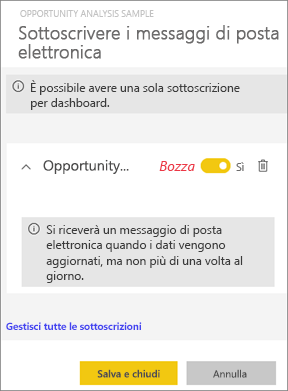
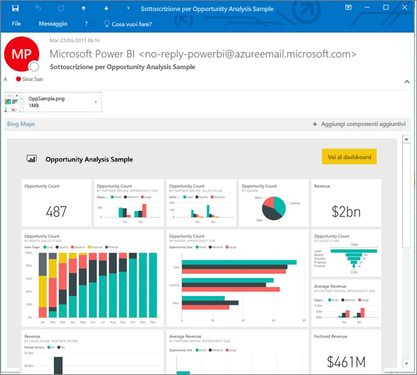
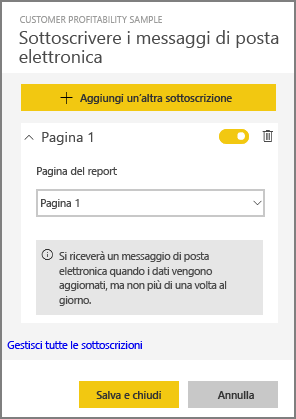
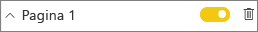
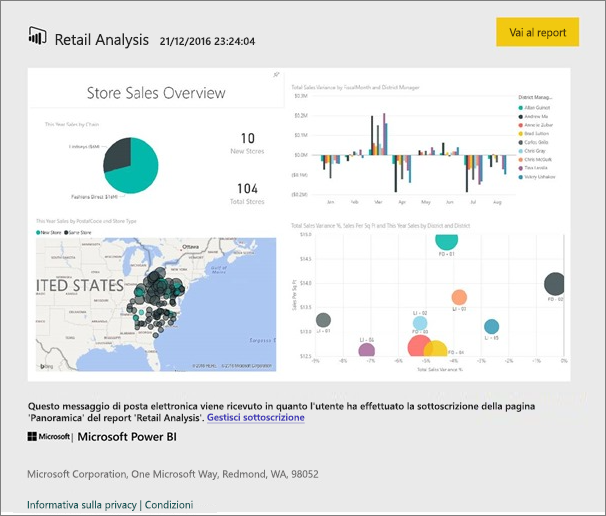
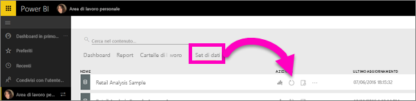

# Sottoscrivere un report o un dashboard di Power BI
Rimanere aggiornati sui dashboard e sui report più importanti non è mai stato così facile. Basta sottoscrivere le pagine dei report e dei dashboard più importanti e Power BI invierà uno snapshot nella posta in arrivo. È possibile indicare con quale frequenza si vogliono ricevere i messaggi di posta da Power BI, da una volta al giorno a una volta alla settimana. 

Per il messaggio di posta elettronica e lo snapshot verrà usata la lingua specificata nelle impostazioni di Power BI (vedere [Lingue e paesi/aree geografiche supportate per Power BI](supported-languages-countries-regions.md)). Se non è definita alcuna lingua, Power BI usa la lingua in base alle impostazioni internazionali nel browser corrente. Per visualizzare o impostare la preferenza per la lingua, selezionare l'icona a forma di ingranaggio  **> Impostazioni > Generali > Lingua**. 

> [!NOTE]
> È possibile creare sottoscrizioni solo nel servizio Power BI. Il messaggio di posta elettronica ricevuto includerà un collegamento "Vai al report/dashboard". Nei dispositivi mobili con l'app Power BI installata, selezionando questo collegamento si avvia l'app (anziché l'azione predefinita di apertura del report o del +dashboard nel sito Web di Power BI).
> 
> 

Guardare il video per vedere come impostare una sottoscrizione tramite posta elettronica per un report. Seguire quindi tutte le istruzioni riportate sotto il video per provare a farlo da soli.

<iframe width="560" height="315" src="https://www.youtube.com/embed/saQx7G0pxhc" frameborder="0" allowfullscreen></iframe>

## Requisiti
La **creazione**  di una sottoscrizione è una funzionalità di Power BI Pro ed è necessario avere le autorizzazioni di visualizzazione o modifica per il contenuto (dashboard o report).

## Sottoscrivere un dashboard

1. Aprire il dashboard.
2. Nella barra dei menu superiore selezionare **Sottoscrivi** oppure l'icona a forma di busta .
   
   
3. Usare il dispositivo di scorrimento giallo per attivare e disattivare la sottoscrizione.  Lo spostamento del dispositivo di scorrimento sulla posizione Disattivato non comporta l'eliminazione della sottoscrizione. Per eliminare la sottoscrizione, selezionare l'icona a forma di cestino.
   
   
4. Selezionare **Salva e chiudi** per salvare la sottoscrizione. Si riceverà via email uno snapshot del dashboard ogni volta che uno dei set di dati sottostanti subisce delle modifiche. Se il dashboard viene aggiornato più di una volta al giorno, si riceverà lo snapshot tramite posta elettronica solo dopo il primo aggiornamento.
   
   
   
   > [!TIP]
   > Per visualizzare immediatamente il messaggio di posta elettronica, Attivare un messaggio di posta elettronica aggiornando uno dei set di dati associati al dashboard. Se non si hanno le autorizzazioni di modifica per il set di dati, sarà necessario chiedere a un utente che abbia tali autorizzazioni per eseguire questa operazione. Per scoprire quali set di dati vengono usati per creare il dashboard, dal dashboard selezionare l'icona **Visualizza elementi correlati**  per aprire **Contenuto correlato** e quindi selezionare l'icona di aggiornamento . 
   > 
   > 
   
   

## Sottoscrivere una pagina di un report
1. Aprire il report nella [Visualizzazione di lettura](service-reading-view-and-editing-view.md).
2. Nella barra dei menu superiore selezionare **Sottoscrivi**.
   
   
3. È possibile sottoscrivere una pagina di report alla volta. Selezionare la pagina del report specifica nell'elenco a discesa.
   
   
   
   Continuare ad aggiungere le pagine del report.
4. Usare il dispositivo di scorrimento giallo per attivare e disattivare la sottoscrizione per ogni pagina.  Lo spostamento del dispositivo di scorrimento sulla posizione Disattivato non comporta l'eliminazione della sottoscrizione. Per eliminare la sottoscrizione, selezionare l'icona a forma di cestino.
   
   
5. Selezionare **Salva e chiudi** per salvare la sottoscrizione. Quando il report viene aggiornato, si riceverà uno snapshot tramite posta elettronica di ogni pagina del report. Se il report non viene aggiornato, per quel giorno non si riceverà alcun messaggio di posta elettronica con lo snapshot.  Se il report viene aggiornato più di una volta al giorno, si riceverà lo snapshot tramite posta elettronica solo dopo il primo aggiornamento.
   
   
   
   > [!TIP]
   > Per visualizzare immediatamente il messaggio di posta elettronica, attivare un messaggio aprendo il set di dati e selezionando **Aggiorna ora**. Se non si hanno le autorizzazioni di modifica per il set di dati, sarà necessario chiedere a un utente che abbia tali autorizzazioni per eseguire questa operazione.
   > 
   > 
   > 
   > 

## Come determinare la pianificazione di posta elettronica per i report
La tabella seguente descrive la frequenza con cui si riceverà un messaggio di posta elettronica. Tutto dipende dal metodo di connessione del set di dati su cui è basato il dashboard o il report (DirectQuery, Live Connect, importato in Power BI o file di Excel in OneDrive o SharePoint Online) e dalle opzioni di sottoscrizione disponibili e selezionate (giornaliera, settimanale o nessuna).

|  | **DirectQuery** | **Live Connect** | **Aggiornamento pianificato (importazione)** | **File di Excel in OneDrive/SharePoint Online** |
| --- | --- | --- | --- | --- |
| **Con quale frequenza viene aggiornato il report/dashboard?** |Ogni 15m |Power BI controlla ogni 15 minuti e, se il set di dati è stato modificato, il report viene aggiornato. |L'utente seleziona nessuna, giornaliera o settimanale. La frequenza giornaliera può essere fino a 8 volte al giorno. La frequenza settimanale è effettivamente una pianificazione settimanale creata dall'utente, in base alla quale viene impostato l'aggiornamento, da una volta alla settimana a una volta al giorno. |Una volta ogni ora |
| **Quale livello di controllo ha l'utente sulla pianificazione di posta elettronica della sottoscrizione?** |Le opzioni sono: giornaliera o settimanale |Nessuna opzione: agli utenti viene inviato un messaggio di posta elettronica se il report viene aggiornato, ma non più di una volta al giorno. |Se la pianificazione dell'aggiornamento è giornaliera, le opzioni sono giornaliera e settimanale.  Se la pianificazione dell'aggiornamento è settimanale, l'unica opzione è settimanale. |Nessuna opzione: all'utente viene inviato un messaggio di posta elettronica ogni volta che il set di dati viene aggiornato, ma non più di una volta al giorno. |

## Gestire le sottoscrizioni
Per accedere alla schermata per la gestione delle sottoscrizioni, è possibile procedere in due modi.  Selezionare **Gestione di tutte le sottoscrizioni** nella finestra di dialogo **Sottoscrivere i messaggi di posta elettronica** (vedere il passaggio 3 precedente). Selezionare l'icona a forma di ingranaggio  di Power BI nella barra dei menu superiore e scegliere **Impostazioni**.

Le sottoscrizioni visualizzate variano in base all'area di lavoro attiva.  Per vedere contemporaneamente tutte le sottoscrizioni per tutte le aree di lavoro, assicurarsi che **Area di lavoro personale** sia attivo. Per altre informazioni sulle aree di lavoro, vedere [Workspaces in Power BI](service-create-distribute-apps.md) (Aree di lavoro in Power BI).

Una sottoscrizione termina se la licenza Pro scade, il dashboard o il report viene eliminato dal proprietario, l'account utente usato per creare la sottoscrizione viene eliminato.

## Considerazioni e risoluzione dei problemi
* Al momento, la sottoscrizione non è disponibile per i dashboard o i report provenienti dai pacchetti di contenuto o dalle app Power BI. Esiste però una soluzione alternativa: creare una copia del report/dashboard e aggiungere sottoscrizioni a tale versione.
* Le sottoscrizioni alle pagine dei report sono associate al nome della pagina del report. Se si sottoscrive una pagina del report e la si rinomina, sarà necessario ricreare la sottoscrizione
* Per le sottoscrizioni tramite posta elettronica nei set di dati con connessione dinamica, si riceveranno messaggi di posta elettronica solo quando vengono modificati i dati. Quindi, se si verifica un aggiornamento ma nessun dato viene modificato, Power BI non invierà alcun messaggio di posta elettronica.
* Le sottoscrizioni tramite posta elettronica non supportano la maggior parte degli [oggetti visivi personalizzati](power-bi-custom-visuals.md).  L'unica eccezione è costituita dagli oggetti visivi personalizzati che sono stati [certificati](power-bi-custom-visuals-certified.md).  
* Le sottoscrizioni tramite posta elettronica vengono inviate con gli stati di filtro e filtro dei dati predefinito del report. Eventuali modifiche ai valori predefiniti apportate prima della sottoscrizione non verranno visualizzate nel messaggio di posta elettronica.    
* Le sottoscrizioni tramite posta elettronica non sono ancora supportate nelle pagine del report create dalla funzione di connessione al servizio in tempo reale di Power BI Desktop.    
* Per le sottoscrizioni ai dashboard, in particolare, alcuni tipi di riquadri non sono ancora supportati,  tra cui: riquadri di streaming, riquadri video, riquadri di contenuto Web personalizzato.     
* Se si condivide un dashboard con un collega fuori dal tenant, questi non riuscirà a sottoscrivere il dashboard o le pagine del report associato. Ad esempio aaron@xyz.com può condividere con anyone@ABC.com,  ma anyone@ABC.com non può sottoscrivere il contenuto condiviso.    
* Le sottoscrizioni possono non riuscire nei dashboard o nei report con immagini grandi a causa dei limiti delle dimensioni della posta elettronica.    
* Power BI sospende automaticamente l'aggiornamento nei set di dati associati ai dashboard e ai report che non sono stati visitati da più di 2 mesi.  Tuttavia, se si aggiunge una sottoscrizione a un dashboard o un report, l'aggiornamento non verrà sospeso anche nel caso in cui non sia stato visitato.    
* Se non si ricevono i messaggi di posta elettronica relativi alla sottoscrizione, assicurarsi che il Nome dell'entità utente sia in grado di ricevere messaggi di posta elettronica. [Il team di Power BI si sta impegnando per rendere meno rigoroso questo requisito](https://community.powerbi.com/t5/Issues/No-Mail-from-Cloud-Service/idc-p/205918#M10163) e fornirà presto notizie in merito. 
* Per i report e i dashboard inviati viene usata l'impostazione di lingua di Power BI. La lingua predefinita è l'inglese. Per visualizzare o impostare la preferenza per la lingua, selezionare l'icona a forma di ingranaggio  **> Impostazioni > Generali > Lingua**.

## Passaggi successivi
* Altre domande? [Provare a rivolgersi alla community di Power BI](http://community.powerbi.com/)    
* [Leggere il post di blog](https://powerbi.microsoft.com/blog/introducing-dashboard-email-subscriptions-a-360-degree-view-of-your-business-in-your-inbox-every-day/)

