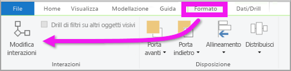
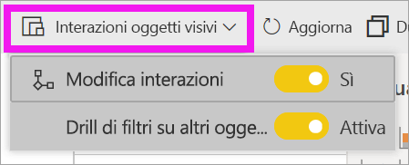
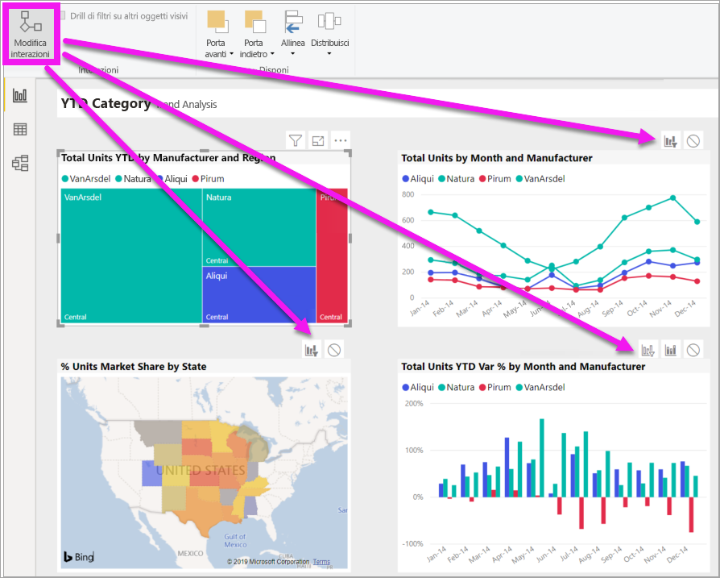
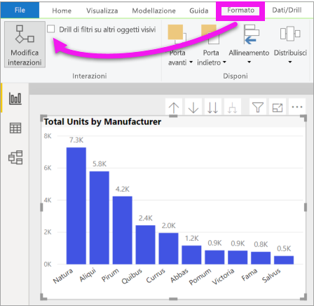

# Modificare l'interazione degli oggetti visivi in un report di Power BI
Se sono presenti autorizzazioni di modifica per un report è possibile usare **Interazioni oggetti visivi** per modificare l'effetto di ogni visualizzazione in una pagina del report sulle altre visualizzazioni. 

## Introduzione alle interazioni con oggetti visivi
Per impostazione predefinita, le visualizzazioni in una pagina di report possono essere usate per applicare un filtro incrociato e un'evidenziazione incrociata nelle altre visualizzazioni nella pagina.
Ad esempio, se si seleziona uno stato in una visualizzazione mappa, viene evidenziato l'istogramma e il grafico a linee viene filtrato in modo da visualizzare solo i dati applicabili allo stato selezionato.
Vedere [Informazioni su filtri ed evidenziazione](power-bi-reports-filters-and-highlighting.md). Se è presente anche una visualizzazione che supporta il [drill](consumer/end-user-drill.md) per impostazione predefinita, l'esecuzione del drill in una visualizzazione non ha alcun impatto sulle altre visualizzazioni nella pagina del report. Tuttavia entrambi i comportamenti predefiniti possono essere sottoposti a override e le interazioni possono essere impostate per le singole visualizzazioni.

Questo articolo illustra come usare le **interazioni con oggetti visivi** in Power BI Desktop. Il processo è lo stesso nella [visualizzazione di modifica](service-interact-with-a-report-in-editing-view.md) del servizio Power BI. Se si ha solo accesso in lettura o il report è stato condiviso, non sarà possibile modificare le impostazioni delle interazioni con oggetti visivi.

I termini *filtro incrociato* ed *evidenziazione incrociata* vengono usati per distinguere il comportamento descritto in questa sezione da ciò che accade quando si usa il riquadro **Filtri** per *filtrare* ed *evidenziare* le visualizzazioni.  

> [!NOTE]
> Questo video usa le versioni precedenti di Power BI Desktop e il servizio Power BI. 
>
>

<iframe width="560" height="315" src="https://www.youtube.com/embed/N_xYsCbyHPw?list=PL1N57mwBHtN0JFoKSR0n-tBkUJHeMP2cP" frameborder="0" allowfullscreen></iframe>

## Abilitare i controlli delle interazioni con oggetti visivi
Se si hanno le autorizzazioni di modifica per un report, è possibile attivare i controlli delle interazioni con oggetti visivi e quindi personalizzare i filtri e le evidenziazioni delle visualizzazioni nella pagina del report. 

1. Selezionare una visualizzazione per attivarla.  
2. Visualizzare le opzioni **Interazioni con oggetti visivi**.
    

    - In Desktop, selezionare **Formato > Interazioni**.

        

    - Nella servizio Power BI aprire il report in visualizzazione di modifica e selezionare l'elenco a discesa dalla barra dei menu del report.

        

3. Per abilitare i controlli delle interazioni con oggetti visivi, selezionare **Modifica interazioni**. Power BI aggiunge icone di filtro ed evidenziazione a tutte le altre visualizzazioni nella pagina di report. È possibile vedere che la mappa ad albero applica un filtro incrociato al grafico a linee e alla mappa ed esegue l'evidenziazione incrociata dell'istogramma. È ora possibile modificare il modo in cui la visualizzazione selezionata interagisce con le altre visualizzazioni nella pagina del report.
   
    

## Cambiare il comportamento dell'interazione
Acquisire familiarità con il modo in cui le visualizzazioni interagiscono selezionando ogni visualizzazione nella pagina del report, una alla volta.  Selezionare un punto dati, una barra o una forma e osservare l'effetto sulle altre visualizzazioni. Se il comportamento visualizzato non è quello che si preferisce, è possibile modificare le interazioni. Queste modifiche vengono salvate con il report in modo che gli utenti del report abbiano la stessa esperienza di interazione visiva.

Iniziare selezionando una visualizzazione per attivarla.  Si noti che tutte le altre visualizzazioni sulla pagina ora visualizzano icone di interazione. L'icona applicata è riconoscibile dal grassetto. Determinare quindi l'impatto che la **visualizzazione selezionata** deve avere sulle altre.  Facoltativamente, ripetere per tutte le altre visualizzazioni nella pagina del report.

Se la visualizzazione selezionata deve:
   
   * applicare un filtro incrociato a una delle altre visualizzazioni nella pagina, selezionare l'icona del **filtro** nell'angolo superiore destro della visualizzazione in questione ;
   * applicare un'evidenziazione incrociata a una delle altre visualizzazioni nella pagina, selezionare l'icona di **evidenziazione** ;
   * evitare qualsiasi impatto su una delle altre visualizzazioni nella pagina, selezionare l'icona **Nessun impatto** .

## Modificare le interazioni delle visualizzazioni drill-through
[È possibile eseguire il drill-through di alcune visualizzazioni di Power BI](consumer/end-user-drill.md). Per impostazione predefinita, quando si esegue il drill-through di una visualizzazione, il drill-through non ha alcun impatto sulle altre visualizzazioni nella pagina del report. Tuttavia, questo comportamento può essere modificato. 

> [!TIP]
> Provare a usare l'oggetto visivo con il [file PBX Human Resources Sample](https://download.microsoft.com/download/6/9/5/69503155-05A5-483E-829A-F7B5F3DD5D27/Human%20Resources%20Sample%20PBIX.pbix). Nella scheda **New hires** è disponibile un istogramma con drill-down.
>

1. Selezionare l'oggetto visivo drill-through per attivarlo. 

2. Attivare il drill-down selezionando l'icona corrispondente.

    

2. Dalla barra dei menu selezionare **Formato** > **Drill di filtri su altri oggetti visivi**.  Ora quando si esegue il drill-down (e il drill-up) in una visualizzazione, le altre visualizzazioni nella pagina del report cambiano per riflettere la selezione di drill corrente. 

    

3. Se il comportamento visualizzato non è quello che si preferisce, è possibile modificare le interazioni [come descritto in precedenza](#change-the-interaction-behavior).
    
## Passaggi successivi
[Filtri ed evidenziazione nei report di Power BI](power-bi-reports-filters-and-highlighting.md)