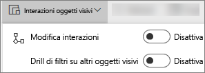
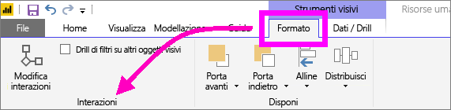
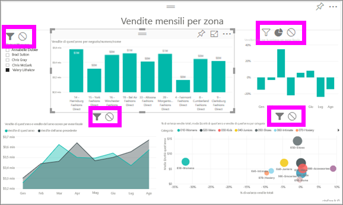

# Modificare l'interazione degli oggetti visivi in un report di Power BI
Se sono presenti autorizzazioni di modifica per un report è possibile usare **Interazioni oggetti visivi** per modificare l'effetto di ogni visualizzazione in una pagina del report sulle altre visualizzazioni. 

Per impostazione predefinita, le visualizzazioni in una pagina di report possono essere usate per applicare un filtro incrociato e un'evidenziazione incrociata nelle altre visualizzazioni nella pagina.
Ad esempio, se si seleziona uno stato in una visualizzazione mappa, viene evidenziato l'istogramma e il grafico a linee viene filtrato in modo da visualizzare solo i dati applicabili allo stato selezionato.
Vedere [Informazioni su filtri ed evidenziazione](power-bi-reports-filters-and-highlighting.md). Se è presente anche una visualizzazione che supporta il [drill](consumer/end-user-drill.md) per impostazione predefinita, l'esecuzione del drill in una visualizzazione non ha alcun impatto sulle altre visualizzazioni nella pagina del report. Tuttavia entrambi i comportamenti predefiniti possono essere sottoposti a override e le interazioni possono essere impostate per le singole visualizzazioni.

Questo articolo illustra come usare **Interazioni oggetti visivi** nella [Visualizzazione di modifica](service-interact-with-a-report-in-editing-view.md) del servizio Power BI e in Power BI Desktop. Se un report è stato condiviso con l'utente corrente, l'utente non potrà modificare le interazioni con oggetti visivi.

> [!NOTE]
> I termini *filtro incrociato* ed *evidenziazione incrociata* vengono usati per distinguere il comportamento qui descritto da ciò che accade quando si usa il riquadro **Filtri** per filtrare ed evidenziare le visualizzazioni.  
> 
> 

<iframe width="560" height="315" src="https://www.youtube.com/embed/N_xYsCbyHPw?list=PL1N57mwBHtN0JFoKSR0n-tBkUJHeMP2cP" frameborder="0" allowfullscreen></iframe>

1. Selezionare una visualizzazione per attivarla.  
2. Visualizzare le opzioni **Interazioni con oggetti visivi**.
    - Nel servizio Power BI selezionare l'elenco a discesa dalla barra dei menu dei report.

       

    - In Desktop, selezionare **Formato > Interazioni**.

        

3. Per attivare i controlli di interazione delle visualizzazioni, selezionare **Modifica interazioni**. Power BI aggiunge icone di filtro incrociato ed evidenziazione incrociata a tutte le altre visualizzazioni nella pagina di report.
   
    
3. Determinare l'impatto che la visualizzazione selezionata dovrà avere sulle altre.  Facoltativamente, ripetere per tutte le altre visualizzazioni nella pagina del report.
   
   * Se deve applicare un filtro incrociato alla visualizzazione, selezionare l'icona del **filtro** .
   * Se deve applicare un'evidenziazione incrociata alla visualizzazione, selezionare l'icona dell'**evidenziazione** .
   * Se non deve avere alcun impatto, selezionare l'icona che indica **nessun impatto** .

4. Per attivare i controlli di drill selezionare **Drill di filtri su altri oggetti visivi**.  Ora quando si esegue il drill-down (e il drill-up) in una visualizzazione, le altre visualizzazioni nella pagina del report cambiano per riflettere la selezione di drill corrente. 

   

