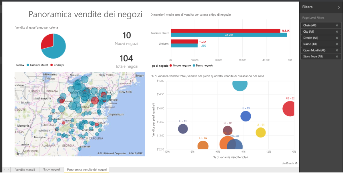

# Report in Power BI
## Che cos'è un report di Power BI?
Un ***report*** di Power BI consente di visualizzare un set di dati da più punti di vista, grazie a visualizzazioni che rappresentano conclusioni e approfondimenti diversi ottenuti da tale set di dati.  Un report può includere una sola visualizzazione oppure contenere pagine con più visualizzazioni. In base al proprio ruolo, si può essere un utente che *crea* report e/o che *utilizza* report.

Questo report è costituito da tre pagine (o schede). La pagina attualmente visualizzata è Store Sales Overview, costituita da sei diverse visualizzazioni e da un titolo. Le visualizzazioni possono essere *aggiunte* ai dashboard, in modo tale che quando si seleziona una visualizzazione aggiunta venga aperto il report da cui è stata aggiunta.

Se non si ha familiarità con Power BI, è possibile imparare le nozioni di base utili leggendo [Concetti di base di Power BI](service-basic-concepts.md)

I report sono una funzionalità del servizio Power BI e di Power BI Desktop. L'esperienza di utilizzo dei report è quasi identica. Con i dispositivi mobili non è però possibile creare report, ma solo [visualizzarli, condividerli e aggiungere annotazioni](mobile-reports-in-the-mobile-apps.md).

## Vantaggi dei report
I report sono basati su un singolo set di dati. Le visualizzazioni in un report rappresentano ognuna una parte di informazioni. Le visualizzazioni non sono statiche: è infatti possibile aggiungere e rimuovere dati, cambiare i tipi di visualizzazione e applicare filtri e filtri dei dati quando si analizzano i dati per individuare informazioni dettagliate e cercare risposte. Analogamente a un dashboard, ma in misura maggiore, un report è un elemento altamente interattivo e personalizzabile in cui le visualizzazioni vengono aggiornate quando cambiano i dati sottostanti.

## Dashboard e report a confronto
I [dashboard](service-dashboards.md) sono spesso confusi con i report perché sono anch'essi costituiti da aree di disegno contenenti visualizzazioni. Tuttavia, ci sono alcune importanti differenze.  

| **Capacità** | **Dashboard** | **Report** |
| --- | --- | --- |
| Pagine |Una pagina |Una o più pagine |
| Origini dati |Uno o più report e uno o più set di dati per dashboard |Un singolo set di dati per report |
| Disponibile in Power BI Desktop |No |Sì, è possibile creare e visualizzare i report in Power BI Desktop |
| Aggiunta |È possibile aggiungere visualizzazioni esistenti (riquadri) solo dal dashboard corrente ad altri dashboard |È possibile aggiungere visualizzazioni (come riquadri) a uno dei dashboard. È possibile aggiungere tutte le pagine del report a uno dei dashboard. |
| Sottoscrivi |Non è possibile sottoscriversi a un dashboard |È possibile sottoscriversi alle pagine del report |
| Applicazione di filtri |Non è possibile filtrare o sezionare |Molti modi diversi di filtrare, evidenziare e sezionare |
| Impostazione di avvisi |Permette di creare avvisi per e-mail quando vengono soddisfatte determinate condizioni |No |
| Funzionalità |Permette di impostare un dashboard come dashboard "in primo piano" |Non permette di creare un report in primo piano |
| Query in linguaggio naturale |Disponibile dal dashboard |Non disponibile dai report |
| Permette di modificare il tipo di visualizzazione |No. Infatti, se il proprietario di un report modifica il tipo di visualizzazione nel report, la visualizzazione bloccata nel dashboard non viene aggiornata |Sì |
| Permette di visualizzare i campi e le tabelle del set di dati sottostante |No. Consente di esportare i dati ma le tabelle e i campi nel dashboard stesso non sono visibili. |Sì. È possibile visualizzare le tabelle, i campi e valori del set di dati. |
| Permette di creare le visualizzazioni |Si limita all'aggiunta di widget al dashboard tramite "Aggiungi riquadro" |È possibile creare molti tipi diversi di elementi visivi, aggiungere elementi visivi personalizzati, modificare gli elementi visivi e altro ancora con le autorizzazioni di modifica |
| Personalizzazione |È possibile fare operazioni con le visualizzazioni (riquadri) come spostare e disporre, ridimensionare, aggiungere collegamenti, rinominare, eliminare e visualizzare a schermo intero. Ma i dati e le visualizzazioni sono di sola lettura. |Nella visualizzazione di lettura è possibile pubblicare, incorporare, filtrare, esportare, scaricare come file .pbix, visualizzare il contenuto correlato, generare codici QR, analizzare in Excel e così via.  Nella visualizzazione di modifica è possibile eseguire tutte le operazioni indicate finora e molto altro. |

## ***Creatori*** di report e ***fruitori*** di report
In base al proprio ruolo, si può essere un utente che crea report per uso personale o da condividere con i colleghi. Si supponga di voler imparare a creare e condividere report o ricevere report da altri utenti, nonché di voler imparare a conoscere e a interagire con i report.

Per iniziare, è possibile leggere gli argomenti seguenti organizzati in base al ruolo.

### Se si intende creare e condividere report
* Iniziare con una [presentazione del servizio Power BI](service-basic-concepts.md), in cui viene spiegato dove trovare i report e i relativi strumenti.
* Fare clic sul collegamento per una presentazione dell'[editor di report](service-the-report-editor-take-a-tour.md).
* Fare clic sul collegamento per informazioni su come [creare un report da un set di dati](service-report-create-new.md).
* Fare clic sul collegamento per informazioni su come [usare i filtri a livello di visualizzazione, pagina e report](power-bi-how-to-report-filter.md).
* Fare clic sul collegamento per scoprire i vari modi in cui è possibile [condividere un report con i colleghi](service-share-dashboards.md).

### Se si intende ricevere e utilizzare i report
* Iniziare con una [presentazione del servizio Power BI](service-basic-concepts.md), in cui viene spiegato dove trovare i report e i relativi strumenti.
* Fare clic sul collegamento per informazioni su come [aprire un report](service-report-open.md) e su tutte le interazioni disponibili nella [Visualizzazione di lettura](service-reading-view-and-editing-view.md).
* Per acquisire familiarità con i report, eseguire la presentazione di uno degli [esempi](sample-tutorial-connect-to-the-samples.md) forniti.  
* Se il report non è più necessario, è possibile [rimuoverlo](service-delete.md).
* Per conoscere il set di dati usato nel report e i dashboard contenenti riquadri aggiunti dal report, [visualizzare il contenuto correlato](service-related-content.md).

> [!TIP]
> Se non si riesce a trovare le informazioni cercate, usare il sommario a sinistra per sfogliare tutti gli argomenti relativi ai *report*.
> 
> 

## Passaggi successivi
[Introduzione a Power BI](service-get-started.md) 

[Power BI - Concetti di base](service-basic-concepts.md)

Altre domande? [Provare la community di Power BI](http://community.powerbi.com/)

