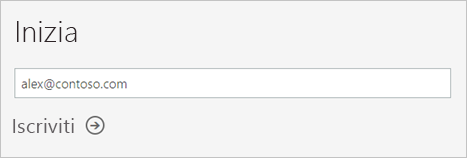
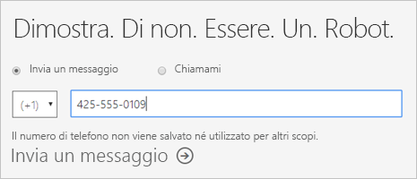
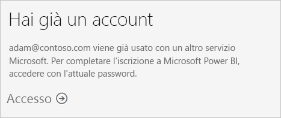
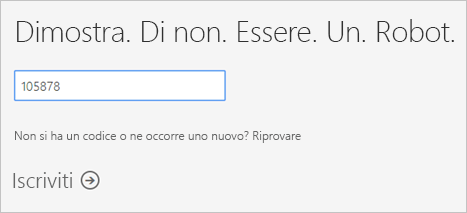
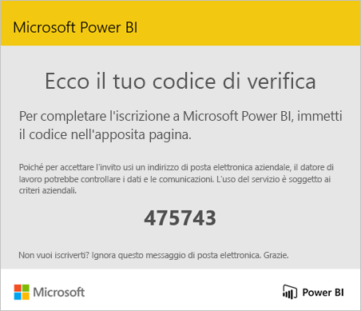
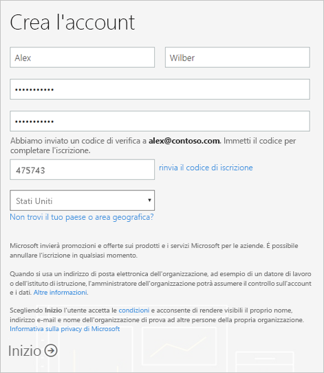
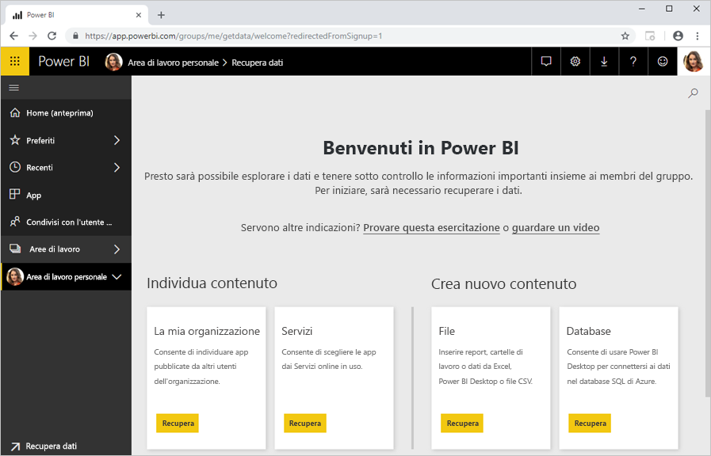

# Iscriversi a Power BI come utente singolo

Power BI può essere usato come strumento personale per l'analisi e la visualizzazione dei dati, ma anche come motore di analisi e decisionale per progetti di gruppi, divisioni o intere aziende. Questo articolo illustra come iscriversi a Power BI come utente singolo. Per gli amministratori di Power BI, vedere [Gestione delle licenze di Power BI nell'organizzazione](service-admin-licensing-organization.md).

## Indirizzi di posta elettronica supportati

Prima di iniziare il processo di iscrizione, è importante apprendere quali tipi di indirizzi di posta elettronica è possibile usare in Power BI:

* Per l'iscrizione, Power BI richiede l'uso di un indirizzo di posta elettronica aziendale o dell'istituto di iscrizione. Non è possibile iscriversi con indirizzi di posta elettronica forniti da provider di telecomunicazioni o da servizi di posta elettronica commerciali, tra cui outlook.com, hotmail.com e gmail.com.

* Dopo l'iscrizione è possibile [invitare gli utenti guest](https://docs.microsoft.com/azure/active-directory/active-directory-b2b-what-is-azure-ad-b2b) a visualizzare il contenuto di Power BI con qualsiasi indirizzo di posta elettronica, inclusi gli account personali.

* È possibile iscriversi a Power BI con indirizzi .gov o .mil, ma con una procedura diversa. Per altre informazioni, vedere [Registrare l'organizzazione governativa statunitense al servizio Power BI](service-govus-signup.md).

## Creare un account Power BI

Seguire questa procedura per creare un account di Power BI. Al termine di questo processo sarà disponibile una licenza gratuita di Power BI che consentirà di provare Power BI in autonomia usando l'area di lavoro personale, utilizzare contenuto da un'area di lavoro di Power BI assegnata a una capacità Power BI Premium o avviare una versione di valutazione di Power BI Pro singola. Per altre informazioni, vedere [Funzionalità di Power BI in base al tipo di licenza](service-features-license-type.md). 

1. Passare alla [pagina di iscrizione](https://signup.microsoft.com/signup?sku=a403ebcc-fae0-4ca2-8c8c-7a907fd6c235).

1. Immettere l'indirizzo di posta elettronica, quindi selezionare **Iscriviti**.

    

1. Se viene visualizzato un messaggio simile a questo, scegliere un'opzione per ricevere un codice di verifica, quindi procedere con il passaggio successivo di questa procedura.

    

    Se viene visualizzato un messaggio simile a questo, completare la procedura per accedere e usare Power BI.

    

1. Immettere il codice ricevuto, quindi selezionare **Iscriviti**.

    

1. Controllare la posta elettronica per vedere se si è ricevuto un messaggio simile a questo.

    

1. Nella schermata successiva, immettere le informazioni e il codice di verifica del messaggio di posta elettronica. Selezionare un'area, rivedere i criteri che sono collegati da questa schermata, quindi selezionare **Avvia**.

    

1. L'utente verrà quindi reindirizzato alla [pagina di accesso di Power BI](https://powerbi.microsoft.com/landing/signin/) e potrà iniziare a usarlo.

    

## Scadenza della versione di valutazione

Al termine del processo di iscrizione, è possibile iscriversi a una versione di valutazione di Power BI Pro nel servizio Power BI. Alla scadenza della versione di valutazione, si tornerà alla licenza di Power BI gratuita. In questo caso, non si avrà più accesso alle funzionalità che richiedono una licenza di Power BI Pro. Per altre informazioni, vedere [Funzionalità in base al tipo di licenza](service-features-license-type.md).

Se la licenza di Power BI gratuita è sufficiente, non è necessario eseguire altre operazioni. Per sfruttare le funzionalità di Power BI Pro, contattare l'amministratore IT per richiedere l'acquisto di una licenza appropriata.

## Risoluzione dei problemi del processo di iscrizione

Nella maggior parte dei casi è possibile iscriversi a Power BI seguendo la procedura descritta. Nella tabella seguente sono descritti alcuni dei problemi che possono impedire l'iscrizione e le possibili soluzioni alternative.

| Sintomo o messaggio di errore | Causa e soluzione |
| ----------------------- | -------------------- |
| <strong>Indirizzi di posta elettronica personali (ad esempio nancy@gmail.com)</strong> Durante l'iscrizione viene visualizzato un messaggio simile al seguente:    *È stato immesso un indirizzo di posta elettronica personale: immettere l'indirizzo di posta elettronica aziendale per permetterci di archiviare in modo sicuro i dati della società.*    o    *L'indirizzo di posta elettronica specificato sembra essere di tipo personale. Immettere l'indirizzo aziendale per poter entrare in contatto con altre persone nell'organizzazione. Questo L'indirizzo non verrà condiviso con nessuno.* | Power BI non supporta gli indirizzi di posta elettronica forniti dai provider di telecomunicazioni o di servizi di posta elettronica commerciali.    Per completare l'iscrizione, riprovare usando un indirizzo di posta elettronica assegnato dall'azienda o dall'istituto di istruzione.    Se non si riesce comunque a effettuare l'iscrizione e si è disposti a eseguire un processo di configurazione più avanzato, [richiedere un nuovo abbonamento di valutazione a Office 365 e usare tale indirizzo di posta elettronica per l'iscrizione](service-admin-signing-up-for-power-bi-with-a-new-office-365-trial.md).    È anche possibile che un utente esistente [inviti l'utente come utente guest](service-admin-azure-ad-b2b.md). |
| **Iscrizione self-service disabilitata**: durante l'iscrizione viene visualizzato un messaggio simile a questo:    *Non è possibile completare l'iscrizione. Il reparto IT ha disattivato l'iscrizione per Microsoft Power BI. Contattarli per completare l'iscrizione.*    o    *L'indirizzo di posta elettronica specificato sembra essere di tipo personale. Immettere l'indirizzo aziendale per poter entrare in contatto con altre persone nell'organizzazione. Questo L'indirizzo non verrà condiviso con nessuno.* | L'amministratore IT dell'organizzazione ha disabilitato l'iscrizione a Power BI in modalità self-service.    Per completare l'iscrizione, contattare l'amministratore IT e chiedere di [seguire le istruzioni per abilitare l'iscrizione](service-admin-licensing-organization.md#enable-or-disable-individual-user-sign-up-in-azure-active-directory).    Questo problema può verificarsi anche se è stata effettuata l'[iscrizione a Office 365 tramite un partner](service-admin-syndication-partner.md). |
| **L'indirizzo di posta elettronica non è un ID di Office 365** Durante l'iscrizione viene visualizzato un messaggio simile a questo:    *Non è stato trovato l'ID in contoso.com.  Si usa un ID diverso al lavoro o a scuola?    Provare ad accedere con quello. Se non funziona, contattare il reparto IT.* | Gli ID usati dall'organizzazione per accedere a Office 365 e altri servizi Microsoft sono diversi rispetto al proprio indirizzo di posta elettronica.  Ad esempio, è possibile che il proprio indirizzo di posta elettronica sia Nancy.Smith@contoso.com mentre l'ID è nancys@contoso.com.    Per completare l'iscrizione, usare l'ID assegnato dall'organizzazione per l'accesso a Office 365 o ad altri servizi Microsoft.  Se non si conosce questo ID, contattare l'amministratore IT.    Se non si riesce comunque a effettuare l'iscrizione e si è disposti a eseguire un processo di configurazione più avanzato, [richiedere un nuovo abbonamento di valutazione a Office 365 e usare tale indirizzo di posta elettronica per l'iscrizione](service-admin-signing-up-for-power-bi-with-a-new-office-365-trial.md). |

## Passaggi successivi

[Acquisto di Power BI Pro](service-admin-purchasing-power-bi-pro.md)  
[Contratto di assistenza di Power BI per utenti singoli](https://powerbi.microsoft.com/terms-of-service/)  

Altre domande? [Provare a rivolgersi alla community di Power BI](https://community.powerbi.com/)
