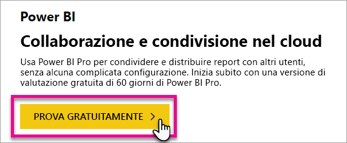
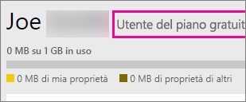
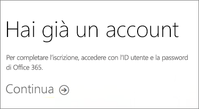
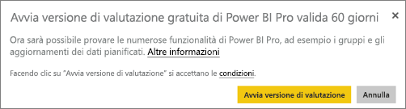
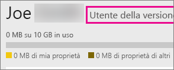

# Iscrizione a Power BI come utente singolo
Informazioni su come iscriversi a Power BI e iniziare a usarlo per le proprie esigenze personali di creazione e visualizzazione di report.

Power BI può essere usato come strumento personale per i report e la visualizzazione, ma anche come motore di analisi e decisionale per progetti di gruppi, divisioni o intere aziende.

Questo articolo descrive le opzioni disponibili per iscriversi ed iniziare a usare il servizio Power BI. Per informazioni sulle differenze tra Power BI gratuito e Pro, vedere [Differenze tra la versione gratuita e la versione Pro di Power BI](service-free-vs-pro.md).

## Ci sono diverse opzioni disponibili
Come utente singolo, è possibile scegliere varie opzioni per iscriversi e iniziare a usare Power BI. È possibile scegliere di iscriversi gratuitamente oppure acquistare una sottoscrizione Power BI Pro. Se ci si iscrive con un account gratuito, appena il servizio è attivo, è possibile scegliere la versione di prova gratuita di 60 giorni di Power BI Pro.

È comunque possibile iscriversi con un account gratuito anche se si è parte di un'organizzazione esistente che usa Office 365. Anche l'amministratore IT può scegliere tra varie opzioni per l'acquisto di Power BI Pro e l'assegnazione delle licenze. Per altre informazioni sulle opzioni disponibili agli amministratori IT, vedere [Acquisto di Power BI Pro](service-admin-purchasing-power-bi-pro.md).

> [!NOTE]
> Se si lavora in un'organizzazione, l'iscrizione come utente singolo potrebbe essere disabilitata. Per maggiori informazioni, nel caso in cui venga visualizzato un messaggio di errore in merito, vedere [Iscrizione utente singolo disabilitata](#individual-sign-up-has-been-turned-off).
>

## Che cosa è necessario per l'iscrizione?

Per effettuare l'iscrizione a Power BI è necessario un indirizzo di posta elettronica aziendale. Un indirizzo di posta elettronica personale non funziona per l'iscrizione a Power BI.

### Quale indirizzo di posta elettronica può essere usato con Power BI?
Per iscriversi, Power BI richiede l'uso di un indirizzo di posta elettronica dell'azienda o della scuola. Non è possibile effettuare l'iscrizione a Power BI con indirizzi di posta elettronica forniti da provider di telecomunicazioni o da servizi di posta elettronica commerciali, tra cui outlook.com, hotmail.com, gmail.com e altri.

Se si tenta di effettuare l'iscrizione con un indirizzo di posta elettronica personale, verrà visualizzato un messaggio che indica di specificare un indirizzo di posta elettronica di un'azienda o di un istituto scolastico.

> [!NOTE]
> È possibile effettuare l'iscrizione a Power BI con indirizzi .gov o .mil. Per altre informazioni, vedere [Registrare l'organizzazione governativa statunitense al servizio Power BI](https://docs.microsoft.com/en-us/power-bi/service-govus-signup).
>

> [!NOTE]
> Dopo l'iscrizione è possibile [invitare utenti guest](https://docs.microsoft.com/en-us/azure/active-directory/active-directory-b2b-what-is-azure-ad-b2b) alla visualizzazione di contenuti nel tenant di Power BI con qualsiasi indirizzo di posta elettronica, inclusi gli account personali.
>

## Quale opzione scegliere
È possibile determinare l'opzione più adatta esaminando ciò che viene fornito con ciascun tipo di licenza. Gli utenti con account gratuito possono accedere alla maggior parte delle funzionalità dei servizi, ad eccezione di quelle di condivisione e collaborazione. Gli utenti Power BI Pro possono utilizzare tutte le funzionalità del servizio, ma non gratuitamente. Se non si ha l'esigenza di condividere contenuti, la versione gratuita è probabilmente la scelta migliore. Altre informazioni sono riportate nella [pagina Power BI Pricing (Prezzi di Power BI)](https://powerbi.microsoft.com//pricing/).

La parte restante di questo articolo fornisce istruzioni su come eseguire l'iscrizione per ciascuna opzione.

## Iscrizione a Power BI (gratuito) come utente singolo
Il modo più rapido per iscriversi a Power BI è registrarsi per creare un account di Power BI (gratuito). Non sono previsti costi per questo account, che consente di utilizzare molte delle funzionalità disponibili nel servizio.

> [!NOTE]
> Se si riceve un messaggio che indica che l'utente è già registrato, provare a passare a https://app.powerbi.com e ad eseguire l'accesso.
> 
> 

Per iscriversi a Power BI, è possibile eseguire le operazioni seguenti.

1. Accedere a [powerbi.com](https://powerbi.microsoft.com).
2. Selezionare **Inizia gratis** o **Iscrizione gratuita**.
   
    
3. Nella pagina iniziale selezionare **Prova gratuitamente >** sotto a Power BI.
   
    
4. Immettere l'indirizzo di posta elettronica con cui registrarsi e selezionare **Iscrizione**. Assicurarsi che l'indirizzo di posta elettronica sia consentito per l'iscrizione. Per altre informazioni su quale indirizzo di posta elettronica si può utilizzare, vedere [Quale indirizzo di posta elettronica può essere usato con Power BI](#what-email-address-can-be-used-with-power-bi).
   
    
5. Si riceverà un messaggio che chiede di controllare la posta elettronica.
   
    
6. Selezionare il collegamento nel messaggio per verificare l'indirizzo di posta elettronica. In questo modo si torna alla procedura di iscrizione. Potrebbe essere necessario specificare alcune informazioni personali aggiuntive.
7. A quel punto il sistema reindirizza l'utente a https://app.powerbi.com ed è possibile iniziare a usare Power BI gratuitamente.

### Verifica dello stato all'interno del servizio
Una volta all'interno nel servizio, è possibile verificare di avere un account gratuito selezionando l'icona a forma di **ingranaggio** e selezionando **Gestisci archivio personale**.

### Se l'utente fa già parte di un'organizzazione esistente
Se l'account fa parte di un'organizzazione esistente, verrà visualizzato un messaggio in cui verrà richiesto di eseguire l'accesso con tale account. Selezionare **Continua** e accedere con l'account di Office 365.

Viene visualizzato un messaggio che chiede di selezionare **Start**.

## Versione di valutazione completa di Power BI Pro per 60 giorni
Dopo aver effettuato l'iscrizione all'account gratuito, è possibile provare la versione Pro gratuitamente per 60 giorni. Sarà possibile accedere a tutte le funzionalità Pro per la durata del periodo di valutazione. Power BI Pro dispone di tutte le funzionalità della versione gratuita di Power BI, oltre a funzionalità di condivisione e collaborazione aggiuntive. Per altre informazioni, vedere la [pagina dei prezzi di Power BI](https://powerbi.microsoft.com/pricing). Per provare una versione di valutazione gratuita di 60 giorni di Power BI Pro, iscriversi a Power BI e provare una di queste funzionalità Power BI Pro:

* [Crea area di lavoro per le app](service-create-distribute-apps.md)
* [Share a dashboard (Condividi un dashboard)](service-share-dashboards.md)

Quando si prova una qualsiasi di queste funzionalità, viene richiesto l'avvio della versione di valutazione gratuita. È anche possibile decidere di usarla selezionando l'icona dell'ingranaggio e poi **Gestisci archivio personale**. Selezionare quindi **Prova gratuitamente la versione Pro** sulla destra.

È quindi possibile selezionare **Avvia versione di valutazione**.

>[!NOTE]
>Gli utenti che usano questa versione di valutazione di Power BI Pro del prodotto non vengono visualizzati nel portale di amministrazione di Office 365 come utenti della versione di valutazione Power BI Pro (vengono visualizzati come utenti gratuiti di Power BI). Tuttavia, verranno visualizzati come utenti della versione di valutazione di Power BI Pro nella pagina **Gestisci archiviazione** di Power BI.

>[!NOTE]
>Se un amministratore IT vuole acquisire e distribuire le licenze della versione di valutazione di Power BI a più utenti dell'organizzazione senza che i singoli utenti accettino individualmente le condizioni della versione di valutazione, può iscriversi a una [versione di valutazione Power BI Pro](https://portal.office.com/Signup/MainSignup15.aspx?OfferId=d59682f3-3e3b-4686-9c00-7c7c1c736085&dl=POWER_BI_PRO). È necessario essere un amministratore fatturazione o amministratore globale di Office 365 oppure creare un nuovo tenant per iscriversi a una versione di valutazione per l'amministratore. Per altre informazioni, vedere [Acquisto di Power BI Pro](service-admin-purchasing-power-bi-pro.md).
> 
> [!NOTE]
> Con la disponibilità di Power BI Premium e le modifiche dell'offerta di Power BI gratuito del 1° giugno 2017, è possibile che si sia idonei per una versione di valutazione Pro estesa. Per altre informazioni, vedere [Extended Pro Trial activation](service-extended-pro-trial.md) (Attivazione della versione di valutazione Pro estesa).
> 
> 

### Verifica dello stato all'interno del servizio
Una volta all'interno del servizio, è possibile verificare di avere un account per la versione di valutazione Pro selezionando l'icona a forma di *ingranaggio* e scegliendo **Gestisci archivio personale**.

## Cosa fare per ottenere la versione completa di Power BI Pro
Gli utenti singoli non possono in alcun modo ottenere una licenza Power BI Pro. È necessario rivolgersi all'amministratore IT per acquistare e far assegnare la licenza al proprio account. Per altre informazioni, vedere [Acquisto di Power BI Pro](service-admin-purchasing-power-bi-pro.md).

## Risoluzione dei problemi
In molti casi, la registrazione a Power BI può essere eseguita tramite il semplice processo di iscrizione in modalità self-service illustrato in precedenza. Esistono però varie ragioni per cui potrebbe essere impossibile completare l'iscrizione in modalità self-service.  La tabella seguente riepiloga alcune delle situazioni più frequenti che impediscono di completare l'iscrizione e indica alcune soluzioni alternative.

| **Sintomo/Messaggio di errore** | **Causa e soluzione** |
| --- | --- |
| **Indirizzi di posta elettronica personali (ad esempio nancy@gmail.com)** Durante l'iscrizione viene visualizzato un messaggio analogo al seguente:    *Hai specificato un indirizzo di posta elettronica personale. Immetti il tuo indirizzo aziendale e potremo archiviare i dati della tua società in tutta sicurezza.*    oppure    *L'indirizzo di posta elettronica specificato sembra essere di tipo personale. Immettere l'indirizzo aziendale per poter entrare in contatto con altre persone nell'organizzazione. Questo L'indirizzo non verrà condiviso con nessuno.* |Power BI non supporta gli indirizzi di posta elettronica forniti dai provider di telecomunicazioni o di servizi di posta elettronica commerciali.    Per completare l'iscrizione, riprovare usando un indirizzo di posta elettronica assegnato dall'azienda o dall'istituto di istruzione.    Se non si riesce comunque a effettuare l'iscrizione e si è disposti a eseguire un processo di configurazione più avanzato, [richiedere un nuovo abbonamento di valutazione a Office 365 e usare tale indirizzo di posta elettronica per l'iscrizione](service-admin-signing-up-for-power-bi-with-a-new-office-365-trial.md).    Richiedere che l'account utente sia invitato come [guest Azure B2B](https://docs.microsoft.com/en-us/azure/active-directory/active-directory-b2b-what-is-azure-ad-b2b). |
| **Iscrizione in modalità self-service disabilitata** Durante l'iscrizione viene visualizzato un messaggio analogo al seguente:    *Non è possibile completare l'iscrizione. Il reparto IT ha disattivato l'iscrizione per Microsoft Power BI. Contattarli per completare l'iscrizione.*    oppure    *L'indirizzo di posta elettronica specificato sembra essere di tipo personale. Immettere l'indirizzo aziendale per poter entrare in contatto con altre persone nell'organizzazione. Questo L'indirizzo non verrà condiviso con nessuno.* |L'amministratore IT dell'organizzazione ha disabilitato l'iscrizione a Power BI in modalità self-service.    Per completare l'iscrizione, contattare l'amministratore IT e chiedergli di seguire le istruzioni nella pagina indicata di seguito per consentire agli utenti esistenti di iscriversi a Power BI e ai nuovi utenti di aggiungersi al tenant esistente.    Questo problema può verificarsi anche se è stata effettuata l'iscrizione a Office 365 tramite un partner. [Altre informazioni](service-admin-syndication-partner.md)    [Power BI nell'organizzazione](https://support.office.com/en-ca/article/Power-BI-in-your-Organization-d7941332-8aec-4e5e-87e8-92073ce73dc5#BKMK_HowCanIAllowO365Tenant) |
| **L'indirizzo di posta elettronica non è un ID di Office 365** Durante l'iscrizione viene visualizzato un messaggio analogo al seguente:    *Non è stato trovato l'ID in contoso.com.  Si usa un ID diverso al lavoro o a scuola?    Provare ad accedere con quello. Se non funziona, contattare il reparto IT.* |Gli ID usati dall'organizzazione per accedere a Office 365 e altri servizi Microsoft sono diversi rispetto al proprio indirizzo di posta elettronica.  Ad esempio, è possibile che il proprio indirizzo di posta elettronica sia Nancy.Smith@contoso.com mentre l'ID è nancys@contoso.com.    Per completare l'iscrizione, usare l'ID assegnato dall'organizzazione per l'accesso a Office 365 o ad altri servizi Microsoft.  Se non si conosce questo ID, contattare l'amministratore IT.    Se non si riesce comunque a effettuare l'iscrizione e si è in grado di eseguire un processo di configurazione più avanzato, [richiedere un nuovo abbonamento di valutazione a Office 365 e usare tale indirizzo di posta elettronica per l'iscrizione](service-admin-signing-up-for-power-bi-with-a-new-office-365-trial.md). |

## Passaggi successivi
[Power BI (gratuito) nell'organizzazione](service-admin-service-free-in-your-organization.md)  
[Acquisto di Power BI Pro](service-admin-purchasing-power-bi-pro.md)  
[Contratto di assistenza di Power BI per utenti singoli](https://powerbi.microsoft.com/terms-of-service/)  
[Power BI Premium - what is it?](service-premium.md) (Power BI Premium: definizione)  
[White paper su Power BI Premium](https://aka.ms/pbipremiumwhitepaper)  

Altre domande? [Provare a rivolgersi alla community di Power BI](http://community.powerbi.com/)

