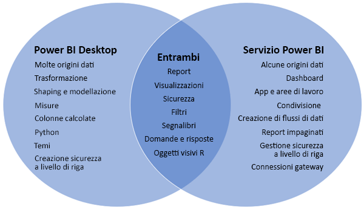
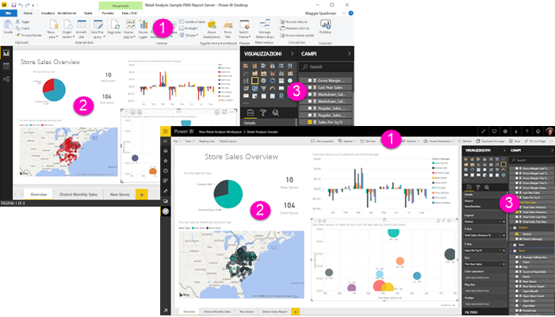

# Confronto tra Power BI Desktop e il servizio Power BI

In un diagramma di Venn che mette a confronto Power BI Desktop e il servizio Power BI, l'area al centro indica le funzionalità disponibili in entrambe le soluzioni. Alcune attività possono essere eseguite in Power BI Desktop o nel servizio. I due lati del diagramma di Venn illustrano invece le funzionalità specifiche dell'applicazione e del servizio.  

**Power BI Desktop** è uno strumento di analisi dei dati e creazione di report completo. Dopo aver installato l'applicazione gratuita nel computer locale, è possibile connettersi a molte origini dati diverse e combinare i dati (attività spesso denominata modellazione) in un modello di dati. Il processo viene illustrato nella [Guida introduttiva a Power BI Desktop](desktop-getting-started.md).

Il **servizio Power BI** è un servizio online basato sul cloud per apportare piccole modifiche ai report e favorire la collaborazione di team e aziende. Anche il servizio Power BI consente di connettersi alle origini dati, ma la modellazione è limitata. 

La maggior parte di coloro che si occupano della progettazione di report in progetti di business intelligence usa **Power BI Desktop** per creare i report e quindi il **servizio Power BI** per condividerli con altri.

## Modifica dei report

È possibile creare e modificare *report* sia nell'applicazione sia nel servizio. Un report può avere una o più pagine con oggetti visivi e raccolte di oggetti visivi. È possibile aggiungere segnalibri, pulsanti, filtri e drill-through per migliorare l'esplorazione dei report.

Gli editor di report in Power BI Desktop e nel servizio sono simili. Si compongono di tre sezioni:  

1. Le barre di spostamento superiori, diverse in Power BI Desktop e nel servizio    
2. Area di disegno report     
3. I riquadri **Campi**, **Visualizzazioni** e **Filtri**

Questo video illustra l'editor di report in Power BI Desktop. 

<iframe width="560" height="315" src="https://www.youtube.com/embed/IkJda4O7oGs" frameborder="0" allowfullscreen></iframe>

## Collaborazione nel servizio Power BI

Dopo aver creato i report, è possibile salvarli in un'*area di lavoro* del **servizio Power BI** in cui si collabora con i colleghi. Oltre ai report è possibile creare *dashboard*. Dashboard e report possono quindi essere condivisi con gli utenti dei report all'interno e all'esterno dell'organizzazione. Gli utenti visualizzano i report nel servizio Power BI nella [visualizzazione di lettura](consumer/end-user-reading-view.md), non nella visualizzazione di modifica. Non hanno accesso a tutte le funzionalità disponibili per gli autori del report. 

## Passaggi successivi

[Che cos'è Power BI Desktop?](desktop-what-is-desktop.md)

[Creare un report](service-report-create-new.md) nel servizio Power BI

[Concetti di base per responsabili di progettazione di report](service-basic-concepts.md)

Altre domande? [Provare la community di Power BI](http://community.powerbi.com/)

