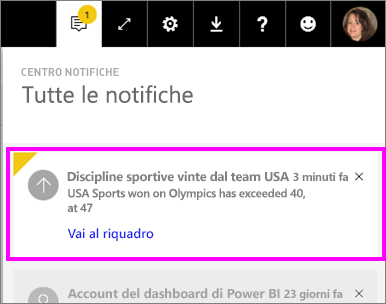

# Avvisi per i dati nel servizio Power BI
Impostare gli avvisi per ricevere una notifica quando i dati nei dashboard superano i limiti impostati. 

È possibile impostare avvisi per i riquadri se si ha una licenza Power BI Pro o se un dashboard è stato condiviso con l'utente da una [capacità Premium](service-premium.md). Gli avvisi possono essere impostati solo in riquadri aggiunti da oggetti visivi del report e solo su misuratori, indicatori KPI e schede. Gli avvisi possono essere impostati sugli oggetti visivi creati da set di dati di streaming aggiunti da un report, ma non possono essere impostati nei riquadri di streaming creati direttamente nel dashboard tramite **Aggiungi riquadro** > **Dati in streaming personalizzati**. 

Gli avvisi possono essere visualizzati solo da chi li imposta, anche se si condivide il dashboard. Gli avvisi per i dati sono completamente sincronizzati sulle piattaforme. È possibile quindi impostare e visualizzare gli avvisi per i dati [nell'app Power BI per dispositivi mobili](consumer/mobile/mobile-set-data-alerts-in-the-mobile-apps.md) e nel servizio Power BI. Non sono disponibili per Power BI Desktop. Gli avvisi possono anche essere [automatizzati e integrati con Microsoft Flow](https://flow.microsoft.com) - [È possibile fare una prova in prima persona](service-flow-integration.md).

> [!WARNING]
> Le notifiche di avviso basate sui dati forniscono informazioni sui dati. Se il dispositivo sul quale si visualizzano i dati di Power BI viene rubato, è consigliabile disattivare tutte le regole di avviso basate sui dati usando il servizio Power BI.
> 
> 

## Impostare gli avvisi per i dati nel servizio Power BI
Il video seguente mostra come aggiungere alcuni avvisi ai riquadri del dashboard. Seguire quindi le istruzioni successive per sotto il video per fare una prova in prima persona.

<iframe width="560" height="315" src="https://www.youtube.com/embed/JbL2-HJ8clE" frameborder="0" allowfullscreen></iframe>

Questo esempio usa un riquadro di tipo scheda dal dashboard di esempio per l'analisi delle vendite al dettaglio.

1. Iniziare in un dashboard. Da un misuratore, un riquadro del misuratore, dell'indicatore KPI o della scheda del dashboard, selezionare i puntini di sospensione.
   
   
2. Selezionare l'icona a forma di campana  per aggiungere uno o più avvisi per **Total stores** (Totale negozi).
   
1. Per iniziare, selezionare **+ Aggiungi regola di avviso**, verificare che il dispositivo di scorrimento sia impostato su **Attivo** e assegnare un titolo all'avviso. I titoli consentono di riconoscere facilmente gli avvisi.
   
   
4. Scorrere verso il basso e immettere i dettagli dell'avviso.  In questo esempio viene creato un avviso che notifica una volta al giorno agli utenti se il numero totale di negozi supera 100. Gli avvisi vengono visualizzati nel centro notifiche e Power BI invia anche un messaggio di posta elettronica.
   
   
5. Selezionare **Salva**.

## Ricezione di avvisi
Quando i dati rilevati raggiungono una delle soglie impostate, verranno eseguite alcune operazioni. A seconda dell'opzione selezionata, Power BI controlla innanzitutto se è trascorsa più di un'ora o più di 24 ore dall'invio dell'ultimo avviso. Se i dati superano la soglia, viene visualizzato un avviso.

Successivamente, Power BI invia un avviso al centro di notifica e, facoltativamente, alla casella di posta elettronica. Ogni avviso contiene un collegamento diretto ai dati. Selezionare il collegamento per visualizzare il riquadro in cui è possibile esplorare, condividere e leggere altre informazioni.  

1. Se è stato impostato anche l'invio di un messaggio di posta elettronica, nella posta in arrivo viene visualizzato un messaggio simile al seguente.
   
   
2. Power BI aggiunge un messaggio al **centro notifiche** e una nuova icona di avviso al riquadro applicabile.
   
   
3. Aprire il centro notifiche per visualizzare i dettagli dell'avviso.
   
    
   
   > [!NOTE]
   > Gli avvisi possono essere usati solo con dati aggiornati. Quando i dati vengono aggiornati, Power BI controlla se è impostato un avviso per tali dati. Se i dati raggiungono una soglia di avviso, viene generato un avviso.
   > 
   > 

## Gestione degli avvisi
Sono disponibili molti modi per gestire gli avvisi: dal riquadro del dashboard, dal menu Impostazioni di Power BI, da una sezione singola nell'[app Power BI per dispositivi mobili su iPhone](consumer/mobile/mobile-set-data-alerts-in-the-mobile-apps.md) o nell'[app Power BI per dispositivi mobili per Windows 10](consumer/mobile/mobile-set-data-alerts-in-the-mobile-apps.md).

### Dal riquadro
1. Per modificare o rimuovere un avviso per un riquadro, aprire nuovamente la finestra **Gestisci avvisi** selezionando l'icona a forma di campana . Vengono visualizzati tutti gli avvisi impostati per questo riquadro.
   
    .
2. Per modificare un avviso, selezionare la freccia a sinistra del nome dell'avviso.
   
    .
3. Per eliminare un avviso, selezionare il cestino a destra del nome dell'avviso.
   
      

### Dal menu Impostazioni di Power BI
1. Selezionare l'icona dell'ingranaggio dalla barra dei menu di Power BI.
   
    .
2. In **Impostazioni** selezionare **Avvisi**.
   
    
3. Da qui è possibile attivare e disattivare gli avvisi, aprire la finestra **Gestisci avvisi** per apportare modifiche o eliminare l'avviso.

## Suggerimenti e risoluzione dei problemi
* Gli avvisi non sono attualmente supportati per i riquadri Bing o di tipo scheda con misure di data/ora.
* Gli avvisi possono essere usati solo con tipi di dati numerici.
* Gli avvisi possono essere usati solo con dati aggiornati. Non possono essere usati con dati statici.
* Gli avvisi funzioneranno nei set di dati di streaming solo se si crea un oggetto visivo del report di tipo indicatore KPI/scheda/misuratore e quindi si aggiunge l'oggetto visivo al dashboard.

## Passaggi successivi
[Creare un flusso di Microsoft Flow che includa un avviso per i dati](service-flow-integration.md)    
[Impostare gli avvisi per i dati nel dispositivo mobile](consumer/mobile/mobile-set-data-alerts-in-the-mobile-apps.md)    
[Che cos'è Power BI?](power-bi-overview.md)    
Altre domande? [Provare a rivolgersi alla community di Power BI](http://community.powerbi.com/)

