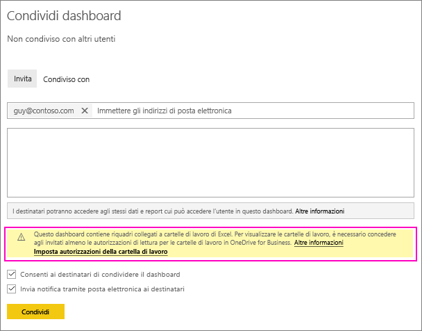
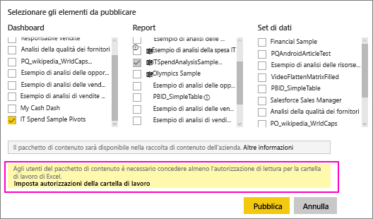
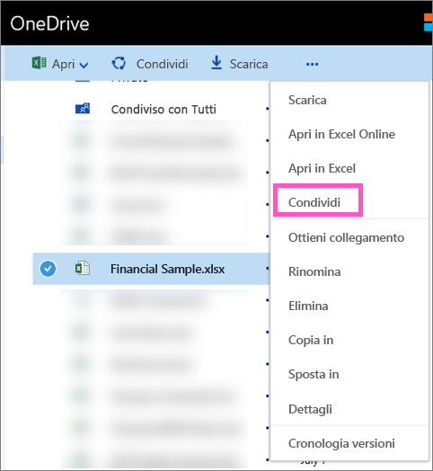

# Condividere un dashboard di Power BI che include collegamenti a un file di Excel in OneDrive
In Power BI è possibile [connettersi alle cartelle di lavoro di Excel in OneDrive for Business](service-excel-workbook-files.md) e aggiungere riquadri a un dashboard dalla cartella di lavoro. Quando si condividono i dashboard oppure si crea un pacchetto di contenuto che include tale dashboard:

* I colleghi possono visualizzare i riquadri senza bisogno di autorizzazioni per la cartella di lavoro. Si può quindi creare un pacchetto di contenuto con la certezza che i colleghi potranno visualizzare i riquadri creati dalla cartella di lavoro di Excel in OneDrive.
* Facendo clic sul riquadro si apre la cartella di lavoro all'interno di Power BI. La cartella di lavoro verrà aperta solo se i colleghi dispongono almeno delle [autorizzazioni di lettura](https://support.office.com/en-us/article/Share-documents-or-folders-in-Office-365-1fe37332-0f9a-4719-970e-d2578da4941c) per la cartella di lavoro in OneDrive for Business.

## Condividere un dashboard che contiene i riquadri della cartella di lavoro
Per condividere un dashboard collegato a una cartella di lavoro di Excel in OneDrive for Business, vedere l'articolo relativo alla [condivisione di dashboard](service-share-dashboards.md). La differenza è che si ha la possibilità di modificare le autorizzazioni per la cartella di lavoro di Excel collegata prima di condividerlo.

  

1. Immettere gli indirizzi di posta elettronica dei colleghi.
2. Per consentire ai colleghi di visualizzare la cartella di lavoro di Excel da Power BI, selezionare **Passa a OneDrive for Business per impostare le autorizzazioni della cartella di lavoro**.
3. In OneDrive, [modificare le autorizzazioni](https://support.office.com/en-US/article/Share-files-and-folders-and-change-permissions-9fcc2f7d-de0c-4cec-93b0-a82024800c07) in base alle esigenze.
4. Seleziona **Condividi**.

>[!NOTE]
>I colleghi non riusciranno ad aggiungere riquadri aggiuntivi dalla cartella di lavoro o di apportare modifiche alla cartella di lavoro di Excel da Power BI.
> 
> 

## Creare un pacchetto di contenuto aziendale con un dashboard che contiene i riquadri della cartella di lavoro
Quando si [pubblica un pacchetto di contenuto](service-organizational-content-pack-create-and-publish.md) si concede l'accesso a colleghi singoli o a gruppi di colleghi. Quando si pubblica un pacchetto di contenuto che contiene i collegamenti della cartella di lavoro si avrà l'opzione per modificare le autorizzazioni per la cartella di lavoro di Excel collegata prima della pubblicazione.

1. Nella schermata **Crea pacchetto di contenuto** , immettere indirizzi di posta elettronica, assegnare al pacchetto di contenuto un titolo e una  descrizione e caricare un'immagine.
2. Selezionare il dashboard e/o report collegato alla cartella di lavoro di Excel in OneDrive for Business.
   
    
3. Selezionare **Passa a OneDrive for Business per impostare le autorizzazioni della cartella di lavoro**.
4. In OneDrive, [modificare le autorizzazioni](https://support.office.com/en-US/article/Share-files-and-folders-and-change-permissions-9fcc2f7d-de0c-4cec-93b0-a82024800c07) in base alle esigenze.
5. Selezionare **Pubblica**.

## Condividere un dashboard da un'area di lavoro di Power BI
La condivisione di un dashboard da un'area di lavoro di Power BI è simile alla condivisione dalla propria area di lavoro, ad eccezione del fatto che i file si trovano in un sito dell'area di lavoro di Office 365, anziché nell'istanza di OneDrive for Business privata. Modificare le autorizzazioni per la cartella di lavoro di Excel prima di condividere il dashboard con utenti al di fuori dell'area di lavoro.

## Passaggi successivi
* [Aggiungere un riquadro a un dashboard di Power BI da Excel](service-dashboard-pin-tile-from-excel.md)
* [Concetti di base di Power BI](service-basic-concepts.md)
* Altre domande? [Provare la community di Power BI](http://community.powerbi.com/)

