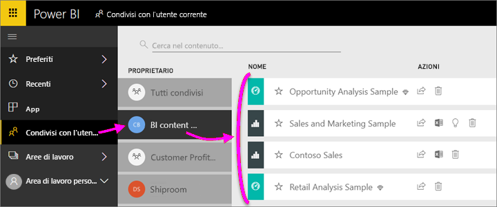

# Condividere i dashboard e i report di Power BI con i colleghi e con altri utenti
La *condivisione* è un approccio valido per consentire ad alcuni utenti di accedere ai dashboard e ai report. Power BI offre anche [diversi altri modi per collaborare a dashboard e report e distribuirli](service-how-to-collaborate-distribute-dashboards-reports.md).

Sia che si condivida il contenuto all'interno o all'esterno dell'organizzazione, è necessaria una [licenza Power BI Pro](service-free-vs-pro.md). Anche i destinatari devono avere una licenza Power BI Pro. In caso contrario, il contenuto deve essere incluso in una [capacità Premium](service-premium.md). 

È possibile condividere dashboard e report dalla maggior parte delle posizioni nel servizio Power BI: Preferiti, Recenti, Condivisi con l'utente corrente (se il proprietario lo consente), Area di lavoro personale o altre aree di lavoro. Quando si condivide un dashboard o un report, gli utenti che lo condividono possono visualizzarlo e interagire con esso, ma non modificarlo. Essi vedranno gli stessi dati che l'utente vede nei dashboard o nei report, a meno che non sia stata applicata la [sicurezza a livello di riga](service-admin-rls.md). I colleghi con cui si condivide il dashboard possono anche condividerlo con i loro colleghi, se sono autorizzati a tale scopo. Gli utenti all'esterno dell'organizzazione possono visualizzare il dashboard o il report e interagire con esso, ma non condividerlo. 

È anche possibile [condividere un dashboard da una delle app Power BI per dispositivi mobili](mobile-share-dashboard-from-the-mobile-apps.md). È possibile condividere i dashboard dal servizio Power BI e dalle app Power BI per dispositivi mobili, ma non da Power BI Desktop.

## Video: Condividere un dashboard
Il video seguente mostra come condividere il dashboard con i colleghi all'interno e all'esterno dell'azienda. Seguire quindi tutte le istruzioni riportate sotto il video per provare a farlo da soli.

<iframe width="560" height="315" src="https://www.youtube.com/embed/0tUwn8DHo3s?list=PL1N57mwBHtN0JFoKSR0n-tBkUJHeMP2cP" frameborder="0" allowfullscreen></iframe>

## Condividere un dashboard o un report

1. In un elenco di dashboard o report o in un dashboard o report aperto, selezionare **Condividi** .

1. Nella casella superiore, immettere gli indirizzi di posta elettronica completi di singoli utenti, gruppi di distribuzione o gruppi di sicurezza. Non è possibile condividere con le liste di distribuzione dinamiche. 
   
   È possibile condividere con utenti con indirizzi esterni all'organizzazione, ma verrà visualizzato un avviso.
   
    
 
3. Aggiungere un messaggio, se si vuole. È facoltativo.
4. Per consentire ai colleghi di condividere a loro volta il contenuto con altri utenti, selezionare **Consenti ai destinatari di condividere il dashboard/report**.
   
   Il consenso alla condivisione da parte di altri utenti è definito *ricondivisione*. Se li autorizzi, gli utenti possono ricondividere dal servizio Power BI e dalle app per dispositivi mobili oppure possono inoltrare l'invito tramite posta elettronica ad altri utenti dell'organizzazione. L'invito scade dopo un mese. Gli utenti esterni all'organizzazione non possono ricondividere il dashboard. Il proprietario del contenuto può disattivare la ricondivisione o revocarla per singoli utenti. Vedere [Interrompere la condivisione o impedire la condivisione da parte di altri utenti](service-share-dashboards.md#stop-sharing-or-stop-others-from-sharing) di seguito.

5. Seleziona **Condividi**.
   
     
   
   Power BI invierà un invito tramite posta elettronica ai singoli utenti, ma non ai gruppi, con un collegamento al dashboard condiviso. Verrà visualizzata una notifica **Operazione riuscita**. 
   
   Quando i destinatari nell'organizzazione fanno clic sul collegamento, Power BI aggiunge il dashboard o il report alla rispettiva pagina elenco **Condivisi con l'utente corrente**. Infine, potranno selezionare il nome del mittente per visualizzare tutto il contenuto condiviso. 
   
   
   
   Quando i destinatari esterni all'organizzazione fanno clic sul collegamento, possono visualizzare il dashboard o il report, ma non nel consueto portale di Power BI. Per maggiori dettagli, vedere [Condividere un dashboard o un report con utenti esterni all'organizzazione](service-share-dashboards.md#share-a-dashboard-with-people-outside-your-organization) di seguito.

## Utenti autorizzati ad accedere al dashboard o al report condiviso
In alcuni casi è necessario visualizzare gli utenti con cui è stato condiviso un dashboard o un report e verificare con chi lo hanno a loro volta condiviso.

1. Nell'elenco di dashboard o report oppure nel dashboard o report stesso selezionare **Condividi** . 
2. Nella finestra di dialogo **Condividi dashboard/report** selezionare **Accesso**.
   
    
   
    Gli utenti esterni all'organizzazione sono indicati come **Guest**.

## Interrompere la condivisione o impedire la condivisione da parte di altri utenti
Solo il proprietario del dashboard o del report può attivare e disattivare la ricondivisione.

### Se l'invito per la condivisione non è stato ancora inviato
* Deselezionare la casella di controllo **Consenti ai destinatari di condividere il dashboard/report** nella parte inferiore dell'invito prima di inviarlo.

### Se il dashboard o il report è già stato condiviso
1. Nell'elenco di dashboard o report oppure nel dashboard o report stesso selezionare **Condividi** . 
2. Nella finestra di dialogo **Condividi dashboard/report** selezionare **Accesso**.
   
    
3. Fare clic sui puntini di sospensione (**...**) accanto a **Lettura e ricondivisione** e selezionare:
   
   
   
   * **Lettura** per evitare che l'utente condivida il dashboard con altri utenti.
   * **Rimuovi accesso** per impedire all'utente di visualizzare il contenuto condiviso.

4. Nella finestra di dialogo **Rimuovi accesso** stabilire se si vuole rimuovere l'accesso anche al contenuto correlato, ad esempio report e set di dati. Se vengono rimossi elementi con un'icona di avviso , è consigliabile rimuovere anche il contenuto correlato in quanto non verrà visualizzato correttamente.

## Condividere un dashboard o un report con utenti esterni all'organizzazione
Quando si condivide con utenti esterni all'organizzazione, questi ricevono un messaggio di posta elettronica con un collegamento al dashboard o al report condiviso e devono accedere a Power BI per visualizzarlo. Se non dispongono di una licenza Power BI Pro, possono richiederla facendo clic sul collegamento.

Dopo avere eseguito l'accesso, il dashboard o il report condiviso viene visualizzato in una finestra del browser separata senza il riquadro di spostamento a sinistra, non nel consueto portale di Power BI. Per accedere allo stesso dashboard o report in futuro, dovranno aggiungere il collegamento ai segnalibri.

Non possono modificare il contenuto del dashboard o report. Possono interagire con i grafici e modificare i filtri o i filtri dei dati nel report, ma non possono salvare le modifiche.

Il dashboard o il report condiviso è visibile solo per i destinatari diretti. Ad esempio, se è stato inviato il messaggio a Vicki@contoso.com, solo Vicki può visualizzare il dashboard. Nessun altro può visualizzarlo, neanche se ha il collegamento, e Vicki dovrà usare lo stesso indirizzo di posta elettronica per accedere ai dashboard. Se effettua l'iscrizione con un altro indirizzo di posta elettronica, non potrà accedere al dashboard.

Gli utenti esterni all'organizzazione non possono visualizzare del tutto i dati se è implementata la sicurezza a livello di ruolo o di riga nei modelli tabulari di Analysis Services in locale.

Se si invia un collegamento da un'app Power BI per dispositivi mobili a persone all'esterno dell'organizzazione, quando si fa clic sul collegamento viene aperto il dashboard in un browser, non nell'app Power BI per dispositivi mobili.

## Limitazioni e considerazioni
Aspetti da tenere presenti per la condivisione di dashboard e report:

* In generale, i dati visualizzati nel dashboard o nel report sono gli stessi sia per l'utente che per i relativi colleghi. Quindi, se un utente dispone delle autorizzazioni per visualizzare una maggior quantità di dati rispetto ai colleghi, questi ultimi potranno visualizzare tutti i dati presenti nel dashboard o nel report. Tuttavia, se la [sicurezza a livello di riga](service-admin-rls.md) viene applicata al set di dati sottostante di un dashboard o un report, vengono usate le credenziali di ogni persona per determinare a quali dati può accedere.
* Tutti gli utenti con cui si condivide il dashboard lo possono visualizzare e possono interagire con i report correlati nella [visualizzazione di lettura](service-reading-view-and-editing-view.md). Non possono creare report o salvare le modifiche apportate a report esistenti.
* Nessuno può visualizzare o scaricare il set di dati.
* Tutti gli utenti possono [aggiornare manualmente i dati](refresh-data.md).
* Se si usa Office 365 per la posta elettronica, è possibile condividere con i membri di un gruppo di distribuzione immettendo l'indirizzo di posta elettronica associato a quel gruppo.
* I colleghi con lo stesso dominio di posta elettronica dell'utente e quelli che usano un dominio diverso ma registrato nel medesimo tenant possono condividere il dashboard con altri utenti. Si supponga ad esempio che i domini contoso.com e contoso2.com siano stati registrati nello stesso tenant. Se l'indirizzo di posta elettronica è konrads@contoso.com, allora sia ravali@contoso.com che gustav@contoso2.com possono condividere il dashboard, purché abbiano l'autorizzazione alla condivisione.
* Se i colleghi hanno già accesso a un dashboard o a un report specifico, è possibile inviare un collegamento diretto semplicemente copiandone l'URL quando ci si trova al suo interno. Ad esempio: `https://powerbi.com/dashboards/g12466b5-a452-4e55-8634-xxxxxxxxxxxx`
* Analogamente, se i colleghi possono già accedere a un dashboard specifico, è possibile [inviare un collegamento diretto al report sottostante](service-share-reports.md). 

## Risolvere i problemi di condivisione

### I destinatari del dashboard visualizzano un'icona a forma di lucchetto in un riquadro o un messaggio di "Autorizzazione obbligatoria"

È possibile che gli utenti con cui si condivide il dashboard vedano un riquadro bloccato in un o un messaggio di "Autorizzazione obbligatoria" quando provano a visualizzare un report.

In tale caso, è necessario concedere agli utenti l'autorizzazione per il set di dati sottostante. Ecco come:

1. Passare alla scheda **Set di dati** nell'elenco del contenuto.

1. Selezionare i puntini di sospensione (**...**) accanto al set di dati > **Gestisci autorizzazioni**.

    

3. Selezionare **Aggiungi utente**.

    

1. Immettere gli indirizzi di posta elettronica completi di singoli utenti, gruppi di distribuzione o gruppi di sicurezza. Non è possibile condividere con le liste di distribuzione dinamiche.

    

5. Selezionare **Aggiungi**.

### Non è possibile condividere un dashboard o un report

Per condividere un dashboard o un report, è necessario essere autorizzati a ricondividere il contenuto sottostante, ovvero report e set di dati correlati. Se viene visualizzato un messaggio che indica che non è possibile condividere, chiedere all'autore del report di concedere le autorizzazioni di ricondivisione per tali report e set di dati.

## Passaggi successivi
* Per inviare suggerimenti, passare al [sito della community di Power BI](https://community.powerbi.com/).
* [Come si condividono i dashboard e i report e in che modo ci si collabora?](service-how-to-collaborate-distribute-dashboards-reports.md)
* [Condividere un report di Power BI filtrato](service-share-reports.md)
* Domande? [Provare la community di Power BI](http://community.powerbi.com/).

