# Condividere i dashboard e i report di Power BI con i colleghi e con altri utenti
La *condivisione* è un approccio valido per consentire ad alcuni utenti di accedere ai dashboard e ai report. Power BI offre anche [diversi altri modi per collaborare a dashboard e report e distribuirli](service-how-to-collaborate-distribute-dashboards-reports.md).

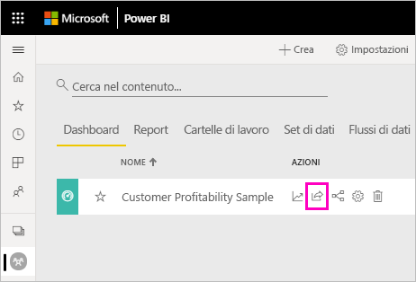

Sia che si condivida il contenuto all'interno o all'esterno dell'organizzazione, è necessaria una [licenza Power BI Pro](service-features-license-type.md). Anche i destinatari devono avere una licenza di Power BI Pro, a meno che il contenuto non sia in una [capacità Premium](service-premium-what-is.md). 

È possibile condividere dashboard e report da numerose posizioni nel servizio Power BI: Preferiti, Recenti, Area di lavoro personale e Condivisi con l'utente corrente se il proprietario lo consente. È possibile condividere il contenuto anche da altre aree di lavoro se si ha il [ruolo Amministratore, Membro o Collaboratore](service-new-workspaces.md#roles-in-the-new-workspaces) nell'area di lavoro. 

Quando si condivide un dashboard o un report, gli utenti che lo condividono possono visualizzarlo e interagire con esso, ma non modificarlo. Essi vedranno gli stessi dati che l'utente vede nei dashboard o nei report, a meno che non sia stata applicata la [sicurezza a livello di riga](service-admin-rls.md). I colleghi con cui si condivide il dashboard possono anche condividerlo con i loro colleghi, se sono autorizzati a tale scopo. Gli utenti all'esterno dell'organizzazione possono visualizzare il dashboard o il report e interagire con esso, ma non condividerlo. 

Non è possibile *condividere* il contenuto direttamente da Power BI Desktop. I [report vengono pubblicati da Power BI Desktop](desktop-upload-desktop-files.md) al servizio Power BI. È tuttavia possibile [condividere un dashboard dalle app Power BI per dispositivi mobili](consumer/mobile/mobile-share-dashboard-from-the-mobile-apps.md).  

## Video: Condividere un dashboard
Il video seguente mostra come condividere il dashboard con i colleghi all'interno e all'esterno dell'azienda. Seguire quindi tutte le istruzioni riportate sotto il video per provare a farlo da soli.

<iframe width="560" height="315" src="https://www.youtube.com/embed/0tUwn8DHo3s?list=PL1N57mwBHtN0JFoKSR0n-tBkUJHeMP2cP" frameborder="0" allowfullscreen></iframe>

## Condividere un dashboard o un report

1. In un elenco di dashboard o report, oppure in un dashboard o un report aperto, selezionare **Condividi** .

2. Nella casella superiore, immettere gli indirizzi di posta elettronica completi di singoli utenti, gruppi di distribuzione o gruppi di sicurezza. Non è possibile condividere con le liste di distribuzione dinamiche. 
   
   È possibile condividere con utenti con indirizzi esterni all'organizzazione, ma verrà visualizzato un avviso. Per altre informazioni, vedere [Condividere un dashboard o un report all'esterno dell'organizzazione](#share-a-dashboard-or-report-outside-your-organization) in questo articolo.
   
   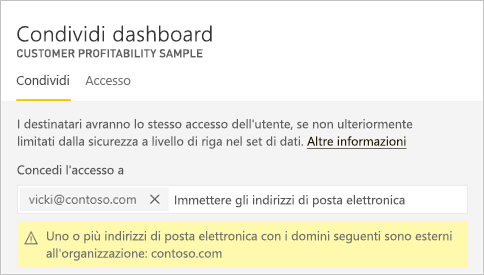 
 
   >[!NOTE]
   >La casella di input supporta un massimo di 100 utenti o gruppi distinti. Per informazioni sulla condivisione con altri utenti, vedere [Condividere con più di 100 utenti](#share-with-more-than-100-separate-users) in questo articolo.

3. Aggiungere un messaggio, se si vuole. È facoltativo.
4. Per consentire ai colleghi di condividere il contenuto con altri utenti, selezionare **Consenti ai destinatari di condividere il dashboard (o il report)** .
   
   Il consenso alla condivisione da parte di altri utenti è definito *ricondivisione*. Se li autorizzi, gli utenti possono ricondividere dal servizio Power BI e dalle app per dispositivi mobili oppure possono inoltrare l'invito tramite posta elettronica ad altri utenti dell'organizzazione. L'invito scade dopo un mese. Gli utenti esterni all'organizzazione non possono ricondividere il dashboard. Il proprietario del contenuto può disattivare la ricondivisione o revocarla per singoli utenti. Vedere [Arrestare o modificare la condivisione](#stop-or-change-sharing) in questo articolo.

5. Se si seleziona **Consente agli utenti di creare nuovo contenuto usando i set di dati sottostanti**, gli utenti possono creare report personalizzati in altre aree di lavoro in base al set di dati per questo dashboard. Per altre informazioni, vedere [Creare report basati su set di dati di aree di lavoro diverse](service-datasets-discover-across-workspaces.md).

1. Seleziona **Condividi**.
   
   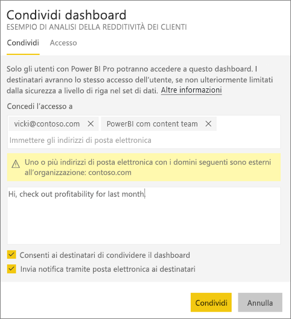  
   
   Power BI invierà un invito tramite posta elettronica ai singoli utenti, ma non ai gruppi, con un collegamento al contenuto condiviso. Verrà visualizzata una notifica **Operazione riuscita**. 
   
   Quando i destinatari nell'organizzazione fanno clic sul collegamento, Power BI aggiunge il dashboard o il report alla rispettiva pagina elenco **Condivisi con l'utente corrente**. Infine, potranno selezionare il nome del mittente per visualizzare tutto il contenuto condiviso. 
   
   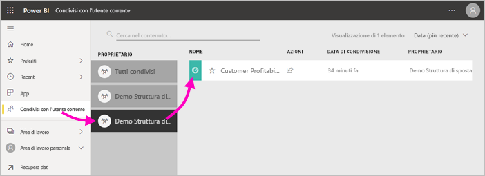
   
   Quando i destinatari esterni all'organizzazione fanno clic sul collegamento, possono visualizzare il dashboard o il report, ma non nel consueto portale di Power BI. Per altre informazioni, vedere [Condividere un dashboard o un report all'esterno dell'organizzazione](#share-a-dashboard-or-report-outside-your-organization) in questo articolo.

## Visualizzare gli utenti autorizzati ad accedere a un dashboard o a un report
In alcuni casi è necessario visualizzare gli utenti con cui è stato condiviso un dashboard o un report e verificare con chi lo hanno a loro volta condiviso.

1. Nell'elenco di dashboard o report, oppure nel dashboard o nel report stesso, selezionare **Condividi** . 
2. Nella finestra di dialogo **Condividi dashboard** o **Condividi report** selezionare **Accesso**.
   
    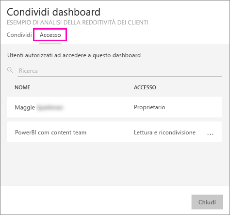

    Gli utenti esterni all'organizzazione sono indicati come **Guest**.

    In questa visualizzazione è possibile [interrompere o modificare le autorizzazioni di condivisione](#stop-or-change-sharing). 

## Condividere un dashboard o un report all'esterno dell'organizzazione
Quando si condivide con utenti esterni all'organizzazione, questi ricevono un messaggio di posta elettronica con un collegamento al report o al dashboard condiviso. Per vedere gli elementi condivisi, è necessario accedere a Power BI. Se non hanno una licenza Power BI Pro, possono richiederla quando fanno clic sul collegamento.

Dopo l'accesso, il dashboard o il report condiviso verrà visualizzato in una finestra del browser separata, non nel consueto portale di Power BI. Per accedere allo stesso dashboard o report in futuro, dovranno aggiungere il collegamento ai segnalibri.

Non possono modificare il contenuto del dashboard o report. Possono interagire con i grafici e modificare i filtri o i filtri dei dati, ma non possono salvare le modifiche. 

Il dashboard o il report condiviso è visibile solo per i destinatari diretti. Se ad esempio è stato inviato il messaggio a Vicki@contoso.com, solo Vicki visualizza il dashboard. Nessun altro può visualizzare il dashboard, nemmeno se Vicki gli inoltra il collegamento. Vicki deve usare lo stesso indirizzo di posta elettronica per accedervi. Se Vicki effettua l'accesso con un altro indirizzo di posta elettronica, non potrà accedere al dashboard.

Gli utenti esterni all'organizzazione non visualizzano del tutto i dati se è implementata la sicurezza a livello di ruolo o di riga nei modelli tabulari di Analysis Services in locale.

Usare un gruppo di sicurezza, non un gruppo di distribuzione, da condividere con un gruppo che include persone con indirizzi di posta elettronica esterni. Le persone con indirizzi di posta elettronica esterni in un gruppo di distribuzione non possono visualizzare il contenuto condiviso, a meno che non siano utenti guest B2B di Azure Active Directory (Azure AD). Vedere altre informazioni sugli [utenti guest B2B di Azure AD](service-admin-azure-ad-b2b.md).

Se si invia un collegamento da un'app Power BI per dispositivi mobili a persone esterne all'organizzazione, facendo clic sul collegamento viene aperto il dashboard in un browser, non nell'app Power BI per dispositivi mobili.

### Consentire agli utenti esterni di modificare il contenuto

L'amministratore di Power BI può consentire agli utenti guest esterni di modificare e gestire il contenuto dell'organizzazione. La loro esperienza non sarà quindi limitata al solo consumo, ma potranno anche modificare e gestire il contenuto all'interno dell'organizzazione. Per altre informazioni, vedere [Distribuire il contenuto di Power BI agli utenti guest esterni usando Azure AD B2B](service-admin-azure-ad-b2b.md).

## Arrestare o modificare la condivisione
Solo il proprietario del dashboard o del report può attivare e disattivare la ricondivisione.

### Se l'invito per la condivisione non è stato ancora inviato
* Deselezionare la casella di controllo **Consenti ai destinatari di condividere il dashboard (o il report)** nella parte inferiore dell'invito prima di inviarlo.

### Se il dashboard o il report è già stato condiviso
1. Nell'elenco di dashboard o report, oppure nel dashboard o nel report stesso, selezionare **Condividi** . 
2. Nella finestra di dialogo **Condividi dashboard** o **Condividi report** selezionare **Accesso**.
   
    
3. Fare clic sui puntini di sospensione ( **...** ) accanto a **Lettura e ricondivisione** e selezionare:
   
   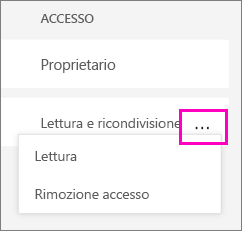
   
   * **Lettura** per evitare che l'utente condivida il dashboard con altri utenti.
   * **Rimuovi accesso** per impedire all'utente di visualizzare il contenuto condiviso.

4. Nella finestra di dialogo **Rimuovi accesso** stabilire se si vuole rimuovere l'accesso anche al contenuto correlato, ad esempio report e set di dati. Se si rimuovono elementi con un'icona di avviso , è consigliabile rimuovere anche il contenuto correlato. In caso contrario, non verrà visualizzato correttamente.

    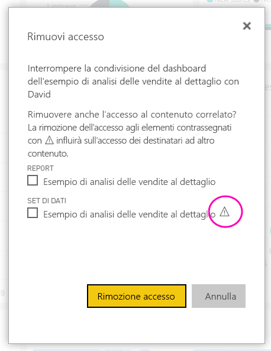

## Limitazioni e considerazioni
Aspetti da tenere presenti per la condivisione di dashboard e report:

* In generale, i dati visualizzati nel dashboard o nel report sono gli stessi sia per l'utente che per i relativi colleghi. Se quindi un utente ha le autorizzazioni per visualizzare una maggior quantità di dati rispetto ai colleghi, questi ultimi visualizzano tutti i dati presenti nel dashboard o nel report. Se tuttavia la [sicurezza a livello di riga](service-admin-rls.md) viene applicata al set di dati sottostante di un dashboard o un report, le credenziali di ogni persona determinano a quali dati può accedere.
* Tutti gli utenti con cui si condivide il dashboard lo possono visualizzare e possono interagire con i report correlati nella [visualizzazione di lettura](consumer/end-user-reading-view.md#reading-view). In generale, non possono creare report o salvare le modifiche apportate a report esistenti. Se tuttavia si seleziona **Consente agli utenti di creare nuovo contenuto usando i set di dati sottostanti**, gli utenti possono creare report personalizzati in altre aree di lavoro in base al set di dati per questo dashboard o report.
* Sebbene nessuno possa visualizzare o scaricare il set di dati, è possibile accedervi direttamente tramite la funzionalità Analizza in Excel. Un amministratore può limitare l'uso di Analizza in Excel per tutti gli utenti in un gruppo. Tuttavia, la restrizione riguarda tutti gli utenti in tale gruppo e ogni area di lavoro a cui appartiene al gruppo.
* Tutti gli utenti possono [aggiornare manualmente i dati](refresh-data.md).
* Se si usa Office 365 per la posta elettronica, è possibile condividere con i membri di un gruppo di distribuzione immettendo l'indirizzo di posta elettronica associato a quel gruppo.
* I colleghi con lo stesso dominio di posta elettronica dell'utente e quelli che usano un dominio diverso ma registrato con il medesimo tenant possono condividere il dashboard con altri utenti. Si supponga ad esempio che i domini contoso.com e contoso2.com siano stati registrati nello stesso tenant e che l'indirizzo di posta elettronica sia konrads@contoso.com. Sia ravali@contoso.com che gustav@contoso2.com possono condividere il dashboard, purché vengano loro concesse le autorizzazioni per la condivisione.
* Se i colleghi hanno già accesso a un dashboard o a un report specifico, è possibile inviare un collegamento diretto semplicemente copiandone l'URL quando ci si trova al suo interno. Ad esempio: `https://powerbi.com/dashboards/g12466b5-a452-4e55-8634-xxxxxxxxxxxx`.
* Analogamente, se i colleghi hanno già accesso a un dashboard specifico, è possibile [inviare un collegamento diretto al report sottostante](service-share-reports.md). 

### Condividere il contenuto con più di 100 utenti distinti

È possibile condividere il contenuto con un massimo di 100 utenti o gruppi in una singola azione di condivisione. Si può però consentire l'accesso a un elemento a più di 500 utenti. Ecco alcuni suggerimenti per iniziare:

- Condividere il contenuto più volte specificando i singoli utenti.
- Condividere il contenuto con un gruppo di utenti che include tutti gli utenti. 
- Creare il report o il dashboard in un'area di lavoro, quindi creare un'app dall'area di lavoro. È possibile condividere l'app con molte più persone. Per altre informazioni, vedere [Pubblicare un'app in Power BI](service-create-distribute-apps.md).

## Risolvere i problemi di condivisione

### I destinatari del dashboard visualizzano un'icona a forma di lucchetto in un riquadro o un messaggio di "Autorizzazione obbligatoria"

È possibile che gli utenti con cui si condivide il dashboard vedano un riquadro bloccato in un o un messaggio di "Autorizzazione obbligatoria" quando provano a visualizzare un report.

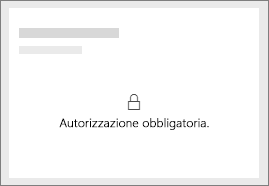

In tale caso, è necessario concedere agli utenti l'autorizzazione per il set di dati sottostante.

1. Passare alla scheda **Set di dati** nell'elenco del contenuto.

1. Selezionare i puntini di sospensione ( **...** ) accanto al set di dati e quindi selezionare **Gestisci autorizzazioni**.

    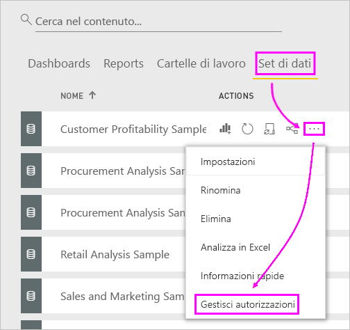

1. Selezionare **Aggiungi utente**.

    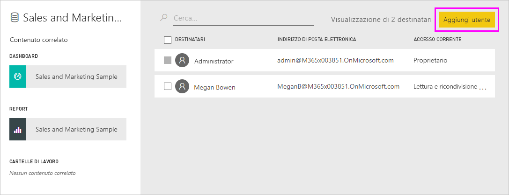

1. Immettere gli indirizzi di posta elettronica completi di singoli utenti, gruppi di distribuzione o gruppi di sicurezza. Non è possibile condividere con le liste di distribuzione dinamiche.

    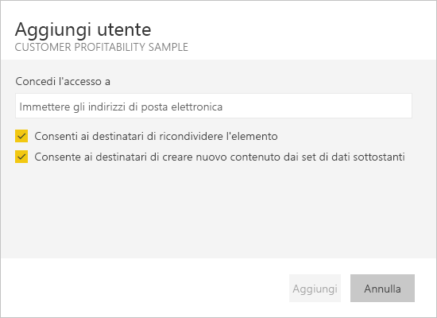

1. Selezionare **Aggiungi**.

### Non è possibile condividere un dashboard o un report

Per condividere un dashboard o un report, è necessario essere autorizzati a ricondividere il contenuto sottostante, ovvero report e set di dati correlati. Se viene visualizzato un messaggio che indica che non è possibile condividere, chiedere all'autore del report di concedere l'autorizzazione di ricondivisione per tali report e set di dati.

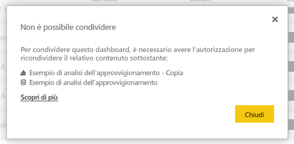

## Passaggi successivi

* [Come si condividono i dashboard e i report e in che modo ci si collabora?](service-how-to-collaborate-distribute-dashboards-reports.md)
* [Condividere un report di Power BI filtrato](service-share-reports.md)
* Domande? [Provare la community di Power BI](https://community.powerbi.com/)

