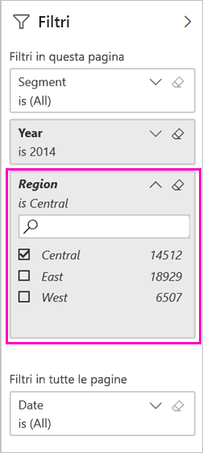
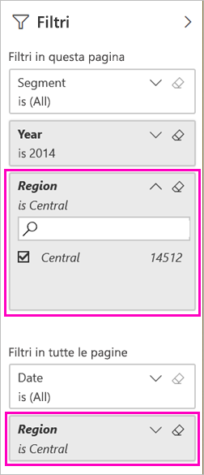

# Due modi di condividere un report di Power BI filtrato
La *condivisione* è un approccio valido per consentire ad alcuni utenti di accedere ai dashboard e ai report. Cosa accade se si vuole condividere una versione filtrata di un report? Ad esempio, un report che mostri solo i dati relativi a una città, un venditore o un anno specifici. Provare a filtrare un report e condividerlo o a creare un URL personalizzato. Il report viene filtrato quando i destinatari lo aprono per la prima volta. I destinatari possono rimuovere il filtro modificando l'URL. 

Power BI offre anche [altri modi per collaborare e distribuire i report](service-how-to-collaborate-distribute-dashboards-reports.md). Con la condivisione, l'utente e i destinatari necessitano di una [licenza Power BI Pro](service-features-license-type.md). In caso contrario, il contenuto deve avere una [capacità Premium](service-premium-what-is.md). 

## Due modi per filtrare un report

Per entrambe le tecniche di filtro viene usata l'app modello di esempio Marketing and Sales. Si vuole provare? È anche possibile installare l'[app modello di esempio Marketing and Sales](https://appsource.microsoft.com/product/power-bi/microsoft-retail-analysis-sample.salesandmarketingsample?tab=Overview).

### Impostare un filtro

Aprire un report nella [visualizzazione di modifica](consumer/end-user-reading-view.md) e applicare un filtro.

In questo esempio viene filtrata la pagina YTD Category dell'app modello di esempio Marketing and Sales in modo da visualizzare solo i valori dove **Region** è uguale a **Central**. 
 

Salvare il report.

### Creare un filtro nell'URL

Quando si aggiunge il filtro alla fine dell'URL della pagina del report, il comportamento è leggermente diverso. La pagina filtrata ha lo stesso aspetto. Tuttavia, Power BI aggiunge il filtro all'intero report e rimuove gli altri valori dal riquadro del filtro.  

Aggiungere quanto segue alla fine dell'URL della pagina del report:
   
    ?filter=*tablename*/*fieldname* eq *value*
   
Il campo deve essere di tipo number, datetime o string. I valori *tablename* o *fieldname* non possono contenere spazi.
   
In questo esempio, il nome della tabella è **Geo**, il nome del campo è **Region** e il valore a cui applicare il filtro è **Central**:
   
    ?filter=Geo/Region eq 'Central'

Il browser aggiunge dei caratteri speciali per rappresentare barre, spazi e apostrofi, quindi si ottiene un risultato simile al seguente:
   
    app.powerbi.com/groups/xxxx/reports/xxxx/ReportSection4d00c3887644123e310e?filter=Geo~2FRegion%20eq%20'Central'

Salvare il report.

Per maggiori dettagli, vedere l'articolo [Filtrare un report usando i parametri della stringa di query nell'URL](service-url-filters.md).

## Condividere il report filtrato

1. Quando si [condivide il report](service-share-dashboards.md) deselezionare la casella di controllo **Invia notifica tramite posta elettronica ai destinatari**.

    

4. Inviare il collegamento con il filtro creato in precedenza.

## Passaggi successivi
* [Modalità per la condivisione del lavoro in Power BI](service-how-to-collaborate-distribute-dashboards-reports.md)
* [Share a dashboard (Condividi un dashboard)](service-share-dashboards.md)
* Altre domande? [Provare la community di Power BI](http://community.powerbi.com/).
* Per inviare suggerimenti, passare al [sito della community di Power BI](https://community.powerbi.com/).

