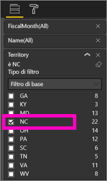
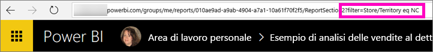
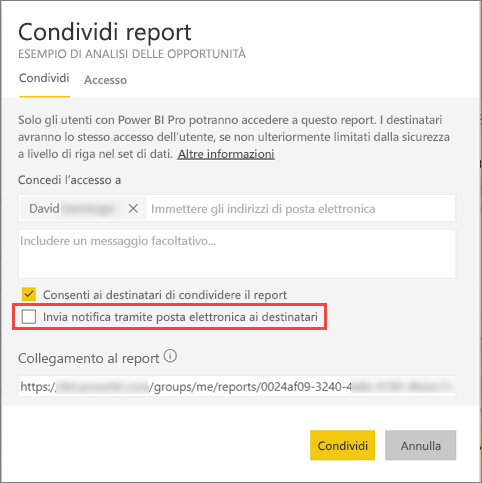

# Condividere un report di Power BI filtrato con i colleghi
La *condivisione* è un approccio valido per consentire ad alcuni utenti di accedere ai dashboard e ai report. Power BI offre anche [diversi altri modi per collaborare a report e distribuirli](service-how-to-collaborate-distribute-dashboards-reports.md).

Con la condivisione, l'utente e i destinatari necessitano di una [licenza Power BI Pro](service-features-license-type.md). In caso contrario, il contenuto deve avere una [capacità Premium](service-premium.md). 

È possibile condividere un report con i colleghi nello stesso dominio di posta elettronica, dalla maggior parte delle posizioni nel servizio Power BI: Preferiti, Recenti, Condivisi con l'utente corrente (se il proprietario lo consente), Area di lavoro personale o altre aree di lavoro. Quando si condivide un report, i colleghi con cui viene condiviso possono visualizzarlo e interagire con esso, ma non possono modificarlo. Essi vedranno gli stessi dati che l'utente vede nel report, a meno che non sia stata applicata la [sicurezza a livello di riga](service-admin-rls.md). 

Cosa accade se si vuole condividere una versione filtrata di un report? Ad esempio, un report che mostri solo i dati relativi a una città, un venditore o un anno specifici. Provare a creare un URL personalizzato. Quando i destinatari aprono il report per la prima volta, questo verrà filtrato. I destinatari possono rimuovere il filtro modificando l'URL.

## Filtrare e condividere un report

1. Aprire il report in [Visualizzazione di modifica](consumer/end-user-reading-view.md), applicare il filtro e salvare il report.
   
   In questo esempio viene filtrato l'[esempio di analisi delle vendite al dettaglio](sample-tutorial-connect-to-the-samples.md) in modo da visualizzare solo i valori in cui **Territory** equivale a **NC**.
   
   
2. Aggiungere quanto segue alla fine dell'URL della pagina del report:
   
   ?filter=*tablename*/*fieldname* eq *value*
   
    Il campo deve essere di tipo **stringa**. I valori *tablename* o *fieldname* non possono contenere spazi.
   
   In questo esempio, il nome della tabella è **Store**, il nome del campo è **Territory** e il valore a cui applicare il filtro è **NC**:
   
    ?filter=Store/Territory eq 'NC'
   
   
   
   Il browser aggiunge dei caratteri speciali per rappresentare barre, spazi e apostrofi, quindi si otterrà il risultato seguente:
   
   app.powerbi.com/groups/me/reports/010ae9ad-a9ab-4904-a7a1-xxxxxxxxxxxx/ReportSection2?filter=Store%252FTerritory%20eq%20%27NC%27

3. [Condividere il report](service-share-dashboards.md), ma deselezionare la casella di controllo **Invia notifica tramite posta elettronica ai destinatari**. 

    

4. Inviare il collegamento con il filtro creato in precedenza.

## Passaggi successivi
* Per inviare suggerimenti, passare al [sito della community di Power BI](https://community.powerbi.com/).
* [Come si condividono i dashboard e i report e in che modo ci si collabora?](service-how-to-collaborate-distribute-dashboards-reports.md)
* [Share a dashboard (Condividi un dashboard)](service-share-dashboards.md)
* Altre domande? [Provare la community di Power BI](http://community.powerbi.com/).

