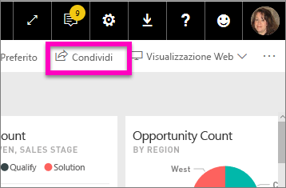
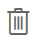
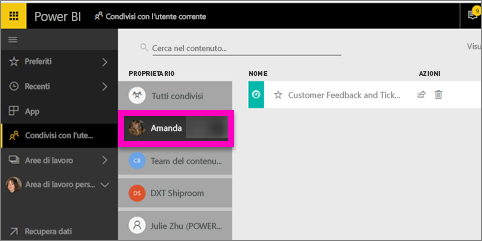

# Visualizzare i dashboard di Power BI condivisi con l'utente corrente
## Condivisi con l'utente corrente

Quando un collega condivide il proprio dashboard, il relativo titolo viene aggiunto all'elenco **Condivisi con l'utente corrente**. Il dashboard è disponibile solo da **Condivisi con l'utente corrente** e non da un'area di lavoro o da **App**.

Il video seguente illustra l'elenco dei contenuti **Condivisi con l'utente corrente** e dimostra come accedervi e filtrarlo. Seguire quindi le istruzioni successive per sotto il video per fare una prova in prima persona. Per poter visualizzare i dashboard condivisi con l'utente è necessario disporre di una licenza Power BI Pro. Per informazioni dettagliate, leggere [Che cos'è Power BI Premium?](service-premium.md).

<iframe width="560" height="315" src="https://www.youtube.com/embed/G26dr2PsEpk" frameborder="0" allowfullscreen></iframe>

Si avranno molte opzioni per interagire con il dashboard e il report sottostante, a seconda delle autorizzazioni concesse dal proprietario. Tra queste, c'è la possibilità di eseguire copie del dashboard, aprire il report nella [Visualizzazione di lettura](service-interact-with-a-report-in-reading-view.md) e ripetere la condivisione con altri colleghi.

## Azioni disponibili dalla schermata **Condivisi con l'utente corrente**
* Selezionare l'icona a stella per [Aggiungere un dashboard ai Preferiti](service-dashboard-favorite.md).
* [Rimuovere un dashboard](service-delete.md)  
* Alcuni dashboard possono essere ricondivisi 
* In più, se gli elenchi di dashboard si allungano, [usare il campo di ricerca e ordinamento per trovare le informazioni necessarie](service-navigation-search-filter-sort.md).
  
  > [!NOTE]
  > Per informazioni sulle classificazioni EGRC, selezionare il pulsante di classificazione o visitare [Classificazione dei dati del dashboard](service-data-classification.md).
  > 
  > 
* Selezionare il nome di un dashboard da aprire ed esplorare. Dopo aver aperto il dashboard condiviso è possibile usare Domande e risposte per porre domande sui dati sottostanti o selezionare un riquadro per aprire e interagire con il report nella Visualizzazione di lettura.

## Filtrare i dashboard condivisi in base al proprietario
Il contenuto della schermata **Condivisi con l'utente corrente** può essere ulteriormente filtrato in base al proprietario del contenuto. Ad esempio, se si seleziona **Amanda**, viene visualizzato solo il dashboard che Amanda ha condiviso con l'utente corrente.

## Passaggi successivi
[Power BI - Concetti di base](service-basic-concepts.md)  
[Power BI Premium: di cosa si tratta?](service-premium.md)  

Altre domande? [Provare a rivolgersi alla community di Power BI](http://community.powerbi.com/)

