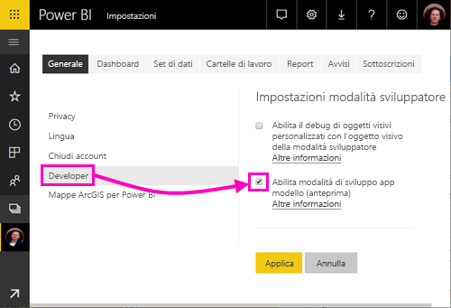
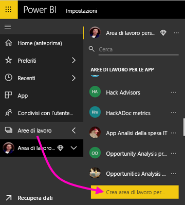
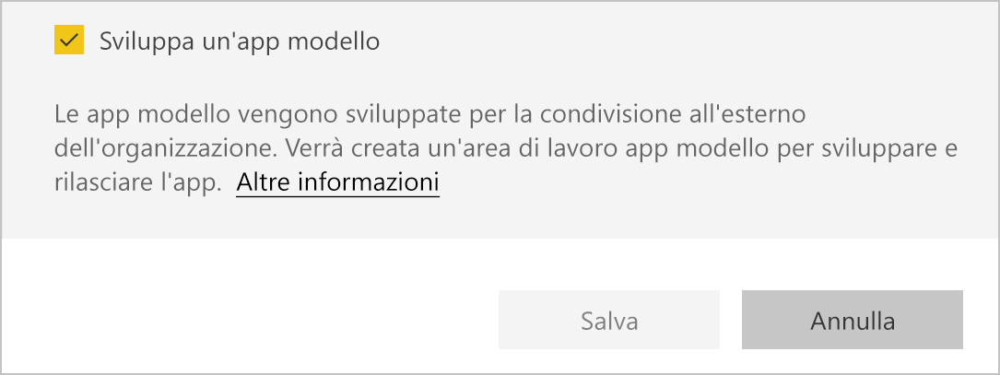
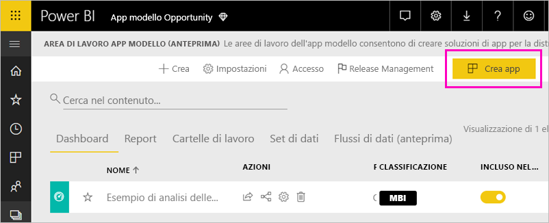
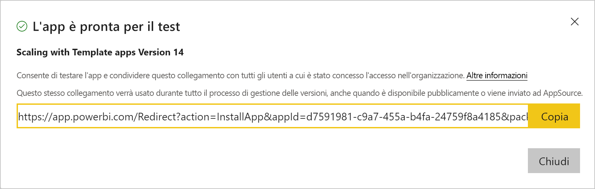
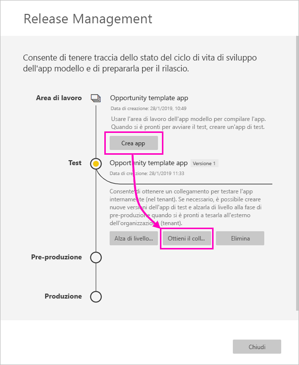
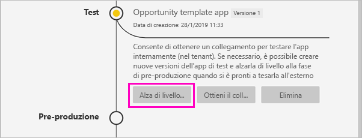
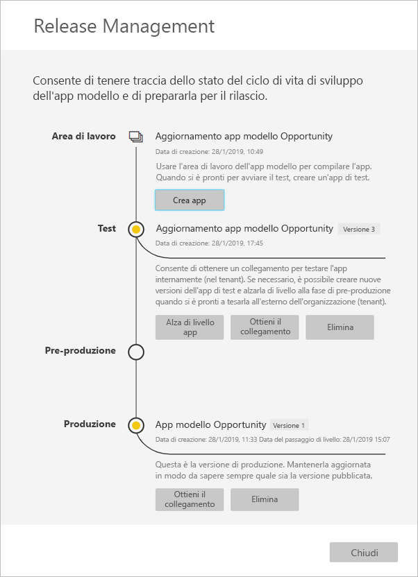

# Creare un'app modello in Power BI (anteprima)

Le nuove *app modello* di Power BI consentono ai partner Power BI di creare app Power BI con un uso minimo o nullo di codice e quindi di distribuire le app a qualsiasi cliente Power BI.  Questo articolo contiene istruzioni dettagliate per la creazione di un'app modello di Power BI. 

Se si ha familiarità con la creazione di report e dashboard di Power BI, è possibile diventare un *creatore di app modello* per integrare e organizzare contenuti analitici in un'*app*. È quindi possibile distribuire l'app ad altri tenant di Power BI tramite qualsiasi piattaforma disponibile, ad esempio con AppSource, oppure usandola nel proprio servizio Web. In qualità di creatore dell'app è possibile creare un pacchetto analitico protetto per la distribuzione. 

Gli amministratori tenant di Power BI determinano quali utenti dell'organizzazione sono autorizzati a creare app modello e quali utenti possono installare tali app. Gli utenti autorizzati possono installare l'app modello, quindi modificarla e distribuirla agli utenti Power BI nella loro organizzazione.

## Prerequisiti 

I requisiti per la creazione di un'app modello sono i seguenti:  

- Una [licenza di Power BI Pro](service-self-service-signup-for-power-bi.md)
- Un'[installazione di Power BI Desktop](desktop-get-the-desktop.md) (facoltativa)
- Conoscenza dei [concetti di base di Power BI](service-basic-concepts.md)
- Autorizzazioni per la creazione di un'app modello. Per informazioni dettagliate, vedere [Impostazioni app modello nel portale dell'amministratore](service-admin-portal.md#template-apps-settings-preview) di Power BI.

## Abilitare la modalità di sviluppo app

Per creare un'app distribuibile ad altri tenant di Power BI è necessario aver attivato la modalità di sviluppo app. In caso contrario si crea semplicemente un'app per utenti di Power BI nell'organizzazione di appartenenza.
 
1. Aprire il servizio Power BI in un browser.
2. Passare a **Impostazioni** > **Generali** > **Sviluppatore** > **Abilita modalità di sviluppo app modello**.

    

    Se l'opzione non è visibile, contattare l'amministratore di Power BI per ottenere le [autorizzazioni per lo sviluppo di app modello](service-admin-portal.md#template-apps-settings-preview) nel portale di amministrazione.

3. Selezionare **Applica**.

## Creare l'area di lavoro app modello

Per creare un'app distribuibile ad altri tenant di Power BI è necessario crearla in una delle nuove aree di lavoro per le app. 
 
1. Nel servizio Power BI selezionare **Aree di lavoro** > **Crea area di lavoro per le app**. 
 
    

3. In **Crea area di lavoro per le app** in **Anteprima aree di lavoro migliorate** selezionare **Prova adesso**.

    

5. Immettere il nome, la descrizione (facoltativa) e l'immagine del logo (facoltativa) dell'area di lavoro per le app.

4. Selezionare **Sviluppa un'app modello**.

    

5. Selezionare **Salva**.

## Creare il contenuto nell'app modello

Come in qualsiasi area di lavoro per le app di Power BI, il passaggio successivo è la creazione del contenuto nell'area di lavoro.  In questa versione di anteprima delle app modello è supportato un solo elemento di ogni tipo: un solo set di dati, un solo report e un solo dashboard.

- [Creare il contenuto di Power BI](power-bi-creator-landing.md) nell'area di lavoro per le app.

Se si usano parametri in Power Query, assicurarsi che abbiano un tipo ben definito (ad esempio Testo). I tipi Qualsiasi e Binario non sono supportati. 

[Suggerimenti per la creazione di app modello in Power BI (anteprima)](service-template-apps-tips.md) include suggerimenti utili per la creazione di report e dashboard per l'app modello.

## Creare l'app modello di test

Ora che l'area di lavoro include contenuto, è possibile integrare tale contenuto in un'app modello. Il primo passaggio è la creazione di un'app modello di test, accessibile solo dall'interno dell'organizzazione nel tenant.

1. Nell'area di lavoro delle app modello selezionare **Crea app**. 

    
 
    Definire i parametri aggiuntivi per l'app modello in quattro categorie. 

    **Personalizzazione**

    - Nome dell'app 
    - Descrizione
    - Logo dell'app (facoltativo)
    - Colore app 

    **Contenuto** 

    - Pagina di destinazione dell'app (facoltativa): definire un report o un dashboard come pagina di destinazione dell'app.  
    
    **Controllo** 

    Controllare diverse limitazioni e restrizioni per gli utenti dell'applicazione in merito al contenuto dell'applicazione. È possibile usare questo controllo per proteggere i dati coperti da proprietà intellettuale eventualmente contenuti nell'app.

    **Accesso**

    - Nella fase di test è possibile decidere quali altri utenti nell'organizzazione possono installare e testare l'app.

    È sempre possibile tornare indietro e modificare queste impostazioni in un secondo momento.  

2. Selezionare **Crea app**. 

    Viene visualizzato un messaggio indicante che l'app di test è pronta, con un collegamento da copiare e condividere con i tester di app.

    

    È stato completato anche il primo passaggio del processo di gestione del rilascio, descritto di seguito.

    

## Gestire il rilascio dell'app modello

Prima di rilasciare pubblicamente l'app modello è importante verificare che sia pronta per il rilascio. Power BI ha creato il riquadro di gestione del rilascio, nel quale è possibile seguire e controllare il percorso completo di rilascio dell'app. È anche possibile attivare la transizione da una fase alla fase successiva. Le fasi comuni sono: 

- Generare l'app di test: solo per i test all'interno dell'organizzazione. 
- Alzare di livello il pacchetto di test alla fase di pre-produzione: per i test all'esterno dell'organizzazione.
- Alzare di livello il pacchetto di pre-produzione a Produzione: versione di produzione. 
- Eliminare tutti i pacchetti o iniziare di nuovo dalla fase precedente. 

Ora si esaminano le singole fasi.

1. Nell'area di lavoro delle app modello selezionare **Release Management**.

    

2. Selezionare **Crea app**. 

    Se l'app di test è stata creata con la procedura **Creare l'app modello di test** descritta in precedenza, il punto giallo accanto a **Test** è già visualizzato come pieno e non è necessario selezionare **Crea app** qui. Se si seleziona Crea app, si torna al processo di creazione di app modello.
 
3. Selezionare **Ottieni il collegamento**.

    
 
9. Per testare l'esperienza di installazione dell'app, copiare il collegamento nella finestra di notifica e incollarlo in una nuova finestra del browser. 

    Da questo punto si segue la stessa procedura che eseguiranno i clienti. Per la versione corrispondente, vedere [Install and distribute template apps in your organization](service-template-apps-install-distribute.md) (Installare e distribuire app modello nell'organizzazione).
 
10. Nella finestra di dialogo selezionare **Installa**.

    Al completamento dell'installazione una notifica indica che la nuova app è pronta. 
 
11. Selezionare **Vai all'app**.
 
12. In **Operazioni iniziali con la nuova app** l'app viene visualizzata come la vedono i clienti. 

    

13. Selezionare **Esplora app** per verificare l'app di test con i dati di esempio.

1. Per apportare modifiche, tornare all'app nell'area di lavoro originale. Aggiornare l'app di test fino a quando non si è soddisfatti.

9. Quando si è pronti per alzare di livello l'app alla pre-produzione per altri test all'esterno del tenant, tornare al riquadro **Release Management** e selezionare **Alza di livello app** accanto a **Test**.
 
    

11. Selezionare **Alza di livello** per confermare la scelta. 

12. Copiare il nuovo URL da condividere all'esterno del tenant per i test. Questo collegamento è lo stesso che si inoltra per iniziare il processo di distribuzione dell'app in AppSource.

12. Quando l'app è pronta per la produzione o la condivisione tramite AppSource, tornare al riquadro **Release Management** e selezionare **Alza di livello app** accanto a **Pre-produzione**.
 
11. Selezionare **Alza di livello** per confermare la scelta. 

    A questo punto l'app è in fase di produzione ed è pronta per la distribuzione.

    

Per rendere disponibile l'app a migliaia di utenti di Power BI in tutto il mondo è consigliabile inviarla ad AppSource. Per informazioni dettagliate, vedere [Offerta di applicazione Power BI](https://docs.microsoft.com/azure/marketplace/cloud-partner-portal/power-bi/cpp-power-bi-offer). 

## Aggiornare l'app

Ora che l'app è in fase di produzione è possibile riattivare la fase di test, senza alcun effetto sull'app nell'ambiente di produzione. 

1. Nel riquadro **Release Management** selezionare **Crea app**.

1. Ripetere il processo di creazione app. 
2. Dopo aver impostato le opzioni in **Personalizzazione**, **Contenuto**, **Controllo** e **Accesso** selezionare di nuovo **Crea app**.
3. Selezionare **Chiudi** e tornare a **Release Management**. 

    Ora sono disponibili due versioni: la versione nell'ambiente di produzione e una nuova versione di test. 

    

## Passaggi successivi

Osservare come i clienti interagiscono con l'app modello in [Install, customize, and distribute template apps in your organization](service-template-apps-install-distribute.md) (Installare, personalizzare e distribuire app modello nell'organizzazione).

Per informazioni dettagliate sulla distribuzione dell'app, vedere [Offerta di applicazione Power BI](https://docs.microsoft.com/azure/marketplace/cloud-partner-portal/power-bi/cpp-power-bi-offer).

