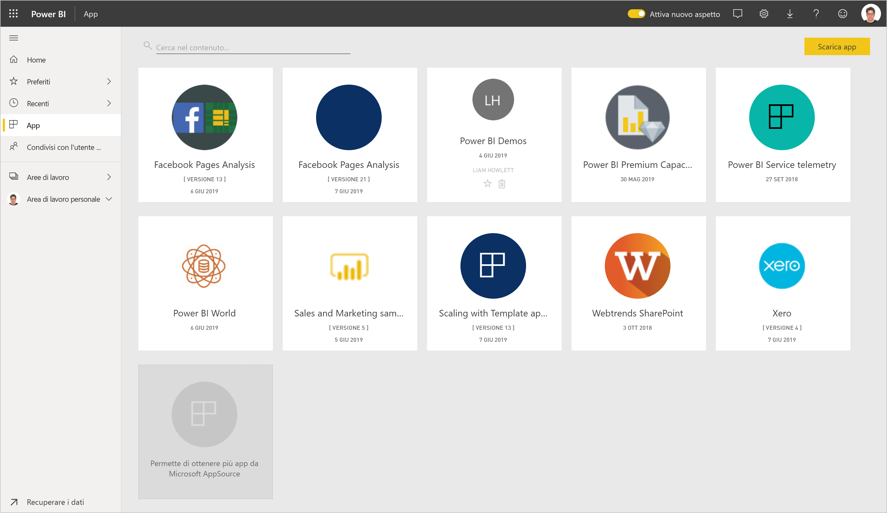
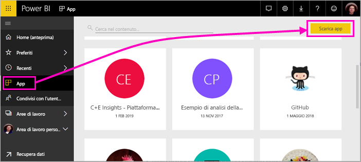
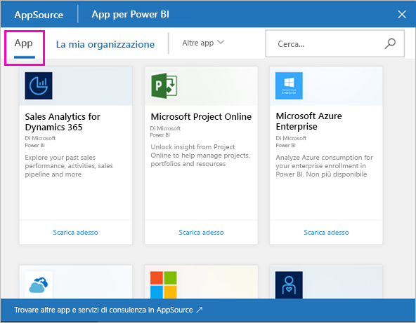
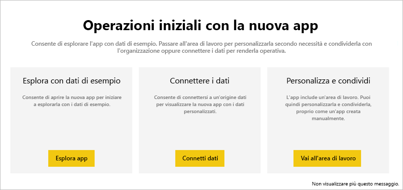
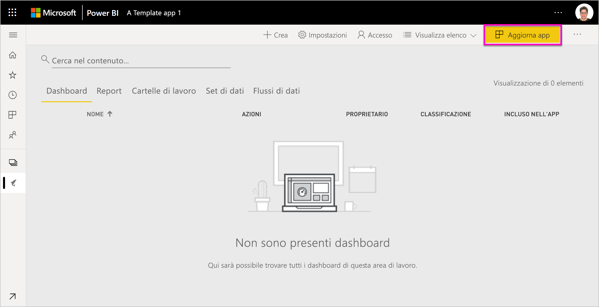
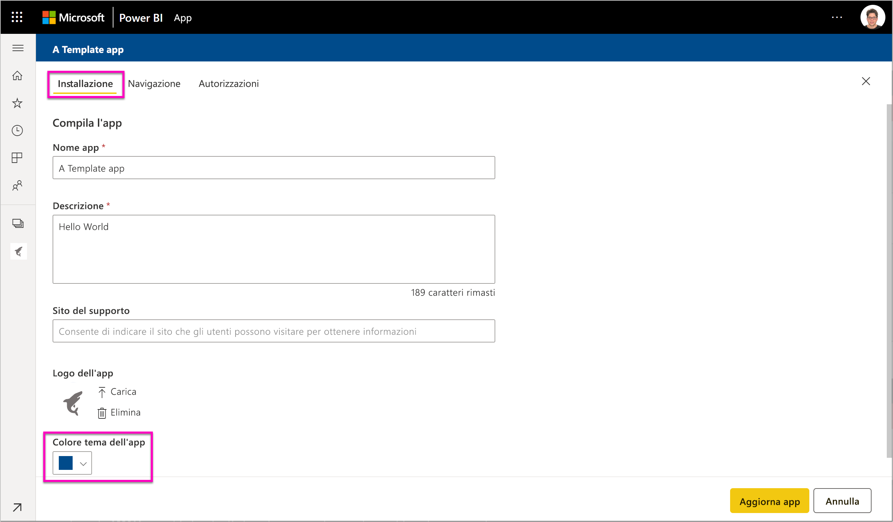
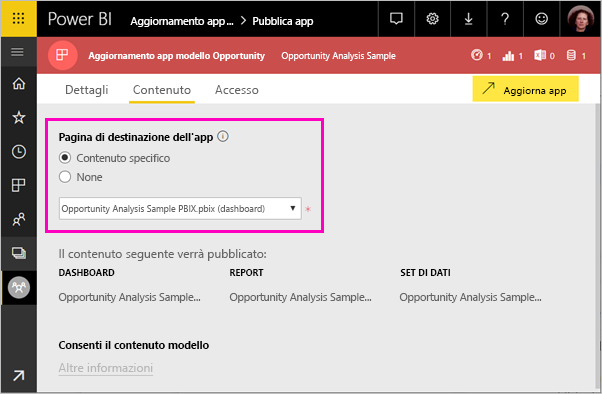
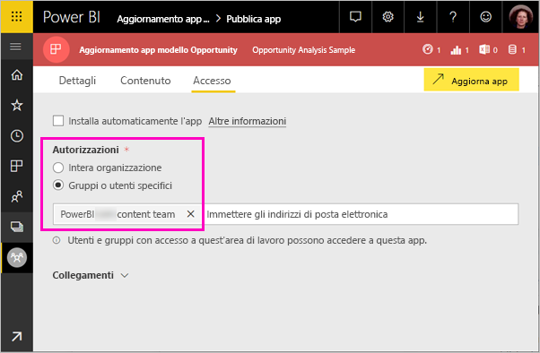

# Installare e distribuire le app modello nell'organizzazione - Power BI (anteprima)

Se l'utente è un analista di Power BI, troverà utile questo articolo che illustra la procedura per installare *app modello* da connettere a molti dei servizi usati per eseguire l'attività aziendale, come ad esempio Salesforce, Microsoft Dynamics e Google Analytics. È possibile modificare dashboard e report per soddisfare le esigenze dell'organizzazione e quindi distribuirli ai colleghi come un'*app*. 

Se si vuole creare app modello da distribuire autonomamente, vedere [Creare un'app modello in Power BI](service-template-apps-create.md). I partner Power BI possono compilare app di Power BI con un uso minimo o nullo di codice e distribuirle ai clienti Power BI. 

## Prerequisiti  

Di seguito sono elencati i requisiti per l'installazione, la personalizzazione e la distribuzione di un'app modello: 

- Una [licenza di Power BI Pro](service-self-service-signup-for-power-bi.md)
- Conoscenza dei [concetti di base di Power BI](service-basic-concepts.md)
- Collegamento di installazione valido dall'autore dell'app modello o da AppSource. 
- Autorizzazioni per l'installazione di app modello. 

## Installare un'app modello

È possibile che si riceva un collegamento a un'app modello. In caso contrario, è possibile cercare l'app desiderata in AppSource. In entrambi i casi, dopo l'installazione, è possibile modificare l'app e distribuirla all'organizzazione.

### Cercare in AppSource da un browser

In un browser selezionare il collegamento seguente per aprire AppSource con filtro per le app di Power BI:

- https://appsource.microsoft.com/marketplace/apps?product=power-bi

### Cercare in AppSource dal servizio Power BI

1. Nel riquadro di spostamento a sinistra nel servizio Power BI selezionare **App** > **Scarica app**.

    

2. In AppSource selezionare **App**.

    

3. Sfogliare o cercare l'app e quindi selezionare **Scarica adesso**.

2. Nella finestra di dialogo selezionare **Installa**.

    Se si ha una licenza di Power BI Pro, l'app viene installata con l'area di lavoro per le app associata. È possibile personalizzare l'app nell'area di lavoro associata.

    Al completamento dell'installazione una notifica indica che la nuova app è pronta. 

3. Selezionare **Vai all'app**.
4. In **Operazioni iniziali con la nuova app** selezionare una delle tre opzioni:

    

    - **Esplora app**: esplorazione dei dati di esempio di base. Iniziare da qui per acquisire familiarità con l'app. 
    - **Connetti dati**: modificare l'origine dati dai dati di esempio alla propria origine dati. È possibile ridefinire i parametri dei set di dati e le credenziali dell'origine dati. Vedere [Limitazioni note](service-template-apps-tips.md#known-limitations) nell'articolo dei suggerimenti sulle app modello. 
    - **Vai all'area di lavoro** (opzione più avanzata): è possibile apportare qualsiasi modifica consentita dal generatore di app.

    In alternativa, ignorare questa finestra di dialogo e accedere all'area di lavoro associata direttamente tramite **Aree di lavoro** nel riquadro di spostamento a sinistra.   
 
5. Prima di condividere l'app con i colleghi, si vorrà connetterla ai propri dati. È anche possibile modificare il report o il dashboard per adattarlo alla propria organizzazione. A questo punto è anche possibile aggiungere altri report o dashboard.

## Aggiornare e distribuire l'app

Dopo aver aggiornato l'app per la propria organizzazione, si è pronti per pubblicarla. I passaggi sono gli stessi della pubblicazione di qualsiasi altra app. 

1. Dopo aver completato la personalizzazione, nella visualizzazione elenco dell'area di lavoro selezionare **Aggiorna app** nell'angolo superiore destro.  

    

2. In **Dettagli** è possibile modificare la descrizione e il colore di sfondo.

   

3. In **Contenuto** è possibile selezionare una pagina di destinazione, ovvero il dashboard o il report.

   

4. In **Accesso** è possibile concedere l'accesso agli utenti selezionati o all'intera organizzazione.  

   

5. Selezionare **Aggiorna app**. 

6. Dopo la pubblicazione, è possibile copiare il collegamento e condividerlo con gli utenti cui è stato concesso l'accesso. Se l'app è stata condivisa, gli utenti visualizzano l'app anche nella scheda **Organizzazione** in AppSource.

## Passaggi successivi 

[Creare aree di lavoro con i colleghi in Power BI](service-create-workspaces.md)

 

 
