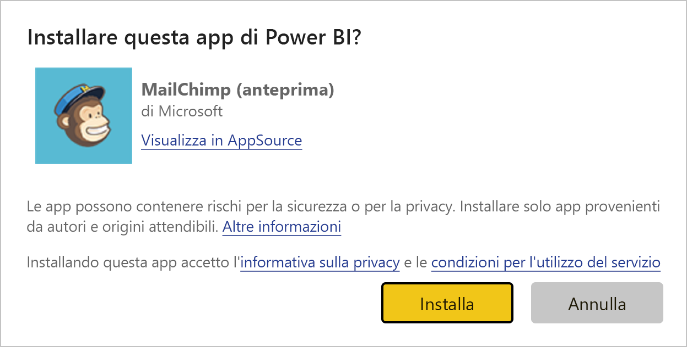
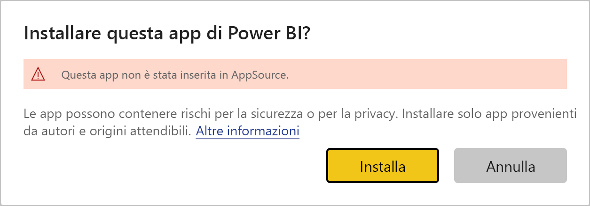
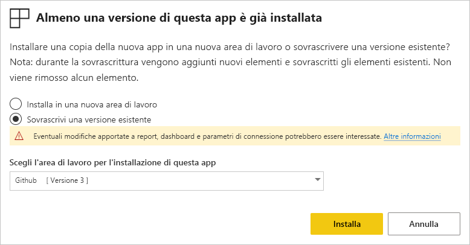
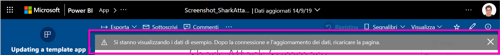

# Installare e distribuire le app modello nell'organizzazione - Power BI

Se l'utente è un analista di Power BI, troverà utile questo articolo che illustra la procedura per installare *app modello* da connettere a molti dei servizi usati per eseguire l'attività aziendale, come ad esempio Salesforce, Microsoft Dynamics e Google Analytics. È possibile modificare dashboard e report per soddisfare le esigenze dell'organizzazione e quindi distribuirli ai colleghi come un'*app*. 

Se si vuole creare app modello da distribuire autonomamente, vedere [Creare un'app modello in Power BI](service-template-apps-create.md). I partner Power BI possono compilare app di Power BI con un uso minimo o nullo di codice e distribuirle ai clienti Power BI. 

## Prerequisiti  

Di seguito sono elencati i requisiti per l'installazione, la personalizzazione e la distribuzione di un'app modello: 

- Una [licenza di Power BI Pro](service-self-service-signup-for-power-bi.md)
- Conoscenza dei [concetti di base di Power BI](service-basic-concepts.md)
- Collegamento di installazione valido dall'autore dell'app modello o da AppSource. 
- Autorizzazioni per l'installazione di app modello. 

## Installare un'app modello

È possibile che si riceva un collegamento a un'app modello. In caso contrario, è possibile cercare l'app desiderata in AppSource. In entrambi i casi, dopo l'installazione, è possibile modificare l'app e distribuirla all'organizzazione.

### Cercare in AppSource da un browser

In un browser selezionare il collegamento seguente per aprire AppSource con filtro per le app di Power BI:

- https://appsource.microsoft.com/marketplace/apps?product=power-bi

### Cercare in AppSource dal servizio Power BI

1. Nel riquadro di spostamento a sinistra nel servizio Power BI selezionare **App** > **Scarica app**.

    

2. In AppSource selezionare **App**.

    

3. Sfogliare o cercare l'app e quindi selezionare **Scarica adesso**.

4. Nella finestra di dialogo selezionare **Installa**.

     Se si ha una licenza di Power BI Pro, l'app viene installata con l'area di lavoro associata. È possibile personalizzare l'app nell'area di lavoro associata.

    Al completamento dell'installazione una notifica indica che la nuova app è pronta.
4. Selezionare **Vai all'app**.
5. In **Operazioni iniziali con la nuova app** selezionare una delle tre opzioni:

    

    - **Esplora app**: esplorazione dei dati di esempio di base. Iniziare da qui per acquisire familiarità con l'app. 
    - **Connetti dati**: modificare l'origine dati dai dati di esempio alla propria origine dati. È possibile ridefinire i parametri dei set di dati e le credenziali dell'origine dati. Vedere [Limitazioni note](service-template-apps-tips.md#known-limitations) nell'articolo dei suggerimenti sulle app modello. 
    - **Vai all'area di lavoro** (opzione più avanzata): è possibile apportare qualsiasi modifica consentita dal generatore di app.

    In alternativa, ignorare questa finestra di dialogo e accedere all'area di lavoro associata direttamente tramite **Aree di lavoro** nel riquadro di spostamento a sinistra.
    >[!NOTE]
    >L'installazione di un'app modello ha installato un'*app aziendale* e un'*area di lavoro*. Altre informazioni sulla [distribuzione delle app in Power BI](service-create-distribute-apps.md).
 
6. Prima di condividere l'app con i colleghi, si vorrà connetterla ai propri dati. È anche possibile modificare il report o il dashboard per adattarlo alla propria organizzazione. A questo punto è anche possibile aggiungere altri report o dashboard.

   Se si seleziona un collegamento di installazione per un'app che non è elencata in AppSource, una finestra di dialogo di convalida richiede di confermare la selezione.

   

   >[!NOTE]
   >Per installare app modello che non sono elencate in AppSource è necessario richiedere le autorizzazioni di amministratore. Per informazioni dettagliate, vedere [Impostazioni app modello nel portale di amministrazione](service-admin-portal.md#template-apps-settings) di Power BI.

## Personalizzare e pubblicare l'app

Dopo aver aggiornato l'app per la propria organizzazione, si è pronti per pubblicarla. I passaggi sono gli stessi della pubblicazione di qualsiasi altra app.

1. Dopo aver completato la personalizzazione, nella visualizzazione elenco dell'area di lavoro selezionare **Aggiorna app** nell'angolo superiore destro.  

    

2. In **Dettagli** è possibile modificare la descrizione e il colore di sfondo.

   

3. In **Spostamento** è possibile usare il nuovo generatore della struttura di spostamento per l'app oppure selezionare il dashboard o il report per la pagina di destinazione. Vedere [Progettare l'esperienza di navigazione](service-create-distribute-apps.md#design-the-navigation-experience) per altri dettagli.

   

4. In **Accesso** è possibile concedere l'accesso agli utenti selezionati o all'intera organizzazione.  

   

5. Selezionare **Aggiorna app**. 

6. Dopo la pubblicazione, è possibile copiare il collegamento e condividerlo con gli utenti cui è stato concesso l'accesso. Se l'app è stata condivisa, gli utenti visualizzano l'app anche nella scheda **Organizzazione** in AppSource.

## Caricare un'app modello

Gli autori di app modello possono rilasciare nuove versioni delle app modello tramite AppSource o un collegamento diretto. Quando si esegue questa operazione, è possibile aggiornare l'app modello durante la reinstallazione dell'app con la stessa versione o una versione più recente.

  >[!NOTE]
  >L'installazione di una nuova versione sovrascrive tutte le modifiche apportate ai report e ai dashboard. Per conservare i report e i dashboard aggiornati, è possibile salvarli con un nome o un percorso diverso prima dell'installazione.

- **Sovrascrivi una versione esistente:** sovrascrive l'area di lavoro esistente con la versione aggiornata dell'app modello.

   

- **Installa in una nuova area di lavoro:** installa una versione aggiornata dell'area di lavoro e dell'app che è necessario riconfigurare

### Comportamento di sovrascrittura

* La sovrascrittura aggiorna i report, i dashboard e il set di dati all'interno dell'*area di lavoro* e non l'app. La sovrascrittura non modifica la struttura di spostamento, la configurazione e le autorizzazioni dell'app.
* Dopo aver aggiornato l'area di lavoro, è necessario *aggiornare l'app* per applicare le modifiche dall'area di lavoro all'app aziendale.
* La sovrascrittura mantiene i parametri e l'autenticazione configurati. Dopo l'aggiornamento, viene avviato un aggiornamento automatico dei set di dati. Durante questo periodo, l'app, i report e i dashboard dell'organizzazione presentano l'esperienza dei *dati di esempio*.
  
* Con la sovrascrittura vengono sempre presentati i dati di esempio fino al completamento dell'aggiornamento. Se l'autore dell'app modello ha apportato modifiche al set di dati o ai parametri, gli utenti dell'area di lavoro e dell'app continuano a vedere l'esperienza dei *dati di esempio*.
* La sovrascrittura non comporta mai l'eliminazione dei report o dei dashboard *nuovi* aggiunti all'area di lavoro. Vengono sovrascritti i report e i dashboard originali con le modifiche apportate dall'autore originale.

>[!IMPORTANT]
>Ricordarsi di [aggiornare l'app](#customize-and-publish-the-app) dopo la sovrascrittura per applicare le modifiche ai report e ai dashboard per gli utenti dell'app aziendale.

## Passaggi successivi

[Creare aree di lavoro con i colleghi in Power BI](service-create-workspaces.md)
