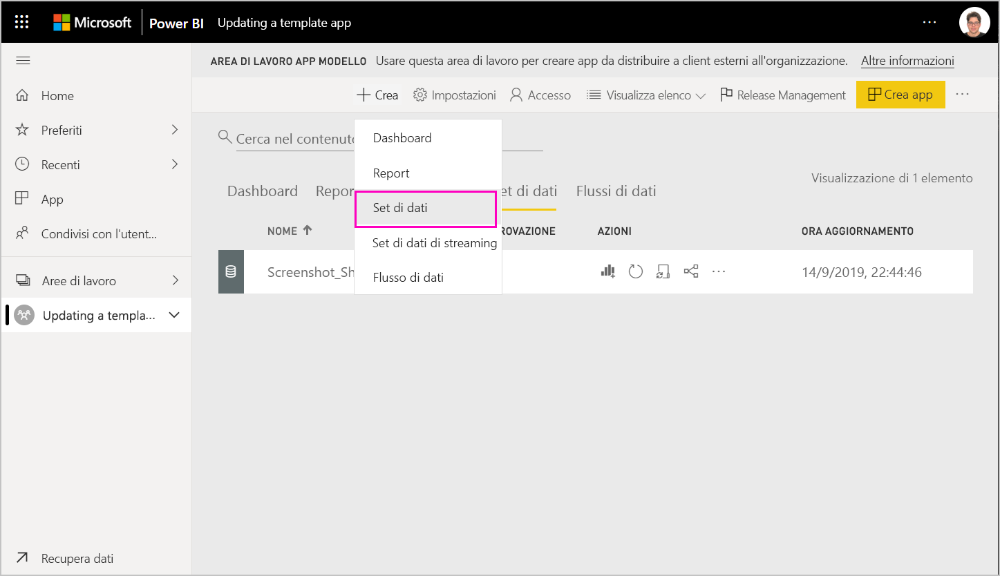
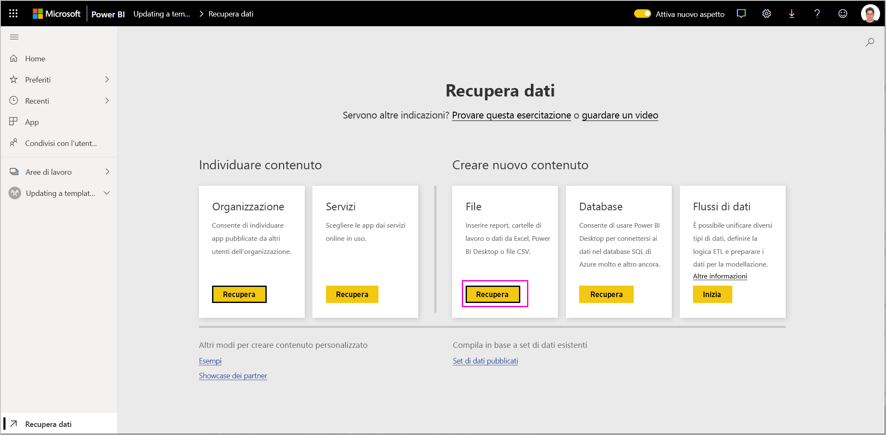
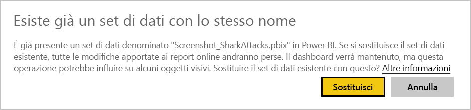
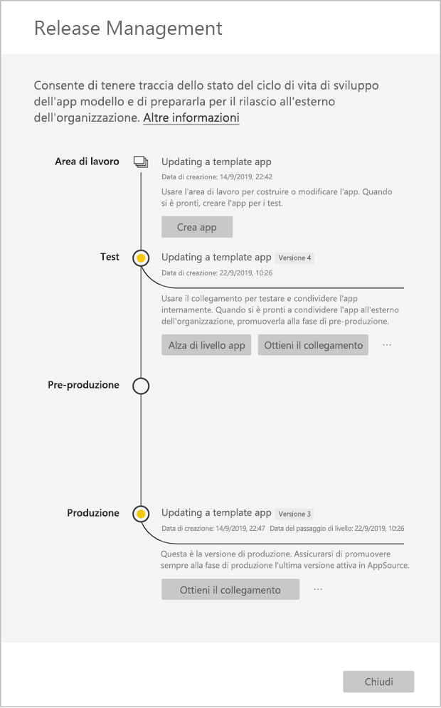
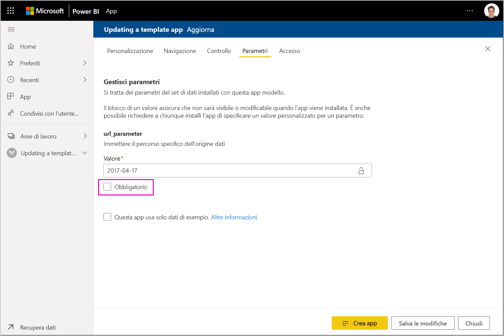

# Aggiornare, eliminare ed estrarre un'app modello

Ora che l'app è in fase di produzione è possibile riattivare la fase di test, senza alcun effetto sull'app nell'ambiente di produzione.
## Aggiornare l'app

Se le modifiche sono state apportate in Power BI Desktop, iniziare dal passaggio (1). Se le modifiche non sono state apportate in Power BI Desktop, iniziare dal passaggio (4).

1. Caricare il set di dati aggiornato e sovrascrivere il set di dati esistente. **Assicurarsi di usare esattamente lo stesso nome di set di dati**. Se si usa un nome diverso, verrà creato un nuovo set di dati per gli utenti che aggiornano l'app.

1. Importare il file PBIX dal computer.

1. Confermare la sovrascrittura.

1. Nel riquadro **Release Management** selezionare **Crea app**.
1. Ripetere il processo di creazione app.
1. Dopo aver impostato le opzioni in **Personalizzazione**, **Contenuto**, **Controllo** e **Accesso** selezionare di nuovo **Crea app**.
1. Selezionare **Chiudi** e tornare a **Release Management**.

   Ora sono disponibili due versioni: la versione nell'ambiente di produzione e una nuova versione di test.

    

5. Quando si è pronti per alzare di livello l'app alla pre-produzione per altri test all'esterno del tenant, tornare al riquadro Gestione del rilascio e selezionare **Alza di livello app** accanto a **Test**.
6. Il collegamento è ora attivo. Eseguire di nuovo l'invio al portale Cloud Partner (CPP) seguendo la procedura in [Aggiornare un'offerta di app Power BI](https://docs.microsoft.com/azure/marketplace/cloud-partner-portal/power-bi/cpp-update-existing-offer).
7. Nel portale Cloud Partner è necessario **pubblicare** di nuovo l'offerta e farla convalidare di nuovo.

   >[!NOTE]
   >Alzare di livello l'app alla fase di produzione solo dopo che l'app è stata approvata nel portale Cloud Partner e pubblicata.

### Comportamento di aggiornamento

1. L'aggiornamento dell'app consentirà al programma di installazione dell'app modello di [aggiornare un'app modello](service-template-apps-install-distribute.md#update-a-template-app) nell'area di lavoro già installata senza perdere la configurazione della connessione.
1. Per informazioni sul modo in cui le modifiche nel set di dati influiscono sull'app modello installata, vedere il [comportamento di sovrascrittura](service-template-apps-install-distribute.md#overwrite-behavior) del programma di installazione.
1. Quando si esegue l'aggiornamento (sovrascrittura) di un'app modello, viene innanzitutto ripristinato il set di dati di esempio e l'app si riconnetterà automaticamente con la configurazione dell'utente (parametri e autenticazione). Fino al completamento dell'aggiornamento, i report, i dashboard e l'app dell'organizzazione presenteranno il banner dei dati di esempio.
1. Se è stato aggiunto un nuovo parametro di query al set di dati aggiornato che richiede l'input degli utenti, è necessario selezionare la casella di controllo *Richiesto*. Il programma di installazione richiederà così la stringa di connessione dopo l'aggiornamento dell'app.
 

## Estrarre l'area di lavoro
Eseguire il rollback alla versione precedente di un'app modello è ora più facile che mai grazie alla funzionalità di estrazione. La procedura seguente consente di estrarre una versione specifica dell'app da diverse fasi di rilascio in una nuova area di lavoro:

1. Nel riquadro di gestione del rilascio premere **(...)** e quindi **Estrai**.

     
2. Nella finestra di dialogo immettere il nome dell'area di lavoro estratta. Verrà aggiunta una nuova area di lavoro.

Il controllo delle versioni della nuova area di lavoro viene reimpostato ed è possibile continuare a sviluppare e distribuire l'app modello dalla nuova area di lavoro estratta.

## Eliminare una versione dell'app modello
Un'area di lavoro di un'app di modello è l'origine di un'app modello distribuita attiva. Per proteggere gli utenti dell'app modello, non è possibile eliminare un'area di lavoro senza prima rimuovere tutte le versioni dell'app create nell'area di lavoro.
L'eliminazione di una versione dell'app comporta anche l'eliminazione dell'URL dell'app, che non funzionerà più.

1. Nel riquadro di gestione del rilascio selezionare i puntini di sospensione **(...)** e quindi **Elimina**.
 
 

>[!NOTE]
>Assicurarsi di non eliminare una versione dell'app in uso dai clienti o in **AppSource**, in quanto in tal caso non funzionerà più.

## Passaggi successivi

Osservare come i clienti interagiscono con l'app modello in [Install, customize, and distribute template apps in your organization](service-template-apps-install-distribute.md) (Installare, personalizzare e distribuire app modello nell'organizzazione).

Per informazioni dettagliate sulla distribuzione dell'app, vedere [Offerta di applicazione Power BI](https://docs.microsoft.com/azure/marketplace/cloud-partner-portal/power-bi/cpp-power-bi-offer).
