# Navigazione nel servizio Power BI
## Riquadro di spostamento a sinistra

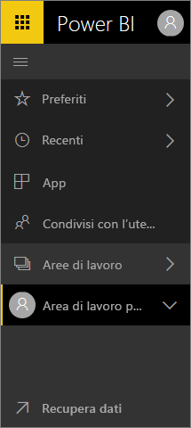

**Guida di riferimento rapido**

| Azione | Percorso nuovo (corrente) |
| --- | --- | --- |
| Aggiungere un dashboard o un report a Preferiti |Area di lavoro > Dashboard o Area di lavoro > Report e selezionare l'icona a stella per evidenziarlo in giallo |
| Aggiungere un'app a Preferiti | Selezionare **App** nel riquadro di spostamento a sinistra e selezionare l'icona a stella accanto al nome dell'app
| Visualizzare l'elenco Preferiti |Selezionare **Preferiti** nel riquadro di spostamento a sinistra |
| Visualizzare un elenco di dashboard e report visitati di recente |Selezionare **Recenti** nel riquadro di spostamento a sinistra |
| Visualizzare un elenco di dashboard condivisi con l'utente corrente |Selezionare **Condivisi con l'utente corrente** nel riquadro di spostamento a sinistra |
| Condividere un dashboard |Aprire un dashboard e selezionare **Condividi** oppure creare e pubblicare un'app |
| Eliminare un dashboard |Area di lavoro personale > Dashboard > icona a forma di cestino |
| Eliminare un report |Area di lavoro personale > Report > icona a forma di cestino |
| Eliminare un set di dati |Area di lavoro personale > Set di dati >... > Elimina |
| Aprire un dashboard |Area di lavoro > Dashboard > e selezionare il nome del dashboard |
| Aprire un report. |Area di lavoro > Report > e selezionare il nome del report |
| Aprire un set di dati |Area di lavoro > Set di dati > e selezionare il nome del set di dati |
| Creare un dashboard |Nella barra di spostamento superiore selezionare Crea > Dashboard |
| Creare un report. |Nella barra di spostamento superiore selezionare Crea > Report |
| Creare un set di dati |Nella barra di spostamento superiore selezionare Crea > Set di dati |
| Creare un'app |Aree di lavoro > Creare un'area di lavoro per le app |
| Visualizzare un elenco di tutti i dashboard, i report e i set di dati di cui si è proprietari |Aree di lavoro > Area di lavoro personale |

## Attività comuni

Amanda presenta una panoramica della navigazione nel servizio Power BI.  Seguire quindi tutte le istruzioni riportate sotto il video per esplorare da soli.

<iframe width="560" height="315" src="https://www.youtube.com/embed/G26dr2PsEpk" frameborder="0" allowfullscreen></iframe>

## Visualizzazione del contenuto (dashboard, report, cartelle di lavoro, set di dati, aree di lavoro, app)
Per iniziare, verrà esaminata l'organizzazione del contenuto di base, ovvero dashboard, report, set di dati e cartelle di lavoro. In precedenza, tutto il contenuto disponibile era elencato nel riquadro di spostamento a sinistra. Tale opzione è ancora disponibile, ma per impostazione predefinita il contenuto viene visualizzato in base al tipo nel contesto di un'area di lavoro. Selezionare un'area di lavoro nel riquadro di spostamento a sinistra: le schede relative al contenuto associato (dashboard, report, cartelle di lavoro, set di dati) vengono visualizzate nell'area di disegno di Power BI a destra.

Se si usa la versione gratuita di Power BI, verrà visualizzata una sola area di lavoro, ovvero **Area di lavoro personale**.

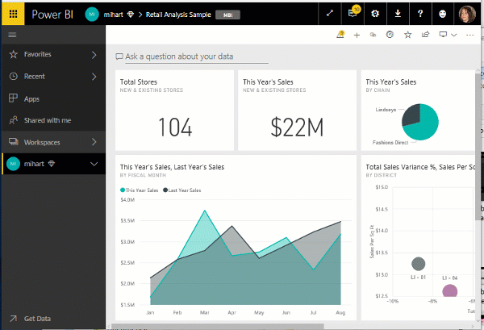

### Dashboard, report e app di Preferiti
L'opzione **Preferiti** consente di accedere rapidamente ai contenuti più importanti.  

1. Con il dashboard o il report aperto, selezionare **Aggiungi a Preferiti** nell'angolo in alto a destra.
   
   
   
   **Aggiungi a Preferiti** diventa **Rimuovi da Preferiti** e l'icona a stella diventa gialla.
   
   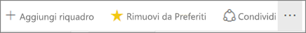

2. Per un'app selezionare **App** nel riquadro di spostamento a sinistra, passare il puntatore sull'app e scegliere la stella per aggiungere l'app a Preferiti.

2. Per visualizzare l'elenco di tutti i contenuti aggiunti a Preferiti, nel riquadro di spostamento a sinistra selezionare la freccia a destra di **Preferiti**. Il riquadro di spostamento a sinistra è una funzionalità permanente del servizio Power BI, pertanto è possibile accedere a questo elenco da qualsiasi punto del servizio Power BI.
   
    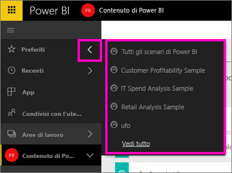
   
    Da qui è possibile selezionare un dashboard, un report o un'app da aprire.

3. Per aprire il riquadro **Preferiti**, nel riquadro di spostamento a sinistra selezionare **Preferiti** oppure l'icona Preferiti .
   
   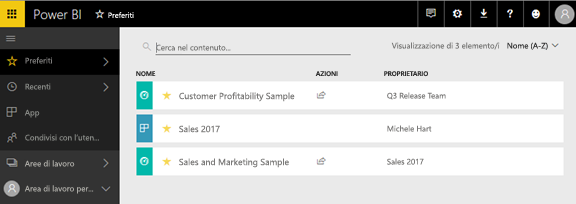
   
   Da qui è possibile trovare o aprire il contenuto, rimuoverlo da Preferiti o condividerlo con i colleghi.

1. È anche possibile aggiungere un dashboard o un report a Preferiti dalla scheda **Dashboard** o **Report** dell'area di lavoro.  È sufficiente aprire l'area di lavoro con la visualizzazione contenuto e selezionare l'icona a stella a sinistra del nome dell'elemento desiderato.
   
   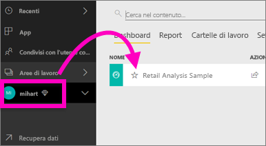

Per altre informazioni, vedere [Preferiti](service-dashboard-favorite.md).

### Recenti
È possibile visualizzare rapidamente i contenuti aperti di recente passando al riquadro **Recenti**, che include i contenuti di tutte le aree di lavoro.

  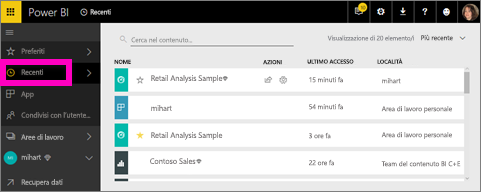

Come per i Preferiti, è possibile accedere rapidamente agli elementi recenti da qualsiasi punto del servizio Power BI selezionando la freccia accanto a **Recenti** nel riquadro di spostamento a sinistra.

  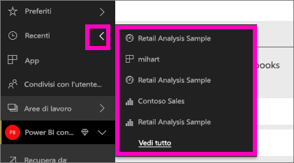

Per altre informazioni, vedere [Recenti in Power BI](service-recent.md).

### App
Un'app è una raccolta di dashboard e report compilati per offrire metriche chiave in un'unica posizione. È possibile avere app interne all'organizzazione, nonché [app per servizi esterni](service-connect-to-services.md) come Google Analytics e Microsoft Dynamics CRM. 

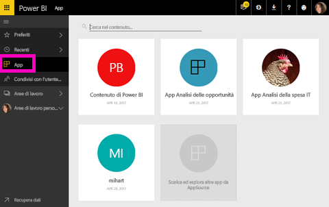

Per altre informazioni, vedere **Aree di lavoro per le app** (di seguito) e [Informazioni sulle app Power BI](service-install-use-apps.md).

### Condivisi con l'utente corrente
**Condivisi con l'utente corrente** è la posizione in cui sono presenti tutti i contenuti che i colleghi hanno condiviso con l'utente.  Filtrare in base al proprietario del dashboard, usare il campo di ricerca per trovare i contenuti pertinenti e ordinare gli elementi per data.  Per quanto riguarda il contenuto condiviso a cui si accede di frequente, è ancora più semplice aggiungerlo ai Preferiti dalla propria visualizzazione **Condivisi con l'utente corrente**.

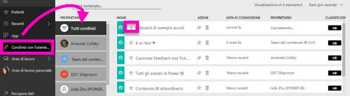

Per altre informazioni, vedere [Condivisi con l'utente corrente](service-shared-with-me.md).

### Utilizzo delle aree di lavoro
L'elemento successivo nel riquadro di spostamento a sinistra è costituito dalle *aree di lavoro*. Le aree di lavoro possono essere considerate come *contenitori* per il contenuto di Power BI. Sono disponibili due tipi di aree di lavoro, ovvero l'**Area di lavoro personale** e le aree di lavoro per le app.

Se non si è membri di un'area di lavoro per le app o un amministratore, nel riquadro di spostamento a sinistra non verrà visualizzata alcuna area di lavoro per le app. Infine, se si è clienti di Power BI gratuito, non verrà visualizzata alcuna area di lavoro per le app.

#### Area di lavoro
Nell'**Area di lavoro personale** viene archiviato tutto il contenuto di cui si è proprietari. È possibile considerarla come un sandbox personale o un'area di lavoro per il proprio contenuto. Il contenuto dell'Area di lavoro personale può essere condiviso con i colleghi. Nell'Area di lavoro personale il contenuto è organizzato in quattro schede, ovvero Dashboard, Report, Cartelle di lavoro e Set di dati.

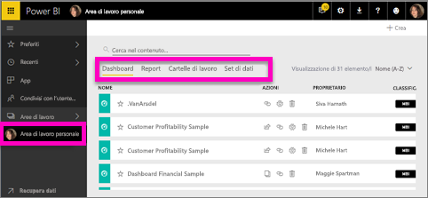

#### Aree di lavoro per le app
Le app e le aree di lavoro per le app sono una funzionalità di Power BI Pro. Le aree di lavoro per le app consentono di creare dashboard e report per altri utenti. Un'area di lavoro per le app è il posto in cui si crea l'app; dunque, per creare un'app, è prima di tutto necessario creare l'area di lavoro per le app. Queste aree sono infatti l'evoluzione delle aree di lavoro del gruppo, ovvero aree di gestione temporanea e contenitori per il contenuto dell'app.  È possibile collaborare insieme ai colleghi alla creazione di dashboard, report e altro contenuto che si prevede di distribuire a un pubblico più ampio o persino all'intera organizzazione.

Per altre informazioni, vedere [Creare e distribuire un'app in Power BI](service-create-distribute-apps.md#app-workspaces).

Come nell'**Area di lavoro personale**, il contenuto è organizzato in quattro schede, ovvero Dashboard, Report, Cartelle di lavoro e Set di dati.

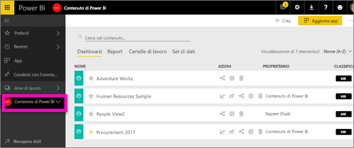

Per passare da un'area di lavoro all'altra selezionare **Aree di lavoro** nel riquadro di spostamento a sinistra.

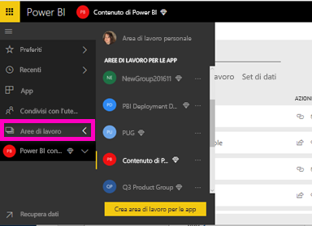

### Cercare e ordinare il contenuto
La visualizzazione contenuto rende più semplice cercare, filtrare e ordinare il contenuto. Per cercare un dashboard, un report o una cartella di lavoro, digitare nell'area di ricerca. Power BI filtra solo il contenuto il cui nome include la stringa di ricerca.

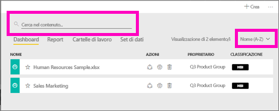

È anche possibile ordinare il contenuto in base al nome o al proprietario.  

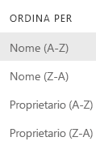

Per altre informazioni, vedere [Eseguire ricerche, ordinare e filtrare in Power BI](service-navigation-search-filter-sort.md).

## Passaggi successivi
[Servizio Power BI - Concetti fondamentali](service-basic-concepts.md)    

Domande o commenti? [Visitare il forum della community di Power BI](http://community.powerbi.com/t5/Navigation-Preview-Forum/bd-p/NavigationPreview)

