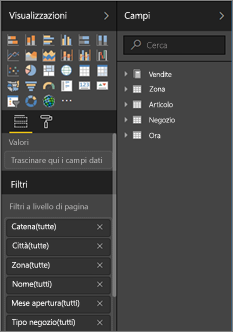
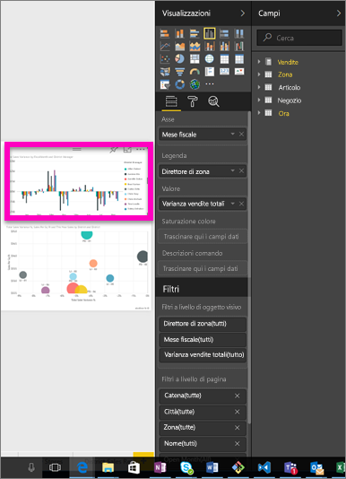
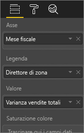
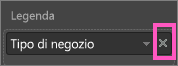
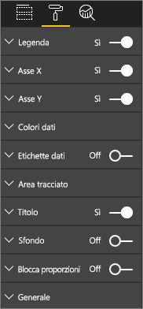
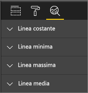
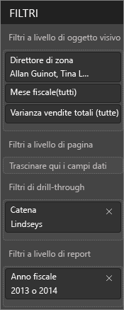
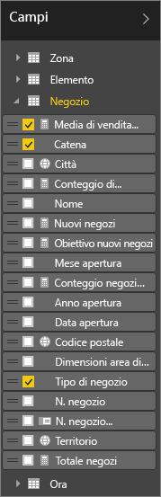

# Presentazione dell'editor di report
## Modifica di report nel servizio Power BI e in Power BI Desktop
Gli editor di report disponibili nel servizio Power BI e in Power BI Desktop sono molto simili. Il video mostra l'editor di report in Power BI Desktop e questo articolo illustra l'editor di report nel servizio Power BI. 

## Differenza tra *autori* di report e *fruitori* di report
La possibilità di creare e modificare un report è limitata ai proprietari di report (noti anche come *autori*). I *fruitori* di un report condiviso da altri potranno comunque aprirlo e interagire con il report nel servizio Power BI [solo nella visualizzazione di lettura](service-reading-view-and-editing-view.md), ma non saranno disponibili tutte le funzionalità potenti e complete riservate all'autore del report.  

Per altre informazioni sulla visualizzazione di lettura del report, vedere [Visualizzazione di lettura e visualizzazione di modifica dei report nel servizio Power BI](service-reading-view-and-editing-view.md). 

<iframe width="560" height="315" src="https://www.youtube.com/embed/IkJda4O7oGs" frameborder="0" allowfullscreen></iframe>

Nel servizio Power BI l'*editor di report* è disponibile solo nella [Visualizzazione di modifica](service-reading-view-and-editing-view.md). Per aprire un report nella visualizzazione di modifica, è necessario essere un proprietario del report o l'autore.

L'editor di report di Power BI è organizzato in tre sezioni:  

1. Riquadri **Campi**, **Visualizzazioni** e **Filtri**
2. Barre di spostamento superiori    
3. Area di disegno report     

## 1. Riquadri dell'editor di report

All'apertura di un report sono visibili tre riquadri, ovvero Visualizzazioni, Filtri e Campi. I riquadri sul lato sinistro, Visualizzazioni e Filtri, controllano l'aspetto delle visualizzazioni, vale a dire tipo, colori, filtro, formattazione.  Il riquadro a destra, Campi, consente di gestire i dati sottostanti usati nelle visualizzazioni. 

Il contenuto visualizzato nell'editor di report varia in base alle selezioni effettuate nell'area di disegno report.  Ad esempio, quando si seleziona un oggetto visivo singolo: 

|  |  |
| --- | --- |
|  |<ul><li>La parte superiore del riquadro Visualizzazione identifica il tipo di oggetto visivo in uso, in questo esempio un istogramma a colonne raggruppate.  </li> <li>La parte inferiore del riquadro Visualizzazione (potrebbe essere necessario scorrere verso il basso) mostra i campi usati nell'oggetto visivo. Questo grafico usa FiscalMonth, DistrictManager e Total Sales Variance.   </li><li>Il riquadro Filtri (potrebbe essere necessario scorrere verso il basso) mostra eventuali filtri che sono stati applicati.   </li><li>Il riquadro Campi elenca le tabelle disponibili e, se si espande il nome di una tabella, i campi che costituiscono tale tabella. Il carattere giallo indica che almeno un campo della tabella usato nella visualizzazione.  </li><li> Per visualizzare il riquadro di formattazione, per la visualizzazione selezionata, selezionare l'icona del rullo.  </li><li> Per visualizzare il riquadro Analisi, selezionare l'icona della lente di ingrandimento.</ul> |

## Riquadro Visualizzazioni (dall'alto verso il basso)

In questo riquadro è possibile selezionare un tipo di visualizzazione. Le immagini di piccole dimensioni sono dette *modelli*. Nell'immagine precedente è selezionato un grafico a barre raggruppate. Se invece di selezionare prima un tipo di visualizzazione, si inizia a creare una visualizzazione selezionando i campi, Power BI sceglierà automaticamente il tipo di visualizzazione. È possibile accettare il tipo proposto da Power BI o cambiarlo selezionando un modello diverso. È possibile cambiare tipo più volte finché non si individua quello che meglio rappresenta i propri dati.

### Gestire i campi usati nell'oggetto visivo

I bucket (noti anche come *aree*) visualizzati in questo riquadro variano a seconda del tipo di visualizzazione selezionato.  Ad esempio, se si è selezionato un grafico a barre, si vedranno bucket per: Valori, Asse e Legenda. Quando si seleziona un campo o lo si trascina nell'area di disegno, Power BI lo aggiunge a uno dei bucket.  È anche possibile trascinare campi dall'elenco Campi direttamente nei bucket.  Alcuni bucket sono limitati a determinati tipi di dati.  Ad esempio, **Valori** non accetta i campi non numerici. Dunque, se si trascina un campo **employeename** nel bucket **Valori**, Power BI lo cambia in **count of employeename**.

### Rimuovere un campo
Per rimuovere un campo dalla visualizzazione, selezionare la **X** a destra del nome del campo.

Per altre informazioni, vedere [Aggiungere visualizzazioni a un report di Power BI](power-bi-report-add-visualizations-i.md).

### Formattare gli oggetti visivi
Selezionare l'icona del rullo per visualizzare il riquadro Formato. L'opzione disponibile dipende dal tipo di visualizzazione selezionato.

Le opzioni di formattazione sono praticamente infinite.  Per informazioni, esplorarle autonomamente o vedere gli articoli seguenti:

* [Personalizzazione di visualizzazione, sfondo e legenda della visualizzazione](power-bi-visualization-customize-title-background-and-legend.md)
* [Formattazione dei colori](service-getting-started-with-color-formatting-and-axis-properties.md)
* [Personalizzazione delle proprietà degli assi X e Y](power-bi-visualization-customize-x-axis-and-y-axis.md)

### Aggiungere il riquadro Analisi alle visualizzazioni
Per visualizzare il riquadro Analisi, selezionare l'icona della lente di ingrandimento. L'opzione disponibile dipende dal tipo di visualizzazione selezionato.

    
Il riquadro Analisi nel servizio Power BI consente di aggiungere linee di riferimento dinamiche alle visualizzazioni e di concentrare l'attenzione su tendenze o informazioni importanti. Per altre informazioni, vedere [Riquadro Analisi nel servizio Power BI](service-analytics-pane.md) o [Riquadro Analisi in Power BI Desktop](desktop-analytics-pane.md).

- - -
## Riquadro Filtri
Usare il riquadro Filtri per visualizzare, impostare e modificare i filtri permanenti per i report a livello di pagina, report, drill-through e oggetto visivo. È possibile applicare filtri ad hoc alle pagine e agli oggetti visivi del report selezionando gli elementi degli oggetti visivi o usando strumenti come i filtri dei dati, ma tramite il riquadro Filtri lo stato dei filtri viene salvato con il report. 

Il riquadro Filtri offre anche un'altra potente funzionalità, ovvero la possibilità di filtrare i dati in base a un campo ***non già in uso in uno degli oggetti visivi nel report***. Quando si crea una pagina del report Power BI aggiunge automaticamente tutti i campi usati nelle visualizzazioni nell'area dei filtri a livello di oggetto visivo del riquadro Filtri.  Tuttavia, se si vuole impostare un filtro per oggetto visivo, pagina, drill-through o report in base a un campo non attualmente usato in una visualizzazione, è sufficiente trascinarlo su uno dei bucket dei filtri.   

Per altre informazioni, vedere [Aggiungere un filtro a un report](power-bi-report-add-filter.md).

- - -
## Riquadro Campi
Il riquadro Campi mostra tabelle e campi esistenti nei dati e utilizzabili per creare visualizzazioni.

|  |  |
| --- | --- |
|  |<ul><li>Trascinare un campo sulla pagina per avviare una nuova visualizzazione.  È anche possibile trascinare un campo in una visualizzazione esistente per aggiungervi il campo.  </li> <li>Quando si aggiunge un segno di spunta accanto a un campo, Power BI aggiunge tale campo alla visualizzazione attiva o a quella nuova. Decide anche in quale bucket posizionare il campo.  Ad esempio, il campo deve essere usato come legenda, asse o valore? Power BI ipotizza l'uso del campo, che può comunque essere spostato in un altro bucket se necessario.   </li><li>In entrambi i casi, ogni campo selezionato viene aggiunto al riquadro Visualizzazioni nell'editor di report.</li></ul> |

**NOTA**: se si usa Power BI Desktop, sono anche disponibili opzioni per mostrare/nascondere campi, aggiungere calcoli e così via.

### Cosa significano le icone di campo?
* **Aggregati ∑** Un aggregato è un valore numerico che verrà sommato o per cui sarà calcolata la media, ad esempio. Gli aggregati vengono importati con i dati definiti nel modello di dati su cui si basa il report.
  Per altre informazioni, vedere [Aggregati nei report di Power BI](service-aggregates.md).
*  **Misure calcolate (dette anche campi calcolati)**  
   Ogni campo calcolato ha una propria formula hardcoded. Non è possibile modificare il calcolo; ad esempio, se è una somma, può essere solo una somma. Per altre informazioni, leggere [Informazioni sulle misure](desktop-measures.md)
*  **Campi univoci**  
   I campi con questa icona sono stati importati da Excel e sono impostati in modo da mostrare tutti i valori, anche se hanno duplicati. Ad esempio i dati potrebbero contenere due record per utenti denominati "Lorenzo Russo" e ognuno verrà considerato come univoco (non saranno sommati).  
* ** Campi geografici**  
   I campi di posizione possono essere usati per creare visualizzazioni mappa. 
* ** Gerarchia**  
   Selezionare la freccia per visualizzare i campi che costituiscono la gerarchia. 

- - -
## 2. Barra di spostamento superiore
Le azioni disponibili nella barra di spostamento superiore sono numerose e in continuo aumento. Per informazioni su una determinata azione, usare il Sommario della documentazione o la casella di ricerca di Power BI.

## 3. Area di disegno report
Nell'area di disegno report viene visualizzato il lavoro. Quando si usano i riquadri Campi, Filtri e Visualizzazioni per creare oggetti visivi, questi vengono creati e visualizzati nell'area di disegno report. Ogni scheda nella parte inferiore dell'area di disegno rappresenta una pagina del report. Selezionare una scheda per aprire tale pagina. 

## Passaggi successivi:
[Creare un report](service-report-create-new.md)

Altre informazioni sui report nel [servizio Power BI](service-reports.md), in [Power BI Desktop](desktop-report-view.md) e in [Power BI per dispositivi mobili](mobile-apps-view-phone-report.md).

[Power BI - Concetti di base](service-basic-concepts.md)

Altre domande? [Provare la community di Power BI](http://community.powerbi.com/)

