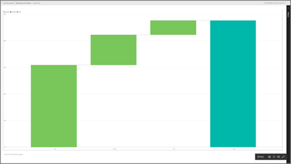

# Visualizzare un riquadro del dashboard nella modalità schermo intero
Per poter essere visualizzati nella modalità schermo intero, i riquadri devono essere prima aperti nella [modalità messa a fuoco](service-focus-mode.md).

## Che cos'è la modalità schermo intero?
Consente di visualizzare [dashboard, report](service-fullscreen-mode.md) e riquadri senza essere distratti da menu e pulsanti di spostamento.  Offre una vista completa e senza alterazioni dell'azienda in qualsiasi momento. È anche detta modalità TV.

Alcuni usi della modalità schermo intero sono:

* presentazione del riquadro a una riunione o conferenza
* visualizzazione del riquadro in un ufficio su schermi di grandi dimensioni o proiettori dedicati
* visualizzazione del riquadro su uno schermo di piccole dimensioni
* revisione del riquadro in modalità di blocco - possibilità di toccare la schermata o passare il mouse sul riquadro senza aprire il report sottostante

## Per attivare e disattivare la modalità schermo intero
1. [Aprire il riquadro in una nuova finestra e visualizzarlo nella modalità messa a fuoco](service-focus-mode.md).
   
    
   
    Il riquadro occupa tutta l'area di disegno, di conseguenza è possibile esaminarlo in dettaglio. In modalità messa a fuoco per un riquadro del dashboard è possibile visualizzare e modificare i filtri applicati durante la creazione dell'oggetto visivo.
   
    
2. Dalla barra dei menu superiore, selezionare l'icona  per visualizzare il riquadro in modalità schermo intero.
3. Nella modalità schermo intero il riquadro occupa l'intera schermata. Dal momento che menu e pulsanti di spostamento non vengono visualizzati,  è possibile ottenere una visualizzazione completa e immediata del riquadro in qualsiasi momento. È anche detta modalità TV.
   
   
4. Quando si sposta il mouse, viene visualizzato un menu. Il menu rimarrà nell'angolo in basso a destra finché non si esce dalla modalità schermo intero. Se scompare, è sufficiente spostare il cursore o toccare lo schermo.
   
    
   
   * Usare il pulsante **Indietro** per passare alla pagina precedente nel browser. Se la pagina precedente è una pagina del servizio Power BI, verrà visualizzata in modalità schermo intero.  La modalità schermo intero resterà attiva fino a quando non viene chiusa.
   * Per stampare un riquadro dalla modalità schermo intero, selezionare l'icona di stampa.
     
   * Per uscire dalla modalità schermo intero, selezionare l'icona **Chiudi schermo intero** .

## Passaggi successivi
[Dashboard in Power BI](service-dashboards.md)

[Modalità schermo intero per dashboard e report](service-fullscreen-mode.md)

[Modalità messa a fuoco in Power BI](service-focus-mode.md)

Altre domande? [Provare la community di Power BI](http://community.powerbi.com/)

