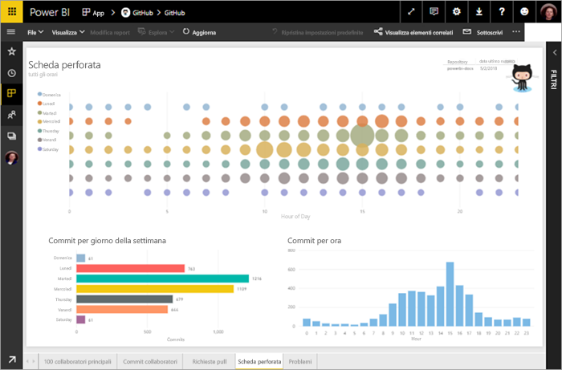
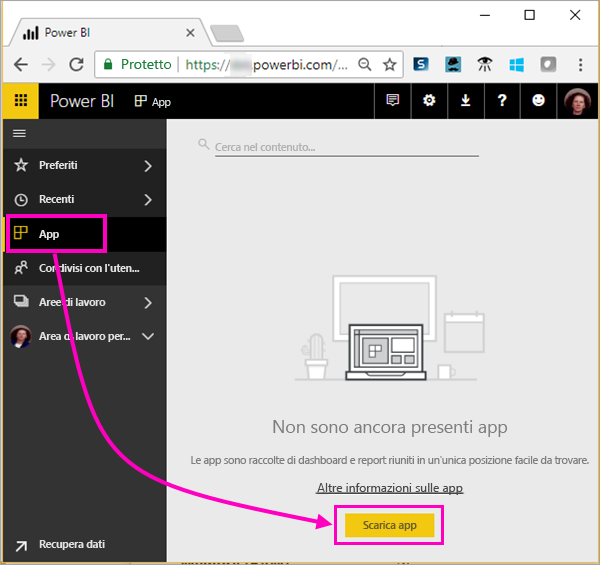
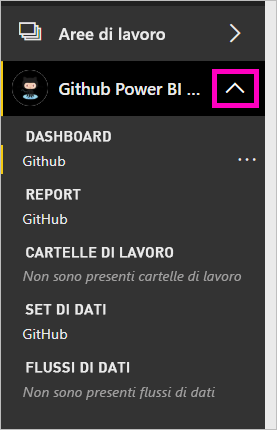
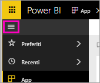
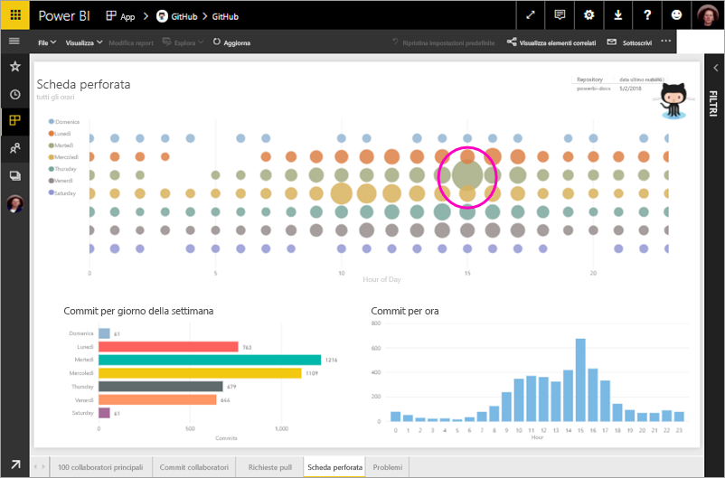
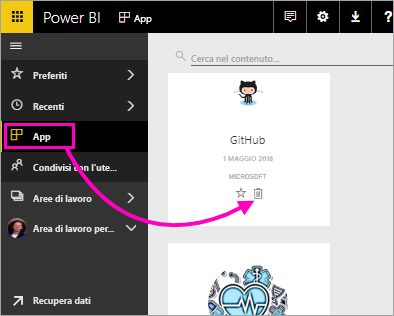

# Esercitazione: Connettersi a un repository di GitHub con Power BI
In questa esercitazione si esegue la connessione ai dati reali nel servizio GitHub usando Power BI, il quale crea automaticamente dashboard e report. Connettersi al repository pubblico contenuto Power BI (noto anche come un *repository*) e vedi le risposte a domande come: sul numero di persone che contribuiscono al contento pubblico di Power BI, sapere chi contribuisce di più, in quale giorno della settimana si registrano più contributi E altre domande. 

In questa esercitazione viene completata la procedura seguente:

> [!div class="checklist"]
> * Registrarsi a GitHub per ottenere un account se non se ne ha ancora uno 
> * Accedere all'account Power BI o registrarsi se non si ha ancora un account
> * Aprire il servizio Power BI
> * Individuare l'app GitHub
> * Immettere le informazioni per il repository GitHub pubblico in Power BI
> * Visualizzare il dashboad e il report con dati di GitHub
> * Pulire le risorse eliminando l'app

Se non si è ancora iscritti a Power BI, [iscriversi per ottenere una versione di prova gratuita](https://app.powerbi.com/signupredirect?pbi_source=web) prima di iniziare.

## Prerequisiti

Per completare questa esercitazione, è necessario un account GitHub, se non se ne ha già uno. 

- Iscriversi per una [account GitHub](https://docs.microsoft.com/contribute/get-started-setup-github).

## Come connettersi
1. Accedere al servizio Power BI (https://app.powerbi.com). 
2. Selezionare **App** e **Scarica app** nel riquadro di spostamento a sinistra.
   
    

3. Selezionare **Apps**, digitare **GitHub** nella casella di ricerca > **Scarica adesso**.
   
    

4. Nelle **installare questa App di Power BI?** selezionate **installare**.
5. Nelle **la nuova app è pronta**, selezionare **passare all'app**.
6. Nelle **iniziare con la nuova app**, selezionare **connettere dati**.

    

7. Immettere il nome del repository e il proprietario del repository. L'URL del repository è https://github.com/MicrosoftDocs/powerbi-docs, quindi **Proprietario repository** è **MicrosoftDocs** e **Repository** è **powerbi-docs**. 
   
    

5. Immettere le credenziali create per GitHub. Power BI potrebbe ignorare questo passaggio se già stato eseguito l'accesso a GitHub nel browser. 

6. Per la **metodo di autenticazione**, mantenere **oAuth2** selezionato \> **Accedi**.

7. Seguire le schermate di autenticazione di GitHub. Concedere le autorizzazioni di Power BI ai dati di GitHub.
   
   A questo punto Power BI può connettersi a GitHub e ai dati.  I dati vengono aggiornati una volta al giorno.

8. Dopo che Power BI Importa i dati, è visualizzato il contenuto della nuova area di lavoro di GitHub. 
9. Selezionare la freccia accanto al nome dell'area di lavoro nella barra di spostamento a sinistra. Noterete che l'area di lavoro contiene un dashboard e un report. 

    

10. Selezionare i puntini di sospensione (...) accanto al nome del dashboard > **rinominare** > digitare **dashboard GitHub**.
 
     

8. Selezionare l'icona di spostamento globale per ridurre a icone il riquadro di spostamento di sinistra e avere più spazio.

    

10. Selezionare il dashboard di GitHub.
    
    Il dashboard di GitHub contiene i dati in tempo reale, in modo che i valori visualizzati potrebbero essere diversi.

    

    

## Invia una domanda

1. Posizionare il cursore **porre una domanda sui dati**. Power BI offre **domande per iniziare a usare**. 

1. Selezionare **quanti utenti sono presenti**.
 
    

13. Compreso tra **quanti** e **gli utenti sono presenti**, digitare **richieste per ogni pull**. 

     Power BI crea un grafico a barre che mostra il numero di richieste pull per ogni persona.

    

13. Selezionare la puntina per aggiungerlo al dashboard, quindi **Chiudi domande e risposte**.

## Visualizzare il report di GitHub 

1. Nel dashboard di GitHub, selezionare l'istogramma **richieste Pull in base al mese** per aprire il report.

    

2. Selezionare un nome utente nel **richieste pull totali dall'utente** grafico. In questo esempio viene illustrato la maggior parte dei loro ore sono stati nel mese di febbraio.

    

3. Selezionare la scheda **Punch Card** (Scheda perforata) per visualizzare la pagina successiva del report. 
 
    

    Apparentemente martedì alle 15:00 è più comune ora e giorno della settimana per *esegue il commit*, quando gli utenti archiviano il proprio lavoro.

## Pulire le risorse

Dopo aver completo l'esercitazione, è possibile eliminare l'app GitHub. 

1. Selezionare **App** dal riquadro di spostamento a sinistra.
2. Passare il mouse sul riquadro di GitHub e selezionare l'icona a forma di bidone della spazzatura **Delete** (Elimina).

    

## Passaggi successivi

In questa esercitazione è stata eseguita la connessione a un repository pubblico di GitHub e sono stati ottenuti i dati che Power BI ha formattato sotto forma di dashboard e report. Esplorando il dashboard e il report è stato possibile ottenere le risposte ad alcune domande relative ai dati. Ora è possibile scoprire come connettersi ad altri servizi, ad esempio Salesforce, Microsoft Dynamics e Google Analytics. 
 
> [!div class="nextstepaction"]
> [Connettersi ai servizi online usati](service-connect-to-services.md)

