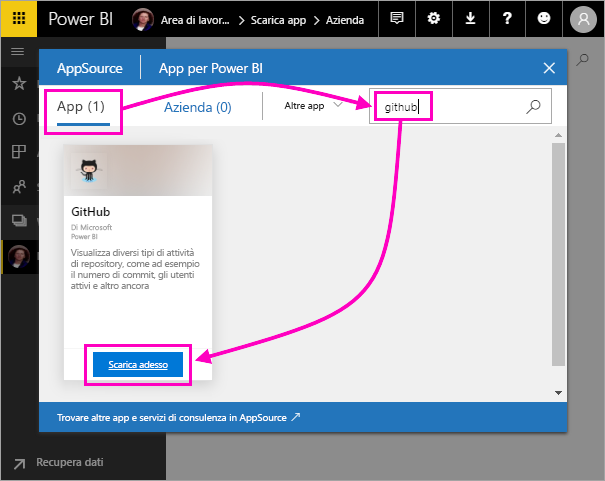
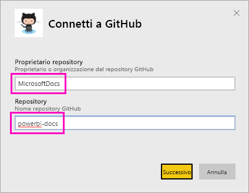
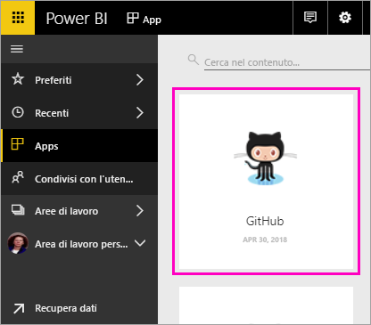
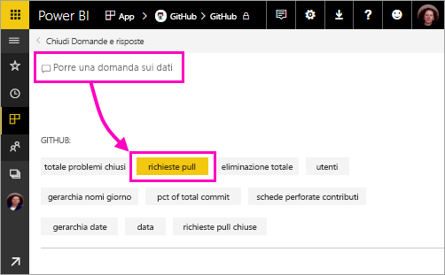
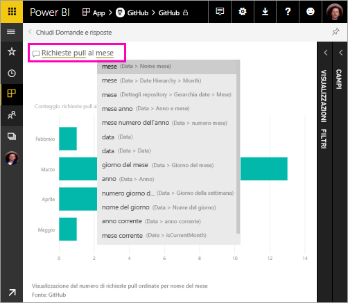
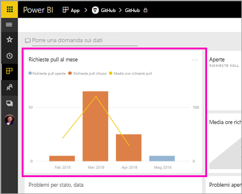
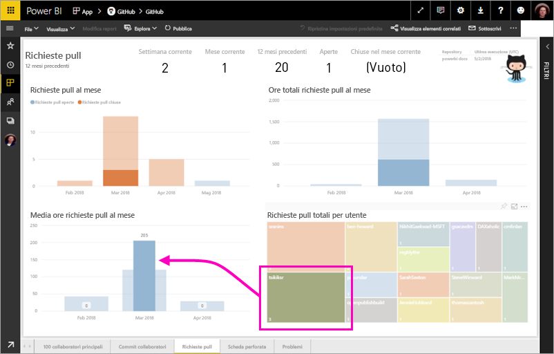

# Esercitazione: Connettersi a un esempio di GitHub con Power BI
In questa esercitazione si esegue la connessione ai dati reali nel servizio GitHub usando Power BI, il quale crea automaticamente dashboard e report. È possibile connettersi al repository pubblico dei contenuti di Power BI (noto anche come *repository*), ottenere informazioni sul numero di persone che contribuiscono al contento pubblico di Power BI, sapere chi contribuisce di più, in quale giorno della settimana si registrano più contributi nonché avere risposte ad altre domande. 

In questa esercitazione viene completata la procedura seguente:

> [!div class="checklist"]
> * Registrarsi a GitHub per ottenere un account se non se ne ha ancora uno 
> * Accedere all'account Power BI o registrarsi se non si ha ancora un account
> * Aprire il servizio Power BI
> * Individuare l'app GitHub
> * Immettere le informazioni per il repository GitHub pubblico in Power BI
> * Visualizzare il dashboad e il report con i dati di GitHub
> * Pulire le risorse eliminando l'app

Se non si è ancora iscritti a Power BI, [iscriversi per ottenere una versione di prova gratuita](https://app.powerbi.com/signupredirect?pbi_source=web) prima di iniziare.

## Prerequisiti

Per completare questa esercitazione, è necessario un account GitHub, se non se ne ha già uno. 

- Registrarsi per ottenere un [account GitHub](https://docs.microsoft.com/contribute/get-started-setup-github)

## Come connettersi
1. Accedere al servizio Power BI (http://powerbi.com). 
2. Selezionare **App** e **Scarica app** nel riquadro di spostamento a sinistra.
   
    

3. Selezionare **App**, digitare **github** nella casella di ricerca > **Scarica adesso**.
   
    

4. Immettere il nome del repository e il proprietario del repository. L'URL del repository è https://github.com/MicrosoftDocs/powerbi-docs, quindi **Proprietario repository** è **MicrosoftDocs** e **Repository** è **powerbi-docs**. 
   
    

5. Immettere le credenziali create per GitHub. Power BI potrebbe ignorare questo passaggio se già stato eseguito l'accesso a GitHub nel browser. 

6. In **Metodo di autenticazione** selezionare **oAuth2** \> **Accedi**.

7. Seguire le istruzioni nelle schermate di autenticazione di Github. Concedere le autorizzazioni di Power BI ai dati di GitHub.
   
   A questo punto Power BI può connettersi a GitHub e ai dati.  I dati vengono aggiornati una volta al giorno.

8. Dopo che i dati sono stati importati da Power BI, viene visualizzato il nuovo riquadro di GitHub. 
 
    

8. Selezionare l'icona di spostamento globale per ridurre al minimo il riquadro di spostamento di sinistra e avere più spazio.

    

10. Selezionare il riquadro di GitHub del passaggio 8. 
    
    Si apre il dashboard di GitHub. I dati visualizzati sono dinamici, pertanto i valori potrebbero essere diversi.

    

    

## Invia una domanda

11. Posizionare il cursore su **Porre una domanda sui dati**, quindi selezionare **pull requests** (richieste pull). 

    

12. Digitare **by month** (al mese).
 
    

     Power BI crea un grafico a barre che illustra il numero di richieste pull al mese.

13. Selezionare **Chiudi Domande e risposte**.

## Visualizzare il report di GitHub 

1. Nel dashboard di GitHub selezionare il grafico combinato di righe e colonne **Pull Requests by Month** (Richieste pull al mese) per aprire il report correlato.

    

2. Selezionare un nome utente nel grafico **Total pull requests by user** (Richieste pull totali dell'utente). In questo esempio si noti che il numero di ore medio di marzo supera il numero medio totale.

    

3. Selezionare la scheda **Punch Card** (Scheda perforata) per visualizzare la pagina successiva del report. 
 
    

    Apparentemente sembra che il martedì e le ore 15 siano il giorno e l'ora della settimana più comuni per *eseguire i commit*, vale a dire quando il lavoro viene archiviato dagli utenti.

## Pulire le risorse

Dopo aver completo l'esercitazione, è possibile eliminare l'app GitHub. 

1. Selezionare **App** dal riquadro di spostamento a sinistra.
2. Passare il mouse sul riquadro di GitHub e selezionare l'icona a forma di bidone della spazzatura **Delete** (Elimina).

    

## Passaggi successivi

In questa esercitazione è stata eseguita la connessione a un repository pubblico di GitHub e sono stati ottenuti i dati che Power BI ha formattato sotto forma di dashboard e report. Esplorando il dashboard e il report è stato possibile ottenere le risposte ad alcune domande relative ai dati. Ora è possibile scoprire come connettersi ad altri servizi, ad esempio Salesforce, Microsoft Dynamics e Google Analytics. 
 
> [!div class="nextstepaction"]
> [Connettersi ai servizi online usati](service-connect-to-services.md)

