# Esercitazione: Richiamare un modello di Machine Learning Studio in Power BI (anteprima)

In questa esercitazione verrà riprodotta l'esperienza di incorporamento di informazioni dettagliate da un modello di **Azure Machine Learning Studio** in Power BI. L'esercitazione include indicazioni su come concedere a un utente di Power BI l'accesso a un modello di Azure Machine Learning, creare un flusso di dati e applicare le informazioni dettagliate del modello al flusso di dati. Fa riferimento anche alla guida di avvio rapido per la creazione di un modello di Azure Machine Learning, se non se ne ha già uno.

L'esercitazione è costituita dai passaggi seguenti:

> [!div class="checklist"]
> * Creare e pubblicare un modello di Azure Machine Learning
> * Concedere l'accesso a un utente di Power BI perché possa usare il modello
> * Creare un flusso di dati
> * Applicare le informazioni dettagliate del modello di Azure Machine Learning al flusso di dati

## Creare e pubblicare un modello di Azure Machine Learning

Seguire le istruzioni in [Esercitazione 1: Prevedere il rischio di credito - Azure Machine Learning Studio](https://docs.microsoft.com/azure/machine-learning/studio/walkthrough-1-create-ml-workspace) per creare un'area di lavoro di **Machine Learning**.

È possibile usare questi passaggi con qualsiasi set di dati o modello di Azure Machine Learning già a disposizione. Se non è disponibile un modello pubblicato, è possibile crearne uno in pochi minuti seguendo le istruzioni della guida [Creare il primo esperimento data science in Azure Machine Learning Studio](https://docs.microsoft.com/azure/machine-learning/studio/create-experiment), in cui viene configurato un modello di Azure Machine Learning Studio per stimare il prezzo di un'automobile.

Seguire la procedura descritta in [Distribuire un servizio Web di Azure Machine Learning Studio](https://docs.microsoft.com/azure/machine-learning/studio/publish-a-machine-learning-web-service) per pubblicare il modello di Azure Machine Learning Studio come servizio Web.

## Concedere l'accesso a un utente di Power BI

Per accedere a un modello di Azure Machine Learning da Power BI, è necessario l'accesso in **lettura** alla sottoscrizione e al gruppo di risorse di Azure e, ugualmente, l'accesso in **lettura** al servizio Web Azure Machine Learning Studio per i modelli di Machine Learning Studio.  Per il modello di servizio Azure Machine Learning serve l'accesso in **lettura** all'area di lavoro del servizio Machine Learning.

Le procedure riportate di seguito devono essere eseguite da un coamministratore della sottoscrizione e del gruppo di risorse di Azure in cui è stato pubblicato il modello.

Accedere al [portale di Azure](https://portal.azure.com) e passare alla pagina **Sottoscrizioni**, disponibile nell'elenco **Tutti i servizi** nel menu di spostamento a sinistra.

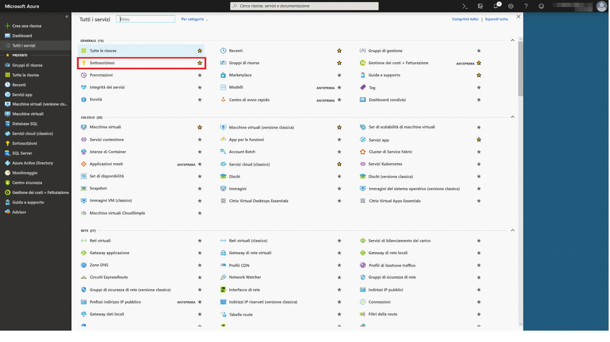

Selezionare la sottoscrizione di Azure usata per pubblicare il modello e quindi selezionare **Controllo di accesso (IAM)**. Selezionare **Aggiungi assegnazione di ruolo**, quindi il ruolo **Lettore** e infine l'utente di Power BI. Al termine, selezionare **Salva**. La figura seguente mostra queste selezioni.

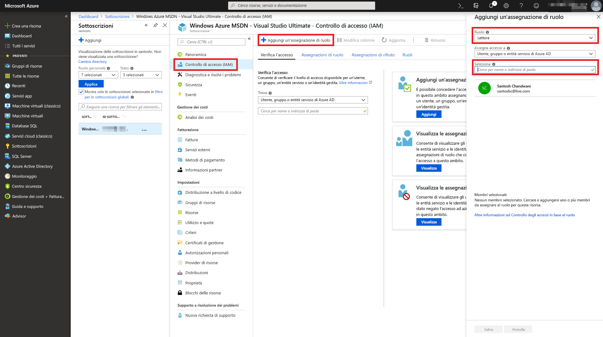

Ripetere i passaggi precedenti per concedere all'utente di Power BI il ruolo di **Collaboratore** per il servizio Web di Machine Learning specifico in cui è stato distribuito il modello di Azure Machine Learning.

## Creare un flusso di dati

### Ottenere i dati per la creazione del flusso di dati

Accedere al servizio Power BI con le credenziali utente per cui si è ottenuto l'accesso al modello di Azure Machine Learning nel passaggio precedente.

Questo passaggio presuppone che si abbiano a disposizione i dati a cui si vuole assegnare un punteggio con il modello di Azure Machine Learning in formato CSV.  Se è stato usato l'**esperimento relativo alla stima del prezzo di un'automobile** per creare il modello in Machine Learning Studio, il set di dati è condiviso tramite il collegamento seguente:

* [Modello di esempio di Azure Learning Studio](https://raw.githubusercontent.com/santoshc1/PowerBI‑AI‑samples/master/Tutorial\_MLStudio\_model\_integration/Automobile%20price%20data%20\_Raw\_.csv)

### Creare un flusso di dati

Per creare le entità nel flusso di dati, accedere al servizio Power BI e passare a un'area di lavoro nella propria capacità dedicata in cui sia abilitata l'anteprima delle funzionalità di intelligenza artificiale.

Se non si ha già un'area di lavoro, è possibile crearne una selezionando **Aree di lavoro** nel menu a sinistra e quindi selezionando **Crea area di lavoro per le app** nel pannello in fondo.  Viene aperto un pannello in cui immettere i dettagli dell'area di lavoro. Immettere il nome dell'area di lavoro e selezionare **Salva**.

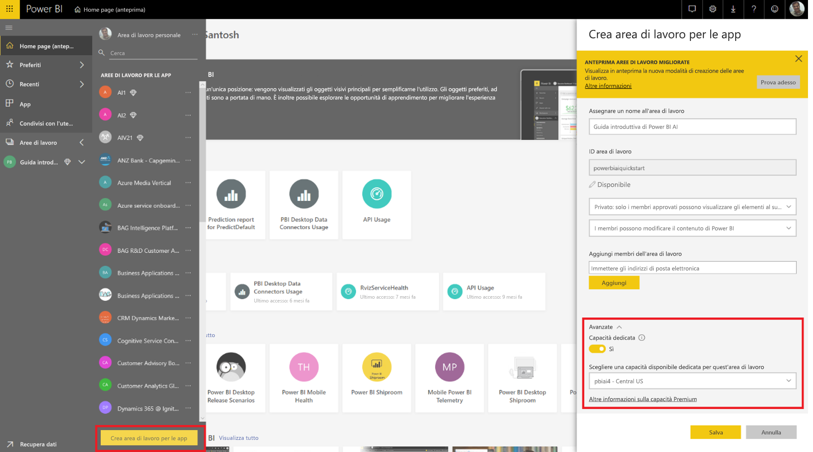

Una volta creata l'area di lavoro, è possibile selezionare **Ignora** nell'angolo inferiore destro della schermata iniziale.

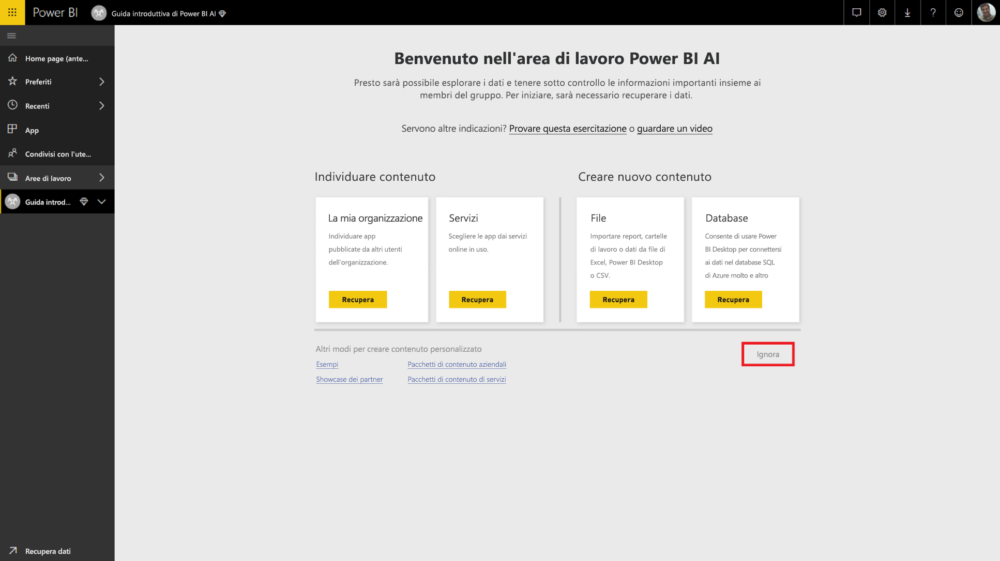

Selezionare la scheda **Flussi di dati (anteprima)**, quindi selezionare il pulsante **Crea** nell'angolo superiore destro dell'area di lavoro e infine selezionare **Flusso di dati**.

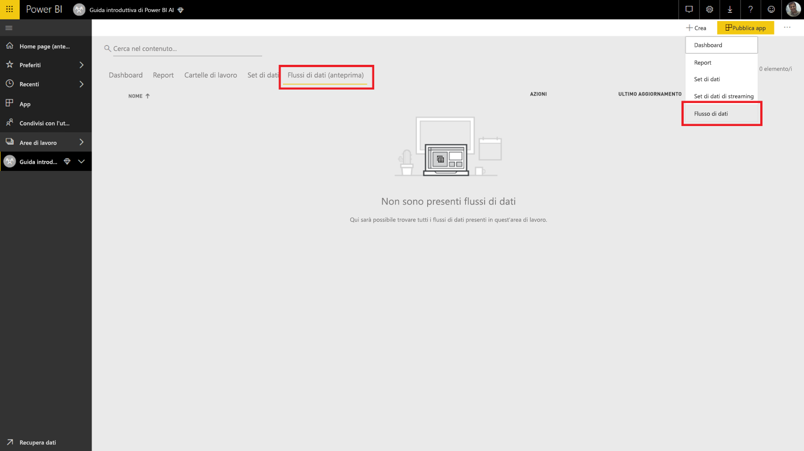

Selezionare **Aggiungi nuove entità** per aprire l'**editor di Power Query** nel browser.

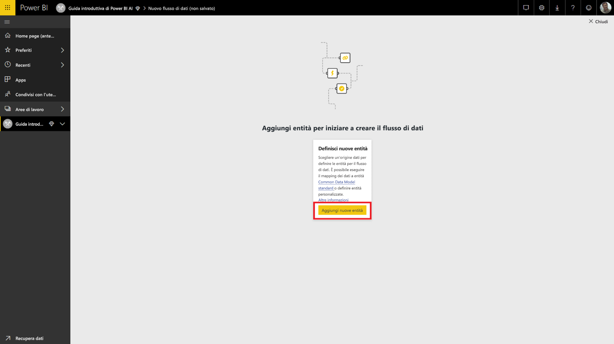

Selezionare **Testo/CSV** come origine dati.

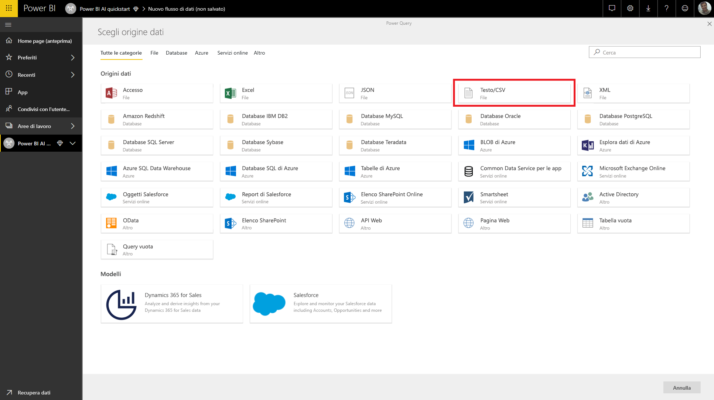

Nella schermata successiva viene chiesto di connettersi a un'origine dati. Incollare il collegamento ai dati usati per creare il modello di Azure Machine Learning. Se sono stati usati i dati del modello di _stima del prezzo di un'automobile_, è possibile incollare il collegamento seguente nella casella **URL o percorso del file** e quindi selezionare **Avanti**.

`https://raw.githubusercontent.com/santoshc1/PowerBI‑AI‑samples/master/Tutorial\_MLStudio\_model\_integration/Automobile%20price%20data%20\_Raw\_.csv`

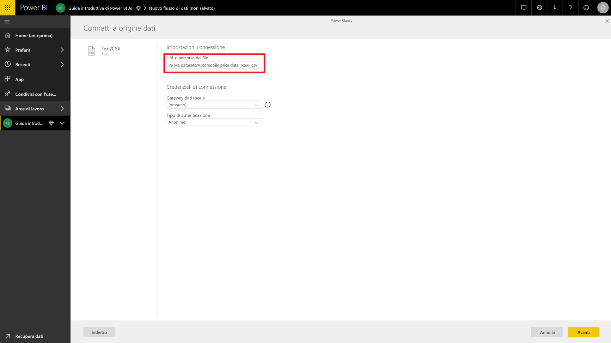

L'editor di Power Query mostra un'anteprima dei dati del file CSV. Selezionare **Trasforma tabella** sulla barra multifunzione e quindi selezionare **Usa la prima riga come intestazione**.  Viene aggiunto il passaggio di query _Intestazioni alzate di livello_ nel riquadro **Passaggi applicati** sulla destra. Si può anche rinominare la query assegnandole un nome più intuitivo, come _Automobile Pricing_, usando il riquadro a destra.

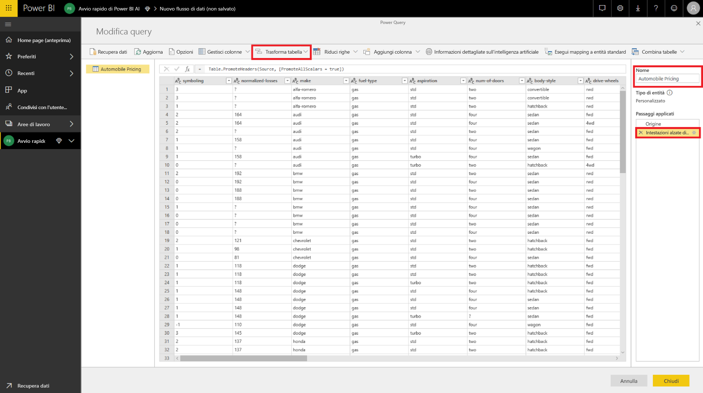

Il set di dati di origine contiene valori sconosciuti impostati su "?".  Per pulire il set di dati, è possibile sostituire "?" con "0" per evitare errori in seguito e per semplicità.  A questo scopo, selezionare le colonne *normalized-losses*, *bore*, *stroke*, *compression-ratio*, *horsepower*, *peak-rpm* e *price* facendo clic sul rispettivo nome nelle intestazioni di colonna, quindi fare clic su "Trasforma colonne" e selezionare "Sostituisci valori".  Sostituire "?" con "0".

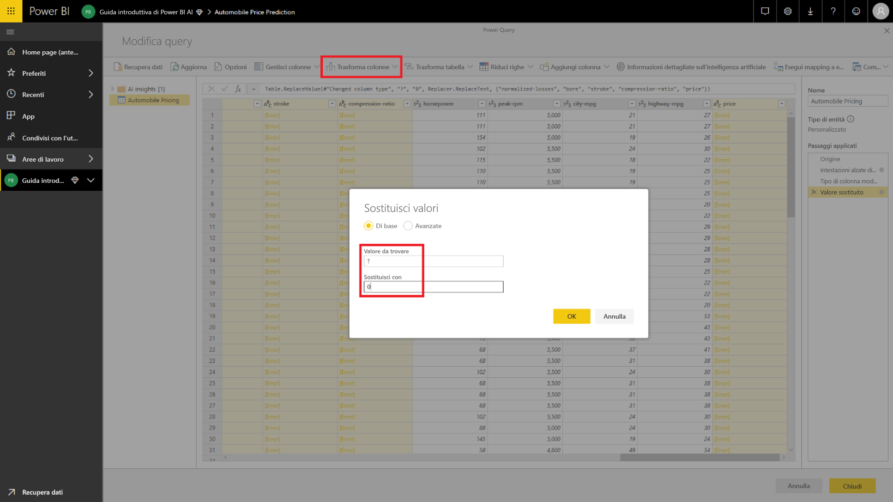

Tutte le colonne nella tabella di un'origine in formato testo/CSV vengono trattate come colonne di testo.  A questo punto occorre sostituire le colonne numeriche con i tipi di dati corretti.  È possibile farlo in Power Query facendo clic sul simbolo del tipo di dati nell'intestazione della colonna.  Impostare le colonne sui tipi seguenti:

- **Numero intero**: symboling, normalized-losses, curb-weight, engine-size, horsepower, peak-rpm, city-mpg, highway-mpg, price
- **Numero decimale**: wheel-base, length, width, height, bore, stroke, compression-ratio

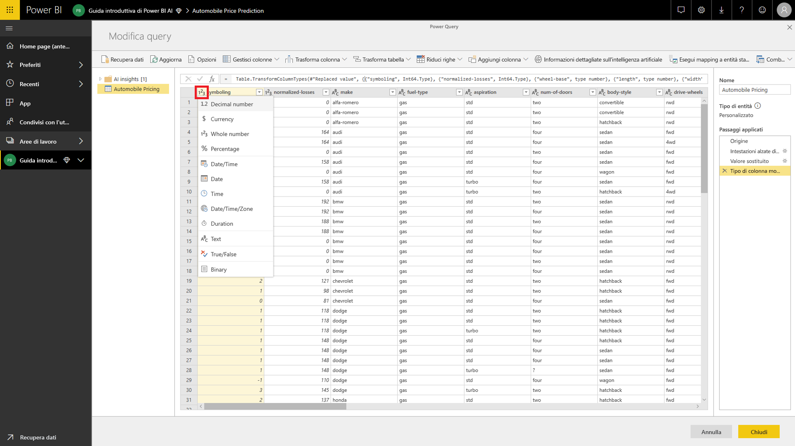

Selezionare **Fine** per chiudere l'editor di Power Query. Verrà visualizzato l'elenco di entità con i dati di _Automobile Pricing_ aggiunti. Scegliere **Salva** nell'angolo in alto a destra, specificare un nome per il flusso di dati e quindi scegliere **Salva**.

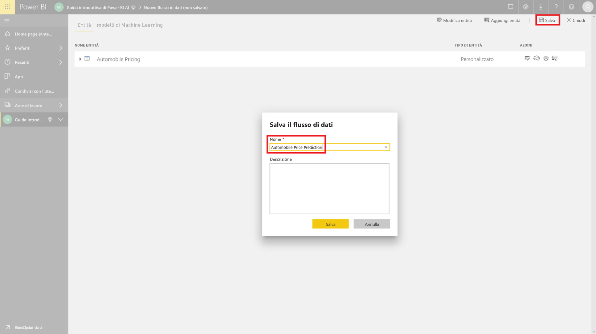

### Aggiornare il flusso di dati

Quando si salva il flusso di dati viene visualizzata una notifica che conferma il salvataggio. Selezionare **Aggiorna adesso** per inserire i dati dell'origine nel flusso di dati.

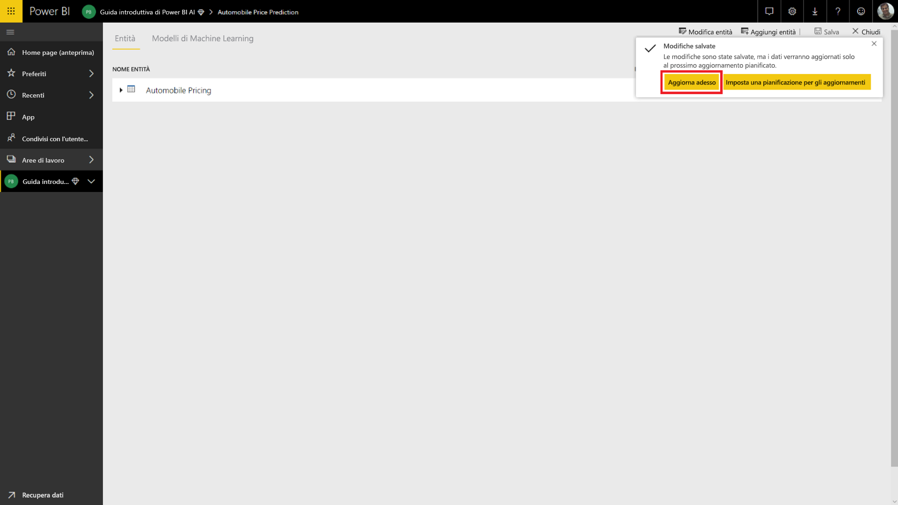

Selezionare **Chiudi** nell'angolo in alto a destra e attendere il completamento dell'aggiornamento del flusso di dati.

Si può aggiornare il flusso di dati anche con i comandi in **Azioni**. Il flusso di dati mostra il timestamp al completamento dell'aggiornamento.

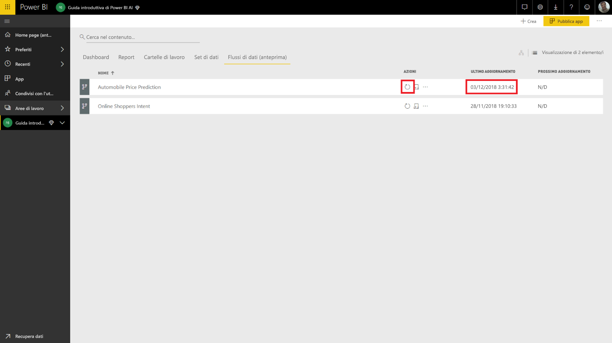

## Applicare le informazioni dettagliate del modello di Azure Machine Learning

Per accedere al modello di Azure Machine Learning per _Automobile Price Prediction_, è possibile modificare l'entità _Automobile Pricing_ per cui si vuole aggiungere il prezzo stimato.

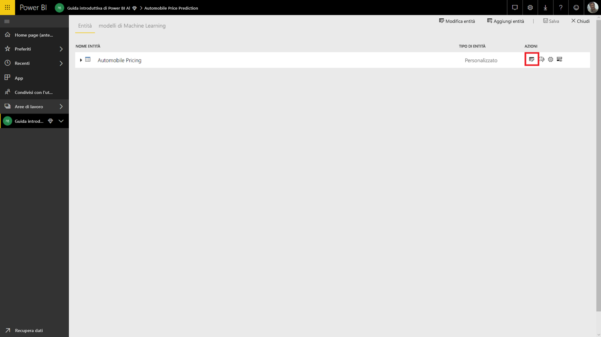

Selezionando l'icona **Modifica** viene aperto l'editor di Power Query per le entità del flusso di dati.

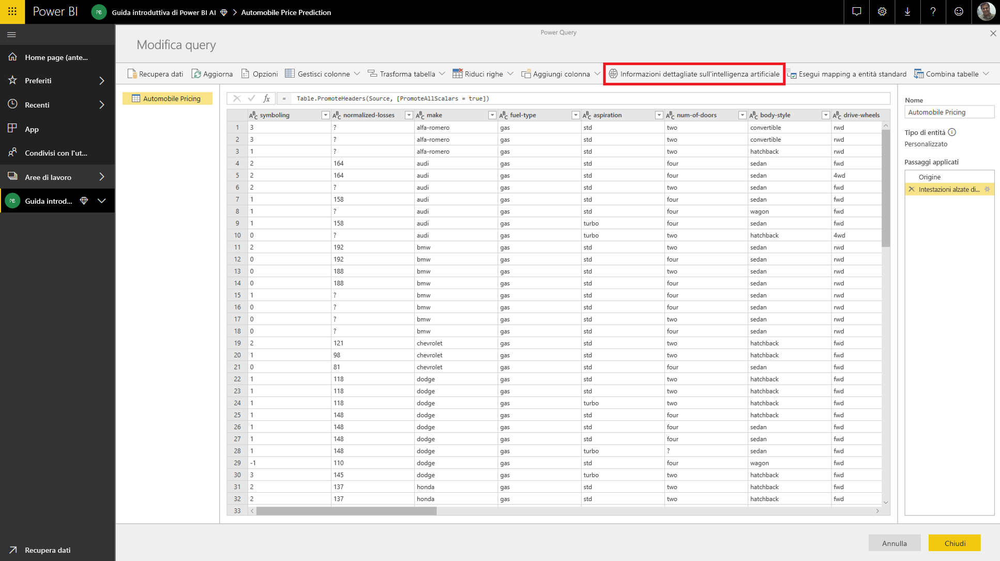

Selezionare il pulsante **Informazioni dettagliate sull'intelligenza artificiale** sulla barra multifunzione e quindi selezionare la cartella _Azure Machine Learning Models_ (Modelli di Azure Machine Learning) nel menu di spostamento a sinistra.

I modelli di Azure Machine Learning per i quali è stato concesso l'accesso sono elencati come funzioni di Power Query con il prefisso *AzureML.*  Quando si fa clic sulla funzione corrispondente al modello _AutomobilePricePrediction_, i parametri del servizio Web del modello vengono elencati come parametri della funzione.

Per richiamare un modello di Azure Machine Learning è possibile specificare una qualsiasi delle colonne dell'entità selezionata come input dall'elenco a discesa. Si può anche specificare un valore di costante da usare come input attivando l'icona della colonna a sinistra della finestra di dialogo di input. Quando un nome di colonna corrisponde a uno dei nomi dei parametri della funzione, la colonna viene automaticamente suggerita come input.  Se il nome di colonna non corrisponde, è possibile selezionarlo dall'elenco a discesa.

Nel caso del modello _Automobile Pricing Prediction_ i parametri di input sono:

- make
- body-style
- wheel-base
- engine-size
- horsepower
- peak-rpm
- highway-mpg

Nel nostro caso, poiché la tabella corrisponde al set di dati originale usato per eseguire il training del modello, le colonne corrette sono già selezionate per tutti i parametri.

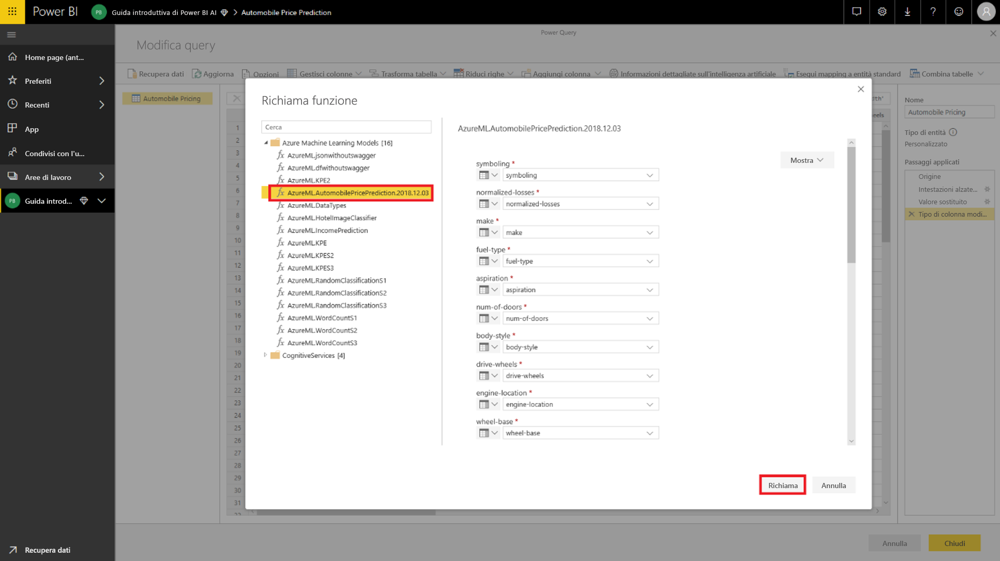

Selezionare **Richiama** per visualizzare l'anteprima dell'output del modello di Azure Machine Learning come nuova colonna nella tabella delle entità. Il richiamo del modello verrà visualizzato anche come passaggio applicato per la query.

L'output del modello viene visualizzato come record nella colonna di output. È possibile espandere la colonna per produrre singoli parametri di output in colonne separate. Nel nostro caso interessa solo la colonna _Scored Labels_, che contiene il prezzo stimato dell'automobile.  Deselezionare quindi le altre colonne e scegliere **OK**.

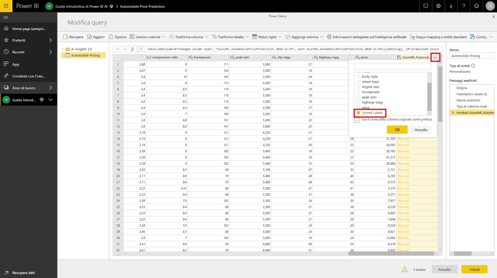

La colonna *Scored Labels* risultante contiene la stima di prezzo del modello di Azure Machine Learning.

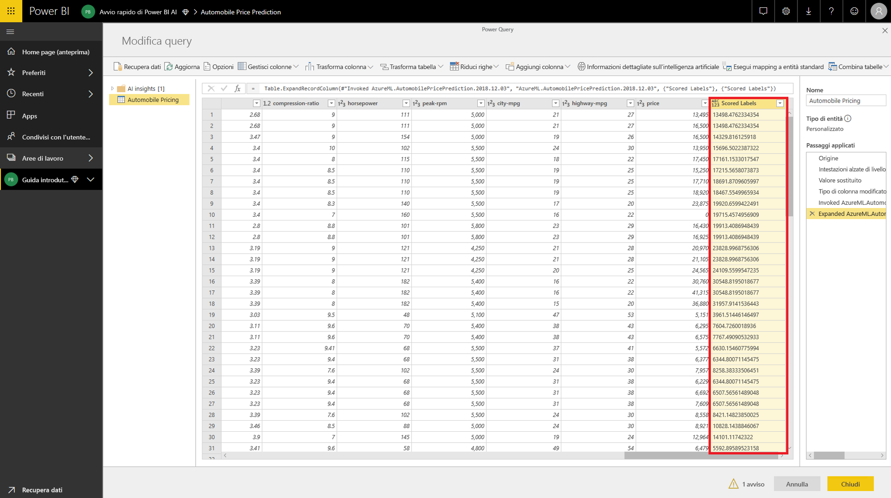

Dopo il salvataggio del flusso di dati, il modello di Azure Machine Learning verrà richiamato automaticamente ogni volta che il flusso di dati viene aggiornato con le righe nuove o modificate nella tabella delle entità.

## Pulire le risorse

Se le risorse di Azure create tramite questo articolo non servono più, eliminarle per evitare eventuali addebiti.  Si possono eliminare anche i flussi di dati creati, se non sono più necessari.

## Passaggi successivi

In questa esercitazione è stato creato un semplice esperimento eseguendo i passaggi seguenti con un semplice set di dati in Azure Machine Learning Studio:

- Creare e pubblicare un modello di Azure Machine Learning
- Concedere l'accesso a un utente di Power BI perché possa usare il modello
- Creare un flusso di dati
- Applicare le informazioni dettagliate del modello di Azure Machine Learning al flusso di dati

Per altre informazioni sull'integrazione di Azure Machine Learning in Power BI, vedere [Integrazione di Azure Machine Learning in Power BI (anteprima)](service-machine-learning-integration.md).
