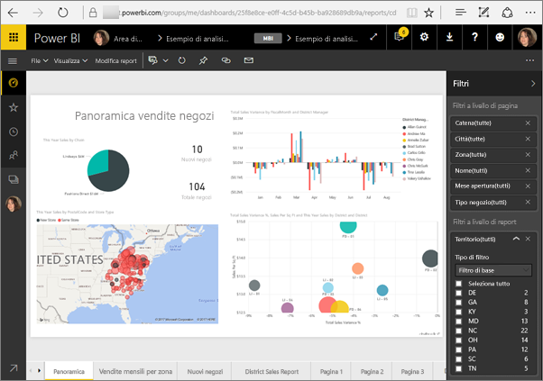
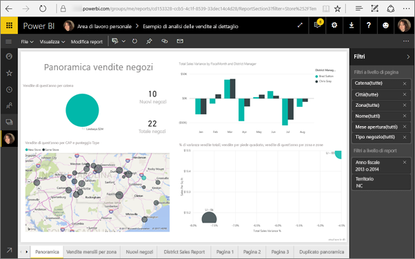

# <a name="filter-a-report-using-query-string-parameters-in-the-url"></a>Filtrare un report usando i parametri della stringa di query nell'URL
Quando si apre un report nel servizio Power BI, ogni pagina del report ha un proprio URL univoco. Per filtrare tale pagina del report, è possibile usare il riquadro Filtri nell'area di disegno report.  In alternativa, è possibile aggiungere i parametri della stringa di query all'URL per filtrare il report. Se, ad esempio, si vuole mostrare un report ai colleghi applicando un filtro preliminare, basta iniziare dall'URL predefinito del report, aggiungere i parametri di filtro all'URL e quindi inviare l'intero URL via posta elettronica.



<iframe width="640" height="360" src="https://www.youtube.com/embed/WQFtN8nvM4A?list=PLv2BtOtLblH3YE_Ycas5B1GtcoFfJXavO&amp;showinfo=0" frameborder="0" allowfullscreen></iframe>

## <a name="query-string-parameter-syntax-for-filtering"></a>Sintassi dei parametri della stringa di query per i filtri
La sintassi è molto semplice: iniziare con l'URL del report, aggiungere un punto interrogativo e quindi aggiungere la sintassi del filtro.

URL?filter=***Tabella***/***Campo*** eq '***valore***'


* I nomi **Tabella** e **Campo** rispettano la distinzione tra maiuscole e minuscole, **valore** non la rispetta.
* I campi che sono nascosti dalla visualizzazione Report possono comunque essere filtrati.
* **Valore** deve essere racchiuso tra virgolette singole.
* Il tipo di campo deve essere una stringa.
* I nomi di tabella e campo non possono contenere spazi.

Se è ancora poco chiaro, continuare la lettura per un'analisi approfondita.  

## <a name="filter-on-a-field"></a>Filtrare in base a un campo
Si supponga che l'URL per il report sia il seguente.


Nella visualizzazione della mappa (sopra) sono visibili i negozi presenti nella Carolina del Nord.

>[!NOTE]
>Questo esempio si basa sull'[Esempio di analisi delle vendite al dettaglio](sample-datasets.md).
> 

Per filtrare il report in modo da visualizzare solo i dati relativi ai negozi in "NC" (Carolina del Nord), aggiungere all'URL quanto segue:

?filter=Store/Territory eq 'NC'


>[!NOTE]
>*NC* è un valore memorizzato nel campo **Territory** (Territorio) della tabella **Store** (Negozio).
> 
> 

Il report viene filtrato in base alla Carolina del Nord; tutte le visualizzazioni nella pagina del report mostrano solo i dati relativi alla Carolina del Nord.



## <a name="filter-on-multiple-fields"></a>Filtrare in base a più campi
È possibile anche filtrare in base a più campi aggiungendo parametri aggiuntivi all'URL. Tornare al parametro filtro originale.

```
?filter=Store/Territory eq 'NC'
```

Per filtrare in base a campi aggiuntivi, aggiungere un `and` e un altro campo nello stesso formato indicato in precedenza. Ecco un esempio.

```
?filter=Store/Territory eq 'NC' and Store/Chain eq 'Fashions Direct'
```

<iframe width="640" height="360" src="https://www.youtube.com/embed/0sDGKxOaC8w?showinfo=0" frameborder="0" allowfullscreen></iframe>


### <a name="using-dax-to-filter-on-multiple-values"></a>Uso di DAX per filtrare in base a più valori
Un altro modo per filtrare in base a più campi consiste nel creare una colonna calcolata che concateni due campi in un unico valore. quindi filtrare in base a tale valore.

Ad esempio, ci sono due campi: Territory (Territorio) e Chain (Catena). In Power BI Desktop [creare una nuova colonna calcolata](desktop-tutorial-create-calculated-columns.md) (Campo) denominata TerritoryChain. Tenere presente che il nome **Campo** non può contenere spazi. Ecco la formula DAX per tale colonna.

TerritoryChain = [Territory] & " - " & [Chain]

Pubblicare il report nel servizio Power BI, quindi usare la stringa di query dell'URL per filtrare e visualizzare solo i dati relativi ai negozi Lindseys nella Carolina del Nord.

https://app.powerbi.com/groups/me/reports/8d6e300b-696f-498e-b611-41ae03366851/ReportSection3?filter=Store/TerritoryChain eq 'NC–Lindseys'

## <a name="pin-a-tile-from-a-filtered-report"></a>Aggiungere un riquadro da un report filtrato
Dopo aver filtrato il report usando i parametri della stringa di query, è possibile aggiungere al dashboard le visualizzazioni da tale report. Il riquadro nel dashboard conterrà i dati filtrati; selezionandolo, verrà aperto il report che è stato usato per crearlo.  Tuttavia, i filtri applicati usando l'URL non vengono salvati con il report e, quando si seleziona il riquadro del dashboard, il report verrà aperto nello stato non filtrato.  Ciò significa che i dati visualizzati nel riquadro del dashboard non corrisponderanno ai dati visualizzati nella visualizzazione del report.

Ciò potrebbe essere utile nei casi in cui si volessero ottenere risultati differenti, ad esempio filtrati nel dashboard e non filtrati nel report.

## <a name="limitations-and-troubleshooting"></a>Limitazioni e risoluzione dei problemi
Ci sono un paio di aspetti da tenere presenti quando si usano i parametri della stringa di query.

* I filtri della stringa di query non funzionano con gli URL [Pubblica sul Web](service-publish-to-web.md).
* Il tipo di campo deve essere una stringa.
* I nomi di tabella e campo non possono contenere spazi.

## <a name="next-steps"></a>Passaggi successivi
[Aggiungere una visualizzazione a un dashboard](service-dashboard-pin-tile-from-report.md)  
[Provalo gratuitamente](https://powerbi.com/)

Altre domande? [Provare a rivolgersi alla community di Power BI](http://community.powerbi.com/)

