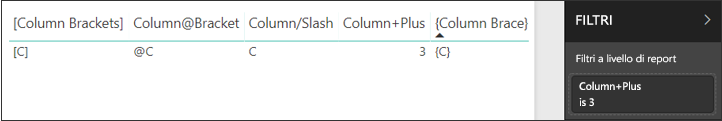
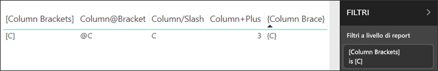

# <a name="filter-a-report-using-query-string-parameters-in-the-url"></a>Filtrare un report usando i parametri della stringa di query nell'URL
Quando si apre un report nel servizio Power BI, ogni pagina del report ha un proprio URL univoco. Per filtrare tale pagina del report, è possibile usare il riquadro Filtri nell'area di disegno report.  In alternativa, è possibile aggiungere i parametri della stringa di query all'URL per prefiltrare il report. Se, ad esempio, si vuole mostrare un report ai colleghi applicando un filtro preliminare, basta iniziare dall'URL predefinito del report, aggiungere i parametri di filtro all'URL e quindi inviare l'intero nuovo URL tramite posta elettronica.


## <a name="uses-for-query-string-parameters"></a>Usi dei parametri della stringa di query
Si supponga di voler utilizzare Power BI Desktop per creare un report che include collegamenti ad altri report di Power BI, ma che sia necessario visualizzare solo alcune delle informazioni negli altri report. In primo luogo, filtrare i report usando i parametri della stringa di query e salvare gli URL. Successivamente, creare una tabella in Power BI Desktop con questi nuovi URL di report.  Quindi, pubblicare e condividere il report.

I parametri della stringa di query possono essere anche utili per la creazione di una soluzione avanzata di Power BI.  Con DAX è possibile creare un report che genera un URL del report filtrato in modo dinamico in base alla selezione effettuata dal cliente nel report corrente. Quando i clienti selezionano l'URL, vedono solo le informazioni desiderate. 

## <a name="query-string-parameter-syntax-for-filtering"></a>Sintassi dei parametri della stringa di query per i filtri
Con i parametri, è possibile filtrare il report per uno o più valori, anche se tali valori contengono spazi o caratteri speciali. La sintassi di base è molto semplice: iniziare con l'URL del report, aggiungere un punto interrogativo e quindi aggiungere la sintassi del filtro.

URL?filter=***Tabella***/***Campo*** eq '***valore***'


* Per i nomi **Tabella** e **Campo** viene fatta distinzione tra maiuscole e minuscole, mentre per **valore** la distinzione non è rilevante.
* I campi che sono nascosti dalla visualizzazione Report possono comunque essere filtrati.

### <a name="field-types"></a>Tipi di campo
Il tipo del campo può essere numerico, datetime o stringa e il tipo usato deve corrispondere al tipo impostato nel set di dati.  Ad esempio, la specifica del tipo "string" per una colonna di tabella non funzionerà se si sta cercando un valore datetime o numerico in una colonna del set di dati impostata come data (ad esempio, Table/StringColumn eq 1).

* Le **stringhe** devono essere racchiuse tra virgolette singole, ad esempio 'nome manager'.
* Per i **numeri** non è richiesta alcuna formattazione speciale.
* **Date e ore** devono essere racchiuse tra virgolette singole e precedute dalla parola **DateTime**.

Se è ancora poco chiaro, continuare la lettura per un'analisi approfondita.  

## <a name="filter-on-a-field"></a>Filtrare in base a un campo
Si supponga che l'URL per il report sia il seguente.


Nella visualizzazione della mappa (sopra) sono visibili i negozi presenti nella Carolina del Nord.

>[!NOTE]
>Questo esempio si basa sull'[Esempio di analisi delle vendite al dettaglio](sample-datasets.md).
> 

Per filtrare il report in modo da visualizzare solo i dati relativi ai negozi in "NC" (Carolina del Nord), aggiungere all'URL quanto segue:

?filter=Store/Territory eq 'NC'


>[!NOTE]
>*NC* è un valore memorizzato nel campo **Territory** (Territorio) della tabella **Store** (Negozio).
> 

Il report viene filtrato in base alla Carolina del Nord; tutte le visualizzazioni nella pagina del report mostrano solo i dati relativi alla Carolina del Nord.


## <a name="filter-on-multiple-fields"></a>Filtrare in base a più campi
È possibile anche filtrare in base a più campi aggiungendo parametri aggiuntivi all'URL. Tornare al parametro filtro originale.

```
?filter=Store/Territory eq 'NC'
```

Per filtrare in base a campi aggiuntivi, aggiungere **and** e un altro campo nello stesso formato indicato in precedenza. Ecco un esempio.

```
?filter=Store/Territory eq 'NC' and Store/Chain eq 'Fashions Direct'
```

<iframe width="640" height="360" src="https://www.youtube.com/embed/0sDGKxOaC8w?showinfo=0" frameborder="0" allowfullscreen></iframe>

## <a name="operators"></a>Operatori
Power BI supporta molti operatori oltre a **and**. La tabella seguente elenca tali operatori insieme al tipo di contenuto supportato.

|Operatore  | Definizione | Stringa  | Numero | Data |  Esempio|
|---------|---------|---------|---------|---------|---------|
|**and**     | e |  sì      | sì |  sì|  prodotto/prezzo le 200 and prezzo gt 3.5 |
|**eq**     | è uguale a |  sì      | sì   |  sì       | Indirizzo/Città eq 'Milano' |
|**ne**     | diverso da |   sì      | sì  | sì        |  Indirizzo/Città ne 'Londra' |
|**ge**     |  maggiore o uguale a       | no | sì |sì |  prodotto/prezzo ge 10
|**gt**     | maggiore di        |no | sì | sì  | prodotto/prezzo gt 20
|**le**     |   minore o uguale a      | no | sì | sì  | prodotto/prezzo le 100
|**lt**     |  minore di       | no | sì | sì |  prodotto/prezzo lt 20
|**in****     |  incluso       | no | no |  sì | Studente/Età in (27, 29)


\** Quando si usa **in**, i valori a destra di **in** possono essere un elenco delimitato da virgole racchiuso tra parentesi o una singola espressione che restituisce una raccolta.

### <a name="numeric-data-types"></a>Tipi di dati numerici
Un filtro URL di Power BI può includere numeri nei formati seguenti.

|Tipo di numero  |Esempio  |
|---------|---------|
|**integer**     |   5      |
|**long**     |   5L o 5l      |
|**double**     |   5,5 o 55e-1 o 0,55e+1 o 5D o 5d o 0,5e1D o 0,5e1d o 5,5D o 5,5d o 55e-1D o 55e-1d     |
|**decimal**     |   5M o 5m o 5,5M o 5,5m      |
|**float**     | 5F o 5f o 0,5e1F o 0,5e-1d        |

### <a name="date-data-types"></a>Tipi di dati di data
Power BI supporta OData V3 e V4 per i tipi di dati **Date** e **DateTimeOffset**.  Le date vengono rappresentate usando il formato EDM (2019-02-12T00:00:00). Ciò significa che quando si specifica una data nel formato AAAA-MM-GG, Power BI la interpreta come AAAA-MM-GGT00:00:00.

Perché è importante questa distinzione? Si supponga di creare un parametro di stringa di query **Table/Date gt 2018-08-03**.  I risultati includeranno il 3 agosto 2018 oppure partiranno dal 4 agosto 2018? Dato che Power BI converte la query in **Table/Date gt 2018-08-03T00:00:00**, i risultati includeranno tutte le date con una parte dell'ora diversa da zero, poiché tali date saranno maggiori di **2018-08-03T00:00:00**.

## <a name="special-characters-in-url-filters"></a>Caratteri speciali nei filtri di URL
Gli spazi e i caratteri speciali richiedono alcuni elementi di formattazione aggiuntivi. Quando la query contiene spazi, trattini o altri caratteri non ASCII, anteporre a questi caratteri speciali un *codice di escape* (**_x**) e il codice **Unicode** da 4 cifre. Se il codice Unicode è composto da meno 4 caratteri sarà necessario riempire con zeri. Di seguito sono riportati alcuni esempi.

|Identificatore  |Unicode  | Codice per Power BI  |
|---------|---------|---------|
|**Nome tabella**     | Spazio: 0x20        |  Nome_x0020_tabella       |
|**Colonna**@**Numero**     |   @: 0x40     |  Colonna_x0040_Numero       |
|**[Colonna]**     |  [:0x005B ]:0x0050       |  _x0058_Colonna_x0050       |
|**Colonna+Più**     | +:0x2B        |  Colonna_x002B_Più       |

Tabella_x0020_Nome/Colonna_x002B_Più eq 3 


Tabella_x0020_Speciale/_x005B_Colonna_x0020_ParentesiQuadre_x005D_ eq '[C]' 

### <a name="use-dax-to-filter-on-multiple-values"></a>Usare DAX per filtrare in base a più valori
Un altro modo per filtrare in base a più campi consiste nel creare una colonna calcolata che concateni due campi in un unico valore. quindi filtrare in base a tale valore.

Ad esempio, ci sono due campi: Territory (Territorio) e Chain (Catena). In Power BI Desktop [creare una nuova colonna calcolata](desktop-tutorial-create-calculated-columns.md) (Campo) denominata TerritoryChain. Tenere presente che il nome **Campo** non può contenere spazi. Ecco la formula DAX per tale colonna.

TerritoryChain = [Territory] & " - " & [Chain]

Pubblicare il report nel servizio Power BI, quindi usare la stringa di query dell'URL per filtrare e visualizzare solo i dati relativi ai negozi Lindseys nella Carolina del Nord.

    https://app.powerbi.com/groups/me/reports/8d6e300b-696f-498e-b611-41ae03366851/ReportSection3?filter=Store/TerritoryChain eq 'NC–Lindseys'

## <a name="pin-a-tile-from-a-filtered-report"></a>Aggiungere un riquadro da un report filtrato
Dopo aver filtrato il report usando i parametri della stringa di query, è possibile aggiungere al dashboard le visualizzazioni da tale report.  Il riquadro nel dashboard conterrà i dati filtrati; selezionandolo, verrà aperto il report che è stato usato per crearlo.  Tuttavia, i filtri applicati usando l'URL non vengono salvati con il report e, quando si seleziona il riquadro del dashboard, il report verrà aperto nello stato non filtrato.  Ciò significa che i dati visualizzati nel riquadro del dashboard non corrisponderanno ai dati visualizzati nella visualizzazione del report.

Ciò sarà utile quando si vogliono vedere risultati diversi, ad esempio filtrati nel dashboard e non filtrati nel report.

> [!NOTE]
> I riquadri della [pagina del report dinamico](service-dashboard-pin-live-tile-from-report.md) aggiunti non supportano ancora i filtri URL. 

## <a name="considerations-and-troubleshooting"></a>Considerazioni e risoluzione dei problemi
Ci sono un paio di aspetti da tenere presenti quando si usano i parametri della stringa di query.

* Quando si usa l'operatore *in*, i valori a destra di *in* devono essere un elenco delimitato da virgole racchiuso tra parentesi.    
* Nel Server di report di Power BI è possibile [passare parametri del report](https://docs.microsoft.com/sql/reporting-services/pass-a-report-parameter-within-a-url?view=sql-server-2017.md) includendoli in un URL del report. Questi parametri URL non hanno prefisso in quanto vengono passati direttamente al motore di elaborazione dei report.    
* I filtri della stringa di query non funzionano con [Pubblica sul Web](service-publish-to-web.md) o Power BI Embedded.   
* Il tipo di dati long è (2^53-1) a causa di limitazioni di JavaScript.
* I riquadri della *pagina del report dinamico* aggiunti non supportano ancora i filtri URL. 
 
## <a name="next-steps"></a>Passaggi successivi
[Aggiungere una visualizzazione a un dashboard](service-dashboard-pin-tile-from-report.md)  
[Iscriversi per una versione di valutazione gratuita](https://powerbi.microsoft.com/get-started/)

Altre domande? [Provare a rivolgersi alla community di Power BI](http://community.powerbi.com/)

