# Monitorare le metriche di utilizzo per dashboard e report di Power BI

Se si creano dashboard e report, le metriche di utilizzo aiutano a comprenderne l'impatto. L'esecuzione di metriche di utilizzo per dashboard o report permette di scoprire come vengono usati questi elementi all'interno dell'organizzazione, cosa viene usato, chi usa che cosa e per quale motivo lo usa.  

> [!NOTE]
> Le metriche di utilizzo tengono traccia dei report incorporati in SharePoint Online. Tuttavia non tengono traccia dell'incorporamento di dashboard e report effettuato usando il flusso di lavoro di tipo "le credenziali sono di proprietà dell'utente" o "le credenziali sono di proprietà dell'app". Le metriche di utilizzo inoltre non tengono traccia dell'incorporamento dei report effettuato con [Pubblica sul Web](service-publish-to-web.md).

Questi report sulle metriche di utilizzo sono di sola lettura. Tuttavia, è possibile personalizzare un report sulle metriche di utilizzo selezionando "Salva con nome". Questa operazione crea un nuovo set di dati e converte il report di sola lettura in un report Power BI modificabile con funzionalità complete. Il report personalizzato non solo contiene metriche per il dashboard o il report selezionato, ma consente anche di accedere alle metriche di utilizzo per tutti i dashboard o i report nell'area di lavoro selezionata, se si rimuove il filtro predefinito. E consente anche di visualizzare i nomi degli utenti finali.

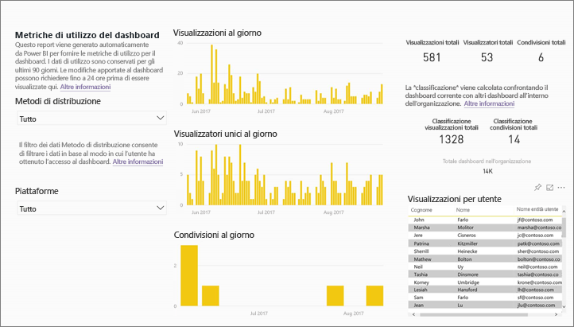

## Perché le metriche di utilizzo sono importanti per me?

Sapere come viene usato il contenuto consente di dimostrare l'impatto e assegnare priorità agli interventi. Le metriche di utilizzo possono mostrare che uno dei report viene utilizzato ogni giorno da un importante segmento dell'organizzazione e potrebbe mostrare che un dashboard creato dall'utente non viene affatto visualizzato. Questo tipo di commenti e suggerimenti è estremamente utile nel guidare gli interventi.

È possibile eseguire report sulle metriche di utilizzo solo nel servizio Power BI.  Se tuttavia si salva un report sulle metriche di utilizzo o lo si aggiunge a un dashboard, è possibile aprire e usare il report nei dispositivi mobili.

### Prerequisiti

- La funzionalità Metriche di utilizzo acquisisce le informazioni sull'utilizzo di tutti gli utenti, indipendentemente dalla licenza a loro assegnata. Tuttavia, per eseguire ed accedere ai dati delle metriche di utilizzo è necessaria una licenza Power BI Pro.
- Le metriche di utilizzo vengono offerte per i dashboard o i report presenti nell'area di lavoro selezionata. Per accedere ai dati delle metriche di utilizzo per un determinato dashboard o report, è necessario:    
    • Avere accesso in modalità di modifica al dashboard o al report specifico • Avere una licenza Pro

## Informazioni sul report Metriche di utilizzo

Quando si seleziona **Metriche di utilizzo** o l'icona , Power BI genera un report predefinito con le metriche di utilizzo per tale contenuto relative agli ultimi 90 giorni.  L'aspetto del report è simile a quello dei tradizionali report di Power BI, ma è progettato per essere informale, non interattivo. È possibile suddividerlo in sezioni a seconda della modalità di accesso degli utenti finali, ossia a seconda del fatto che accedano tramite un'app Web o per dispositivi portatili, ecc. Man mano che i dashboard e i report si evolvono, si evolve anche il report sulle metriche di utilizzo, che viene aggiornato quotidianamente con i nuovi dati.  

Le metriche di utilizzo non vengono visualizzate in **Recenti**, **Aree di lavoro**, **Preferiti** o in altri elenchi di contenuti. Non possono essere aggiunte a un'app. Se si aggiunge un titolo di un rapporto sulle metriche di utilizzo a un dashboard, non è possibile aggiungere il dashboard a un pacchetto di app o contenuti.

Per esaminare in dettaglio i dati del report o creare report personali basati sul set di dati, usare **Salva con nome** (vedere [Salvare il report Metriche di utilizzo come un report Power BI con tutte le funzionalità)](#Save-the-Usage-Metrics-report-as-a-full-featured-Power-BI-report-(personalize)).

## Aprire un report Metriche di utilizzo per un dashboard o report

1. Iniziare nell'area di lavoro che contiene il dashboard o report.
2. Dall'elenco del contenuto dell'area di lavoro o dallo stesso dashboard o report, selezionare l'icona di **Metriche di utilizzo** .

    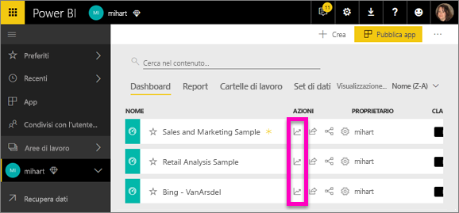

    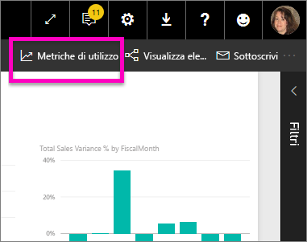
3. La prima volta che si esegue questa operazione, Power BI crea un report sulle metriche di utilizzo e avvisa l'utente appena è pronto.

    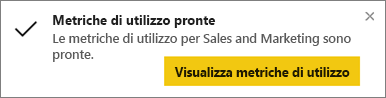
4. Per aprire i risultati, selezionare **Visualizza metriche di utilizzo**.

    Le metriche di utilizzo sono un potente alleato quando si distribuiscono e si aggiornano dashboard e report di Power BI. Come scegliere quali pagine del report è utile mantenere e quali eliminare? Sezionare in base alla **pagina del report** per scoprirlo. Come determinare se è opportuno creare un layout mobile per il dashboard? Sezionare in base alle **piattaforme** per scoprire quanti utenti accedono al contenuto tramite l'app per dispositivi mobili e quanti tramite il Web browser.

5. Facoltativamente, passare il puntatore del mouse su una visualizzazione e selezionare l'icona a forma di puntina per aggiungere la visualizzazione a un dashboard. In alternativa, dalla barra dei menu superiore selezionare **Aggiungi pagina dinamica** per aggiungere l'intera pagina a un dashboard. Dal dashboard è possibile monitorare le metriche di utilizzo con maggiore facilità oppure condividerle con altri utenti.

    > [!NOTE]
    > Se si aggiunge un titolo di un rapporto sulle metriche di utilizzo a un dashboard, non è possibile aggiungere il dashboard a un pacchetto di app o contenuti.

## Quali metriche vengono inserite nel report?

| Metrica | Dashboard | Report | Descrizione |
| --- | --- | --- | --- |
| Filtro dei dati del metodo di distribuzione |sì |sì |Il modo in cui gli utenti hanno ottenuto l'accesso al contenuto. Sono disponibili 3 metodi: gli utenti possono accedere al dashboard o al report se sono membri di un'[area di lavoro appl.](consumer/end-user-experience.md), consentendo la [condivisione del loro contenuto](service-share-dashboards.md) o installando un pacchetto/un'app di contenuto.  Si noti che le visualizzazioni tramite app sono conteggiate come "pacchetto di contenuto". |
| Filtro dei dati delle piattaforme |sì |sì |L'accesso al dashboard o al report è stato eseguito attraverso il servizio Power BI (PowerBI.com) o un dispositivo mobile? I dispositivi mobili includono tutte le app per iOS, Android e Windows. |
| Filtro dei dati pagine del report |no |sì |Se il report contiene più di una pagina filtrarlo in base alla pagina (o alle pagine) visualizzata. Se viene visualizzata un'opzione di elenco per "Vuoto", significa che la pagina del report è stata aggiunta di recente (entro 24 ore il nome effettivo della nuova pagina viene visualizzato nell'elenco del filtro dei dati) e/o che le pagine del report sono state eliminate. "Vuoto" acquisisce questo tipo di situazioni. |
| Visualizzazioni al giorno |sì |sì |Numero totale delle visualizzazioni al giorno: per visualizzazione si intende il caricamento di una pagina del report o del dashboard da parte di un utente. |
| Visualizzatori unici al giorno |sì |sì |Numero di utenti *diversi* che hanno visualizzato il dashboard o il report (in base all'account utente AAD). |
| Visualizzazioni per utente |sì |sì |Numero di visualizzazioni negli ultimi 90 giorni, suddivise per i singoli utenti. |
| Condivisioni al giorno |sì |no |Numero di volte in cui il dashboard è stato condiviso con un altro utente o gruppo. |
| Visualizzazioni totali |sì |sì |Numero di visualizzazioni negli ultimi 90 giorni. |
| Visualizzatori totali |sì |sì |Numero di visualizzatori unici negli ultimi 90 giorni. |
| Condivisioni totali |sì |no |Numero di volte in cui il dashboard o il report è stato condiviso negli ultimi 90 giorni. |
| Totale nell'organizzazione |sì |sì |Conteggio di tutti i dashboard o report in tutta l'organizzazione che sono stati visualizzati almeno una volta negli ultimi 90 giorni.  Usato per calcolare la classificazione. |
| Classificazione: Visualizzazioni totali |sì |sì |Per le visualizzazioni totali di tutti i dashboard o i report nell'organizzazione negli ultimi 90 giorni, dove si classifica questo dashboard o report. |
| Classificazione: Condivisioni totali |sì |no |Per le condivisioni totali di tutti i dashboard nell'organizzazione negli ultimi 90 giorni, dove si classifica questo dashboard o report. |

### Report Metriche di utilizzo del dashboard

### Report Metriche di utilizzo del report

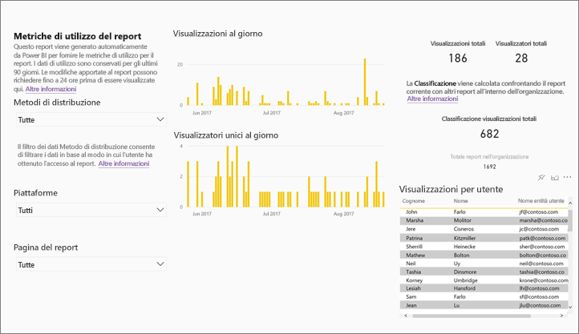

## Salvare Metriche di utilizzo come report Power BI con funzionalità complete (personalizzato)

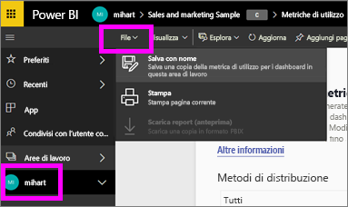

Scegliere **Salva con nome** per convertire il report Metriche di utilizzo in un report di Power BI completo che può essere personalizzato e condiviso. Dopo aver creato una copia personalizzata, si avrà accesso completo al set di dati sottostante e sarà possibile personalizzare il report sulle metriche di utilizzo in base alle proprie esigenze specifiche. È possibile anche usare Power BI Desktop per creare report sulle metriche di utilizzo personalizzati usando la funzionalità di [connessione dinamica al servizio Power BI](https://powerbi.microsoft.com/blog/connecting-to-datasets-in-the-power-bi-service-from-desktop).

In più, il set di dati sottostante include i dettagli di utilizzo per tutti i dashboard o report nell'area di lavoro. Ciò dà vita a tutta un'altra serie di possibilità. È possibile ad esempio creare un report che confronti tutti i dashboard nell'area di lavoro in base all'utilizzo. Oppure, è possibile creare un dashboard sulle metriche di utilizzo per l'app Power BI aggregando l'utilizzo di tutti i contenuti distribuiti all'interno dell'app.  Vedere la sezione [Remove the Page level filter (Rimuovere il filtro a livello di pagina) ](#remove-the-filter-to-see-all-the-usage-metrics-data-in-the-workspace)riportata di seguito.

### Cosa viene creato quando si usa "Salva con nome"?

Quando Power BI crea il report con tutte le funzionalità, crea anche un nuovo set di dati **costituito da tutti i dashboard e report contenuti nell'area di lavoro corrente** a cui gli utenti hanno avuto accesso negli ultimi 90 giorni. Si supponga ad esempio di avere un'area di lavoro denominata "Sales" (Vendite) che contiene tre dashboard e due report, e che si crei un report sulle metriche di utilizzo nel dashboard "Northeast" (Nordest). Si supponga quindi di usare **Salva con nome** per personalizzarlo e convertirlo in un report con tutte le funzionalità. I set di dati per questo nuovo report contengono le metriche di utilizzo *non solo del dashboard denominato "Northeast" (Nordest)* ma anche di tutti e tre i dashboard nell'area di lavoro "Sales" (Vendite). Per impostazione predefinita, il report visualizza i dati per il dashboard "Northeast" (Nordest) e sarà necessario [rimuovere un filtro](#remove-the-filter-to-see-all-the-usage-metrics-data-in-the-workspace) (con un solo clic del mouse) per visualizzare i dati per tutti e tre i dashboard.

### Creare una copia del report di utilizzo usando "Salva con nome"

Quando si crea una copia usando "Salva con nome" (copia personalizzata), Power BI converte il report pre-compilato di sola lettura in un report con tutte le funzionalità.  A prima vista non c'è alcuna differenza. Tuttavia, dopo questa operazione è possibile aprire il report nella visualizzazione di modifica, aggiungere nuove visualizzazioni, filtri e pagine, modificare o eliminare le visualizzazioni esistenti e molto altro ancora. Power BI salva il nuovo report e il set di dati nell'area di lavoro corrente. Nell'esempio seguente l'area di lavoro corrente è **mihart**.

1. Nel report sulle metriche di utilizzo pre-compilato, selezionare **File > Salva con nome**. Power BI converte il report Metriche di utilizzo in un report di Power BI completo. Questo report viene definito un report sulle metriche di utilizzo *personalizzato*. Il report sull'utilizzo personalizzato e il set di dati vengono salvati nell'area di lavoro corrente denominata **mihart*.

    
2. Aprire il report nella Visualizzazione di modifica e [interagire con esso come si farebbe con qualsiasi altro report di Power BI](service-interact-with-a-report-in-editing-view.md). Ad esempio, aggiungere nuove pagine e creare nuove visualizzazioni, aggiungere filtri, formattare i tipi di carattere e i colori, e così via.

    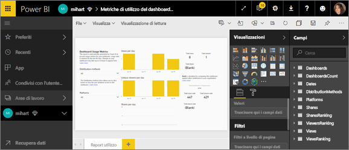
3. In alternativa, iniziare con un nuovo set di dati e creare un report da zero.

    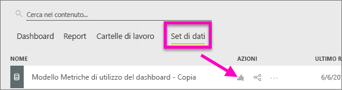
4. Il nuovo report viene salvato nell'area di lavoro corrente (mihart) e anche aggiunto all'elenco del contenuto **Recenti**.

    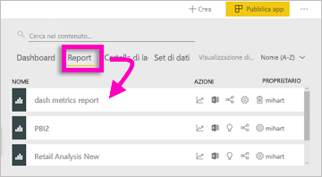

### Rimuovere il filtro per visualizzare ***tutti*** i dati sulle metriche di utilizzo nell'area di lavoro

Per visualizzare le metriche di tutti i dashboard o di tutti i report nell'area di lavoro, è necessario rimuovere un filtro. Per impostazione predefinita, il report personalizzato viene filtrato per visualizzare le metriche solo per il dashboard o report usato per la creazione.

Ad esempio, se è stato usato il dashboard denominato "European sales" (Vendite europee) per creare il nuovo report personalizzato, vengono visualizzati solo i dati di utilizzo del dashboard "European sales" (Vendite europee). Per rimuovere il filtro e abilitare i dati di tutti i dashboard in quell'area di lavoro:

1. Aprire il report personalizzato nella visualizzazione di modifica.

    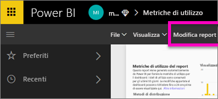
2. Nel riquadro Filtri, ricercare il bucket **Filtri a livello di report** e rimuovere il filtro selezionando la "x".

    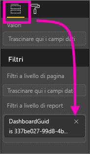

    A questo punto il report personalizzato visualizza le metriche per tutta l'area di lavoro.

## Comandi dell'amministratore per le metriche di utilizzo - Per gli amministratori di Power BI

I report sulle metriche di utilizzo sono una funzionalità che l'amministratore di Power BI o Office 365 può attivare o disattivare. Gli amministratori hanno un controllo granulare sugli utenti autorizzati ad accedere alle metriche di utilizzo. L'accesso alle metriche è attivato per impostazione predefinita per tutti gli utenti dell'organizzazione.

1. Aprire il Portale di amministrazione selezionando l'icona dell'ingranaggio nell'angolo in alto a destra del servizio Power BI e scegliendo **Portale di amministrazione**.

    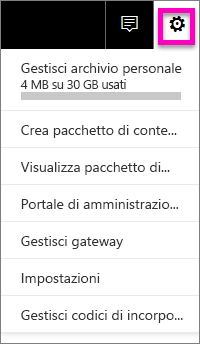
2. Dal portale di amministrazione, selezionare **Impostazioni tenant** e scegliere **Metriche di utilizzo per i creatori di contenuti**.

    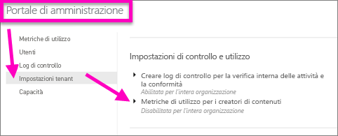
3. Abilitare (o disabilitare) le metriche di utilizzo e selezionare **Applica**.

    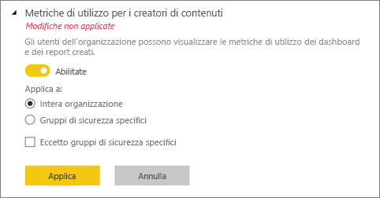

Per impostazione predefinita, i dati per utente sono abilitati nelle metriche di utilizzo e le informazioni sull'account del creatore di contenuto sono incluse nel report delle metriche. Se non si desidera includere queste informazioni per alcuni o tutti gli utenti, disabilitare la funzionalità per specifici gruppi di sicurezza o per un'intera organizzazione. Le informazioni sull'account vengono quindi visualizzate nel report come *Senza nome*.

Quando disabilitano le metriche di utilizzo per l'intera organizzazione, gli amministratori possono usare l'opzione **Elimina tutto il contenuto della metrica di utilizzo esistente** per eliminare tutti i report esistenti e i riquadri del dashboard creati usando i report e i set di dati delle metriche di utilizzo. Questa opzione rimuove completamente l'accesso ai dati delle metriche di utilizzo per tutti gli utenti dell'organizzazione che le usano. Occorre prestare attenzione, perché l'eliminazione del contenuto delle metriche di utilizzo è irreversibile.

## Metriche di utilizzo nei cloud nazionali

Power BI è disponibile in cloud nazionali separati. Questi cloud offrono gli stessi livelli di sicurezza, privacy, conformità e trasparenza della versione globale di Power BI, combinati a un modello univoco per i regolamenti locali su fornitura del servizio, residenza dei dati, accesso e controllo. A causa di questo modello univoco per i regolamenti locali, le metriche di utilizzo non sono disponibili nei cloud nazionali. Per altre informazioni, vedere [Cloud nazionali](https://powerbi.microsoft.com/en-us/clouds/).

## Considerazioni e limitazioni

È importante comprendere le differenze che possono verificarsi quando si confrontano i log di controllo e le metriche di utilizzo e il motivo di tali differenze. I *log di controllo* vengono raccolti usando i dati del servizio Power BI e le *metriche di utilizzo* vengono raccolte nel client. A causa di questa differenza, i conteggi aggregati delle attività nei log di controllo potrebbero non corrispondere sempre alle metriche di utilizzo, per i motivi seguenti:

* Le metriche di utilizzo potrebbero talvolta sottostimare le attività a causa di connessioni di rete non coerenti, funzionalità di blocco degli annunci o altri problemi che possono interrompere l'invio di eventi dal client.
* Alcuni tipi di visualizzazioni non sono inclusi nelle metriche di utilizzo, come descritto in precedenza in questo articolo.
* Le metriche di utilizzo potrebbero talvolta sovrastimare le attività, ad esempio quando il client viene aggiornato senza necessità di inviare una richiesta al servizio Power BI.

## Domande frequenti

Oltre alle potenziali differenze tra i log di controllo e le metriche di utilizzo, le domande e risposte seguenti sulle metriche di utilizzo possono essere utili per gli utenti e gli amministratori:

**D:**    non è possibile eseguire le metriche di utilizzo per un dashboard o un report

**R:**    è possibile visualizzare solo le metriche di utilizzo di cui si è proprietari o che si è autorizzati a modificare.

**D:**    le metriche di utilizzo acquisiscono viste da dashboard e report incorporati?

**R:**    le metriche di utilizzo attualmente non supportano l'acquisizione dell'utilizzo per dashboard e report incorporati e per il flusso [Pubblica sul Web](service-publish-to-web.md).          In questi casi, è consigliabile usare le piattaforme di analisi Web esistenti per tenere traccia dell'utilizzo dell'app o del portale di hosting.

**D:**    non è possibile eseguire le metriche di utilizzo in nessun contenuto.

**R1:**    gli amministratori possono disattivare questa funzionalità per la loro organizzazione.  Contattare l'amministratore per verificare se è questo il caso.

**R2:**    le metriche di utilizzo sono una funzionalità di Power BI Pro.

**D:**    i dati non sembrano essere aggiornati. Ad esempio, i metodi di distribuzione non vengono visualizzati, mancano le pagine del report e così via.

**R:**    l'aggiornamento dei dati può richiedere fino a 24 ore.

**D:**    ci sono quattro report nell'area di lavoro, ma il report sulle metriche di utilizzo ne visualizza solo tre.

**R:**    il report sulle metriche di utilizzo include solo i report (o i dashboard) a cui gli utenti hanno avuto accesso negli ultimi 90 giorni.  Se un report (o dashboard) non viene visualizzato, è probabile che non sia stato usato per oltre 90 giorni.

## Passaggi successivi

[Aggiungere un dashboard ai Preferiti](consumer/end-user-favorite.md)

Altre domande? [Provare la community di Power BI](http://community.powerbi.com/)
