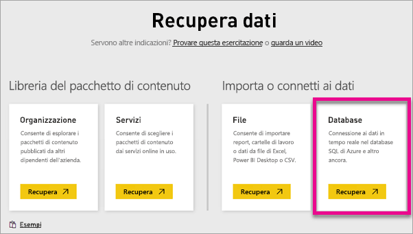

# Spark in HDInsight con DirectQuery
Spark in Azure HDInsight con DirectQuery consente di creare report dinamici basati su dati e metriche già presenti nel cluster di Spark. Con DirectQuery le query vengono inviate nuovamente al cluster Spark di Azure HDInsight durante l'esplorazione dei dati nella visualizzazione report. Si tratta di un'esperienza consigliata per gli utenti che hanno familiarità con le entità cui si connettono.

> [!WARNING]
> L'aggiornamento automatico dei riquadri è stato disabilitato per i riquadri del dashboard basati su set di dati basati su Spark. È possibile selezionare **Aggiorna riquadri del dashboard** per eseguire manualmente l'aggiornamento. I report non sono interessati e dovrebbero rimanere aggiornati. 
> 
> 

La procedura seguente consente di connettersi all'origine dati Spark in Azure HDInsight usando DirectQuery all'interno del servizio Power BI.

1. Selezionare **Recupera dati** nella parte inferiore del riquadro di spostamento sinistro.
   
     
2. Selezionare **Database e altro**.
   
     
3. Selezionare il connettore di **Spark in HDInsight** e scegliere **Connetti**.
   
     
4. Immettere il nome del **server** a cui connettersi, oltre a **nome utente** e **password**. Il formato del nome del server è sempre \<nomecluster\>.azurehdinsight.net. Per altre informazioni su come trovare questi valori, vedere di seguito.
   
     
   
     
5. Dopo la connessione verrà visualizzato un nuovo set di dati denominato "SparkDataset". È anche possibile accedere al set di dati attraverso il riquadro segnaposto creato.
   
     
6. Esaminando il set di dati è possibile esplorare tutte le tabelle e le colonne presenti nel database. Selezionando una colonna verrà inviata una query all'origine e verrà quindi creato dinamicamente l'oggetto visivo. Gli oggetti visivi possono essere salvati in un nuovo report e riaggiunti al dashboard.

## Ricerca dei parametri di Spark in HDInsight
Il formato del nome del server è sempre \<nomecluster\>.azurehdinsight.net e il nome è presente nel portale di Azure.

Anche nome utente e password sono indicati nel portale di Azure.

## Limitazioni
Queste restrizioni e note possono cambiare dal momento che le esperienze vengono costantemente migliorate. Per altra documentazione, vedere [Usare gli strumenti di Business Intelligence con Apache Spark in HDInsight](https://azure.microsoft.com/documentation/articles/hdinsight-apache-spark-use-bi-tools/)

* Il servizio Power BI supporta solo una configurazione di Spark 2.0 e HDInsight 3.5.
* Ogni azione, ad esempio la selezione di una colonna o l'aggiunta di un filtro invierà una query al database. Prima di selezionare i campi di dimensioni molto ampie, è consigliabile scegliere un tipo di elemento visivo appropriato.
* La funzione Domande e risposte non è disponibile per i set di dati di DirectQuery.
* Le modifiche allo schema non vengono selezionate automaticamente.
* Power BI supporta 16.000 colonne **in tutte le tabelle** all'interno di un set di dati. Power BI include anche una colonna dei numeri di riga interna per tabella. In questo modo, se nel set di dati sono presenti 100, il numero di colonne disponibili è 15.900. A seconda della quantità di dati in uso dall'origine dati Spark, è possibile che si raggiunga questo limite.

## Risoluzione dei problemi
Se si riscontrano problemi durante l'esecuzione di query sul cluster, verificare che l'applicazione sia ancora in esecuzione e riavviarla se necessario.

È anche possibile allocare risorse aggiuntive nel portale di Azure in **Configurazione** > **Ridimensiona cluster**:

## Passaggi successivi
[Introduzione: creare un cluster Apache Spark in HDInsight Linux ed eseguire query interattive usando SQL Spark](https://azure.microsoft.com/documentation/articles/hdinsight-apache-spark-jupyter-spark-sql)  
[Introduzione a Power BI](service-get-started.md)  
[Recuperare dati per Power BI](service-get-data.md)  
Altre domande? [Provare la community di Power BI](http://community.powerbi.com/)

