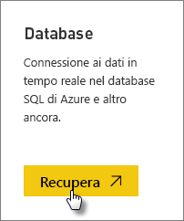
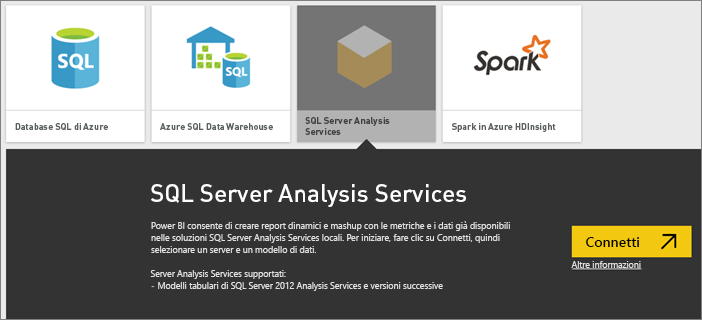
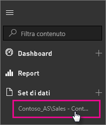

# Dati dinamici di SQL Server Analysis Services in Power BI
In Power BI è possibile connettersi a un server SQL Server Analysis Services dinamico in due modi. In **Recupera dati** è possibile connettersi a un server SQL Server Analysis Services oppure è possibile connettersi a un [file di Power BI Desktop](service-desktop-files.md), o a una [cartella di lavoro di Excel](service-excel-workbook-files.md) che si connette già a un server Analysis Services. Come procedura consigliata, Microsoft consiglia di usare Power BI Desktop grazie alla completezza del set di strumenti e alla possibilità di mantenere una copia di backup del file di Power BI Desktop in locale.

 >[!IMPORTANT]
 >* Per connettersi a un server Analysis Services dinamico, è necessario che un gateway dati locale sia installato e configurato da un amministratore. Per altre informazioni, vedere [Gateway dati locale](service-gateway-onprem.md).
 >* Quando si usa il gateway, i dati rimangono in locale.  I report creati in base a tali dati vengono salvati nel servizio Power BI. 
 >* Le [domande e risposte per query in linguaggio naturale](service-q-and-a-direct-query.md) sono disponibili in anteprima per le connessioni dinamiche ad Analysis Services.

## Per connettersi a un modello da Recupera dati
1. Dall'**Area di lavoro personale** selezionare **Recupera dati**. È anche possibile passare a un'area di lavoro di un gruppo, se disponibile.
   
   
2. Selezionare **Database e altro**.
   
   
3. Selezionare **SQL Server Analysis Services** > **Connetti**. 
   
   
4. Selezionare un server. Se non è elencato alcun server, significa che un gateway e un'origine dati non sono configurati o che l'account non è presente nella scheda **utenti** dell'origine dati, nel gateway. Rivolgersi all'amministratore.
5. Selezionare il modello a cui ci si vuole connettere. Può essere un modello tabulare o multidimensionale.

Dopo aver eseguito la connessione al modello, verrà visualizzato nel sito di Power BI in **Area di lavoro personale/Set di dati**. Se si è passati a un'area di lavoro del gruppo, il set di dati verrà visualizzato all'interno del gruppo.

## Riquadri del dashboard
Se si bloccano elementi visivi di un report sul dashboard, i riquadri bloccati vengono aggiornati automaticamente ogni 10 minuti. Se i dati nel server Analysis Services locale vengono aggiornati, i riquadri verranno aggiornati automaticamente dopo 10 minuti.

## Problemi comuni

* Non è possibile caricare l'errore dello schema del modello - Questo errore si verifica quando l'utente che si connette a SSAS non ha accesso a database SSAS, cubo e modello.

## Passaggi successivi
[Gateway dati locale](service-gateway-onprem.md)  
[Gestire origini dati di Analysis Services](service-gateway-enterprise-manage-ssas.md)  
[Risoluzione dei problemi del gateway dati locale](service-gateway-onprem-tshoot.md)  
Altre domande? [Provare la community di Power BI](http://community.powerbi.com/)