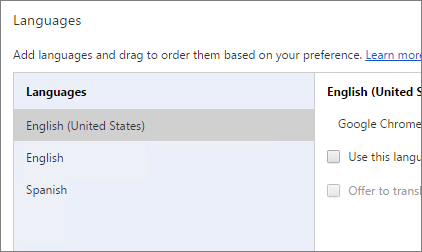
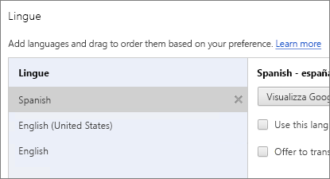
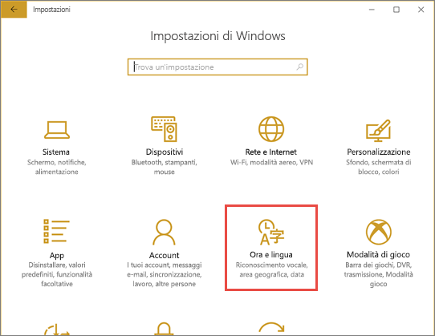
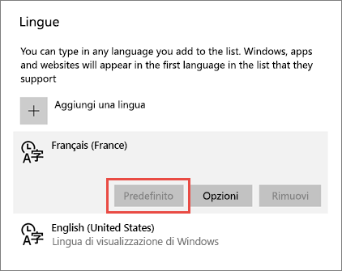
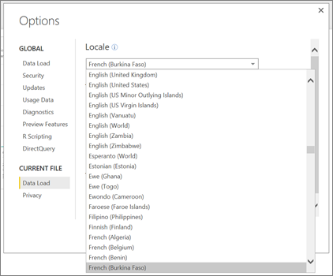
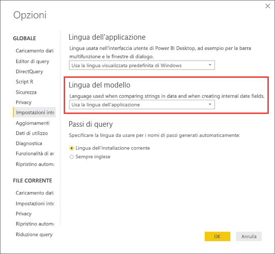

# Lingue e paesi/aree geografiche supportate per Power BI

Questo articolo fornisce l'elenco di lingue e paesi/aree geografiche supportati per il servizio Power BI, Power BI Desktop e la documentazione di Power BI.

## Paesi e aree geografiche in cui Power BI è disponibile
Per conoscere i paesi e le aree geografiche in cui Power BI è disponibile, vedere questo [elenco relativo alla disponibilità internazionale](https://products.office.com/business/international-availability). 

## Lingue per il servizio Power BI
Il servizio Power BI (nel browser) è disponibile nelle 42 lingue seguenti:

* Arabo
* Basco - Basque
* Bulgaro - Български
* Catalano - català
* Cinese (semplificato) - 中文(简体)
* Cinese (tradizionale) - 中文(繁體)
* Croato - hrvatski
* Ceco - čeština
* Danese - dansk
* Olandese - Nederlands
* Inglese - English
* Estone - eesti
* Finlandese - suomi
* Francese - français
* Gallego - galego
* Tedesco - Deutsch
* Greco - Ελληνικά
* Ebraico
* Hindi - हिंदी
* Ungherese - magyar
* Indonesiano - Bahasa Indonesia
* Italiano - italiano
* Giapponese - 日本語
* Kazaco - Қазақ
* Coreano - 한국어
* Lettone - latviešu
* Lituano - lietuvių
* Malese - Bahasa Melayu
* Norvegese bokmål - norsk (bokmål)
* Polacco - Polski
* Portoghese (Brasile) - Português
* Portoghese (Portogallo) - português
* Romeno - română
* Russo - Русский
* Serbo (alfabeto cirillico) - српски
* Serbo (alfabeto latino) - srpski
* Slovacco - slovenčina
* Sloveno - slovenski
* Spagnolo - español
* Svedese - svenska
* Thai - ไทย
* Turco - Türkçe
* Ucraino - українська
* Vietnamita - Tiếng Việt

### Elementi tradotti
Menu, pulsanti, messaggi ed altri elementi dell'esperienza sono tradotti nelle varie lingue e consentono di esplorare e interagire facilmente con Power BI.

Al momento alcune funzionalità sono disponibili solo in inglese:

* Dashboard e report che Power BI crea automaticamente quando ci si connette a servizi quali Microsoft Dynamics CRM, Google Analytics, Salesforce e così via. È comunque possibile creare dashboard e report nella propria lingua.
* Esplorazione dei dati con Domande e risposte.

In futuro è prevista l'aggiunta di ulteriori funzionalità in altre lingue. 

### Scegliere la lingua nel servizio Power BI
1. Nel servizio Power BI selezionare l'icona **Impostazioni**  > **Impostazioni**.
2. Nella scheda **Generale** > **Lingua**.
3. Selezionare la lingua > **Applica**.

### Scegliere la lingua nel browser
Power BI rileva la lingua in base alle preferenze del computer usato. Le modalità di accesso e modifica di queste preferenze possono variare a seconda del sistema operativo e del browser usati. Le istruzioni seguenti spiegano come accedere a queste preferenze da Internet Explorer e Google Chrome.

#### Internet Explorer (versione 11)
1. Fare clic sul pulsante **Strumenti** nell'angolo in alto a destra della finestra del browser:
   
   
2. Fare clic su **Opzioni Internet**.
3. Nella scheda Generale della finestra di dialogo Opzioni Internet fare clic sul pulsante **Lingue** nella sezione Aspetto.

#### Google Chrome (versione 42)
1. Fare clic sul menu Strumenti nell'angolo in alto a destra della finestra del browser:
   
   
2. Fare clic su **Impostazioni**.
3. Fare clic su **Mostra impostazioni avanzate**.
4. In Lingue fare clic sul pulsante **Impostazioni della lingua e di immissione** .
5. Fare clic su **Aggiungi**, selezionare una lingua e fare clic su **OK**.
   
   
   
   La nuova lingua viene visualizzata alla fine dell'elenco. 
6. Trascinare la nuova lingua nella parte superiore dell'elenco e fare clic su **Visualizza Google Chrome in questa lingua**.
   
   
   
   Per visualizzare la modifica potrebbe essere necessario chiudere e riaprire il browser.

## Scegliere la lingua o le impostazioni locali di Power BI Desktop
È possibile ottenere Power BI Desktop in due modi: tramite download oppure tramite installazione da Windows Store.

* Quando si [installa Power BI Desktop da Windows Store](#choose-a-language-for-power-bi-desktop-installed-from-the-windows-store), vengono installate tutte le lingue e viene mostrata la lingua corrispondente alla lingua predefinita di Windows.
* Quando si [scarica Power BI Desktop](#choose-a-language-when-you-download-power-bi-desktop), si sceglie la lingua durante il download. 
* È anche possibile [scegliere le impostazioni locali da usare durante l'importazione di dati](#choose-the-locale-to-be-used-when-importing-data-into-power-bi-desktop) per un report specifico. 

### Scegliere una lingua per Power BI Desktop installato da Windows Store
1. [Installare Power BI Desktop](http://aka.ms/pbidesktopstore) da Windows Store.
2. Per cambiare la lingua, nel computer cercare **Impostazioni di Windows**. 
3. Selezionare **Ora e lingua**.
   
     
4. Selezionare **Paese e lingua**, selezionare una lingua e quindi **Imposta come predefinita**.
   
     
   
     Al successivo avvio di Power BI Desktop verrà usata la lingua configurata come predefinita. 

### Scegliere una lingua quando si scarica Power BI Desktop
La lingua scelta per Power BI Desktop influisce sul formato di visualizzazione dei numeri e delle date nei report. 

* Selezionare una lingua durante il [download di Power BI Desktop](https://powerbi.microsoft.com/desktop). 

Per cambiare la lingua in Power BI Desktop, tornare alla pagina di download e scaricarlo in una lingua diversa.

### Scegliere le impostazioni locali da usare per l'importazione di dati in Power BI Desktop
Quando si scarica Power BI Desktop o lo si installa da Windows Store, è possibile scegliere impostazioni locali diverse per un report specifico rispetto alle impostazioni locali della versione di Power BI Desktop in uso. Questo approccio modifica la modalità in cui i dati vengono interpretati durante l'importazione dall'origine dati, ad esempio determina se "3/4/2017" viene interpretato come 3 aprile o 4 marzo. 

1. In Power BI Desktop passare a **File** > **Opzioni e impostazioni** > **Opzioni**.
2. In **File corrente** selezionare **Impostazioni internazionali**.
3. Nella casella **Impostazioni locali** selezionare un'opzione diversa per le impostazioni locali. 
   
   
4. Selezionare **OK**.

### Scegliere la lingua per il modello in Power BI Desktop

Oltre a impostare la lingua per l'applicazione Power BI Desktop, è anche possibile impostare la lingua del modello. La lingua del modello influisce principalmente su due aspetti:

- Il modo in cui le stringhe vengono confrontate e ordinate. Ad esempio, poiché l'alfabeto turco contiene due lettere i, a seconda delle regole di confronto del database, l'ordinamento può risultare diverso. 
- La lingua usata da Power BI Desktop per la creazione di tabelle data nascoste dai campi data. Ad esempio, i campi sono denominati Month/Monat/Mese e così via.

Ecco come impostare la lingua del modello.

1. In Power BI Desktop passare a **File** > **Opzioni e impostazioni** > **Opzioni**.
2. In **Globale** selezionare **Impostazioni internazionali**.
3. Nella casella **Lingua del modello** selezionare un'altra lingua. 

    

## Lingue per la documentazione della Guida
La Guida è localizzata nelle 10 lingue seguenti: 

* Cinese (semplificato) - 中文(简体)
* Cinese (tradizionale) - 中文(繁體)
* Francese - français
* Tedesco - Deutsch
* Italiano - italiano
* Giapponese - 日本語
* Coreano - 한국어
* Portoghese (Brasile) - Português
* Russo - Русский
* Spagnolo - español

## Passaggi successivi
* Si sta usando una delle app Power BI per dispositivi mobili? Per informazioni dettagliate, vedere le [lingue supportate nelle app Power BI per dispositivi mobili](mobile-apps-supported-languages.md).
* Domande? Provare a chiedere alla [community di Power BI](http://community.powerbi.com/).
* Ci sono ancora problemi? Visitare la [pagina del supporto tecnico di Power BI](https://powerbi.microsoft.com/support/).

