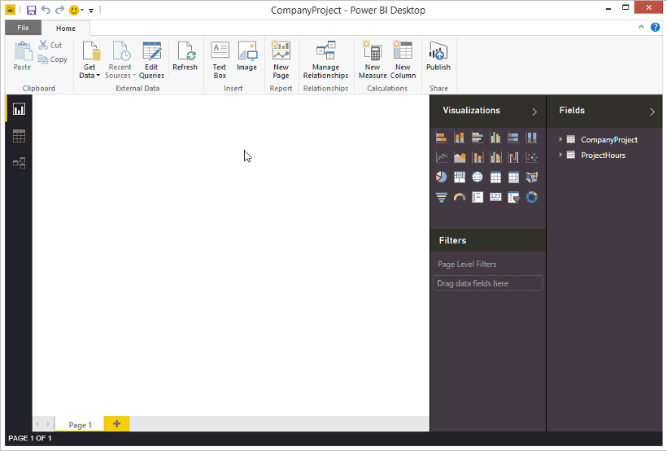
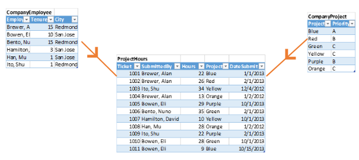
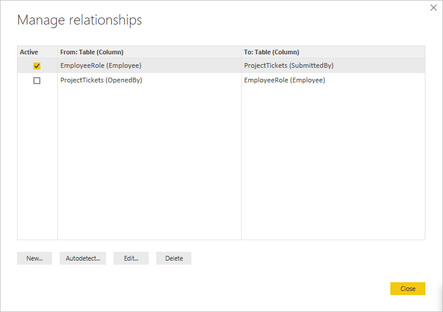

# Creare e gestire le relazioni in Power BI Desktop
Quando si importano più tabelle, è probabile che si eseguano analisi relative ai dati inclusi nelle tabelle. Le relazioni tra le tabelle sono necessarie per calcolare con precisione i risultati e visualizzare le informazioni corrette nei report. Power BI Desktop semplifica la creazione di queste relazioni. Nella maggior parte dei casi, infatti, tutte le operazioni vengono eseguite automaticamente dalla funzionalità Rilevamento automatico. Talvolta, tuttavia, può essere necessario creare manualmente le relazioni oppure apportarvi alcune modifiche. È quindi importante comprendere le relazioni in Power BI Desktop e capire come crearle e modificarle.

## Rilevamento automatico durante il caricamento
Se si eseguono query in due o più tabelle alla volta, Power BI Desktop tenta di trovare e creare automaticamente le relazioni quando i dati vengono caricati. Le opzioni di relazione **Cardinalità**, **Direzione filtro incrociato** e **Imposta come relazione attiva** vengono impostate automaticamente. Power BI Desktop esamina i nomi di colonna nelle tabelle sottoposte a query per determinare se sono presenti potenziali relazioni. Se le relazioni sono presenti, verranno create automaticamente. Se Power BI Desktop non riesce a determinare una corrispondenza con un livello elevato di attendibilità, la relazione non viene creata automaticamente. È comunque possibile usare la finestra di dialogo **Gestisci relazioni** per creare o modificare le relazioni manualmente.

## Creare una relazione con la funzionalità Rilevamento automatico
Nella scheda **Home** selezionare **Gestisci relazioni** \> **Rilevamento automatico**.

## Creare manualmente una relazione
1. Nella scheda **Home** selezionare **Gestisci relazioni** \> **Nuovo**.

2. Nella finestra di dialogo **Crea relazione** selezionare una tabella dal primo elenco a discesa di tabelle. Selezionare la colonna da usare nella relazione.

3. Nel secondo elenco a discesa di tabelle selezionare l'altra tabella da includere nella relazione. Selezionare l'altra colonna da usare e quindi scegliere **OK**.

   

Per impostazione predefinita, Power BI Desktop configura automaticamente le opzioni **Cardinalità** (direzione), **Direzione filtro incrociato** e **Imposta come relazione attiva** per una nuova relazione. È tuttavia possibile modificare queste impostazioni, se necessario. Per altre informazioni, vedere [Informazioni sulle opzioni aggiuntive](#understanding-additional-options).

Se nessuna delle tabelle selezionate per la relazione ha valori univoci, viene visualizzato un errore per segnalare che *una delle colonne deve contenere valori univoci*. Almeno una tabella in una relazione *deve* avere un elenco distinto e unico di valori chiave. Questo è un requisito comune per tutte le tecnologie di database relazionali. 

Se viene visualizzato questo errore, è possibile risolvere il problema in due modi:

* Usare **Rimuovi duplicati** per creare una colonna con valori univoci. Lo svantaggio di questo approccio è dato dal rischio di perdita di informazioni con l'eliminazione delle righe duplicate. In molti casi una chiave (riga) è duplicata per un motivo valido.
* Aggiungere al modello una tabella intermedia con l'elenco di valori di chiave univoci, che verrà quindi collegato a entrambe le colonne originali nella relazione.

Per ulteriori informazioni, vedere questo [post di blog](https://blogs.technet.microsoft.com/cansql/2016/12/19/relationships-in-power-bi-fixing-one-of-the-columns-must-have-unique-values-error-message/).

## Modificare una relazione
1. Nella scheda **Home** selezionare **Gestisci relazioni**.

2. Nella finestra di dialogo **Gestisci relazioni** selezionare la relazione e quindi selezionare **Modifica**.

## Configurare opzioni aggiuntive
Quando si crea o si modifica una relazione, è possibile configurare opzioni aggiuntive. Per impostazione predefinita, Power BI Desktop configura automaticamente le opzioni aggiuntive in base alla maggiore probabilità, che può variare per ogni relazione a seconda dei dati contenuti nelle colonne.

### Cardinalità
L'opzione **Cardinalità** può avere una delle impostazioni seguenti:

**Molti-a-uno (\*:1)** : una relazione molti-a-uno è il tipo predefinito e più comune di relazione. Significa che la colonna in una tabella può avere più istanze di un valore e l'altra tabella correlata, spesso nota come tabella di ricerca, include una sola istanza di un valore.

**Uno-a-uno (1:1)** : in una relazione uno-a-uno la colonna in una tabella include una sola istanza di un valore specifico e l'altra tabella correlata include una sola istanza di un valore specifico.

**Uno-a-molti (1:*)** : in una relazione uno-a-molti la colonna in una tabella include una sola istanza di un valore specifico e l'altra tabella correlata può avere più istanze di un valore.

**Molti-a-molti (\*:\*)** : con i modelli compositi è possibile stabilire una relazione molti-a-molti tra le tabelle, rimuovendo così i requisiti per i valori univoci nelle tabelle. Annulla anche le soluzioni alternative precedenti, ad esempio l'introduzione di nuove tabelle solo per stabilire relazioni. Per altre informazioni, vedere [Relazioni con cardinalità molti-a-molti](https://docs.microsoft.com/power-bi/desktop-many-to-many-relationships). 

Per altre informazioni sui casi in cui modificare la cardinalità, vedere [Informazioni sulle opzioni aggiuntive](#understanding-additional-options).

### Direzione filtro incrociato
L'opzione **Direzione filtro incrociato** può avere una delle impostazioni seguenti:

**Entrambi**: ai fini dell'applicazione di filtri, entrambe le tabelle vengono considerate come una singola tabella. L'opzione **Entrambi** funziona correttamente per una singola tabella con una serie di tabelle di ricerca correlate. Un esempio è dato da una tabella di valori effettivi delle vendite con una tabella di ricerca per reparto. Questa configurazione è spesso definita schema a stella (una tabella centrale con diverse tabelle di ricerca). Se tuttavia si hanno due o più tabelle con tabelle di ricerca (alcune delle quali in comune), non usare l'impostazione **Entrambi**. Per continuare l'esempio precedente, in questo caso, è anche presente una tabella delle vendite in budget che registra il budget mirato per ogni reparto. La tabella del reparto, infine, è connessa sia alla tabella vendite sia alla tabella budget. Evitare l'impostazione **Entrambi** per questo tipo di configurazione.

**Singola**: è la direzione predefinita e più comune. Indica che le opzioni di filtro nelle tabelle connesse vengono applicate alla tabella in cui vengono aggregati i valori. Se si importa una tabella di Power Pivot in Excel 2013 o in un modello di dati precedente, tutte le relazioni avranno un'unica direzione. 

Per altre informazioni sui casi in cui modificare la direzione del filtro incrociato, vedere [Informazioni sulle opzioni aggiuntive](#understanding-additional-options).

### Imposta come relazione attiva
Se selezionata, questa opzione indica che la relazione viene usata come relazione attiva e predefinita. Nei casi in cui sono presenti più relazioni tra due tabelle, la relazione attiva permette a Power BI Desktop di creare automaticamente visualizzazioni che includono entrambe le tabelle.

Per altre informazioni dettagliate sui casi in cui impostare come attiva una relazione specifica, vedere [Informazioni sulle opzioni aggiuntive](#understanding-additional-options).

## Informazioni sulle relazioni
Dopo aver connesso due tabelle con una relazione, è possibile usare i dati di entrambe le tabelle allo stesso modo di una singola tabella, senza doversi preoccupare dei dettagli della relazione né ridurre le due tabelle a una sola prima di importarle. In molte situazioni Power BI Desktop può creare le relazioni automaticamente. Se tuttavia Power BI Desktop non riesce a determinare con un grado elevato di certezza che deve esistere una relazione tra due tabelle, la relazione non viene creata automaticamente. In tal caso, è necessario eseguire l'operazione in modo manuale. 

La breve esercitazione seguente illustra il funzionamento delle relazioni in Power BI Desktop.

>[!TIP]
>È possibile completare personalmente questa lezione: 
>
> 1. Copiare la tabella **ProjectHours** seguente in un foglio di lavoro di Excel (escluso il titolo), selezionare tutte le celle e quindi selezionare **Inserisci** \> **Tabella**. 
> 2. Nella finestra di dialogo **Crea tabella** selezionare **OK**. 
> 3. Selezionare una cella della tabella, selezionare **Progettazione** \> **Nome tabella** e quindi immettere *ProjectHours*. 
> 4. Ripetere la procedura per la tabella **CompanyProject**. 
> 5. Importare i dati usando **Recupera dati** in Power BI Desktop. Selezionare le due tabelle come origine dati e quindi selezionare **Carica**.

La prima tabella, **ProjectHours**, è un record di ticket di lavoro che registrano il numero di ore in cui una persona ha lavorato su un progetto specifico. 

**ProjectHours**

| **Ticket** | **SubmittedBy** | **Hours** | **Project** | **DateSubmit** |
| ---:|:--- | ---:|:--- | ---:|
| 1001 |Brewer, Alan |22 |Blu |1/1/2013 |
| 1002 |Brewer, Alan |26 |Rosso |2/1/2013 |
| 1003 |Ito, Shu |34 |Giallo |12/4/2012 |
| 1004 |Brewer, Alan |13 |Arancione |1/2/2012 |
| 1005 |Bowen, Eli |29 |Purple |10/1/2013 |
| 1006 |Bento, Nuno |35 |Verde |2/1/2013 |
| 1007 |Hamilton, David |10 |Giallo |10/1/2013 |
| 1008 |Han, Mu |28 |Orange |1/2/2012 |
| 1009 |Ito, Shu |22 |Viola |2/1/2013 |
| 1010 |Bowen, Eli |28 |Verde |10/1/2013 |
| 1011 |Bowen, Eli |9 |Blu |10/15/2013 |

La seconda tabella, **CompanyProject**, è un elenco di progetti a cui è stata assegnata una priorità di tipo A, B o C. 

**CompanyProject**

| **ProjName** | **Priority** |
| --- | --- |
| Blu |A |
| Red |B |
| Verde |C |
| Yellow |C |
| Viola |B |
| Arancione |C |

Si noti che ogni tabella contiene una colonna del progetto. Ogni colonna ha un nome leggermente diverso, ma i valori sono simili. Si tratta di un aspetto importante, che verrà esaminato a breve.

Dopo avere importato le due tabelle in un modello, è possibile creare un report. Si vuole ottenere prima di tutto il numero di ore inviate in base alla priorità del progetto. È quindi necessario selezionare **Priority** e **Hours** dal riquadro **Campi**.

Se si esamina la tabella nell'area di disegno del report, il numero di ore visualizzato è 256 per ogni progetto e questo valore corrisponde anche al totale. Evidentemente il numero non è corretto. Questo problema dipende Questo problema dipende dal fatto che non è possibile calcolare una somma totale dei valori di una tabella (**Hours** nella tabella **Project**), suddivisi in base ai valori di un'altra tabella (**Priority** nella tabella **CompanyProject**) senza una relazione tra le due tabelle.

È quindi necessario creare una relazione tra le due tabelle.

Come si ricorderà, in entrambe le tabelle sono disponibili colonne con un nome progetto, con valori simili. Si useranno queste due colonne per creare una relazione tra le tabelle.

Perché queste colonne? Se si esamina la colonna **Project** nella tabella **ProjectHours**, si noteranno valori quali Blue, Red, Yellow, Orange e così via. Sono in effetti presenti alcune righe con lo stesso valore. I valori relativi ai colori per **Project** sono molti.

Se si esamina la colonna **ProjName** nella tabella **CompanyProject**, si noterà che è presente un solo valore per ogni colore relativo al progetto. Ogni valore di colore in questa tabella è univoco e questo è importante, perché è possibile creare una relazione tra queste due tabelle. In questo caso, si tratta di una relazione di tipo Molti-a-uno. In una relazione molti-a-uno è necessario che almeno una colonna in una delle tabelle contenga valori univoci. Sono disponibili alcune opzioni aggiuntive per alcune relazioni, che verranno esaminate più avanti. Per il momento verrà creata una relazione tra le colonne del progetto in ognuna delle due tabelle.

### Per creare la nuova relazione
1. Selezionare **Gestisci relazioni** nella scheda **Home**.
2. In **Gestisci relazioni** selezionare **Nuovo** per aprire la finestra di dialogo **Crea relazione**, in cui è possibile selezionare tabelle, colonne ed eventuali impostazioni aggiuntive per la relazione.
3. Nel primo elenco a discesa selezionare **ProjectHours** come prima tabella e quindi selezionare la colonna **Project**. Questo è il lato *molti* della relazione.
4. Nel secondo elenco a discesa **CompanyProject** è già selezionata come seconda tabella. Selezionare la colonna **ProjName**. Questo è il lato *uno* della relazione. 
5. Accettare i valori predefiniti per le opzioni della relazione e quindi selezionare **OK**.

   

6. Nella finestra di dialogo **Gestisci relazioni** selezionare **Chiudi**.

Per offrire informazioni più esaustive, la relazione è stata creata eseguendo la procedura più complicata. Sarebbe stato sufficiente selezionare **Rilevamento automatico** nella finestra di dialogo **Gestisci relazioni**. In effetti, la funzionalità Rilevamento automatico potrebbe avere già eseguito questa operazione automaticamente, quando sono stati caricati i dati, se entrambe le colonne avessero avuto lo stesso nome. È comunque utile conoscere la procedura manuale.

È ora possibile esaminare di nuovo la tabella nell'area di disegno del report.

Ha un aspetto decisamente migliore.

Quando si sommano le ore in base a **Priority**, Power BI Desktop cerca ogni istanza dei valori di colore univoci nella tabella di ricerca **CompanyProject**, quindi cerca ogni istanza di tali valori nella tabella **ProjectHours** e infine calcola una somma totale per ogni valore univoco.

La procedura è semplice. In realtà, con la funzionalità Rilevamento automatico, potrebbe essere anche meno complicato.

## Informazioni sulle opzioni aggiuntive
Quando viene creata una relazione, con Rilevamento automatico o manualmente, Power BI Desktop configura automaticamente opzioni aggiuntive in base ai dati disponibili nelle tabelle. Queste opzioni aggiuntive per le relazioni sono disponibili nella parte inferiore delle finestre di dialogo **Crea relazione** e **Modifica relazione**.

 

Power BI imposta in genere queste opzioni automaticamente e non è necessario modificarle. In alcuni casi, tuttavia, può essere opportuno configurarle manualmente.

## Aggiornamenti automatici delle relazioni

È possibile gestire il modo in cui Power BI gestisce e automaticamente adatta le relazioni nei report e nei modelli. Per specificare il modo in cui Power BI gestisce le opzioni delle relazioni, selezionare **File** > **Opzioni e impostazioni** > **Opzioni** da Power BI Desktop e quindi selezionare **Caricamento dati** nel riquadro sinistro. Verranno quindi visualizzate le opzioni per **Relazioni**.

   

È possibile selezionare e abilitare tre opzioni: 

- **Importa relazioni dalle origini dati al primo caricamento**. Questa opzione è selezionata per impostazione predefinita. Quando è selezionata, Power BI controlla la presenza di relazioni definite nell'origine dati, ad esempio relazioni di chiave esterna/chiave primaria nel data warehouse. Se tali relazioni sono presenti, viene eseguito il mirroring nel modello di dati Power BI quando si caricano inizialmente i dati. Questa opzione consente di iniziare rapidamente a usare il modello, anziché dover trovare o definire tali relazioni manualmente.

- **Aggiorna o elimina le relazioni durante l'aggiornamento dei dati**. Questa opzione non è selezionata per impostazione predefinita. Se è selezionata, Power BI controlla la presenza di modifiche apportate alle relazioni dell'origine dati quando il set di dati viene aggiornato. Se tali relazioni sono state modificate o vengono rimosse, Power BI esegue il mirroring di tali modifiche nel modello di dati, aggiornandole o modificandole affinché siano corrispondenti.

   > [!WARNING]
   > Se si usa la sicurezza a livello di riga basata sulle relazioni definite, non è consigliabile selezionare questa opzione. Se si rimuove una relazione su cui si basano le impostazioni di sicurezza a livello di riga, il modello potrebbe diventare meno sicuro. 

- **Rileva automaticamente le nuove relazioni al caricamento dei dati**. Questa opzione è descritta in [Rilevamento automatico durante il caricamento](#autodetect-during-load). 

## Gli aggiornamenti futuri ai dati richiedono una cardinalità diversa
In genere, Power BI Desktop riesce a determinare automaticamente la cardinalità migliore per la relazione. Se è necessario eseguire l'override dell'impostazione automatica, poiché si prevede che i dati cambieranno in futuro, è possibile modificarla con il controllo **Cardinalità**. L'esempio seguente illustra una situazione in cui è necessario selezionare una cardinalità diversa.

La tabella **CompanyProjectPriority** seguente è un elenco di tutti i progetti aziendali e delle rispettive priorità. La tabella **ProjectBudget** è il set di progetti per cui è stato approvato il budget.

**CompanyProjectPriority**

| **ProjName** | **Priority** |
| --- | --- |
| Blu |A |
| Red |B |
| Verde |C |
| Yellow |C |
| Viola |B |
| Arancione |C |

**ProjectBudget**

| **Approved Projects** | **BudgetAllocation** | **AllocationDate** |
|:--- | ---:| ---:|
| Blu |40,000 |12/1/2012 |
| Rosso |100,000 |12/1/2012 |
| Green |50.000 |12/1/2012 |

Se si crea una relazione tra la colonna **Approved Projects** nella tabella **ProjectBudget** e la colonna **ProjectName** nella tabella **CompanyProjectPriority**, Power BI imposta automaticamente **Cardinalità** su **Uno-a-uno (1:1)** e **Direzione filtro incrociato** su **Entrambi**. 

 

Il motivo per cui Power BI configura queste impostazioni è dato dal fatto che, per Power BI Desktop, la combinazione ideale delle due tabelle è la seguente:

| **ProjName** | **Priority** | **BudgetAllocation** | **AllocationDate** |
|:--- | --- | ---:| ---:|
| Blue |A |40,000 |12/1/2012 |
| Rosso |B |100.000 |12/1/2012 |
| Verde |C |50,000 |12/1/2012 |
| Giallo |C |  |  |
| Viola |B |  |  |
| Arancione |C |  |  |

Esiste una relazione uno-a-uno tra le due tabelle, poiché la colonna **ProjName** della tabella combinata non include valori ripetuti. La colonna **ProjName** è univoca, poiché ogni valore è presente una sola volta e pertanto le righe delle due tabelle possono essere combinate direttamente senza duplicazioni.

Si supponga tuttavia che siano previste modifiche ai dati al successivo aggiornamento. Una versione aggiornata della tabella **ProjectBudget** include ora righe aggiuntive per Blue e Red:

**ProjectBudget**

| **Approved Projects** | **BudgetAllocation** | **AllocationDate** |
| --- | ---:| ---:|
| Blu |40,000 |12/1/2012 |
| Rosso |100,000 |12/1/2012 |
| Green |50.000 |12/1/2012 |
| Blu |80,000 |6/1/2013 |
| Rosso |90,000 |6/1/2013 |

 Queste righe aggiuntive indicano che la combinazione migliore delle due tabelle ha ora un aspetto simile al seguente: 

| **ProjName** | **Priority** | **BudgetAllocation** | **AllocationDate** |
| --- | --- | ---:| ---:|
| Blue |A |40,000 |12/1/2012 |
| Rosso |B |100.000 |12/1/2012 |
| Verde |C |50,000 |12/1/2012 |
| Giallo |C |  |  |
| Viola |B |  |  |
| Arancione |C |  |  |
| Blu |A |80000 |6/1/2013 |
| Rosso |B |90000 |6/1/2013 |

In questa nuova tabella combinata, la colonna **ProjName** include valori ripetuti. Le due tabelle originali non avranno una relazione uno-a-uno dopo l'aggiornamento della tabella. In questo caso, poiché si è a conoscenza del fatto che gli aggiornamenti futuri determineranno la presenza di duplicati nella colonna **ProjName**, si decide di impostare il campo **Cardinalità** su **Molti-a-uno (\*:1)** , con il lato *molti* su **ProjectBudget** e il lato *uno* su **CompanyProjectPriority**.

## Modifica della direzione del filtro incrociato per un set complesso di tabelle e relazioni
Per la maggior parte delle relazioni, la direzione del filtro incrociato è impostata su **Entrambi**. In alcune circostanze non comuni, tuttavia, potrebbe essere necessario impostare per l'opzione un valore diverso da quello predefinito, ad esempio se si importa un modello da una versione precedente di Power Pivot, in cui ogni relazione è impostata su una direzione singola. 

L'impostazione **Entrambi** consente a Power BI Desktop di considerare tutti gli aspetti delle tabelle connesse allo stesso modo di una tabella singola. In alcune situazioni, tuttavia, Power BI Desktop non può impostare la direzione del filtro incrociato di una relazione su **Entrambi**, mantenendo al tempo stesso un set non ambiguo di valori predefiniti disponibile per finalità di reporting. Se la direzione del filtro incrociato di una relazione non è impostata su **Entrambi**, ciò dipende in genere dal fatto che questa impostazione creerebbe ambiguità. Se l'impostazione predefinita per il filtro incrociato non è adatta alle proprie esigenze, provare a impostarla nella direzione di una tabella specifica o su **Entrambi**.

Il filtro incrociato a direzione singola è adatto a molte situazioni. Se è stato importato un modello da Power Pivot a Excel 2013 o versioni precedenti, tutte le relazioni verranno impostate sulla direzione singola. Per direzione singola si intende che le opzioni del filtro nelle tabelle connesse vengono applicate alla tabella in cui viene eseguita l'aggregazione. In alcuni casi la comprensione del filtro incrociato può risultare complessa, quindi può essere utile esaminare un esempio.

Con il filtro incrociato a direzione singola, se si crea un report di riepilogo delle ore del progetto, è quindi possibile scegliere di riepilogare o filtrare in base alla tabella **CompanyProject**, con la relativa colonna **Priority** o alla tabella **CompanyEmployee**, con la relativa colonna **City**. Se tuttavia si vuole contare il numero di dipendenti per ogni progetto (una domanda meno comune), il filtro non funzionerà. Verrà visualizzata una colonna di valori tutti uguali. Nell'esempio seguente, la direzione del filtro incrociato di entrambe le relazioni è impostata su una direzione singola, ovvero verso la tabella **ProjectHours**. Nell'area **Valori** il campo **Project** è impostato su **Count**:

 

La specifica del filtro procederà da **CompanyProject** a **ProjectHours**, come illustrato nella figura seguente, ma senza raggiungere **CompanyEmployee**. 

 

Se tuttavia si imposta la direzione del filtro incrociato su **Entrambi**, il filtro funzionerà correttamente. L'impostazione **Entrambi** consente alla specifica del filtro di raggiungere **CompanyEmployee**.

 

Se la direzione del filtro incrociato è impostata su **Entrambi**, il report avrà l'aspetto corretto:

 

L'applicazione del filtro a entrambe le direzioni è ottimale per un schema di relazioni di tabella analogo a quello riportato in precedenza. Questo è in genere definito schema a stella e ha un aspetto simile al seguente:

 

L'applicazione della direzione per il filtro incrociato non funziona in modo ottimale con un criterio più generale spesso presente nei database, come illustrato nel diagramma seguente:

 

Se il criterio di tabelle disponibile è analogo al seguente, ovvero include cicli, il filtro incrociato può creare un set ambiguo di relazioni. Ad esempio, se si somma un campo da TableX e quindi si sceglie di filtrare in base a un campo in TableY, non sarà possibile determinare chiaramente la direzione del filtro, ovvero attraverso la tabella in alto o la tabella in basso. Un esempio comune di questo tipo di schema prevede TableX come tabella delle vendite con i dati effettivi e TableY come tabella contenente i dati di budget. Le tabelle nel centro sono pertanto tabelle di ricerca usate da entrambe le tabelle, ad esempio Division o Region. 

Analogamente alle relazioni attive/inattive, Power BI Desktop non consente l'impostazione di una relazione su **Entrambi** se ciò comporta la creazione di ambiguità nei report. Questa situazione può essere gestita in diversi modi. Di seguito sono indicati i due più comuni:

* Eliminare o contrassegnare le relazioni come inattive per ridurre l'ambiguità. Potrebbe quindi essere possibile impostare su **Entrambi** il filtro incrociato di una relazione.
* Importare una tabella due volte (la seconda volta con un nome diverso), per eliminare i cicli. Lo schema delle relazioni avrà quindi l'aspetto di uno schema a stella. Con uno schema a stella, tutte le relazioni possono essere impostate su **Entrambi**.

## Relazione attiva non valida
Quando Power BI Desktop crea automaticamente le relazioni, in alcuni casi rileva più di una relazione tra due tabelle. In questo caso, solo una delle relazioni viene impostata come attiva. La relazione attiva viene usata come relazione predefinita, in modo che Power BI Desktop possa creare automaticamente una visualizzazione quando si scelgono campi da due diverse tabelle. È tuttavia possibile che in alcuni casi la relazione selezionata automaticamente non sia valida. Usare la finestra di dialogo **Gestisci relazioni** per impostare una relazione come attiva o inattiva oppure impostare la relazione attiva nella finestra di dialogo **Modifica relazione**. 

Per assicurare che sia disponibile una relazione predefinita, Power BI Desktop consente solo una singola relazione attiva tra due tabelle in un determinato momento. È quindi necessario impostare prima di tutto la relazione corrente come inattiva e in seguito impostare la relazione che deve essere attiva.

Esaminiamo un esempio. La prima tabella è **ProjectTickets** e la seconda è **EmployeeRole**.

**ProjectTickets**

| **Ticket** | **OpenedBy** | **SubmittedBy** | **Hours** | **Project** | **DateSubmit** |
| ---:|:--- |:--- | ---:|:--- | ---:|
| 1001 |Perham, Tom |Brewer, Alan |22 |Blu |1/1/2013 |
| 1002 |Roman, Daniel |Brewer, Alan |26 |Rosso |2/1/2013 |
| 1003 |Roth, Daniel |Ito, Shu |34 |Giallo |12/4/2012 |
| 1004 |Perham, Tom |Brewer, Alan |13 |Arancione |1/2/2012 |
| 1005 |Roman, Daniel |Bowen, Eli |29 |Purple |10/1/2013 |
| 1006 |Roth, Daniel |Bento, Nuno |35 |Verde |2/1/2013 |
| 1007 |Roth, Daniel |Hamilton, David |10 |Giallo |10/1/2013 |
| 1008 |Perham, Tom |Han, Mu |28 |Orange |1/2/2012 |
| 1009 |Roman, Daniel |Ito, Shu |22 |Viola |2/1/2013 |
| 1010 |Roth, Daniel |Bowen, Eli |28 |Verde |10/1/2013 |
| 1011 |Perham, Tom |Bowen, Eli |9 |Blu |10/15/2013 |

**EmployeeRole**

| **Employee** | **Role** |
| --- | --- |
| Bento, Nuno |Project Manager |
| Bowen, Eli |Project Lead |
| Brewer, Alan |Project Manager |
| Hamilton, David |Project Lead |
| Han, Mu |Project Lead |
| Ito, Shu |Project Lead |
| Perham, Tom |Project Sponsor |
| Roman, Daniel |Project Sponsor |
| Roth, Daniel |Project Sponsor |

In realtà sono presenti due relazioni:
- Tra **Employee** nella tabella **EmployeeRole** e **SubmittedBy** nella tabella **ProjectTickets**.
- Tra **OpenedBy** nella tabella **ProjectTickets** e **Employee** nella tabella **EmployeeRole**.

 

Se si aggiungono entrambe le relazioni al modello (prima di tutto **OpenedBy**), nella finestra di dialogo **Gestisci relazioni** si potrà notare che la relazione **OpenedBy** è attiva:

 

Se ora si crea un report che usa i campi **Role** ed **Employee** da **EmployeeRole** e il campo **Hours** da **ProjectTickets** in una visualizzazione tabella nell'area di disegno del report, verranno visualizzati solo gli sponsor del progetto, poiché sono gli unici ad avere aperto un ticket di progetto.

 

È possibile modificare la relazione attiva e impostarla su **SubmittedBy** invece di **OpenedBy**. In **Gestisci relazioni** deselezionare la relazione tra **ProjectTickets(OpenedBy)** ed **EmployeeRole(Employee)** e quindi selezionare la relazione tra **EmployeeRole(Employee)** e **Project Tickets(SubmittedBy)** .

## Visualizzare tutte le relazioni nella visualizzazione Relazioni
Talvolta il modello ha più tabelle e relazioni complesse tra di esse. La visualizzazione **Relazioni** in Power BI Desktop mostra tutte le relazioni nel modello, la loro direzione e la cardinalità in un diagramma personalizzabile e facile da comprendere. 

Per altre informazioni, vedere [Utilizzo di Visualizzazione relazioni in Power BI Desktop](desktop-relationship-view.md).

