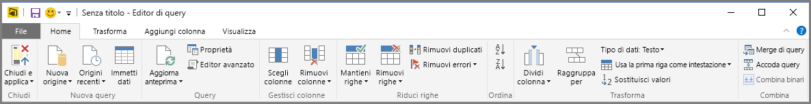

# Panoramica delle query in Power BI Desktop
Con Power BI Desktop è possibile connettersi a un mondo di dati, creare report efficaci e fondamentali e condividere il proprio impegno con altri utenti, che potranno quindi basarsi sul lavoro già svolto ed espandere le proprie attività di business intelligence.

Power BI Desktop offre tre visualizzazioni:

* **Report** : consente di usare le query create dall'utente per generare visualizzazioni interessanti, organizzate nella sequenza preferita e con più pagine, che è possibile condividere con altri
* **Dati** : consente di visualizzare i dati nel report in formato di modello di dati, a cui è possibile aggiungere misure, creare nuove colonne e gestire le relazioni
* **Relazioni** : consente di ottenere una rappresentazione grafica delle relazioni che sono state stabilite nel modello di dati e di gestirle o modificarle in base alle esigenze.

Per accedere a queste visualizzazioni, selezionare una delle tre icone lungo il lato sinistro di Power BI Desktop. Nella figura seguente è selezionata la visualizzazione **Report**, indicata dalla striscia di colore giallo accanto all'icona.  

Insieme a Power BI Desktop è disponibile anche l'editor di Power Query. Con questo editor è possibile connettersi a una o più origini dati, eseguire il data shaping e trasformare i dati in base alle esigenze, quindi caricare il modello in Power BI Desktop.

Questo documento offre una panoramica delle operazioni sui dati eseguite nell'editor di Power Query, ma sono disponibili molte altre informazioni. Alla fine di questo documento, seguire i collegamenti alle linee guida dettagliate sui tipi di dati supportati. Sono anche disponibili altre informazioni sulla connessione ai dati, sul data shaping, sulla creazione di relazioni e su come iniziare.

Prima di tutto è necessario acquisire familiarità con l'editor di Power Query.

## Editor di Power Query
Per aprire l'editor di Power Query, selezionare **Modifica query** nella scheda **Home** di Power BI Desktop.  

Senza connessioni dati, l'editor di Power Query appare come un riquadro vuoto, pronto per i dati.  

Dopo il caricamento di una query, i dati visualizzati nell'editor di Power Query diventano più interessanti. Se ci si connette all'origine dati Web seguente, l'editor di Power Query carica le informazioni relative ai dati, a cui è possibile iniziare a dare forma:

[*https://www.bankrate.com/retirement/best-and-worst-states-for-retirement/*](https://www.bankrate.com/retirement/best-and-worst-states-for-retirement/)

Ecco come viene visualizzato l'editor di Power Query dopo l'attivazione di una connessione dati:

1. Nella barra multifunzione molti pulsanti sono ora attivi per interagire con i dati nella query.
2. Nel riquadro sinistro le query sono elencate e disponibili per la selezione, la visualizzazione e il data shaping.
3. Nel riquadro centrale i dati della query selezionata vengono visualizzati e sono disponibili per il data shaping.
4. Viene visualizzato il riquadro **Impostazioni query**, che elenca le proprietà della query e i passaggi applicati.  
   
   

Nelle sezioni seguenti si esamineranno queste quattro aree: la barra multifunzione, il riquadro Query, la visualizzazione Dati e il riquadro Impostazioni query.

## Barra multifunzione query
La barra multifunzione dell'editor di Power Query è costituita da quattro schede: **Home**, **Trasforma**, **Aggiungi colonna** e **Visualizza**.

La scheda **Home** contiene le attività comuni relative alle query.

Per connettersi ai dati e iniziare a creare query, selezionare il pulsante **Nuova origine**. Viene visualizzato un menu, che fornisce le origini dati più comuni.  

Per altre informazioni sulle origini dati disponibili, vedere **Origini dati**. Per informazioni sulla connessione ai dati, includi gli esempi e i passaggi, vedere **Connettersi ai dati**.

La scheda **Trasforma** consente di accedere alle attività di trasformazione dei dati comuni, ad esempio:

* Aggiunta o rimozione di colonne
* Modifica dei tipi di dati 
* Suddivisione di colonne 
* Altre attività guidate dai dati

Per altre informazioni sulla trasformazione dei dati, inclusi gli esempi, vedere [Esercitazione: Data shaping e combinazione di dati in Power BI Desktop](https://docs.microsoft.com/power-bi/desktop-shape-and-combine-data).

La scheda **Aggiungi colonna** fornisce ulteriori attività associate all'aggiunta di una colonna, la formattazione di dati della colonna e l'aggiunta di colonne personalizzate. L'immagine seguente mostra la scheda **Aggiungi colonna** .  

La scheda **Visualizza** sulla barra multifunzione viene usata per attivare/disattivare la visualizzazione di determinati riquadri o finestre. È anche usata per visualizzare l'Editor avanzato. La figura seguente mostra la scheda **Visualizza**.  

È utile sapere che molte delle attività disponibili nella barra multifunzione sono disponibili anche facendo clic con il pulsante destro del mouse su una colonna, o su altri dati, nel riquadro centrale.

## Riquadro sinistro (Query)
Nel riquadro sinistro, o **Query**, viene visualizzato il numero di query attive, oltre al nome della query. Quando si seleziona una query nel riquadro di sinistra, i relativi dati vengono visualizzati nel riquadro centrale, dove è possibile eseguirne lo shaping e la trasformazione in base alle proprie esigenze. La figura seguente mostra il riquadro sinistro con una query.  

## Riquadro centrale (Dati)
Nel riquadro centrale, o riquadro **Dati**, vengono visualizzati i dati della query selezionata. È in questo riquadro che viene eseguita gran parte delle attività della visualizzazione **Query**.

La figura seguente illustra la connessione dati Web stabilita in precedenza. La colonna **Product** è stata selezionata ed è stato fatto clic con il pulsante destro del mouse sull'intestazione per visualizzare le voci di menu disponibili. Si noti che molte di queste voci del menu di scelta rapida corrispondono ai pulsanti disponibili nelle schede della barra multifunzione.  

Quando si seleziona una voce di un menu di scelta rapida (o un pulsante della barra multifunzione), la query applica il passaggio ai dati e lo salva come parte della query stessa. I passaggi vengono registrati nel riquadro **Impostazioni query** in ordine sequenziale, come descritto nella sezione successiva.  

## Riquadro destro (Impostazioni query)
Nel riquadro destro, o **Impostazioni query**, vengono visualizzati tutti i passaggi associati a una query. Ad esempio, nell'immagine seguente, nella sezione **Passaggi applicati** del riquadro **Impostazioni query** riflette il fatto che è stato appena modificato il tipo della colonna **Overall score** .

Man mano che vengono applicati alla query, i passaggi di shaping vengono acquisiti nella sezione **Passaggi applicati**.

È importante sapere che i dati sottostanti *non* vengono modificati. L'editor di Power Query modifica ed esegue lo shaping della sola visualizzazione dei dati e di qualsiasi interazione con i dati sottostanti che avviene in base alla visualizzazione dei dati modificata e sottoposta a shaping dall'editor.

Nel riquadro **Impostazioni query** , è possibile rinominare, eliminare o riordinare i passaggi secondo necessità. A tale scopo, fare clic con il pulsante destro del mouse sul passaggio nella sezione **Passaggi applicati** e scegliere dal menu di scelta rapida. Tutte le query vengono eseguite nell'ordine in cui vengono visualizzate nel riquadro **Passaggi applicati**.

## Editor avanzato
L'**Editor avanzato** consente di visualizzare il codice che l'editor di Power Query sta creando con ogni passaggio e anche di creare codice di shaping personalizzato. Per avviare l'editor avanzato, selezionare **Visualizza** dalla barra multifunzione, quindi selezionare **Editor avanzato**. Verrà visualizzata una finestra che mostra il codice della query esistente.  

È possibile modificare direttamente il codice nella finestra **Editor avanzato** . Per chiudere la finestra, selezionare il pulsante **Fatto** o **Annulla** .  

## Salvare il lavoro
Quando la query è definita nel modo desiderato, selezionare **Chiudi e applica** dal menu **File** dell'editor di Power Query. Questa azione ha l'effetto di applicare le modifiche e chiudere l'editor.  

Durante l'avanzamento, una finestra di dialogo di Power BI Desktop ne mostra lo stato.  

Quando la query è completata, Power BI Desktop può salvare il lavoro in un file con estensione *pbix*.

Per salvare il lavoro, selezionare **File** \> **Salva** (o **File** \> **Salva con nome**), come illustrato nella figura seguente.  

## Passaggi successivi
Power BI Desktop offre infinite possibilità. Per altre informazioni sulle capacità disponibili, vedere le risorse seguenti:

* [Che cos'è Power BI Desktop?](../fundamentals/desktop-what-is-desktop.md)
* [Origini di dati in Power BI Desktop](../connect-data/desktop-data-sources.md)
* [Connettersi ai dati in Power BI Desktop](../connect-data/desktop-connect-to-data.md)
* [Esercitazione: Data shaping e combinazione di dati in Power BI Desktop](../connect-data/desktop-shape-and-combine-data.md)
* [Eseguire attività di query comuni in Power BI Desktop](desktop-common-query-tasks.md)   
