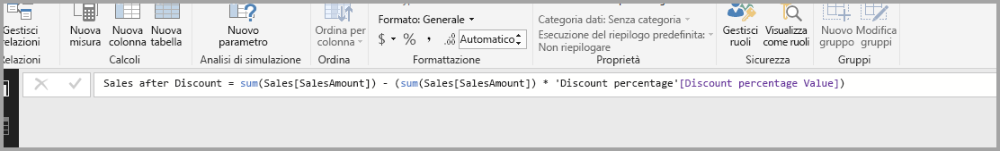

# Creare e usare parametri di simulazione per visualizzare le variabili in Power BI Desktop

A partire dalla versione di *Power BI Desktop* di agosto 2018, è possibile creare variabili di *simulazione* per i report, interagire con la variabile come filtro dei dati e quindi visualizzare e quantificare diversi valori chiave nei report.

È possibile creare un parametro di *simulazione* nella scheda **Creazione di modelli** di Power BI Desktop. Quando si seleziona il parametro, viene visualizzata una finestra di dialogo in cui è possibile configurarlo.

## Creazione di un parametro di simulazione

Per creare un parametro di simulazione, selezionare il pulsante **Nuovo parametro** nella scheda **Creazione di modelli** di Power BI Desktop. Nella figura seguente è stato creato un parametro denominato *Percentuale di sconto* con il tipo di dati impostato su **Numero decimale**. Il valore **Minimo** è 0. Il valore **Massimo** è 0,50 (50%). L'**Incremento** è stato impostato su 0,05, ovvero il 5%. Si tratta dei valori in base a cui verrà regolato il parametro quando si interagisce con esso in un report.

> [!NOTE]
> Per i numeri decimali, assicurarsi di far precedere il valore da uno zero iniziale, come in 0,50, senza lasciare solo ,50. altrimenti il numero non verrà convalidato e il pulsante **OK** non sarà selezionabile.
> 
> 

Per praticità, la casella di controllo **Aggiungi filtro dei dati alla pagina** aggiunge automaticamente un filtro dei dati con il parametro di simulazione nella pagina del report corrente.

Oltre a creare il parametro stesso, quando si crea un parametro di simulazione viene creata anche una misura che è possibile usare per visualizzare il valore corrente del parametro.

È importante notare che, una volta creato un parametro di simulazione, sia il parametro sia la misura diventano parte del modello. Saranno quindi disponibili in tutto il report e potranno essere usati anche in altre pagine del report. Inoltre, dal momento che fanno parte del modello, è possibile eliminare il filtro dei dati dalla pagina del report. Se lo si vuole ripristinare in seguito, sarà sufficiente riprendere il parametro di simulazione dall'elenco **Campi** e trascinarlo nell'area di disegno, quindi modificare l'oggetto visivo in filtro dei dati.

## Uso di un parametro di simulazione

Si creerà ora un semplice esempio d'uso di un parametro di simulazione. Il parametro è stato creato nella sezione precedente. Per osservare come funziona si creerà una nuova misura il cui valore viene regolato con il dispositivo di scorrimento.

La nuova misura rappresenta l'importo totale delle vendite a cui è applicata la percentuale di sconto. È possibile creare misure complesse e interessanti per consentire agli utenti dei report di visualizzare la variabile del parametro di simulazione. Ad esempio, si può creare un report che permette al personale delle vendite di visualizzare i propri compensi in caso di raggiungimento di determinati obiettivi o percentuali di vendite o per visualizzare l'incidenza dell'aumento delle vendite su sconti più elevati.

Immettere la formula della misura nella barra della formula e assegnare il nome *Sales after Discount* alla formula.

Viene quindi creato un oggetto visivo colonna con **OrderDate** sull'asse e **SalesAmount** e la misura **Sales after Discount** appena creata come valori.

A questo punto, man mano che si sposta il dispositivo di scorrimento, è possibile visualizzare che la colonna **Sales after Discount** riflette l'importo delle vendite scontato.

Non sono richieste altre operazioni. È possibile usare i parametri di simulazione in tutti i tipi di situazioni. Questi parametri consentono agli utenti dei report di interagire con i diversi scenari creati nei report.
