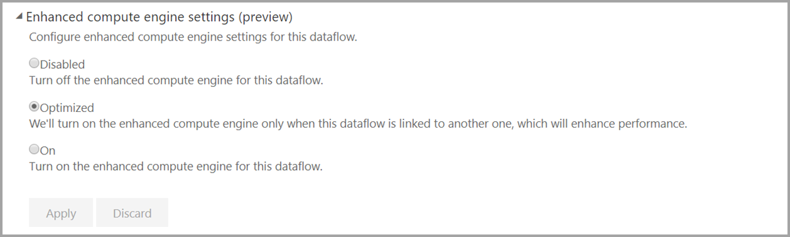

# Usare DirectQuery con i flussi di dati in Power BI (anteprima)

È possibile usare DirectQuery per connettersi direttamente ai flussi di dati e quindi connettersi direttamente al proprio flusso di dati senza dover importare i dati. 

L'uso di DirectQuery con i flussi di dati consente i miglioramenti seguenti ai processi di Power BI e dei flussi di dati:

* **Evitare pianificazioni di aggiornamenti separate**: DirectQuery si connette direttamente a un flusso di dati, eliminando la necessità di creare un set di dati. Di conseguenza, usando DirectQuery con i flussi di dati, non sono più necessarie pianificazioni di aggiornamenti separate per il flusso di dati e il set di dati per garantire la sincronizzazione dei dati.

* **Filtro dei dati**: DirectQuery è utile per lavorare su una visualizzazione filtrata dei dati all'interno di un flusso di dati. Per filtrare i dati e quindi utilizzare un subset più piccolo dei dati nel flusso di dati, è possibile usare DirectQuery (e il motore di calcolo) per filtrare i dati del flusso di dati e utilizzare il subset filtrato necessario.

## Uso di DirectQuery per i flussi di dati

L'uso di DirectQuery con i flussi di dati è una funzionalità di anteprima disponibile a partire dalla versione di maggio 2020 di Power BI Desktop. 

Esistono anche alcuni prerequisiti per l'uso di DirectQuery con i flussi di dati:

* Il flusso di dati deve trovarsi all'interno di un'area di lavoro abilitata per Power BI Premium
* Il **motore di calcolo** deve essere attivato. Per altre informazioni sul motore di calcolo, vedere [Motore di calcolo avanzato](service-dataflows-enhanced-compute-engine.md).

## Abilitare DirectQuery per i flussi di dati

Per assicurarsi che il flusso di dati sia disponibile per l'accesso con DirectQuery, il motore di calcolo avanzato deve essere ottimizzato. Per abilitare DirectQuery per i flussi di dati, impostare la nuova opzione **Impostazioni del motore di calcolo avanzato** su **Ottimizzato**. L'immagine seguente mostra l'impostazione selezionata correttamente.

Dopo aver applicato questa impostazione, aggiornare il flusso di dati per rendere effettiva l'ottimizzazione. 

## Considerazioni e limitazioni

A DirectQuery e ai flussi di dati si applicano alcune limitazioni note descritte di seguito.

* DirectQuery per i flusso di dati non opera con la funzionalità di **anteprima dei metadati avanzata** abilitata. Questa esclusione dovrebbe essere rimossa in una delle prossime versioni mensili di Power BI Desktop.
* Durante il periodo di anteprima di questa funzionalità, alcuni clienti potrebbero riscontrare timeout o problemi di prestazioni mentre usano DirectQuery con i flussi di dati. Durante il periodo di anteprima si lavorerà attivamente alla risoluzione di tali problemi.

## Passaggi successivi

Gli articoli seguenti forniscono altre informazioni e illustrano scenari d'uso dei flussi di dati:

* [Preparazione dei dati self-service con flussi di dati](service-dataflows-overview.md)
* [Uso delle entità calcolate in Power BI Premium](service-dataflows-computed-entities-premium.md)
* [Uso di flussi di dati con origini dati locali](service-dataflows-on-premises-gateways.md)
* [Risorse per sviluppatori per i flussi di dati Power BI](service-dataflows-developer-resources.md)
* [Integrazione di flussi di dati e Azure Data Lake (anteprima)](service-dataflows-azure-data-lake-integration.md)

Per altre informazioni sul modello CDM (Common Data Model), è possibile leggere l'articolo di panoramica:
* [Panoramica del modello CDM (Common Data Model)](https://docs.microsoft.com/powerapps/common-data-model/overview)
* [Altre informazioni sullo schema CDM (Common Data Model) e sulle entità in GitHub](https://github.com/Microsoft/CDM)

Articoli di Power BI Desktop correlati:

* [Connettersi ai set di dati nel servizio Power BI da Power BI Desktop](../connect-data/desktop-report-lifecycle-datasets.md)
* [Panoramica delle query in Power BI Desktop](desktop-query-overview.md)

Articoli del servizio Power BI correlati:
* [Configurazione dell'aggiornamento pianificato](../connect-data/refresh-scheduled-refresh.md)
