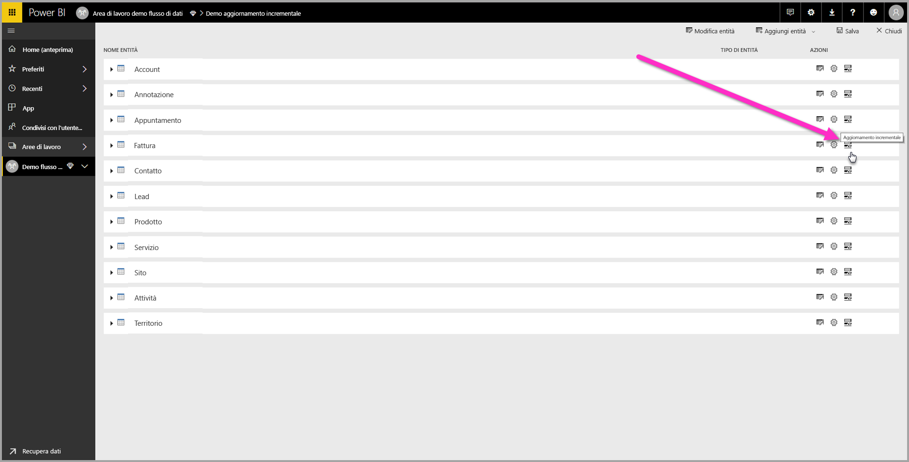
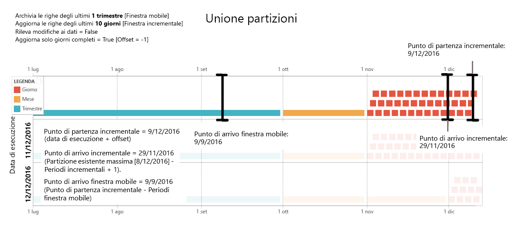
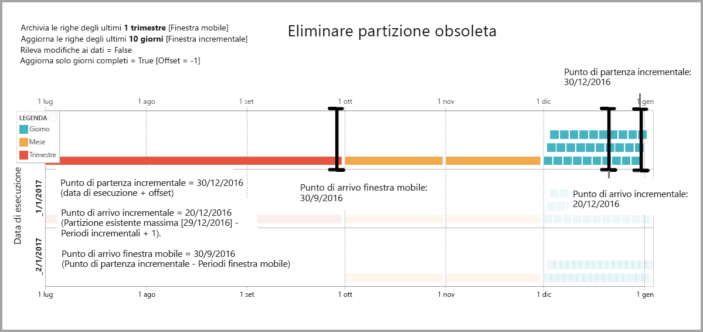
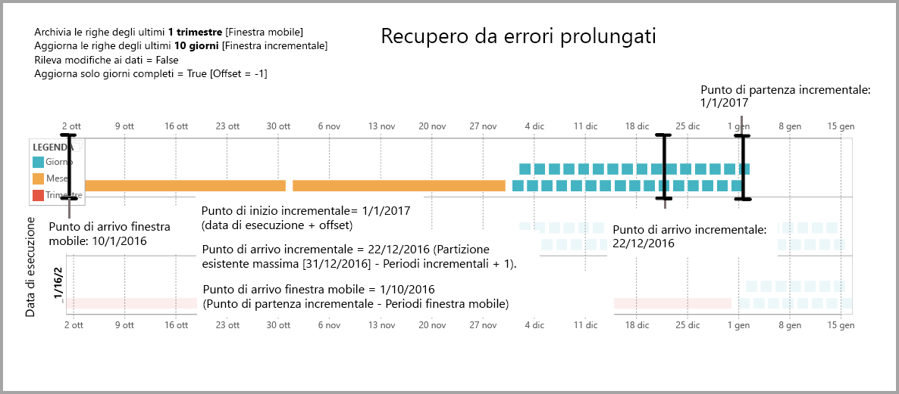

# Uso dell'aggiornamento incrementale con i flussi di dati Power BI

Con i flussi di dati, è possibile trasferire quantità elevate di dati in Power BI per creare report e analisi accattivanti. In alcuni casi, tuttavia, non è pratico aggiornare una copia completa dei dati di origine durante ogni aggiornamento. Una valida alternativa è l'**aggiornamento incrementale**, che offre i vantaggi seguenti per i flussi di dati:

* **L'aggiornamento avviene più velocemente**: devono essere aggiornati solo i dati che sono stati modificati. Ad esempio, è sufficiente aggiornare gli ultimi cinque giorni di un flusso di dati di 10 anni.
* **L'aggiornamento è più affidabile**: ad esempio, non è necessario mantenere connessioni con esecuzione prolungata a sistemi di origine volatili.
* **Il consumo di risorse risulta ridotto**: l'aggiornamento di una quantità di dati inferiore riduce l'uso complessivo di memoria e altre risorse.

L'uso dell'aggiornamento incrementale per i flussi di dati Power BI richiede che l'area di lavoro in cui risiede il flusso di dati si trovi nella [capacità Premium](../admin/service-premium-what-is.md) per l'esecuzione e l'origine dati inserita nel flusso di dati deve avere un campo *datetime* in cui l'aggiornamento incrementale può applicare il filtro. 

## Configurazione dell'aggiornamento incrementale per i flussi di dati

Un flusso di dati può contenere molte entità. L'aggiornamento incrementale è configurato a livello di entità, in modo da consentire a un flusso di dati di contenere sia le entità completamente aggiornate che quelle aggiornate in modo incrementale.

Per configurare un'entità aggiornata in modo incrementale, iniziare configurando normalmente l'entità. Per altre informazioni sulla configurazione di un flusso di dati, vedere [Preparazione dei dati self-service in Power BI](service-dataflows-overview.md).

Dopo aver creato e salvato il flusso di dati, selezionare l'icona dell'**aggiornamento incrementale** nella visualizzazione entità, come illustrato nell'immagine seguente:

Quando si fa clic sull'icona, viene visualizzata la finestra **Impostazioni di aggiornamento incrementale**. Quando si attiva l'aggiornamento incrementale impostandolo sulla posizione **Attiva**, è possibile configurare l'aggiornamento incrementale.

L'elenco seguente descrive le impostazioni della finestra **Impostazioni di aggiornamento incrementale**. 

1. **Attivazione/disattivazione dell'aggiornamento incrementale**: questo dispositivo di scorrimento attiva o disattiva i criteri di aggiornamento incrementale per l'entità.
2. **Elenco a discesa del campo da filtrare**: consente di selezionare il campo della query in cui l'entità deve essere filtrata per gli incrementi. Questo campo contiene solo campi *datetime*. Non è possibile usare l'aggiornamento incrementale se l'entità non contiene un campo *datetime*.
3. **Archivia le righe degli ultimi**: l'esempio seguente è utile per spiegare le impostazioni successive.

    Per questo esempio, viene definito un criterio di aggiornamento per l'archiviazione di cinque anni di dati in totale e l'aggiornamento incrementale di 10 giorni di dati. Se l'entità viene aggiornata quotidianamente, la procedura seguente viene eseguita per ogni operazione di aggiornamento:

    * Aggiungere un nuovo giorno di dati.
    * Aggiornare 10 giorni fino alla data corrente.
    * Rimuovere gli anni di calendario con più di cinque anni dalla data corrente. Se ad esempio la data corrente è 1 gennaio 2019, l'anno 2013 viene rimosso.

    Il primo aggiornamento del flusso di dati potrebbe richiedere qualche minuto per importare tutti i cinque anni, ma gli aggiornamenti successivi probabilmente verranno completati in una piccola frazione del tempo di aggiornamento iniziale.

4. **Rileva modifiche ai dati**: l'aggiornamento incrementale di 10 giorni è molto più efficiente rispetto a un aggiornamento completo di 5 anni, ma si potrebbe fare ancora meglio. Quando si seleziona la casella di controllo **Rileva modifiche ai dati**, è possibile selezionare una colonna di data/ora per identificare e aggiornare solo i giorni in cui i dati vengono modificati. Questa opzione presuppone l'esistenza di una colonna di questo tipo (usata in genere per operazioni di controllo) nel sistema di origine. Il valore massimo di questa colonna viene valutato per ciascuno dei periodi dell'intervallo incrementale. Se tali dati non sono cambiati dall'ultimo aggiornamento, non è necessario aggiornare il periodo. Nell'esempio questa opzione può ridurre ulteriormente i giorni sottoposti ad aggiornamento incrementale, ad esempio da 10 a due.

> [!TIP]
> La struttura corrente richiede che la colonna per il rilevamento delle modifiche ai dati sia persistente e memorizzata nella cache. Può essere utile considerare una delle tecniche seguenti per ridurre la cardinalità e il consumo di memoria:
>
>    * Mantenere solo il valore massimo della colonna al momento dell'aggiornamento, ad esempio con una funzione di Power Query.
>    * Ridurre la precisione a un livello accettabile in base ai requisiti di frequenza di aggiornamento.

5. **Aggiorna solo periodi completi**: si supponga che l'aggiornamento sia stato pianificato per l'esecuzione ogni mattina alle 4.00. Se durante queste prime quattro ore della giornata appaiono dati nel sistema di origine, è possibile che non si vogliano includere tali dati nel set complessivo. Alcune metriche di business, ad esempio i barili al giorno nel settore estrattivo, non sono pratiche o abbastanza sensibili da essere prese in considerazione se sono relative a giorni parziali.

    Un altro esempio in cui solo l'aggiornamento di periodi completi è appropriato è l'aggiornamento dei dati di un sistema finanziario. Si supponga di avere un sistema finanziario in cui i dati per il mese precedente vengono approvati il dodicesimo giorno del mese. È possibile impostare l'intervallo incrementale su 1 mese e pianificare l'esecuzione dell'aggiornamento il dodicesimo giorno del mese. Con questa opzione selezionata, i dati di gennaio (il periodo mensile più recente completo) verranno aggiornati il 12 febbraio.

> [!NOTE]
> L'aggiornamento incrementale del flusso di dati determina le date in base alla logica seguente: se viene pianificato un aggiornamento, l'aggiornamento incrementale per i flussi di dati usa il fuso orario definito nei criteri di aggiornamento. Se non esiste una pianificazione per l'aggiornamento, l'aggiornamento incrementale usa l'ora del computer che esegue l'aggiornamento.

## Query di aggiornamento incrementale

Dopo che l'aggiornamento incrementale è stato configurato, il flusso di dati modifica automaticamente la query in modo da includere il filtro per data. È possibile modificare la query generata automaticamente usando l'**Editor di Power Query avanzato** per ottimizzare o personalizzare l'aggiornamento. Leggere le informazioni contenute nella sezione successiva per saperne di più sull'aggiornamento incrementale e il suo funzionamento.

## Aggiornamento incrementale e confronto tra entità collegate ed entità calcolate

Per le entità *collegate*, l'aggiornamento incrementale aggiorna l'entità di origine. Poiché le entità collegate sono semplicemente un puntatore all'entità originale, l'aggiornamento incrementale non ha alcun impatto sull'entità collegata. Quando l'entità di origine viene aggiornata in base ai relativi criteri di aggiornamento definiti, qualsiasi entità collegata presuppone che i dati nell'origine vengano aggiornati.

Le entità *calcolate* sono basate su query in esecuzione in un archivio dati, che può essere un altro flusso di dati. In quanto tali, le entità calcolate si comportano esattamente come le entità collegate.

Poiché le entità calcolate e quelle collegate si comportano in modo analogo, i requisiti e la procedura di configurazione sono gli stessi per entrambe. Una differenza è costituita dal fatto che, per le entità calcolate, in alcune configurazioni l'aggiornamento incrementale non può essere eseguito in maniera ottimizzata a causa del modo in cui vengono compilate le partizioni. 

## Passaggio dall'aggiornamento incrementale a quello completo

I flussi di dati supportano la modifica dei criteri di aggiornamento tra l'aggiornamento incrementale e quello completo. Quando si verifica un cambiamento in entrambe le direzioni (dall'aggiornamento completo a quello incrementale oppure dall'aggiornamento incrementale a quello completo), la modifica interessa il flusso di dati dopo l'aggiornamento successivo.

Quando si sposta un flusso di dati dall'aggiornamento completo a quello incrementale, la nuova logica di aggiornamento aggiorna il flusso di dati rispettando la finestra di aggiornamento e l'incremento, come definito nelle impostazioni di aggiornamento incrementale.

Quando si sposta un flusso di dati dall'aggiornamento incrementale a quello completo, tutti i dati accumulati nell'aggiornamento incrementale vengono sovrascritti dai criteri definiti nell'aggiornamento completo. È necessario approvare questa operazione.

## Aggiornamento incrementale del flusso di dati e set di dati

L'aggiornamento incrementale del flusso di dati e l'aggiornamento incrementale del set di dati sono progettati per funzionare congiuntamente. È accettabile e supportato avere un'entità che viene aggiornata in modo incrementale in un flusso di dati, completamente caricata in un set di dati, o un'entità completamente caricata in un flusso di dati che viene caricata in modo incrementale in un set di dati. 

Entrambi gli approcci rispettano le definizioni specificate nelle impostazioni di aggiornamento.
Altre informazioni sull'aggiornamento incrementale sono disponibili in [Aggiornamento incrementale in Power BI Premium](../admin/service-premium-incremental-refresh.md).

## Supporto del fuso orario nell'aggiornamento incrementale

L'aggiornamento incrementale del flusso di dati dipende dall'ora in cui viene eseguito e l'applicazione del filtro della query dipende dal giorno di esecuzione.

Per supportare tali dipendenze e per garantire la coerenza dei dati, l'aggiornamento incrementale per i flussi di dati implementa l'euristica seguente per gli scenari di tipo *aggiorna ora*:

* Nel caso in cui un aggiornamento pianificato sia definito nel sistema, l'aggiornamento incrementale usa le impostazioni del fuso orario della pianificazione dell'aggiornamento. Ciò garantisce che in qualsiasi fuso orario ci si trovi per l'aggiornamento del flusso di dati, sarà sempre coerente con la definizione del sistema.

* Se non è definita alcuna pianificazione dell'aggiornamento, i flussi di dati usano il fuso orario del computer dell'utente che esegue l'aggiornamento.

L'aggiornamento incrementale può essere richiamato anche tramite le API. In questo caso, la chiamata API potrebbe contenere un'impostazione del fuso orario che viene usata nell'aggiornamento. L'uso delle API può essere utile a scopo di test e convalida.

## Dettagli di implementazione dell'aggiornamento incrementale

I flussi di dati usano il partizionamento per l'aggiornamento incrementale. Una volta disponibili gli endpoint di XMLA per Power BI Premium, le partizioni diventano visibili. L'aggiornamento incrementale nei flussi di dati consente di mantenere il numero minimo di partizioni per soddisfare i requisiti dei criteri di aggiornamento. Le partizioni obsolete non comprese nell'intervallo vengono eliminate, mantenendo una finestra temporale. Le partizioni vengono unite in base alle esigenze, riducendo il numero totale di partizioni necessarie. Ciò migliora la compressione e, in alcuni casi, può migliorare le prestazioni delle query.

Gli esempi in questa sezione condividono i criteri di aggiornamento seguenti:

* Archivia le righe degli ultimi: 1 trimestre
* Aggiorna le righe degli ultimi: 10 giorni
* Rileva modifiche ai dati = False
* Aggiorna solo giorni completi = True

### Unire le partizioni

In questo esempio le partizioni giornaliere vengono unite automaticamente al livello mensile dopo che non rientrano più nell'intervallo incrementale. Le partizioni nell'intervallo incrementale devono essere mantenute con granularità giornaliera per consentire l'aggiornamento solo dei giorni specificati.
L'operazione di aggiornamento con *data di esecuzione 11/12/2016* unisce i giorni nel mese di novembre, poiché si trovano di fuori dell'intervallo incrementale.

### Eliminare le partizioni obsolete

Le partizioni obsolete che non rientrano nell'intervallo totale vengono rimosse. L'operazione di aggiornamento con *data di esecuzione 2/1/2017* elimina la partizione per il terzo trimestre del 2016 perché non rientra nell'intervallo totale.

### Recupero da errori prolungati

Questo esempio consente di simulare in che modo il sistema viene ripristinato correttamente da errori prolungati. Si supponga che l'aggiornamento non venga eseguito correttamente perché le credenziali dell'origine dati sono scadute e che il problema richieda 13 giorni per essere risolto. L'intervallo incrementale è solo di 10 giorni.

La successiva operazione di aggiornamento con esito positivo, con *data di esecuzione 15/1/2017*, necessita di riempire i 13 giorni mancanti e li aggiorna. Richiede inoltre di aggiornare i 9 giorni precedenti perché non sono stati aggiornati in base alla normale pianificazione. In altre parole, l'intervallo incrementale è salito da 10 a 22 giorni.

L'operazione di aggiornamento successiva, con *data di esecuzione 16/1/2017*, coglie l'opportunità per unire i giorni nel mese di dicembre e i mesi nel quarto trimestre del 2016.

## Passaggi successivi

Questo articolo ha illustrato l'aggiornamento incrementale per i flussi di dati. Ecco alcuni altri articoli che potrebbero essere utili.

* [Preparazione dei dati self-service con flussi di dati](service-dataflows-overview.md)
* [Creare e usare flussi di dati in Power BI](service-dataflows-create-use.md)
* [Uso di flussi di dati con origini dati locali](service-dataflows-on-premises-gateways.md)
* [Risorse per sviluppatori per i flussi di dati Power BI](service-dataflows-developer-resources.md)

Per altre informazioni su Power Query e sull'aggiornamento pianificato, è possibile leggere questi articoli:
* [Panoramica delle query in Power BI Desktop](desktop-query-overview.md)
* [Configurazione dell'aggiornamento pianificato](../connect-data/refresh-scheduled-refresh.md)

Per altre informazioni sul modello CDM (Common Data Model), è possibile leggere l'articolo di panoramica:
* [Panoramica del modello CDM (Common Data Model)](https://docs.microsoft.com/powerapps/common-data-model/overview)
