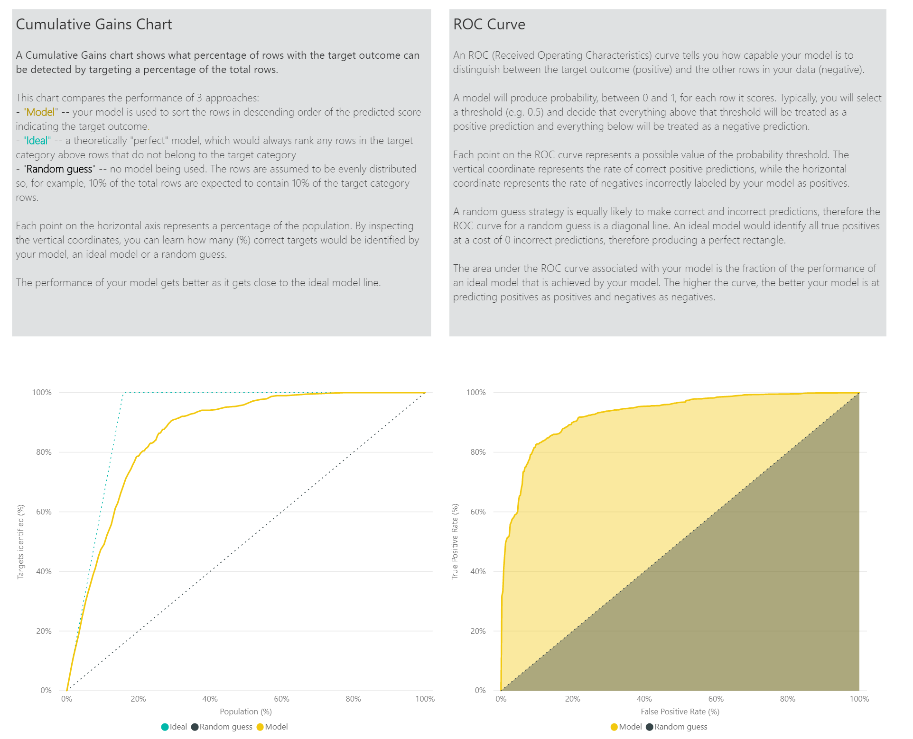

# Machine Learning automatizzato in Power BI

Machine Learning automatizzato (AutoML) per i flussi di dati consente agli analisti aziendali di eseguire il training, convalidare e richiamare i modelli di Machine Learning (ML) direttamente in Power BI. Include un'esperienza semplice per la creazione di un nuovo modello di ML in cui gli analisti possono usare i propri flussi di dati per specificare i dati di input per il training del modello. Il servizio estrae automaticamente le caratteristiche più rilevanti, seleziona un algoritmo appropriato e ottimizza e convalida il modello di ML. Dopo aver eseguito il training di un modello, Power BI genera automaticamente un report prestazioni che include i risultati della convalida. Il modello può quindi essere richiamato per tutti i dati nuovi o aggiornati all'interno del flusso di dati.

Machine Learning automatizzato (AutoML) è disponibile per i flussi di data ospitati solo in Power BI Premium e nelle capacità incorporate.

## Uso di AutoML

I [flussi di dati Power BI](service-dataflows-overview.md) offrono la preparazione dei dati self-service per i Big Data. AutoML è integrato nei flussi di dati e consente di sfruttare le attività di preparazione dei dati per la creazione di modelli di Machine Learning, direttamente all'interno di Power BI.

AutoML in Power BI consente agli analisti di dati di usare i flussi di dati per creare modelli di Machine Learning con un'esperienza semplificata, usando solo competenze di Power BI. La maggior parte delle attività di data science su cui si basa la creazione dei modelli di Machine Learning è automatizzata da Power BI. Sono disponibili controlli che assicurano la buona qualità del modello prodotto e la visibilità sul processo usato per creare il modello di ML.

AutoML supporta la creazione di modelli di **previsione per dati binari**, **classificazione** e **regressione** per i flussi di dati. Sono tipi di tecniche di Machine Learning con supervisione, ovvero l'apprendimento si basa sui risultati noti delle osservazioni precedenti al fine di stimare i risultati di altre osservazioni. Il set di dati di input usato per il training di un modello AutoML è un set di record **etichettati** con i risultati noti.

AutoML in Power BI integra la funzionalità [Machine Learning automatizzato](https://docs.microsoft.com/azure/machine-learning/service/concept-automated-ml) da [Azure Machine Learning](https://docs.microsoft.com/azure/machine-learning/service/overview-what-is-azure-ml) per creare i modelli di Machine Learning. Tuttavia, non è necessaria una sottoscrizione di Azure per usare AutoML in Power BI. Il processo di training e hosting dei modelli di Machine Learning è gestito interamente dal servizio Power BI.

Dopo aver eseguito il training di un modello di Machine Learning, AutoML genera automaticamente un report di Power BI in cui vengono spiegate le prestazioni probabili del modello di Machine Learning. AutoML rende più comprensibile la spiegazione evidenziando i fattori di influenza chiave tra gli input che influenzano le stime restituite dal modello. Il report include anche le metriche chiave per il modello.

Altre pagine del report generato contengono un riepilogo statistico del modello e i dettagli del training. Il riepilogo statistico è di particolare interesse per gli utenti che vogliono visualizzare le misure di data science standard delle prestazioni del modello. I dettagli del training riepilogano tutte le iterazioni eseguite per creare il modello, con i parametri di modellazione associati. Viene inoltre descritto il modo in cui è stato usato ogni input per creare il modello di Machine Learning.

È quindi possibile applicare il modello di Machine Learning ai dati per l'assegnazione dei punteggi. Quando si aggiorna il flusso di dati, i dati vengono aggiornati con le stime del modello di ML. Power BI include anche una spiegazione specifica per ogni stima prodotta dal modello di Machine Learning.

## Creazione di un modello di Machine Learning

Questa sezione descrive la procedura di creazione di un modello AutoML.

### Preparazione dei dati per la creazione di un modello di Machine Learning

Per creare un modello di Machine Learning in Power BI, è necessario prima creare un flusso di dati per i dati contenenti le informazioni relative ai risultati cronologici, da usare per il training del modello di Machine Learning. È inoltre necessario aggiungere colonne calcolate per eventuali metriche aziendali che possono essere predittori forti per il risultato che si sta tentando di prevedere. Per informazioni dettagliate sulla configurazione del flusso di dati, vedere [Preparazione dei dati self-service in Power BI](service-dataflows-overview.md).

AutoML presenta requisiti specifici in termini di dati per eseguire il training di un modello di Machine Learning. Questi requisiti sono descritti nelle sezioni riportate di seguito, in base ai rispettivi tipi di modello.

### Configurazione degli input del modello di Machine Learning

Per creare un modello AutoML, selezionare l'icona ML nella colonna **Azioni** dell'entità del flusso di dati e selezionare **Aggiungi un modello di Machine Learning**.

Viene avviata un'esperienza semplificata, costituita da una procedura guidata che illustra all'utente i passaggi del processo di creazione del modello di Machine Learning. La procedura guidata include i semplici passaggi riportati di seguito.

**1. Selezionare l'entità con i dati cronologici e il campo del risultato per cui si vuole una stima**

Il campo del risultato identifica l'attributo dell'etichetta per il training del modello di Machine Learning, come illustra la figura seguente.

**2. Scegliere un tipo di modello**

Quando si specifica il campo del risultato, AutoML analizza i dati dell'etichetta per consigliare il tipo di modello di ML più adatto per il training. È possibile scegliere un tipo di modello diverso, come mostrato di seguito, facendo clic su "Selezionare un altro modello".

> [!NOTE]
> Alcuni tipi di modelli possono non essere supportati per i dati selezionati e risultano quindi disabilitati. Nell'esempio precedente la regressione è disabilitata, dal momento che è selezionata una colonna di testo come campo del risultato.

**3. Selezionare gli input che il modello dovrà usare come segnali predittivi**

AutoML analizza un campione dell'entità selezionata per suggerire gli input che possono essere usati per il training del modello di Machine Learning. Accanto ai campi che non vengono selezionati verranno fornite delle spiegazioni. Se un campo specifico contiene troppi valori distinti o un solo valore, oppure una correlazione bassa o alta con il campo di output, non verrà consigliato.

Eventuali input che dipendono dal campo del risultato (o dal campo dell'etichetta) non devono essere usati per il training del modello di Machine Learning, perché influiscono negativamente sulle prestazioni. Questi campi vengono contrassegnati come aventi una "correlazione alta sospetta con il campo di output". L'introduzione di questi campi nei dati di training causa la perdita di etichette, per cui il modello offre prestazioni ottimali rispetto ai dati di convalida o di test, ma non riesce a uguagliare tali prestazioni quando viene usato nell'ambiente di produzione per l'assegnazione dei punteggi. La perdita di etichette può costituire un possibile problema nei modelli AutoML, quando le prestazioni del modello di training sono troppo positive per essere vere.

La raccomandazione di questa caratteristica è basata su un campione di dati, pertanto è necessario esaminare gli input usati. È possibile modificare le selezioni in modo da includere solo i campi da esaminare nel modello. È anche possibile selezionare tutti i campi selezionando la casella di controllo accanto al nome dell'entità.

**4. Assegnare un nome al modello e salvare la configurazione**

Nel passaggio finale è possibile assegnare un nome al modello e selezionare Salva ed esegui training per iniziare a eseguire il training del modello di ML. È possibile scegliere di ridurre il tempo di training per visualizzare risultati rapidi o aumentare la quantità di tempo impiegato per il training per ottenere il modello migliore.

### Training del modello di Machine Learning

Il training dei modelli AutoML fa parte dell'aggiornamento del flusso di dati. AutoML prima prepara i dati per il training.
Suddivide i dati cronologici specificati in set di dati di training e test. Il set di dati di test è un set di dati di controllo usato per convalidare le prestazioni del modello dopo il training. Nel flusso di dati si ottengono come entità di **training e test**. AutoML usa la convalida incrociata per convalidare il modello.

Ogni campo di input viene quindi analizzato e viene applicata l'imputazione, che sostituisce eventuali valori mancanti con valori sostituiti. AutoML usa due strategie di imputazione diverse. Per gli attributi di input trattati come caratteristiche numeriche, per l'imputazione viene usata la media dei valori della colonna. Per gli attributi di input trattati come caratteristiche categoriche, per l'imputazione AutoML usa la modalità dei valori della colonna. La media e la modalità dei valori usati per l'imputazione vengono calcolate dal framework AutoML nel set di dati di training sottocampionato.

Vengono quindi applicati ai dati i campionamenti e le normalizzazioni in base alle esigenze. Per i modelli di classificazione, AutoML esegue i dati di input tramite il campionamento stratificato e bilancia le classi per garantire che i conteggi delle righe siano uguali per tutti.

AutoML applica diverse trasformazioni a ogni campo di input selezionato in base al relativo tipo di dati e alle relative proprietà statistiche. AutoML usa queste trasformazioni per estrarre le funzionalità da usare per il training del modello di Machine Learning.

Il processo di training per i modelli AutoML è costituito da un massimo di 50 iterazioni con algoritmi di modellazione e impostazioni di iperparametri diversi per trovare il modello con le migliori prestazioni. Il training può terminare in anticipo con meno iterazioni se AutoML rileva che non è stato osservato alcun miglioramento delle prestazioni. Le prestazioni di ognuno di questi modelli vengono valutate usando la convalida eseguita con il set di dati di test dei dati di controllo. Durante questo passaggio del training, AutoML crea diverse pipeline per il training e la convalida di queste iterazioni. Il processo di valutazione delle prestazioni dei modelli può richiedere tempo, da diversi minuti a un paio d'ore fino alla durata del training configurata nella procedura guidata, a seconda delle dimensioni del set di dati e delle risorse di capacità dedicate disponibili.

In alcuni casi il modello finale generato può usare l'apprendimento di tipo ensemble, in cui vengono usati più modelli per ottimizzare le prestazioni predittive.

### Spiegazione del modello AutoML

Dopo aver eseguito il training del modello, AutoML analizza la relazione tra le funzionalità di input e l'output del modello. Valuta la magnitudine delle modifiche apportate all'output del modello per il set di dati di test dei dati di controllo per ogni caratteristica di input. Questa operazione è nota come _priorità della funzionalità_. Viene eseguita come parte dell'aggiornamento una volta completato il training. Di conseguenza, l'aggiornamento potrebbe richiedere più tempo rispetto alla durata del training configurata nella procedura guidata.

### Report sul modello AutoML

AutoML genera un report di Power BI che contiene un riepilogo delle prestazioni del modello durante la convalida e indica la priorità della funzionalità globale. È possibile accedere a questo report dalla scheda Modello di Machine Learning al termine dell'aggiornamento del flusso di dati. Il report riepiloga i risultati dell'applicazione del modello di Machine Learning ai dati del test dei dati di controllo e del confronto tra le previsioni e i valori dei risultati noti.

È possibile esaminare il report sul modello per comprenderne le prestazioni. È anche possibile verificare che i fattori di influenza chiave del modello siano allineati con le informazioni aziendali dettagliate sui risultati noti.

I grafici e le misure usati per descrivere le prestazioni del modello nel rapporto dipendono dal tipo di modello. I grafici e le misure delle prestazioni sono descritti nelle sezioni seguenti.

Altre pagine del report possono descrivere misure statistiche sul modello da una prospettiva di data science. Ad esempio, il report sulla **previsione per dati binari** include un grafico del guadagno e la curva ROC per il modello.

I report includono inoltre una pagina dei **dettagli del training** che contiene una descrizione del modo in cui è stato eseguito il training del modello e un grafico che descrive le prestazioni del modello per ogni esecuzione di iterazione.

In un'altra sezione di questa pagina viene descritto il tipo rilevato del campo di input e il metodo di imputazione usato per compilare i valori mancanti. Sono inclusi inoltre i parametri usati dal modello finale.

Se il modello prodotto usa l'apprendimento di tipo ensemble, la pagina dei **dettagli del training** include anche un grafico che mostra il peso di ogni modello costituente dell'ensemble, nonché i relativi parametri.

## Applicazione del modello AutoML

Se si è soddisfatti delle prestazioni del modello di Machine Learning creato, è possibile applicarlo ai dati nuovi o aggiornati quando si aggiorna il flusso di dati. È possibile eseguire questa operazione dal report sul modello, selezionando il pulsante **Applica** nell'angolo in alto a destra o il pulsante Applica modello di ML nell'elenco delle azioni della scheda Modelli di Machine Learning.

Per applicare il modello di Machine Learning, è necessario specificare il nome dell'entità a cui deve essere applicato e un prefisso per le colonne che verranno aggiunte a questa entità per l'output del modello. Il prefisso predefinito per i nomi delle colonne è il nome del modello. La funzione _Applica_ può includere parametri aggiuntivi specifici del tipo di modello.

L'applicazione del modello di ML crea due nuove entità del flusso di dati contenenti le stime e le spiegazioni specifiche per ogni riga di cui viene calcolato il punteggio nell'entità di output. Ad esempio, se si applica il modello _PurchaseIntent_ all'entità _OnlineShoppers_, l'output genera le entità **OnlineShoppers enriched PurchaseIntent** e **OnlineShoppers enriched PurchaseIntent explanations**. Per ogni riga nell'entità arricchita, le **spiegazioni** vengono suddivise in più righe nell'entità delle spiegazioni arricchite in base alla caratteristica di input. Un **ExplanationIndex** consente di eseguire il mapping delle righe dall'entità delle spiegazioni arricchite alla riga nell'entità arricchita.

Dopo che è stato applicato il modello, AutoML fa in modo che le stime siano sempre aggiornate ogni volta che viene aggiornato il flusso di dati.

Per usare le informazioni dettagliate e le previsioni del modello di Machine Learning in un report di Power BI, è possibile connettersi all'entità di output da Power BI Desktop usando il connettore di **flussi di dati**.

## Modelli di previsione per dati binari

I modelli di previsione per dati binari, più formalmente noti come **modelli di classificazione binaria**, vengono usati per classificare un set di dati in due gruppi. Consentono di stimare gli eventi che possono avere un risultato binario, ad esempio se un'opportunità di vendita verrà convertita, se un account passa a un'altra azienda, se una fattura verrà pagata in tempo, se una transazione è fraudolenta e così via.

L'output di un modello di previsione per dati binari è un punteggio di probabilità, che identifica la probabilità che venga ottenuto il risultato di destinazione.

### Training di un modello di previsione per dati binari

Prerequisiti:

- Sono necessarie almeno 20 righe di dati cronologici per ogni classe di risultati

Il processo di creazione per un modello di previsione per dati binari segue gli stessi passaggi degli altri modelli AutoML, descritti in precedenza nella sezione **Configurazione degli input del modello di Machine Learning**. L'unica differenza è nel passaggio "Scegliere un modello", in cui è possibile selezionare il valore del risultato di destinazione a cui si è maggiormente interessati. È anche possibile specificare etichette descrittive per i risultati da usare nel report generato automaticamente che riepiloga i risultati della convalida del modello.

### Report del modello di previsione per dati binari

Il modello di previsione per dati binari produce come output una probabilità che un record ottenga il risultato di destinazione. Il report include un filtro dei dati per la soglia di probabilità, che influisce sul modo in cui vengono interpretati i punteggi sopra e sotto la soglia di probabilità.

Il report descrive le prestazioni del modello in termini di _veri positivi, falsi positivi, veri negativi e falsi negativi_. I veri positivi e i veri negativi sono risultati previsti correttamente per le due classi nei dati del risultato. I falsi positivi sono record per cui è stato stimato un risultato di destinazione ma che non l'hanno effettivamente ottenuto. Viceversa, i falsi negativi sono record che hanno ottenuto il risultato di destinazione pur non essendo stato stimato che l'ottenessero.

Le misure, ad esempio la precisione e il richiamo, descrivono l'effetto della soglia di probabilità sui risultati previsti. È possibile usare il filtro dei dati della soglia di probabilità per selezionare una soglia che raggiunga una compromesso equilibrato tra precisione e richiamo.

Il report include anche uno strumento di analisi costi-vantaggi che consente di identificare il subset della popolazione che dovrebbe produrre il massimo profitto. Dato un costo unitario stimato di destinazione e un vantaggio unitario derivante dal raggiungimento di un risultato di destinazione, l'analisi costi-vantaggi tenta di ottimizzare i profitti. È possibile usare questo strumento per scegliere la soglia di probabilità in base al punto massimo nel grafico per ottimizzare i profitti. È anche possibile usare il grafico per calcolare il profitto o il costo per la soglia di probabilità scelta.

La pagina **Report di accuratezza** del report sul modello include il grafico dei _guadagni cumulativi_ e la curva ROC per il modello. Si tratta di misure statistiche delle prestazioni del modello. Nei report sono incluse le descrizioni dei grafici illustrati.

### Applicazione di un modello di previsione per dati binari

Per applicare un modello di previsione per dati binari, è necessario specificare l'entità con i dati a cui verranno applicate le previsioni dal modello di Machine Learning. Altri parametri includono il prefisso del nome della colonna di output e la soglia di probabilità per la classificazione del risultato previsto.

Quando viene applicato un modello di previsione per dati binari, vengono aggiunte quattro colonne di output all'entità di output arricchita: **Outcome**, **PredictionScore**, **PredictionExplanation** e **ExplanationIndex**. I nomi delle colonne nell'entità hanno il prefisso specificato quando viene applicato il modello.

**PredictionScore** è una probabilità percentuale, che identifica la probabilità che venga ottenuto il risultato di destinazione.

La colonna **Outcome** contiene l'etichetta del risultato stimato. Se le probabilità dei record superano la soglia, probabilmente il risultato di destinazione verrà raggiunto e i record saranno etichettati come True. Se le probabilità sono sotto la soglia, si stima che il risultato probabilmente non verrà raggiunto e i record saranno etichettati come False.

La colonna **PredictionExplanation** contiene una spiegazione con l'influenza specifica delle funzionalità di input su **PredictionScore**.

## Modelli di classificazione

I modelli di classificazione vengono usati per classificare un set di dati in più gruppi o classi. Si usano per stimare gli eventi che possono avere uno di più risultati possibili, ad esempio se un cliente probabilmente ha un valore di durata molto elevato, elevato, medio o basso, se il rischio predefinito è alto, moderato, basso o molto basso e così via.

L'output di un modello di classificazione è un punteggio di probabilità, che identifica la probabilità che un record raggiunga i criteri per una determinata classe.

### Training di un modello di classificazione

L'entità di input contenente i dati di training per un modello di classificazione deve avere un campo stringa o numero intero come campo del risultato che identifica i risultati noti precedenti.

Prerequisiti:

- Sono necessarie almeno 20 righe di dati cronologici per ogni classe di risultati

Il processo di creazione per un modello di classificazione segue gli stessi passaggi degli altri modelli AutoML, descritti in precedenza nella sezione **Configurazione degli input del modello di Machine Learning**.

### Report sul modello di classificazione

Il report sul modello di classificazione viene generato applicando il modello di Machine Learning ai dati di test dei dati di controllo e confrontando la classe prevista per un record con la classe nota effettiva.

Il report sul modello include un grafico che illustra la suddivisione dei record classificati in modo corretto e non corretto per ogni classe nota.

Un ulteriore drilldown specifico della classe consente di analizzare il modo in cui vengono distribuite le previsioni per una classe nota. Mostra le altre classi in cui i record della classe nota probabilmente sono classificati erroneamente.

La spiegazione del modello nel report include anche i predittori principali per ogni classe.

Il report sul modello di classificazione include anche una pagina di dettagli del training simile alle pagine usate per altri tipi di modello, come descritto in precedenza nella sezione **Report sul modello AutoML** di questo articolo.

### Applicazione di un modello di classificazione

Per applicare un modello di classificazione di Machine Learning, è necessario specificare l'entità con i dati di input e il prefisso del nome della colonna di output.

Quando viene applicato un modello di classificazione, vengono aggiunte cinque colonne di output all'entità di output arricchita: **ClassificationScore**, **ClassificationResult**, **ClassificationExplanation**, **ClassProbabilities** e **ExplanationIndex**. I nomi delle colonne nell'entità hanno il prefisso specificato quando viene applicato il modello.

La colonna **ClassProbabilities** contiene l'elenco dei punteggi di probabilità per il record per ogni classe possibile.

**ClassificationScore** è la probabilità percentuale, che identifica la probabilità che un record raggiunga i criteri per una determinata classe.

La colonna **ClassificationResult** contiene la classe stimata con maggiore probabilità per il record.

La colonna **ClassificationExplanation** contiene una spiegazione con l'influenza specifica delle caratteristica di input su **ClassificationScore**.

## Modelli di regressione

I modelli di regressione vengono usati per stimare un valore numerico, ad esempio i ricavi che probabilmente verranno realizzati da un contratto di vendita, il valore di durata di un account, l'importo di una fattura che probabilmente verrà pagata, la data in cui è possibile che una fattura venga pagata e così via.

L'output di un modello di regressione è il valore previsto.

### Training di un modello di regressione

L'entità di input contenente i dati di training per un modello di regressione deve avere un campo numerico come campo del risultato che identifica i valori dei risultati noti.

Prerequisiti:

- Sono necessarie almeno 100 righe di dati cronologici per un modello di regressione

Il processo di creazione per un modello di regressione segue gli stessi passaggi degli altri modelli AutoML, descritti in precedenza nella sezione **Configurazione degli input del modello di Machine Learning**.

### Report sul modello di regressione

Analogamente agli altri report sui modelli AutoML, il report di regressione si basa sui risultati dell'applicazione del modello ai dati di test dei dati di controllo.

Il report sul modello include un grafico che confronta i valori stimati con quelli effettivi. In questo grafico la distanza dalla diagonale indica l'errore nella previsione.

Il grafico degli errori residui indica la distribuzione della percentuale di errore media per valori diversi nel set di dati di test dei dati di controllo. L'asse orizzontale rappresenta la media del valore effettivo per il gruppo, con la dimensione della bolla che indica la frequenza o il numero di valori in quell'intervallo. L'asse verticale è l'errore residuo medio.

Il report sul modello di regressione include anche una pagina di dettagli del training come i report su altri tipi di modello, come descritto in precedenza nella sezione **Report sul modello AutoML**.

### Applicazione di un modello di regressione

Per applicare un modello di regressione di Machine Learning, è necessario specificare l'entità con i dati di input e il prefisso del nome della colonna di output.

Quando viene applicato un modello di regressione, vengono aggiunte tre colonne di output all'entità di output arricchita: **RegressionResult**, **RegressionExplanation** e **ExplanationIndex**. I nomi delle colonne nell'entità hanno il prefisso specificato quando viene applicato il modello.

La colonna **RegressionResult** contiene il valore stimato per il record in base ai campi di input. La colonna **RegressionExplanation** contiene una spiegazione con l'influenza specifica delle caratteristiche di input su **RegressionResult**.

## Passaggi successivi

Questo articolo ha offerto una panoramica su Machine Learning automatizzato per i flussi di dati nel servizio Power BI. Anche gli articoli seguenti possono risultare utili.

- [Esercitazione: creare un modello di Machine Learning in Power BI](../connect-data/service-tutorial-build-machine-learning-model.md)
- [Esercitazione: Uso di Servizi cognitivi in Power BI](../connect-data/service-tutorial-use-cognitive-services.md)
- [Esercitazione: Richiamare un modello di Machine Learning Studio (versione classica) in Power BI (anteprima)](../connect-data/service-tutorial-invoke-machine-learning-model.md)
- [Servizi cognitivi in Power BI](service-cognitive-services.md)
- [Integrazione di Azure Machine Learning in Power BI](service-machine-learning-integration.md)

Per altre informazioni sui flussi di dati, è possibile leggere questi articoli:

- [Creare e usare flussi di dati in Power BI](service-dataflows-create-use.md)
- [Uso delle entità calcolate in Power BI Premium](service-dataflows-computed-entities-premium.md)
- [Uso di flussi di dati con origini dati locali](service-dataflows-on-premises-gateways.md)
- [Risorse per sviluppatori per i flussi di dati Power BI](service-dataflows-developer-resources.md)
- [Integrazione di flussi di dati e Azure Data Lake (anteprima)](service-dataflows-azure-data-lake-integration.md)
