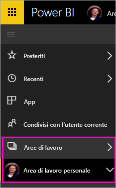
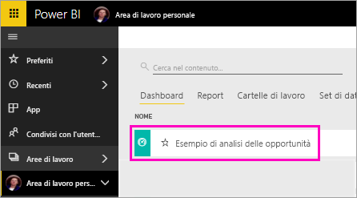
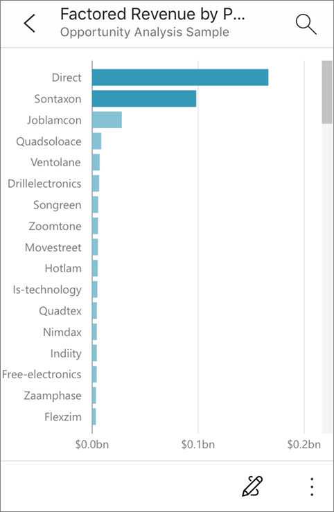

# Esercitazione: Porre domande sui dati con l'analista virtuale Domande e risposte nelle app iOS - Power BI

Il modo più semplice per conoscere i dati consiste nel porre domande a tal proposito con parole proprie. In questa esercitazione è possibile porre domande e visualizzare informazioni dettagliate in primo piano sui dati di esempio con l'analista virtuale Domande e risposte nell'app Power BI per dispositivi mobili su iPad, iPhone e iPod Touch. 

Si applica a:

|  |  |
|:--- |:--- |
| iPhone |iPad |

L'analista virtuale Domande e risposte è un'esperienza di conversazione di Business Intelligence che accede ai dati di Domande e risposte sottostanti nel servizio Power BI [(https://powerbi.com)](https://powerbi.com). Suggerisce informazioni dettagliate sui dati e consente di digitare o pronunciare le proprie domande.

Questa esercitazione illustra come:

> [!div class="checklist"]
> * Installare l'app Power BI per dispositivi mobili per iOS
> * Scaricare un dashboard e un report di esempio di Power BI
> * Visualizzare le informazioni dettagliate in primo piano suggerite dall'app per dispositivi mobili

Se non si è ancora iscritti a Power BI, [iscriversi per ottenere una versione di prova gratuita](https://app.powerbi.com/signupredirect?pbi_source=web) prima di iniziare.

## Prerequisiti

### Installare l'app Power BI per iOS
[Scaricare l'app iOS](http://go.microsoft.com/fwlink/?LinkId=522062 "Scaricare l'app iPhone") dall'App Store di Apple nell'iPad, iPhone o iPod Touch.

Queste versioni supportano l'app Power BI per iOS:
- iPad con iOS 10 o versioni successive.
- iPhone 5 e versioni successive con iOS 10 o versioni successive. 
- iPod Touch con iOS 10 o versioni successive.

### Scaricare l'esempio di analisi delle opportunità
Il primo passaggio dell'esercitazione consiste nel download dell'esempio di analisi delle opportunità nel servizio Power BI.

1. Aprire il servizio Power BI nel browser (app.powerbi.com) ed eseguire l'accesso.

1. Selezionare l'icona di spostamento globale per aprire il riquadro di spostamento a sinistra.

    

2. Nel riquadro di spostamento a sinistra selezionare **Aree di lavoro** > **Area di lavoro personale**.

    

3. Nell'angolo in basso a sinistra selezionare **Recupera dati**.
   
    

3. Nella pagina Recupera dati selezionare l'icona **Esempi**.
   
   

4. Selezionare **Esempio di analisi delle opportunità**.
 
    
 
8. Selezionare **Connetti**.  
  
   
   
5. Power BI importa l'esempio, aggiungendo un nuovo dashboard, report e set di dati all'area di lavoro personale.
   
   

A questo punto si è pronti per visualizzare l'esempio nel dispositivo iOS.

## Provare le informazioni dettagliate in primo piano
1. Nell'iPhone o nell'iPad aprire l'app Power BI e accedere con le credenziali dell'account Power BI, le stesse usate nel servizio Power BI nel browser.

1.  Toccare il pulsante di spostamento globale  > **Aree di lavoro** > **Area di lavoro personale** e aprire il dashboard dell'esempio di analisi delle opportunità.

2. Toccare l'icona dell'analista virtuale Domande e risposte  dal menu azione nella parte inferiore della pagina (nella parte superiore della pagina in un iPad).

     

     Lo strumento di analisi virtuale Domande e risposte di Power BI offre alcuni suggerimenti iniziali.

     
3. Toccare **featured insights** (informazioni dettagliate in primo piano).

     Lo strumento di analisi virtuale Domande e risposte suggerisce alcune informazioni dettagliate.
4. Scorrere verso destra e toccare **Insight 2** (Informazioni dettagliate 2).

    

     Lo strumento di analisi virtuale Domande e risposte mostra la seconda casella di informazioni dettagliate.

    
5. Toccare il grafico per aprirlo in stato attivo.

    
6. Toccare la freccia nell'angolo in alto a sinistra per tornare all'esperienza dell'analista virtuale Domande e risposte.

## Pulire le risorse

Al termine dell'esercitazione è possibile eliminare il dashboard, il report e il set di dati dell'esempio di analisi delle opportunità.

1. Aprire il servizio Power BI (app.powerbi.com) ed eseguire l'accesso.

2. Nel riquadro di spostamento a sinistra selezionare **Aree di lavoro** > **Area di lavoro personale**.

3. Nella scheda **Dashboard** selezionare l'icona **Elimina** a forma di bidone della spazzatura accanto al dashboard dell'esempio di analisi delle opportunità.

    

4. Selezionare la scheda **Report** e fare lo stesso per il report di analisi delle opportunità.

5. Selezionare la scheda **Set di dati** e fare lo stesso per il set di dati di analisi delle opportunità.

## Passaggi successivi

Si è provato a usare l'analista virtuale Domande e risposte nelle app Power BI per dispositivi mobili iOS. Altre informazioni su Domande e risposte nel servizio Power BI.
> [!div class="nextstepaction"]
> [Domande e risposte nel servizio Power BI](power-bi-q-and-a.md)

