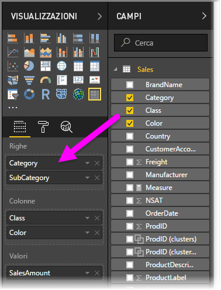
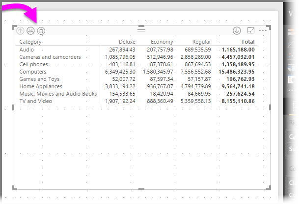
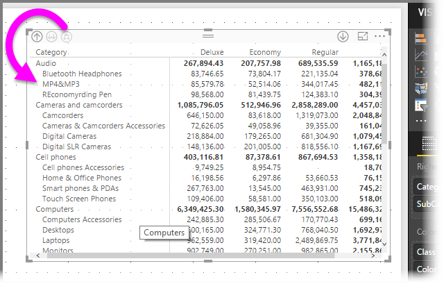
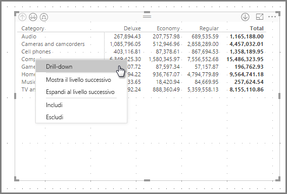
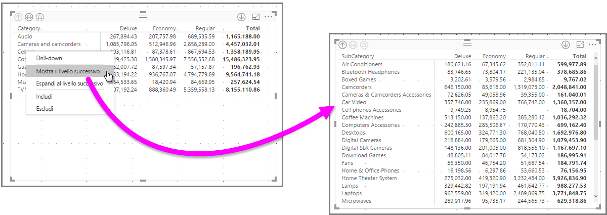
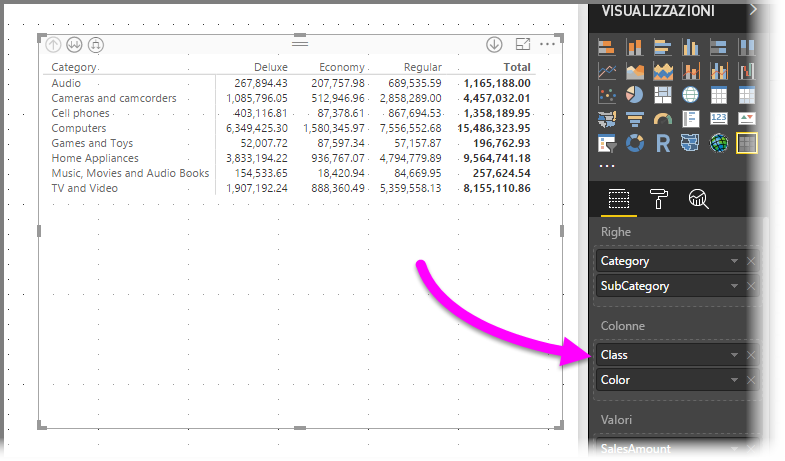
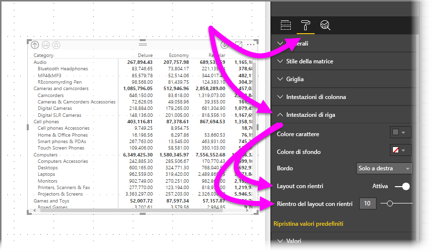
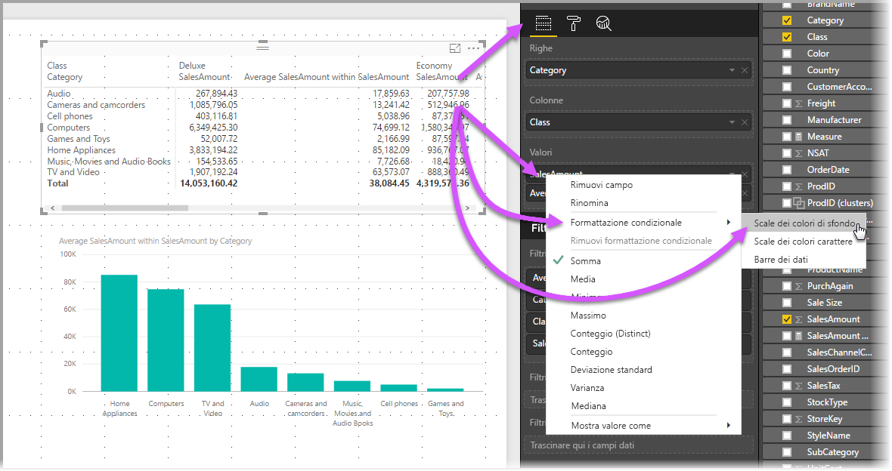
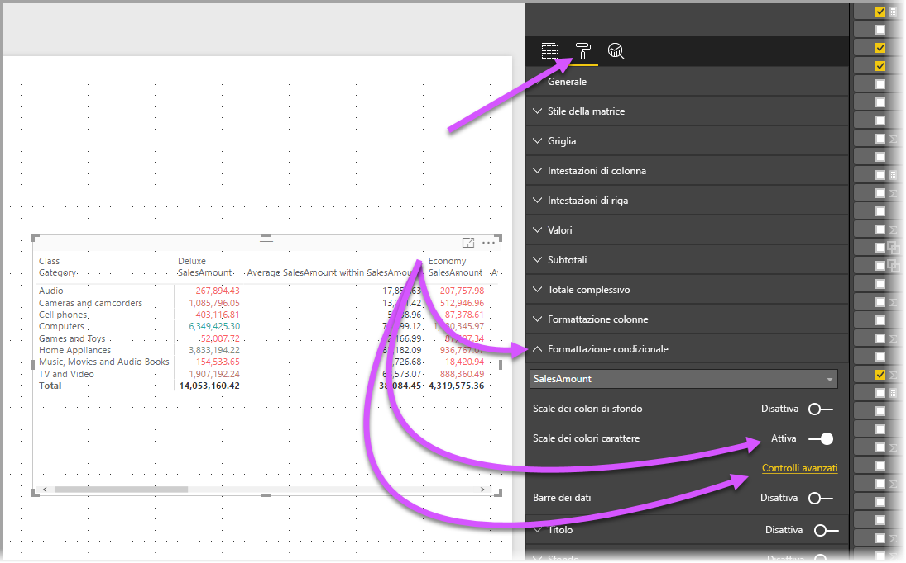
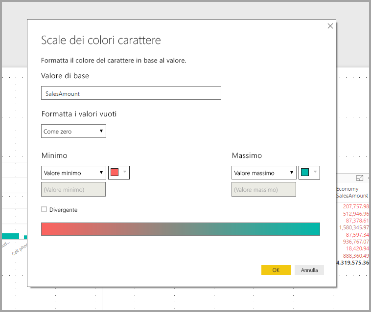

# Usare l'oggetto visivo Matrice in Power BI
Con la funzionalità visiva **Matrice** è possibile creare oggetti visivi matrice (detti anche *tabelle*) nei report di **Power BI Desktop** e del **servizio Power BI** e usare l'evidenziazione incrociata degli elementi all'interno della matrice con altri oggetti visivi. È anche possibile selezionare singole celle, colonne e righe e usare l'evidenziazione incrociata. Le selezioni di singole celle o di più celle possono essere copiate e incollate in altre applicazioni. Infine, per usare al meglio lo spazio del layout, l'oggetto visivo matrice supporta un layout con rientri.

Alla matrice sono associate molte funzionalità, che verranno illustrate nelle sezioni seguenti di questo articolo.

## Temi dei report
Gli oggetti visivi matrice e tabella riflettono entrambi lo stile (inclusi i colori) del **tema del report** applicato. Potrebbero non essere i colori previsti per l'oggetto visivo matrice, ma è possibile modificarli nella configurazione del **tema del report**. Per altre informazioni, vedere [**Usare i temi dei report in Power BI Desktop**](../desktop-report-themes.md).

## Informazioni sulla modalità di calcolo dei totali in Power BI

Prima di passare a informazioni su come usare l'oggetto visivo **Matrice**, è importante comprendere come Power BI calcola i valori totali e subtotali in tabelle e matrici. Per le righe di subtotale e totale, la misura viene valutata su tutte le righe nei dati sottostanti. *Non* si tratta semplicemente dell'addizione dei valori nelle righe visibili o visualizzate. Questo significa che la riga del totale può in effetti contenere valori diversi dal previsto. 

Per meglio comprendere il concetto, iniziare esaminando gli oggetti visivi **Matrice** seguenti. 

In questo esempio, ogni riga nell'oggetto visivo **Matrice** all'estrema destra mostra il valore *Amount* (Quantità) per ogni combinazione di venditore e data. Tuttavia, poiché un venditore viene visualizzato per più date, i numeri possono comparire più volte. Per questo motivo, un totale accurato calcolato dai dati sottostanti e la semplice addizione dei valori visibili non si equivalgono. Si tratta di una condizione comune quando i valori da sommare si trovano sul lato "uno" di una relazione uno-a-molti.

Quando si esaminano i totali e subtotali, tenere presente che tali valori sono basati sui dati sottostanti e non unicamente sui valori visibili. 

<!-- use Nov blog post video

## Expanding and collapsing row headers
There are two ways you can expand row headers. The first is through the right-click menu. You’ll see options to expand the specific row header you clicked on, the entire level or everything down to the very last level of the hierarchy. You have similar options for collapsing row headers as well.

You can also add +/- buttons to the row headers through the formatting pane under the row headers card. By default, the icons will match the formatting of the row header, but you can customize the icons’ color and size separately if you want. 
Once the icons are turned on, they work similarly to the icons from PivotTables in Excel.

The expansion state of the matrix will save with your report. It can be pinned to dashboards as well, but consumers will need to open up the report to change the state. Conditional formatting will only apply to the inner most visible level of the hierarchy. Note that this expand/collapse experience is not currently supported when connecting to AS servers older than 2016 or MD servers.

Watch the following video to learn more about expand/collapse in the matrix:

-->
## Uso del drill-down con l'oggetto visivo Matrice
L'oggetto visivo **Matrice** consente di eseguire moltissime interessanti attività di drill-down che in precedenza non erano disponibili. Tra queste, la possibilità di eseguire il drill-down usando righe e colonne e persino con sezioni e celle singole. Ecco una spiegazione del funzionamento di ognuna di queste attività.

### Drill-down in intestazioni di riga
Nel riquadro **Visualizzazioni**, quando si aggiungono più campi alla sezione **Righe** dell'area **Campi** si abilita il drill-down per le righe dell'oggetto visivo matrice. La procedura è simile alla creazione di una gerarchia, che consente poi di eseguire il drill-down (e in seguito il backup) tramite la gerarchia stessa e di analizzare i dati a ogni livello.

Nell'immagine seguente la sezione **Righe** contiene *Category* e *SubCategory*, creando un raggruppamento (o gerarchia) nelle righe in cui è possibile eseguire il drill-through.

Quando per l'oggetto visivo sono stati creati raggruppamenti nella sezione **Righe**, vengono visualizzate le icone per il *drill-down* e l'*espansione* nell'angolo in alto a sinistra dell'oggetto visivo.

Analogamente al comportamento di drill-down ed espansione in altri oggetti visivi, questi pulsanti consentono di eseguire il drill-down (o il backup) nella gerarchia. In questo caso, si può eseguire il drill-down da *Category* a *SubCategory*, come illustrato nell'immagine seguente, in cui è stata selezionata l'icona relativa al drill-down di un livello (diapason).

Oltre a usare queste icone, è possibile fare clic con il pulsante destro del mouse su una delle intestazioni di riga ed eseguire il drill-down selezionando un'opzione nel menu visualizzato.

Si noti che nel menu visualizzato sono presenti alcune opzioni, che generano risultati diversi:

Se si sceglie **Drill-down** viene espansa la matrice per *quel* livello di riga, *escludendo* tutte le altre intestazioni di riga eccetto quella su cui si è fatto clic con il pulsante destro del mouse. Nell'immagine seguente si è fatto clic con il pulsante destro del mouse su *Computers* ed è stata selezionata l'opzione **Drill-down**. Si noti che le altre righe di livello principale non compaiono più nella matrice. Questa modalità di drilling è molto utile e risulterà particolarmente interessante nella sezione dedicata all'**evidenziazione incrociata**.

Per tornare alla precedente visualizzazione di livello principale, è possibile fare clic sull'icona **Drill-up**. Se si sceglie **Mostra il livello successivo** dal menu di scelta rapida si ottiene un elenco in ordine alfabetico di tutti gli elementi di livello successivo (in questo caso, il campo *SubCategory*), senza la categorizzazione della gerarchia di livello superiore.

Quando si fa clic sull'icona **Drill-up** nell'angolo superiore sinistro per visualizzare tutte le categorie di livello principale e quindi si fa di nuovo clic con il pulsante destro del mouse e si sceglie **Espandi al livello successivo**, viene visualizzato l'oggetto visivo seguente.

Si possono anche usare le voci di menu **Includi** ed **Escludi** per mantenere (o rimuovere) la riga su cui si è fatto clic con il pulsante destro del mouse (e le eventuali sottocategorie) nella matrice specificata.

### Drill-down in intestazioni di colonna
Così come si può eseguire il drill-down nelle righe, si può anche eseguire il drill-down nelle **colonne**. Nell'immagine seguente sono presenti due campi nell'area dei campi **Colonne**, creando una gerarchia simile a quella usata per le righe in precedenza in questo articolo. L'area dei campi **Colonne** include *Class* e *Color*.

Nell'oggetto visivo **Matrice**, quando si fa clic con il pulsante destro del mouse su una colonna, viene visualizzata l'opzione per il drill-down. Nell'immagine seguente si fa clic con il pulsante destro del mouse su *Deluxe* e si seleziona **Drill-down**.

Quando si seleziona **Drill-down**, viene visualizzato il livello successivo della gerarchia di colonne per *Deluxe*, che in questo caso è *Color*.

Le altre voci del menu di scelta rapida per le colonne funzionano esattamente come per le righe. Vedere la sezione precedente **Drill-down in intestazioni di riga**. Anche per le colonne, come per le righe, è possibile scegliere **Mostra il livello successivo**, **Espandi al livello successivo**, **Includi** o **Escludi**.

> [!NOTE]
> Le icone per il drill-down e il drill-up nell'angolo superiore sinistro dell'oggetto visivo matrice si applicano solo alle righe. Per eseguire il drill-down nelle colonne, è necessario usare il menu di scelta rapida.
> 
> 

## Layout con rientri con gli oggetti visivi matrice
L'oggetto visivo **Matrice** applica automaticamente un rientro alle sottocategorie in una gerarchia al di sotto di ogni elemento padre. Questa funzionalità è detta **Layout con rientri**.

Nella versione *originale* dell'oggetto visivo matrice, le sottocategorie sono visualizzate in una colonna totalmente diversa, occupando più spazio nell'oggetto visivo. L'immagine seguente illustra la tabella nell'oggetto visivo **Matrice** originale, con le sottocategorie visualizzate in una colonna separata.

Nell'immagine seguente è presente un oggetto visivo **Matrice** con la funzionalità **Layout con rientri** attiva. La categoria *Computers* include alcune sottocategorie (Computers Accessories, Desktops, Laptops, Monitors e così via) leggermente rientrate, per cui l'oggetto visivo risulta più chiaro e conciso.

È possibile regolare facilmente le impostazioni di Layout con rientri. Con l'oggetto visivo **Matrice** selezionato, nella sezione **Formato** (icona del rullo) del riquadro **Visualizzazioni** espandere la sezione **Intestazioni di riga**. Sono disponibili due opzioni: l'interruttore **Layout con rientri** (per attivarlo o disattivarlo) e **Rientro del layout con rientri** (per specificare il rientro, in pixel).

Se si disattiva **Layout con rientri**, le sottocategorie vengono visualizzate in un'altra colonna anziché rientrate sotto la categoria padre.

## Subtotali con oggetti visivi matrice
Negli oggetti visivi matrice è possibile attivare o disattivare i subtotali, sia per le righe che per le colonne. L'immagine seguente mostra che i subtotali delle righe sono impostati su **Sì**.

Nella sezione **Formato** del riquadro **Visualizzazioni** espandere la scheda **Subtotali** e impostare il dispositivo di scorrimento **Subtotali righe** su **No**. In questo caso, i subtotali non vengono visualizzati.

Lo stesso processo vale per i subtotali delle colonne.

## Evidenziazione incrociata con gli oggetti visivi matrice
Con l'oggetto visivo **Matrice** è possibile selezionare qualsiasi elemento nella matrice come base per l'evidenziazione incrociata. Quando si seleziona una colonna in un oggetto visivo **Matrice**, la colonna viene evidenziata, come anche gli altri oggetti visivi nella pagina del report. Questo tipo di evidenziazione incrociata accomuna da sempre altri oggetti visivi e le selezioni di un punto dati, quindi ora è estesa anche all'oggetto visivo **Matrice**.

Anche per l'evidenziazione incrociata è possibile usare CTRL+clic per selezionare. Nell'immagine seguente, ad esempio, è stato selezionato un insieme di sottocategorie dall'oggetto visivo **Matrice**. Si noti come gli elementi che non sono stati selezionati nell'oggetto visivo sono visualizzati in grigio, mentre gli altri oggetti visivi nella pagina riflettono le selezioni effettuate nell'oggetto visivo **Matrice**.

## Copia di valori da Power BI per l'uso in altre applicazioni

La matrice o la tabella può avere contenuto che si desidera usare in altre applicazioni, ad esempio Dynamics CRM, Excel e anche altri report di Power BI. Con il menu di scelta rapida di Power BI è possibile copiare una singola cella o una selezione di celle negli Appunti e incollare la selezione nell'altra applicazione.

* Per copiare il valore di una singola cella, selezionare la cella, fare clic con il pulsante destro del mouse e scegliere **Copia valore**. Con il valore della cella non formattato negli Appunti, è ora possibile incollarlo in un'altra applicazione.

    

* Per copiare più di una singola cella, selezionare un intervallo di celle o usare CTRL per selezionare una o più celle. La copia includerà le intestazioni di colonna e riga.

    

## Ombreggiatura e colore carattere con gli oggetti visivi matrice
L'oggetto visivo **Matrice** consente di applicare la **formattazione condizionale** (colori e ombreggiatura) allo sfondo delle celle nella matrice, nonché al testo e ai valori stessi.

Per applicare la formattazione condizionale, selezionare un oggetto visivo matrice ed eseguire una delle operazioni seguenti:

* Nel riquadro **Campi** fare clic con il pulsante destro del mouse su Campo e scegliere **Formattazione condizionale** dal menu di scelta rapida.
  
  
* In alternativa, nel riquadro **Formato** espandere la scheda **Formattazione condizionale** e per **Scale dei colori di sfondo** o **Scale dei colori carattere** impostare il dispositivo di scorrimento su **Sì**. Se si attivano queste opzioni, viene visualizzato un collegamento a *Controlli avanzati*, dove è possibile personalizzare i colori e i valori per la formattazione dei colori.
  
  

Entrambi gli approcci garantiscono lo stesso risultato. Se si seleziona *Controlli avanzati* viene visualizzata la finestra di dialogo seguente che consente di apportare modifiche:

## Passaggi successivi

[Grafici a dispersione e grafici a bolle in Power BI](power-bi-visualization-scatter.md)

[Tipi di visualizzazione in Power BI](power-bi-visualization-types-for-reports-and-q-and-a.md)