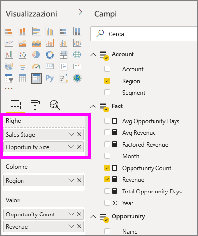

# Usare l'oggetto visivo Matrice in Power BI

[!INCLUDE [power-bi-visuals-desktop-banner](../includes/power-bi-visuals-desktop-banner.md)]

L'oggetto visivo Matrice è simile a una tabella.  Una tabella supporta due dimensioni e i dati non sono strutturati. In altre parole, i valori duplicati vengono visualizzati senza essere aggregati. Una matrice offre la possibilità di visualizzare facilmente i dati in modo significativo su più dimensioni poiché supporta un layout con rientri. La matrice aggrega automaticamente i dati e consente il drill-down. 

È possibile creare oggetti visivi Matrice nei report di **Power BI Desktop** e applicare l'evidenziazione incrociata degli elementi inclusi nella matrice con altri oggetti visivi nella pagina del report. È ad esempio possibile selezionare singole celle, colonne e righe e usare l'evidenziazione incrociata. Le singole celle e le selezioni di più celle possono inoltre essere copiate e incollate in altre applicazioni. 

Alla matrice sono associate molte funzionalità, che verranno illustrate nelle sezioni seguenti di questo articolo.

## Informazioni sulla modalità di calcolo dei totali in Power BI

Prima di passare alle informazioni su come usare l'oggetto visivo Matrice, è importante comprendere come Power BI calcola i valori totali e subtotali in tabelle e matrici. Per le righe di subtotale e totale, Power BI valuta la misura su tutte le righe nei dati sottostanti. Non si tratta di una semplice somma dei valori nelle righe visibili o visualizzate. Questo significa che la riga del totale può in effetti contenere valori diversi dal previsto.

Per meglio comprendere il concetto, iniziare esaminando gli oggetti visivi Matrice seguenti. 

In questo esempio, ogni riga nell'oggetto visivo Matrice all'estrema destra mostra il valore *Amount* (Quantità) per ogni combinazione di venditore e data. Tuttavia, poiché un venditore viene visualizzato per più date, i numeri possono comparire più volte. Per questo motivo, un totale accurato calcolato dai dati sottostanti e la semplice addizione dei valori visibili non si equivalgono. Si tratta di una condizione comune quando i valori da sommare si trovano sul lato "uno" di una relazione uno-a-molti.

Quando si esaminano i totali e i subtotali, tenere presente che tali valori sono basati sui dati sottostanti e non esclusivamente sui valori visibili.

<!-- use Nov blog post video

## Expanding and collapsing row headers
There are two ways you can expand row headers. The first is through the right-click menu. You’ll see options to expand the specific row header you clicked on, the entire level or everything down to the very last level of the hierarchy. You have similar options for collapsing row headers as well.

You can also add +/- buttons to the row headers through the formatting pane under the row headers card. By default, the icons will match the formatting of the row header, but you can customize the icons’ color and size separately if you want. 
Once the icons are turned on, they work similarly to the icons from PivotTables in Excel.

The expansion state of the matrix will save with your report. It can be pinned to dashboards as well, but consumers will need to open up the report to change the state. Conditional formatting will only apply to the inner most visible level of the hierarchy. Note that this expand/collapse experience is not currently supported when connecting to AS servers older than 2016 or MD servers.

Watch the following video to learn more about expand/collapse in the matrix:

-->
## Uso del drill-down con l'oggetto visivo Matrice
L'oggetto visivo Matrice consente di eseguire un'ampia varietà di interessanti attività di drill-down che in precedenza non erano disponibili. Tra queste, la possibilità di eseguire il drill-down usando righe e colonne e persino con sezioni e celle singole. Ecco una spiegazione del funzionamento di ognuna di queste attività.

### Drill-down in intestazioni di riga

Nel riquadro Visualizzazioni, quando si aggiungono più campi alla sezione **Righe** dell'area **Campi**, si abilita il drill-down per le righe dell'oggetto visivo Matrice. La procedura è simile alla creazione di una gerarchia, che consente poi di eseguire il drill-down (e in seguito il backup) tramite la gerarchia stessa e di analizzare i dati a ogni livello.

Nell'immagine seguente la sezione **Righe** contiene *Sales stage* (Fase vendita) e *Opportunity size* (Dimensione opportunità), creando un raggruppamento (o gerarchia) nelle righe in cui è possibile eseguire il drill-through.

Quando per l'oggetto visivo sono stati creati raggruppamenti nella sezione **Righe**, vengono visualizzate le icone per il *drill-down* e l'*espansione* nell'angolo in alto a sinistra dell'oggetto visivo.

Analogamente al comportamento di drill-down ed espansione in altri oggetti visivi, questi pulsanti consentono di eseguire il drill-down (o il backup) nella gerarchia. In questo caso, si può eseguire il drill-down da *Sales stage* (Fase vendita) a *Opportunity size* (Dimensione opportunità), come illustrato nell'immagine seguente, in cui è stata selezionata l'icona relativa al drill-down di un livello (diapason).

Oltre a usare queste icone, è possibile selezionare una delle intestazioni di riga ed eseguire il drill-down selezionando un'opzione dal menu visualizzato.

Si noti che nel menu visualizzato sono presenti alcune opzioni, che generano risultati diversi:

Se si seleziona **Drill-down**, la matrice viene espansa per lo *specifico* livello di riga, *escludendo* tutte le altre intestazioni di riga tranne quella selezionata. Nell'immagine seguente è stata selezionata **Proposal** (Proposta) > **Drill-down**. Si noti che le altre righe di livello principale non compaiono più nella matrice. Questa modalità di drilling è molto utile e risulterà particolarmente interessante nella sezione dedicata all'evidenziazione incrociata.

Fare clic sull'icona **Drill-up** per tornare alla precedente visualizzazione al livello principale. Se successivamente si seleziona **Proposal** (Proposta) > **Mostra il livello successivo** dal menu di scelta rapida, si ottiene un elenco in ordine crescente di tutti gli elementi di livello successivo, in questo caso il campo *Opportunity size* (Dimensione opportunità), senza la categorizzazione della gerarchia di livello superiore.

Selezionare l'icona **Drill-up** nell'angolo superiore sinistro per visualizzare tutte le categorie di livello superiore e quindi selezionare **Proposal** (Proposta) > **Espandi al livello successivo** per vedere tutti i valori per entrambi i livelli della gerarchia, ovvero *Sales stage* (Fase vendita) e *Opportunity size* (Dimensione opportunità).

È anche possibile usare la voce di menu **Espandi** per controllare ulteriormente la visualizzazione.  Ad esempio, selezionare **Proposal** (Proposta) > **Espandi** > **Selezione**. Power BI visualizza una riga del totale per ogni *Sales stage* (Fase vendita) e tutte le opzioni di *Opportunity size* (Dimensione opportunità) per *Proposal* (Proposta).

### Drill-down in intestazioni di colonna
Come per le righe, è possibile eseguire il drill-down nelle colonne. Nell'immagine seguente sono presenti due campi nell'area **Colonne** che creano una gerarchia simile a quella usata in precedenza per le righe in questo articolo. L'area **Colonne** include i campi *Region* (Area) e *Segment* (Segmento). Non appena è stato aggiunto il secondo campo a **Colonne**, viene visualizzato un nuovo menu a discesa sull'oggetto visivo in cui è presente la voce **Righe**.

Per eseguire il drill-down nelle colonne, selezionare **Colonne** dal menu *Drill-down* disponibile nell'angolo superiore sinistro della matrice. Selezionare l'area *East* (Orientale) e scegliere **Drill-down**.

Quando si seleziona **Drill-down**, viene visualizzato il livello successivo della gerarchia delle colonne per *Region > East* (Area > Orientale), che in questo caso è *Opportunity count* (Numero opportunità). L'altra area è nascosta.

Le altre voci di menu per le colonne funzionano esattamente come per le righe. Vedere la sezione precedente **Drill-down in intestazioni di riga**. Come per le righe, anche per le colonne è possibile usare le opzioni **Mostra il livello successivo** ed **Espandi al livello successivo**.

> [!NOTE]
> Le icone per il drill-down e il drill-up nell'angolo superiore sinistro dell'oggetto visivo matrice si applicano solo alle righe. Per eseguire il drill-down nelle colonne, è necessario usare il menu di scelta rapida.

## Layout con rientri con gli oggetti visivi matrice

L'oggetto visivo Matrice applica automaticamente un rientro alle sottocategorie in una gerarchia al di sotto di ogni elemento padre. Questa struttura è definita Layout con rientri.

Nella versione originale dell'oggetto visivo Matrice, le sottocategorie sono visualizzate in una colonna totalmente diversa e occupano più spazio nell'oggetto visivo. L'immagine seguente illustra la tabella nell'oggetto visivo Matrice originale, con le sottocategorie visualizzate in una colonna separata.

Nell'immagine seguente è presente un oggetto visivo Matrice con il Layout con rientri attivo. La categoria *Computers* include alcune sottocategorie (Computers Accessories, Desktops, Laptops, Monitors e così via) leggermente rientrate, per cui l'oggetto visivo risulta più chiaro e conciso.

È possibile regolare facilmente le impostazioni di Layout con rientri. Con l'oggetto visivo Matrice selezionato, nella sezione **Formato** (icona del rullo) del riquadro **Visualizzazioni** espandere la sezione Intestazioni di riga. Sono disponibili due opzioni: l'interruttore Layout con rientri (per attivarlo o disattivarlo) e Rientro del layout con rientri (per specificare il rientro, in pixel).

Se si disattiva Layout con rientri, Power BI mostra le sottocategorie in un'altra colonna, anziché rientrate sotto la categoria padre.

## Subtotali con oggetti visivi matrice

Negli oggetti visivi matrice è possibile attivare o disattivare i subtotali, sia per le righe che per le colonne. L'immagine seguente mostra che i subtotali delle righe sono impostati su **Attivato**.

Nella sezione Formato del riquadro Visualizzazioni espandere la scheda **Subtotali** e impostare il dispositivo di scorrimento Subtotali righe su **No**. In questo caso, i subtotali non vengono visualizzati.

Lo stesso processo vale per i subtotali delle colonne.

## Evidenziazione incrociata con gli oggetti visivi matrice

Con l'oggetto visivo Matrice è possibile selezionare qualsiasi elemento nella matrice come base per l'evidenziazione incrociata. Quando si seleziona una colonna in un oggetto visivo Matrice, Power BI evidenzia la colonna come per gli altri oggetti visivi nella pagina del report. Questo tipo di evidenziazione incrociata accomuna da sempre altri oggetti visivi e le selezioni di un punto dati, quindi ora è estesa anche all'oggetto visivo Matrice.

Anche per l'evidenziazione incrociata è possibile usare CTRL+clic per selezionare. Nell'immagine seguente, ad esempio, è stato selezionato un insieme di sottocategorie dall'oggetto visivo Matrice. Si noti come gli elementi che non sono stati selezionati nell'oggetto visivo sono visualizzati in grigio, mentre gli altri oggetti visivi nella pagina riflettono le selezioni effettuate nell'oggetto visivo Matrice.

## Copia di valori da Power BI per l'uso in altre applicazioni

La matrice o la tabella può includere contenuto da usare in altre applicazioni: Dynamics CRM, Excel e altri report di Power BI. Con il menu di scelta rapida di Power BI è possibile copiare negli Appunti una singola cella o una selezione di celle e quindi incollarle in altre applicazioni.

* Per copiare il valore di una singola cella, selezionare la cella, fare clic con il pulsante destro del mouse e scegliere **Copia valore**. Con il valore della cella non formattato negli Appunti, è ora possibile incollarlo in un'altra applicazione.

    

* Per copiare più di una singola cella, selezionare un intervallo di celle o usare CTRL per selezionare una o più celle. 

    

* La copia includerà le intestazioni di colonna e riga.

    

* Per creare una copia dell'oggetto visivo contenente solo le celle selezionate, selezionare una o più celle usando CTRL, fare clic con il pulsante destro del mouse e scegliere **Copia oggetto visivo**

    

* La copia sarà un'altra visualizzazione della matrice, ma conterrà solo i dati copiati.

    

## Ombreggiatura e colore carattere con gli oggetti visivi matrice
Con l'oggetto visivo Matrice è possibile applicare la formattazione condizionale (colori, ombreggiatura e barre dei dati) allo sfondo delle celle nella matrice, nonché al testo e ai valori stessi.

Per applicare la formattazione condizionale, selezionare l'oggetto visivo Matrice e aprire il riquadro **Formato**. Espandere la scheda **Formattazione condizionale** e per **Colore di sfondo**, **Colore carattere** o **Barre dei dati** impostare il dispositivo di scorrimento su **Attivato**. Se si attiva una di queste opzioni, viene visualizzato un collegamento per *Controlli avanzati*, che consente di personalizzare i colori e i valori per la formattazione dei colori.
  
  

Selezionare *Controlli avanzati* per visualizzare una finestra di dialogo che consente di apportare modifiche. Questo esempio mostra la finestra di dialogo per **Barre dei dati**.

## Passaggi successivi

[Grafici a dispersione e grafici a bolle in Power BI](power-bi-visualization-scatter.md)

[Tipi di visualizzazione in Power BI](power-bi-visualization-types-for-reports-and-q-and-a.md)