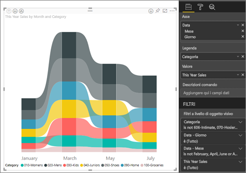

# Usare grafici a nastri in Power BI

[!INCLUDE [power-bi-visuals-desktop-banner](../includes/power-bi-visuals-desktop-banner.md)]

È possibile usare grafici a nastri per visualizzare i dati e individuare rapidamente la categoria di dati di livello più alto (valore più elevato). I grafici a nastri rappresentano una valida opzione nella visualizzazione delle variazioni di posizione, con il valore massimo visualizzato sempre in cima per ogni periodo di tempo. 

## Prerequisiti

Questa esercitazione usa il [file Retail Analysis Sample PBIX](https://download.microsoft.com/download/9/6/D/96DDC2FF-2568-491D-AAFA-AFDD6F763AE3/Retail%20Analysis%20Sample%20PBIX.pbix).

1. Nella sezione in alto a sinistra della barra dei menu selezionare **File** > **Apri**
   
2. Trovare la copia del **file Retail Analysis Sample PBIX**

1. Aprire il **file Retail Analysis Sample PBIX** nella visualizzazione report .

1. Seleziona  per aggiungere una nuova pagina.

## Creare un grafico a nastri

1. Per creare un grafico a nastri, selezionare **Grafico a nastri** nel riquadro **Visualizzazioni**.

    

    I grafici a nastri collegano una categoria di dati in relazione al periodo di tempo visualizzato tramite nastri, consentendo di osservare la posizione di una categoria lungo l'asse X del grafico, che in genere rappresenta la sequenza temporale.

2. Selezionare i campi per **Asse**, **Legenda** e **Valore**.  In questo esempio sono state effettuate le selezioni seguenti: **Store** > **OpenDate**, **Item** > **Category** e **Sales** > **This year sales** > **Value**.  

    

    Poiché il set di dati contiene dati per un solo anno, il campo **Year** e **Quarter** sono stati rimossi dall'area **Asse**.

3. Il grafico a nastri visualizza la classifica per ogni mese. Si noti come la classifica varia nel tempo. La categoria Home, ad esempio, passa da seconda in febbraio a quinta in marzo.

    

## Formattare un grafico a nastri
Quando si crea un grafico a nastri, la sezione **Formato** del riquadro **Visualizzazioni** mette a disposizione opzioni di formattazione. Le opzioni di formattazione per i grafici a nastri sono simili a quelle di un istogramma in pila, con opzioni aggiuntive specifiche per i grafici a nastri.

Queste opzioni di formattazione per i grafici a nastri consentono di eseguire rettifiche.

* **Spaziatura** consente di definire lo spazio tra i nastri. Il numero è la percentuale dell'altezza massima della colonna.
* **Abbina al colore della serie** consente abbinare il colore dei nastri al colore della serie. Se l'opzione è **disattivata**, i nastri vengono visualizzati in grigio.
* **Trasparenza** consente di specificare la trasparenza dei nastri, con il valore predefinito impostato su 30.
* **Bordo** consente di applicare un bordo scuro sulla parte superiore e inferiore dei nastri. Per impostazione predefinita, i bordi sono disattivati.

Dato che il grafico a nastri non dispone di etichette dell'asse y, può risultare utile aggiungere etichette dati. Nel riquadro Formattazione selezionare **Etichette dati**. 

Impostare le opzioni di formattazione per le etichette dati. In questo esempio il colore del testo è stato impostato su bianco e le unità di visualizzazione su migliaia.

## Passaggi successivi

[Grafici a dispersione e grafici a bolle in Power BI](power-bi-visualization-scatter.md)

[Tipi di visualizzazione in Power BI](power-bi-visualization-types-for-reports-and-q-and-a.md)
