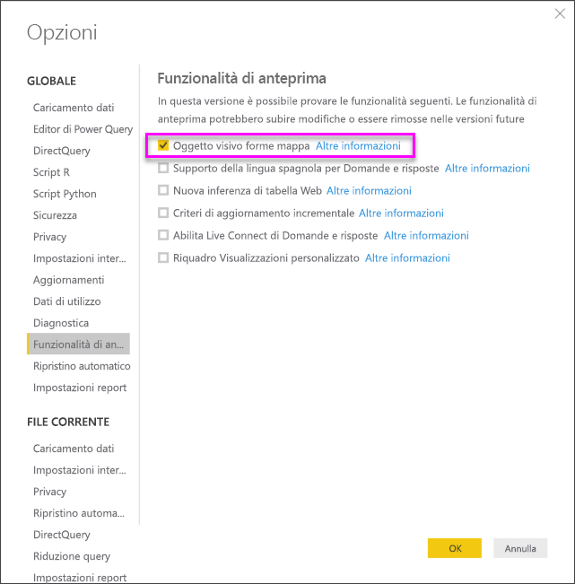
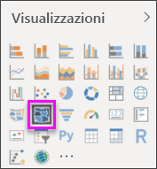
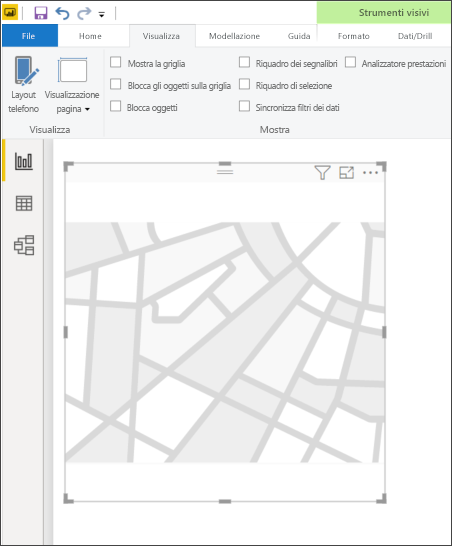
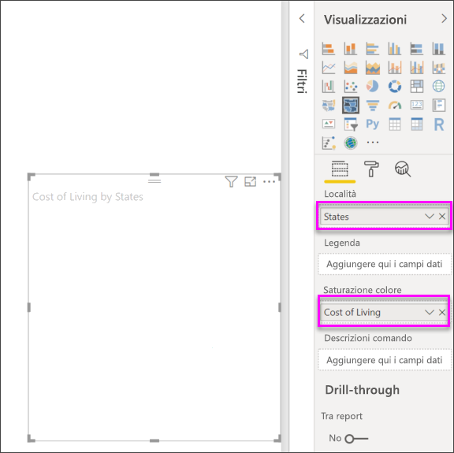
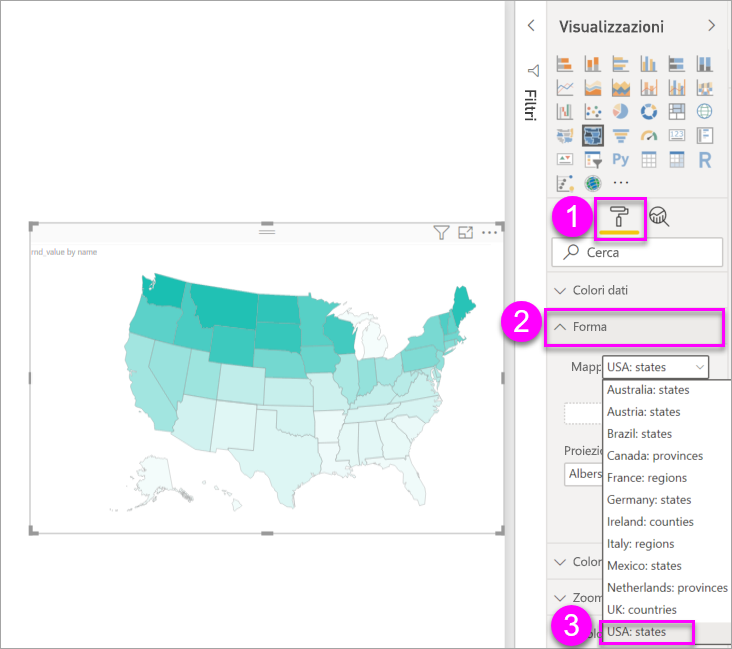
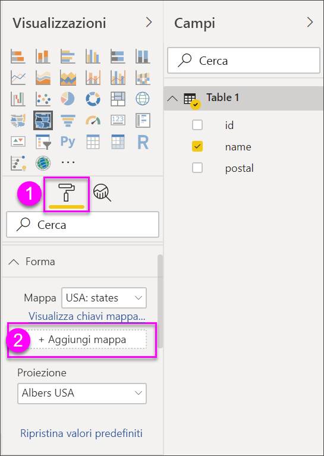
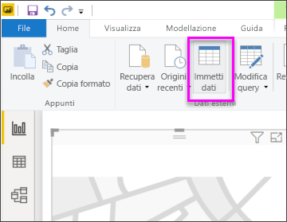
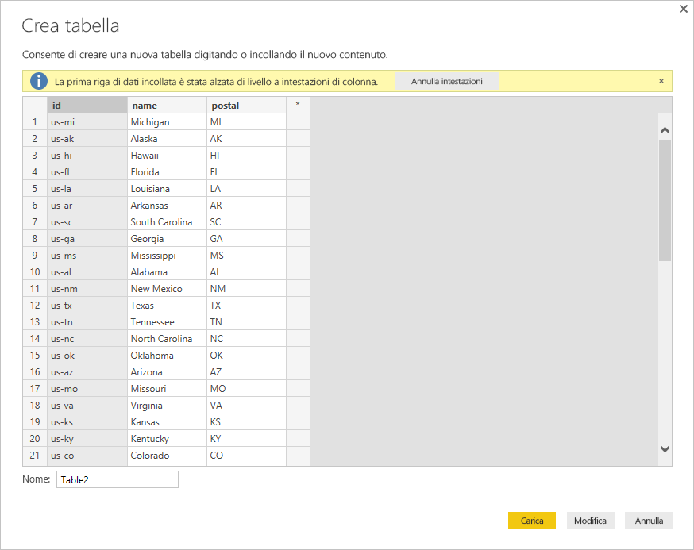

# Forme mappa in Power BI Desktop (anteprima)

[!INCLUDE [power-bi-visuals-desktop-banner](../includes/power-bi-visuals-desktop-banner.md)]

Creare un oggetto visivo **forma mappa** per confrontare le aree di una mappa usando i colori. A differenza dell'oggetto visivo **mappa**, l'oggetto visivo **forma mappa** non è in grado di visualizzare la posizione geografica precisa dei punti dati su una mappa. Lo scopo principale di questo oggetto visivo è di illustrare il confronto tra aree in una mappa applicando alle aree colori diversi.

Gli oggetti visivi **forme mappa** si basano sulle mappe ESRI/TopoJSON che offrono l'interessante possibilità di usare mappe personalizzate create dall'utente, ad esempio posizioni geografiche, disposizioni di posti a sedere, planimetrie e altro ancora. L'uso di mappe personalizzate non è disponibile in questa versione di anteprima di **Forme mappa**.

## Creazione di forme mappa
È possibile testare il controllo **Mappa forme** con le mappe fornite con questa versione di anteprima oppure usare una mappa personalizzata, purché soddisfi i requisiti descritti nella sezione **Usare le mappe personalizzate**.

L'oggetto visivo **forme mappa** è disponibile in anteprima e deve essere abilitato in Power BI Desktop. Per abilitare **Forme mappa**, selezionare **File > Opzioni e impostazioni > Opzioni > Funzionalità in anteprima**, quindi selezionare la casella di controllo **Oggetto visivo forme mappa**. Dopo aver effettuato la selezione è necessario riavviare Power BI Desktop.

Dopo aver abilitato **Forme mappa**, selezionare l'icona **Forme mappa** nel riquadro **Visualizzazioni**.

Power BI Desktop crea un'area di disegno vuota dell'oggetto visivo **forme mappa**.

Per creare **forme mappa**, seguire la procedura illustrata di seguito:

1. Nel riquadro **Campi** trascinare un campo dati contenente i nomi delle aree (o le abbreviazioni) nel bucket **Percorso** e un campo di misura di dati nel bucket **Saturazione colore** (la mappa non viene ancora visualizzata).

   > [!NOTE]
   > Vedere la sezione intitolata **Recupero di dati delle mappe** riportata di seguito per informazioni su come ottenere rapidamente i dati delle mappa per testare le **forme mappa**.
   > 
   > 

   
2. Nel riquadro Impostazioni **Formato** espandere **Forma** ed effettuare una selezione dall'elenco a discesa **Mappe standard** per visualizzare i dati. A questo punto viene visualizzato il rendering, come illustrato nell'immagine seguente.

   

   > [!NOTE]
   > La sezione **Chiavi aree** riportata alla fine di questo articolo fornisce una raccolta di tabelle con chiavi di aree mappa che è possibile usare per testare l'oggetto visivo **forme mappa**.
   > 
   > 
3. È quindi possibile modificare la mappa usando le opzioni di Formattazione, ad esempio **Colore predefinito**, **Zoom** e così via. È anche possibile aggiungere una colonna di dati di categoria al bucket **Legenda** e classificare le aree delle mappe in base alle categorie.

## Usare le mappe personalizzate
È possibile usare mappe personalizzate con **Forme mappa** purché siano nel formato **TopoJSON**. Se la mappa è in un altro formato, è possibile usare strumenti online come [**Map Shaper**](https://mapshaper.org/) per convertire i *file di forma* o le mappe *GeoJSON* nel formato **TopoJSON**.

Per usare il file di mappa **TopoJSON**, aggiungere un oggetto visivo ShapeMap al report e aggiungere alcuni dati nei bucket *Percorso* e *Saturazione colore*. Quindi, nel riquadro **Visualizzazioni** con la sezione **Formato** selezionata (mostrata come (1) nell'immagine seguente), espandere la sezione **Forma** e selezionare **+ Aggiungi mappa**.

## Mappa personalizzata di esempio
L'ente *Offices of the United States Attorneys* (Ente federale dei procuratori distrettuali degli Stati Uniti) rilascia un report finanziario annuale con dati finanziari relativi alle pratiche e al volume di casi.  Tutti i report sono disponibili nel collegamento riportato di seguito:

https://www.justice.gov/usao/resources/annual-statistical-reports

Poiché gli stati degli Stati Uniti possono essere suddivisi in distretti, è necessario usare forme mappa personalizzate.  Mediante l'importazione della mappa **TopoJSON** dei distretti giudiziari degli Stati Uniti in **Power BI Desktop** è possibile visualizzare i dati finanziari annuali corrispondenti al procuratore distrettuale.  L'immagine seguente mostra un esempio di questa mappa.

È possibile eseguire operazioni interessanti anche con le mappe dei singoli stati e visualizzare maggiori dettagli in base ai distretti contenuti nella mappa. 

Per eseguire test con questo set di dati e questa visualizzazione, è possibile scaricare il file originale con estensione pbix usato per generare il report usando il collegamento seguente.

* [File demo con estensione pbix delle forme mappa personalizzate](https://download.microsoft.com/download/1/2/8/128943FB-9231-42BD-8A5D-5E2362C9D589/DistrictAttorneyFiscalReport.pbix)

## Recupero dei dati mappa
Per inserire rapidamente i dati in un modello per poter testare le **forme mappa**, è possibile copiare una delle tabelle riportate alla fine di questo articolo, quindi selezionare **Immettere i dati** dalla barra multifunzione **Home**.

Se i dati includono più colonne, sarà necessario usare un editor come Excel per incollare i dati e quindi copiare separatamente ogni colonna di dati. È quindi possibile incollare i dati in Power BI Desktop. La riga superiore viene automaticamente identificata come intestazione.

È possibile immettere una nuova colonna semplicemente digitandone il nome (nella colonna vuota a destra), quindi aggiungere i valori in ogni cella, esattamente come in Excel. Al termine, selezionare **Carica** per aggiungere la tabella al modello di dati per Power BI Desktop.

> [!NOTE]
> Quando si lavora con paesi o aree geografiche, usare l'abbreviazione di tre lettere per garantire il corretto funzionamento della geocodifica nelle visualizzazioni delle mappe. *Non* usare le abbreviazioni di due lettere, perché alcuni paesi o aree geografiche potrebbero non essere riconosciuti correttamente.
> 
> Se si hanno a disposizione solo le abbreviazioni a due lettere, vedere questo [post di blog esterno](https://blog.ailon.org/how-to-display-2-letter-country-data-on-a-power-bi-map-85fc738497d6#.yudauacxp) per istruzioni su come associare le abbreviazioni di paese/area geografica di due lettere a quelle di tre lettere.
> 
> 

## Comportamenti e requisiti dell'anteprima
Per questa versione di anteprima di **forme mappa** è necessario tenere conto di alcune considerazioni e requisiti:

* L'oggetto visivo **forme mappa** è disponibile in anteprima e deve essere abilitato in Power BI Desktop. Per abilitare **Forme mappa**, selezionare **File > Opzioni e impostazioni > Opzioni > Funzionalità in anteprima**, quindi selezionare la casella di controllo **Oggetto visivo forme mappa**.
* Attualmente deve essere impostato anche il bucket **Saturazione colore** perché la classificazione **Legenda** funzioni correttamente.
* La versione finale di **Forme mappa** avrà un'interfaccia utente che mostra le chiavi della mappa selezionata. Non è ancora stata definita la data della versione finale e la funzionalità **Forme mappa** è ancora in anteprima. In questa versione di anteprima è possibile fare riferimento alle chiavi delle aree della mappa nelle tabelle disponibili nella sezione **Chiavi area** di seguito in questo articolo.
* L'oggetto visivo **Forme mappa** traccia un massimo di 1500 punti dati.

## Chiavi area

Usare le **Chiavi area** seguenti di questa versione di anteprima per testare **forme mappa**.

### Australia: Stati

| ID | abbr | iso | nome | postale |
| --- | --- | --- | --- | --- |
| au-wa |WA |AU-WA |Australia occidentale |WA |
| au-vic |Vic |AU-VIC |Victoria |VIC |
| au-tas |Tas |AU-TAS |Tasmania |TAS |
| au-sa |SA |AU-SA |Australia Meridionale |SA |
| au-qld |Qld |AU-QLD |Queensland |QLD |
| au-nt |NT |AU-NT |Territorio del Nord |NT |
| au-nsw |NSW |AU-NSW |Nuovo Galles del Sud |NSW |
| au-act |ACT |AU-ACT |Territorio della Capitale Australiana |ACT |

### Austria: Stati

| ID | iso | nome | nome-it | postale |
| --- | --- | --- | --- | --- |
| at-wi |AT-9 |Wien |Vienna |WI |
| at-vo |AT-8 |Vorarlberg |Vorarlberg |VO |
| at-tr |AT-7 |Tirol |Tirolo |TR |
| at-st |AT-6 |Steiermark |Stiria |ST |
| at-sz |AT-5 |Salzburg |Salzburg |SZ |
| at-oo |AT-4 |Oberösterreich |Alta Austria |OO |
| at-no |AT-3 |Niederösterreich |Bassa Austria |NO |
| at-ka |AT-2 |Kärnten |Carinzia |KA |
| at-bu |AT-1 |Burgenland |Burgenland |BU |

### Brasile: Stati

| ID |
| --- |
| Tocantins |
| Pernambuco |
| Goias |
| Sergipe |
| San Paolo |
| Santa Catarina |
| Roraima |
| Rondonia |
| Rio Grande do Sul |
| Rio Grande do Norte |
| Rio de Janeiro |
| Piaui |
| Parana |
| Paraiba |
| Para |
| Minas Gerais |
| Mato Grosso |
| Maranhao |
| Mato Grosso do Sul |
| Distrito Federal |
| Ceara |
| Espirito Santo |
| Bahia |
| Amazonas |
| Amapa |
| Alagoas |
| Acre |
| Zona contesa 1 |
| Zona contesa 2 |
| Zona contesa 3 |
| Zona contesa 4 |

### Canada: Province

| ID | iso | nome | postale |
| --- | --- | --- | --- |
| ca-nu |CA-NU |Nunavut |NU |
| ca-nt |CA-NT |Territori del Nord-Ovest |NT |
| ca-yt |CA-YT |Yukon |YT |
| ca-sk |CA-SK |Saskatchewan |SK |
| ca-qc |CA-QC |Quebec |QC |
| ca-pe |CA-PE |Isola del Principe Edoardo |PE |
| ca-on |CA-ON |Ontario |ON |
| ca-ns |CA-NS |Nuova Scozia |NS |
| ca-nl |CA-NL |Terranova e Labrador |NL |
| ca-nb |CA-NB |New Brunswick |NB |
| ca-mb |CA-MB |Manitoba |MB |
| ca-bc |CA-BC |Columbia Britannica |BC |
| ca-ab |CA-AB |Alberta |AB |

### Francia: Regioni

| ID | nome | nome-it |
| --- | --- | --- |
| Alsace |Alsace |Alsazia |
| Rhone Alpes |Rhône-Alpes |Rodano-Alpi |
| Provence-Alpes-Cote d'Azur |Provence-Alpes-Côte d'Azur |Provenza-Alpi-Costa Azzurra |
| Poitou-Charentes |Poitou-Charentes |Poitou-Charentes |
| Picardie |Picardie |Piccardia |
| Pays de la Loire |Pays de la Loire |Paesi della Loira |
| Nord-Pas-de-Calais |Nord-Pas-de-Calais |Nord-Passo di Calais |
| Midi-Pyrenees |Midi-Pyrénées |Midi-Pirenei |
| Lorraine |Lorraine |Lorena |
| Limousin |Limousin |Limosino |
| Languedoc-Roussillon |Languedoc-Roussillon |Linguadoca-Rossiglione |
| Ile-del-Francia |Île-de-France |Île-de-France |
| Haute Normandie |Haute Normandie |Alta Normandia |
| Franche-Comte |Franche Comté |Franca Contea |
| Corse |Corse |Corsica |
| Champagne-Ardenne |Champagne-Ardenne |Champagne-Ardenne |
| Centre-Val de Loire |Centre-Val de Loire |Centro-Valle della Loira |
| Bretagne |Bretagne |Bretagna |
| Bourgogne |Bourgogne |Borgogna |
| Basse-Normandie |Basse-Normandie |Bassa Normandia |
| Auvergne |Auvergne |Alvernia |
| Aquitaine |Aquitaine |Aquitaine |

### Germania: Stati

| ID | iso | nome | nome-it | postale |
| --- | --- | --- | --- | --- |
| de-be |DE-BE |Berlin |Berlino |BE |
| de-th |DE-TH |Thüringen |Turingia |TH |
| de-st |DE-ST |Sachsen-Anhalt |Sassonia-Anhalt |ST |
| de-sn |DE-SN |Sachsen |Sassonia |SN |
| de-mv |de-mv |Mecklenburg-Vorpommern |Meclemburgo-Pomerania Anteriore |MV |
| de-bb |DE-BB |Brandenburg |Brandeburgo |BB |
| de-sh |DE-SH |Schleswig Holstein |Schleswig Holstein |SH |
| de-sl |DE-SL |Saarland |Saarland |SL |
| de-rp |DE-RP |Rheinland-Pfalz |Renania Palatinato |RP |
| de-nw |DE-NW |Nordrhein Westfalen |Renania Settentrionale-Vestfalia |NW |
| de-ni |DE-NI |Niedersachsen |Bassa Sassonia |NI |
| de-he |DE-HE |Hessen |Assia |HE |
| de-hh |DE-HH |Hamburg |Amburgo |HH |
| de-hb |DE-HB |Bremen |Brema |HB |
| de-by |DE-BY |Bayern |Baviera |BY |
| de-bw |DE-BW |Baden-Württemberg |Baden-Württemberg |BW |

### Irlanda: Contee

| ID |
| --- |
| Wicklow |
| Wexford |
| Westmeath |
| Waterford |
| Sligo |
| Tipperary |
| Roscommon |
| Offaly |
| Monaghan |
| Meath |
| Mayo |
| Louth |
| Longford |
| Limerick |
| Leitrim |
| Laoighis |
| Kilkenny |
| Kildare |
| Kerry |
| Galway |
| Dublino |
| Donegal |
| Sughero |
| Clare |
| Cavan |
| Carlow |

### Italia: Regioni

| ID | iso | nome | nome-it | postale |
| --- | --- | --- | --- | --- |
| it-vn |IT-34 |Veneto |Veneto |VN |
| it-vd |IT-23 |Valle d'Aosta |Valle d'Aosta |VD |
| it-um |IT-55 |Umbria |Umbria |UM |
| it-tt |IT-32 |Trentino-Alto Adige |Trentino-Alto Adige |TT |
| it-tc |IT-52 |Toscana |Toscana |TC |
| it-sc |IT-82 |Sicilia |Sicilia |SC |
| it-sd |IT-88 |Sardegna |Sardegna |SD |
| it-pm |IT-21 |Piemonte |Piemonte |PM |
| it-ml |IT-67 |Molise |Molise |ML |
| it-mh |IT-57 |Marche |Marche |MH |
| it-lm |IT-25 |Lombardia |Lombardia |LM |
| it-lg |IT-42 |Liguria |Liguria |LG |
| it-lz |IT-62 |Lazio |Lazio |LZ |
| it-fv |IT-36 |Friuli-Venezia Giulia |Friuli-Venezia Giulia |FV |
| it-er |IT-45 |Emilia-Romagna |Emilia-Romagna |ER |
| it-cm |IT-72 |Campania |Campania |CM |
| it-lb |IT-78 |Calabria |Calabria |LB |
| it-bc |IT-77 |Basilicata |Basilicata |BC |
| it-pu |IT-75 |Puglia |Puglia |PU |
| it-ab |IT-65 |Abruzzo |Abruzzo |AB |

### Messico: Stati

| ID | abbreviazione | iso | nome | nome-it | postale |
| --- | --- | --- | --- | --- | --- |
| mx-zac |Zac. |MX-ZAC |Zacatecas |Zacatecas |ZA |
| mx-yuc |Yuc. |MX-YUC |Yucatán |Yucatán |YU |
| mx-ver |Ver. |MX-VER |Veracruz |Veracruz |VE |
| mx-tla |Tlax. |MX-TLA |Tlaxcala |Tlaxcala |TL |
| mx-tam |Tamps. |MX-TAM |Tamaulipas |Tamaulipas |TM |
| mx-tab |Tab. |MX-TAB |Tabasco |Tabasco |TB |
| mx-son |Son. |MX-SON |Sonora |Sonora |SO |
| mx-sin |Sin. |MX-SIN |Sinaloa |Sinaloa |SI |
| mx-slp |S.L.P. |MX-SLP |San Luis Potosí |San Luis Potosí |SL |
| mx-roo |Q.R. |MX-ROO |Quintana Roo |Quintana Roo |QR |
| mx-que |Qro. |MX-QUE |Querétaro |Querétaro |QE |
| mx-pue |Pue. |MX-PUE |Puebla |Puebla |PU |
| mx-oax |Oax. |MX-OAX |Oaxaca |Oaxaca |OA |
| mx-nle |N.L. |MX-NLE |Nuevo Léon |Nuevo Léon |NL |
| mx-nay |Nay. |MX-NAY |Nayarit |Nayarit |N/D |
| mx-mor |Mor. |MX-MOR |Morelos |Morelos |MR |
| mx-mic |Mich. |MX-MIC |Michoacán |Michoacán |MC |
| mx-mex |Méx. |MX-MEX |Estado de México |Stato del Messico |MX |
| mx-jal |Jal. |MX-JAL |Jalisco |Jalisco |JA |
| mx-hid |Hgo. |MX-HID |Hidalgo |Hidalgo |HI |
| mx-gro |Gro. |MX-GRO |Guerrero |Guerrero |GR |
| mx-gua |Gto. |MX-GUA |Guanajuato |Guanajuato |GT |
| mx-dur |Dgo. |MX-DUR |Durango |Durango |DU |
| mx-dif |CDMX. |MX-DIF |Ciudad de México |Città del Messico |DF |
| mx-col |Col. |MX-COL |Colima |Colima |CL |
| mx-coa |Coah. |MX-COA |Coahuila |Coahuila |CA |
| mx-chh |Chih. |MX-CHH |Chihuahua |Chihuahua |CH |
| mx-chp |Chris. |MX-CHP |Chiapas |Chiapas |CP |
| mx-cam |Camp. |MX-CAM |Campeche |Campeche |CM |
| mx-bcs |B.C.S. |MX-BCS |Baja California Sur |Bassa California del Sud |BS |
| mx-bcn |B.C. |MX-BCN |Baja California |Bassa California |BN |
| mx-agu |Ags. |MX-AGU |Aguascalientes |Aguascalientes |AG |

### Paesi Bassi: Province

| ID | iso | nome | nome-it |
| --- | --- | --- | --- |
| nl-zh |NL-ZH |Zuid-Holland |Olanda Meridionale |
| nl-ze |NL-ZE |Zeeland |Zelanda |
| nl-ut |NL-UT |Utrecht |Utrecht |
| nl-ov |NL-OV |Overijssel |Overijssel |
| nl-nh |NL-NH |Noord-Holland |Olanda Settentrionale |
| nl-nb |NL-NB |Noord-Brabant |Brabante Settentrionale |
| nl-li |NL-LI |Limburg |Limburg |
| nl-gr |NL-GR |Groningen |Groninga |
| nl-ge |NL-GE |Gelderland |Gheldria |
| nl-fr |NL-FR |Fryslân |Frisia |
| nl-fl |NL-FL |Flevoland |Flevoland |
| nl-dr |NL-DR |Drenthe |Drenthe |

### Regno Unito: Paesi

| ID | iso | nome |
| --- | --- | --- |
| gb-wls |GB-WLS |Galles |
| gb-sct |GB-SCT |Scozia |
| gb-nir |GB-NIR |Irlanda del Nord |
| gb-eng |GB-ENG |Inghilterra |

### USA: Stati

| ID | nome | postale |
| --- | --- | --- |
| us-mi |Michigan |MI |
| us-ak |Alaska |AK |
| us-hi |Hawaii |HI |
| us-fl |Florida |FL |
| us-la |Louisiana |LA |
| us-ar |Arkansas |AR |
| us-sc |Carolina del Sud |SC |
| us-ga |Georgia |GA |
| us-ms |Mississippi |MS |
| us-al |Alabama |AL |
| us-nm |Nuovo Messico |NM |
| us-tx |Texas |TX |
| us-tn |Tennessee |TN |
| us-nc |Carolina del Nord |NC |
| us-ok |Oklahoma |OK |
| us-az |Arizona |AZ |
| us-mo |Missouri |MO |
| us-va |Virginia |VA |
| us-ks |Kansas |KS |
| us-ky |Kentucky |KY |
| us-co |Colorado |CO |
| us-md |Maryland |MD |
| us-wv |Virginia Occidentale |WV |
| us-de |Delaware |DE |
| us-de |District of Columbia |DC |
| us-il |Illinois |IL |
| us-oh |Ohio |OH |
| us-ca |California |CA |
| us-ut |Utah |UT |
| us-nv |Nevada |NV |
| us-in |Indiana |IN |
| us-nj |New Jersey |NJ |
| us-ri |Rhode Island |RI |
| us-ct |Connecticut |CT |
| us-pa |Pennsylvania |PA |
| us-ny |New York |NY |
| us-ne |Nebraska |NE |
| us-ma |Massachusetts |MA |
| us-ia |Iowa |IA |
| us-nh |New Hampshire |NH |
| us-or |Oregon |OR |
| us-mn |Minnesota |MN |
| us-vt |Vermont |VT |
| us-id |Idaho |ID |
| us-wi |Wisconsin |WI |
| us-wy |Wyoming |WY |
| us-sd |Dakota del Sud |SD |
| us-nd |Dakota del Nord |ND |
| us-me |Maine |ME |
| us-mt |Montana |MT |
| us-wa |Washington |WA |

## Passaggi successivi

* [Oggetto visivo matrice in Power BI](desktop-matrix-visual.md)

* [Tipi di visualizzazione in Power BI](power-bi-visualization-types-for-reports-and-q-and-a.md)
