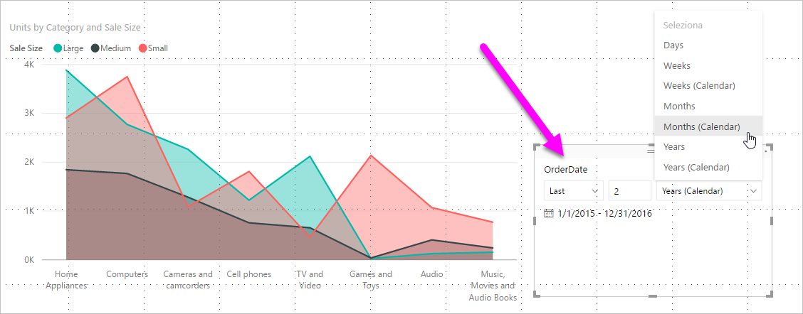
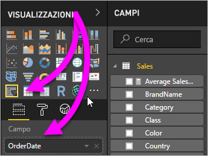
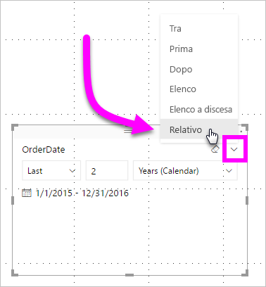
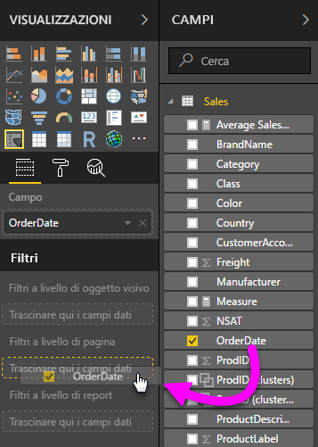
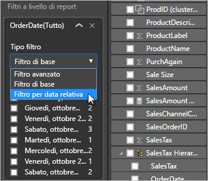
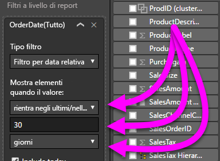

# Usare un filtro dei dati e un filtro per la data relativa in Power BI Desktop

Con il **filtro dei dati per la data relativa** o il **filtro per la data relativa** è possibile applicare filtri basati sulla data a qualsiasi colonna di date nel modello di dati. È ad esempio possibile usare il **filtro dei dati per la data relativa** per visualizzare solo i dati relativi a vendite effettuate negli ultimi 30 giorni (nell'ultimo mese o negli ultimi mesi di calendario e così via). Quando si aggiornano i dati, il periodo di tempo relativo applica automaticamente il vincolo appropriato per la data relativa.

## Usare il filtro dei dati per un intervallo di date relative

È possibile usare il filtro dei dati per la data relativa come qualsiasi altro filtro dei dati. Creare un oggetto visivo **filtro dei dati** per il report e quindi selezionare un valore di data per il valore **Campo**. Nell'immagine seguente è stato selezionato il campo *OrderDate*.

Selezionare il filtro dei dati sul canvas e quindi la freccia nell'angolo superiore destro dell'oggetto visivo filtro dei dati. Se l'oggetto visivo contiene dati di tipo data, il menu visualizzerà l'opzione **Relativo**.

Per il filtro dei dati per la data relativa selezionare *Relativa*.

È quindi possibile selezionare le impostazioni.

Per la prima impostazione nel *filtro dei dati per la data relativa* sono disponibili le opzioni seguenti:

* Ultimi

* Argomento successivo

* This

La seconda impostazione (centrale) nel *filtro dei dati per la data relativa* consente di immettere un numero per definire l'intervallo di date relative.

La terza impostazione consente di selezionare l'unità di misura relativa alla data. Sono disponibili le opzioni seguenti:

* Giorni

* Settimane

* Settimane (calendario)

* Mesi

* Mesi (calendario)

* Anni

* Anni (calendario)

Se si seleziona **Mesi** dall'elenco e si immette *2* nell'impostazione centrale, accade quanto segue:

* se oggi è il 20 luglio

* verranno visualizzati i dati inclusi negli oggetti visivi vincolati dal filtro dei dati per i due mesi precedenti

* a partire dal 21 maggio e fino al 20 luglio (data odierna)

Se invece si seleziona *Mesi (calendario)* , gli oggetti visivi vincolati mostrano i dati a partire dal 1° maggio fino al 30 giugno, ovvero gli ultimi due mesi di calendario completi.

## Uso del filtro intervalli per la data relativa

È anche possibile creare un filtro intervalli per la data relativa per la pagina del report o per l'intero report. A tale scopo, trascinare un campo data nell'area **Filtri a livello di pagina** o nell'area **Filtri a livello di report** nel riquadro **Campo**:

Dopo averlo posizionato, è possibile modificarne l'intervallo di date relative. L'operazione è simile alla personalizzazione del **filtro dei dati per la data relativa**. Selezionare **Filtro per data relativa** dall'elenco a discesa **Tipo di filtro**.

Dopo la selezione dell'opzione **Filtro per data relativa**, vengono visualizzate tre sezioni da modificare, tra cui una casella numerica intermedia, in modo analogo al filtro dei dati.

## Limitazioni e considerazioni

Le limitazioni e le considerazioni seguenti sono attualmente applicabili al **filtro intervalli per la data relativa** e al filtro.

* I modelli di dati in **Power BI** non includono informazioni sul fuso orario. Questi modelli possono archiviare informazioni sugli orari, ma non includono alcuna indicazione sul fuso orario specifico.

* Il filtro dei dati e il filtro si basano sempre sull'ora UTC. Se l'utente imposta un filtro in un report e lo invia a un collega in un altro fuso orario, l'utente e il collega visualizzano gli stessi dati. Se non si trovano nel fuso orario UTC, l'utente e il collega devono tenere conto della differenza di orario.

* È possibile convertire i dati acquisiti in un fuso orario locale nell'ora UTC tramite l'**editor di query**.

## Passaggi successivi

Informazioni su come [usare il raggruppamento e il binning in Power BI Desktop](../desktop-grouping-and-binning.md).
