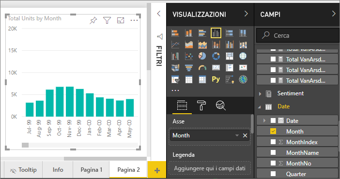
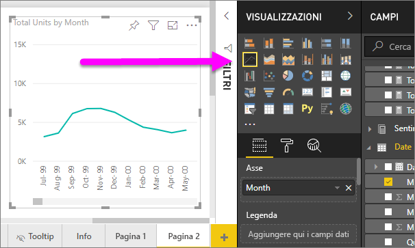
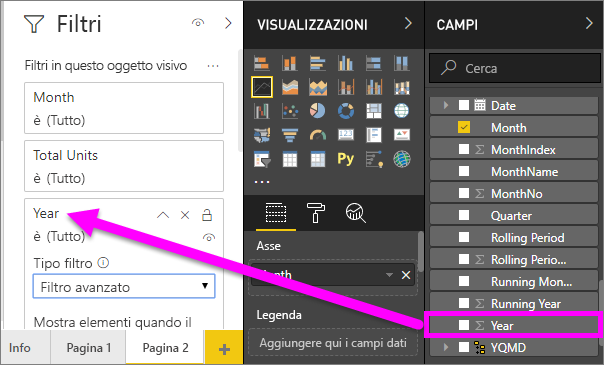
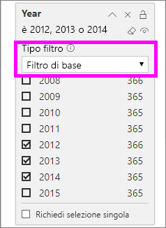
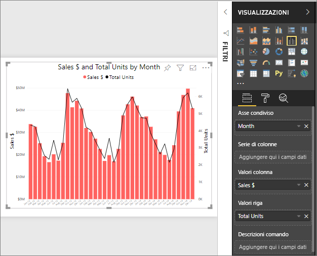
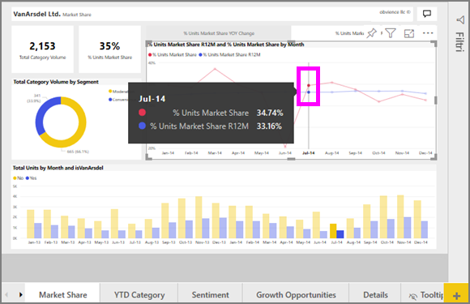

# Grafici a linee in Power BI

[!INCLUDE[consumer-appliesto-nyyn](../includes/consumer-appliesto-nyyn.md)]

Un grafico a linee è costituito da una serie di punti dati uniti da linee rette. Un grafico a linee può includere una o più linee. I grafici a linee hanno un asse X e un asse Y. 

## Creare un grafico a linee
In queste istruzioni viene usata l'app Sales and Marketing Sample per creare un grafico a linee che mostra le vendite dell'anno in corso suddivise per categoria. Per seguire le istruzioni, scaricare l'app di esempio da appsource.com.

> [!NOTE]
> Per condividere il report con un collega di Power BI, è necessario che entrambi gli utenti abbiano licenze di Power BI Pro individuali o che il report venga salvato nella capacità Premium.

1. Iniziare con una pagina del report vuota. Se si usa il servizio Power BI, assicurarsi di aprire il report in [Visualizzazione di modifica](../create-reports/service-interact-with-a-report-in-editing-view.md).

2. Nel riquadro Campi selezionare **SalesFact** \> **Total units**, quindi selezionare **Date** > **Month**.  Power BI crea un istogramma nell'area di disegno del report.

    

4. Convertire in un grafico a linee selezionando il modello di tale grafico nel riquadro Visualizzazioni. 

    
   

4. Filtrare il grafico a linee per visualizzare i dati relativi agli anni 2012-2014. Se il riquadro Filtri è compresso, espanderlo. Nel riquadro Campi selezionare **Date** \> **Year** e trascinare la selezione nel riquadro Filtri. Rilasciarla sotto l'intestazione **Filtri in questo oggetto visivo**. 
     
    

    Modificare **Filtro avanzato** in **Filtro di base** e selezionare **2012**, **2013** e **2014**.

    

6. Facoltativamente, [modificare le dimensioni e il colore del testo del grafico](power-bi-visualization-customize-title-background-and-legend.md). 

    

## Aggiungere altre linee al grafico
I grafici a linee possono avere molte linee diverse. In alcuni casi, i valori sulle linee possono essere così divergenti da non risultare ben definiti. Si vedrà ora come aggiungere altre linee al grafico e quindi formattare il grafico quando i valori rappresentati dalle linee sono molto diversi. 

### Aggiungere altre righe
Invece di esaminare le unità totali per tutte le aree come una singola linea nel grafico, è possibile suddividere le unità totali per area. Per aggiungere altre linee, trascinare **Geo** > **Region** (Posizione geografica > Area) nell'area Legenda.

   

### Usare due assi Y
Cosa accade se si vogliono esaminare le vendite totali e le unità totali nello stesso grafico? I valori delle vendite sono molto superiori rispetto a quelli delle unità e quindi il grafico a linee risulta inutilizzabile. In effetti, la linea rossa relativa alle unità totali sembra essere zero.

   

Per visualizzare valori altamente divergenti nello stesso grafico, usare un grafico combinato. Per informazioni dettagliate sui grafici combinati, leggere [Grafici combinati in Power BI](power-bi-visualization-combo-chart.md). Nell'esempio seguente è possibile visualizzare i valori delle vendite e quelli delle unità totali in uno stesso grafico aggiungendo un secondo asse Y. 

   

## Evidenziazione e filtro incrociato
Per informazioni sull'uso del riquadro Filtri, vedere [Aggiungere un filtro a un report](../create-reports/power-bi-report-add-filter.md).

La selezione di un punto dati su un grafico a linee ha l'effetto di applicare l'evidenziazione incrociata e il filtro incrociato alle altre visualizzazioni nella pagina del report e viceversa. Per seguire le istruzioni, aprire la scheda **Market Share** (Quota di mercato).  

In un grafico a linee, un singolo punto dati rappresenta l'intersezione di un punto sugli assi X e Y. Quando si seleziona un punto dati, Power BI aggiunge marcatori che indicano quale punto (per una singola riga) o quali punti (se sono presenti due o più righe) costituiscono l'origine dell'evidenziazione incrociata e del filtro incrociato degli altri oggetti visivi nella pagina del report. Se l'oggetto visivo presenta una densità elevata, Power BI selezionerà il punto più vicino alla posizione in cui si fa clic sull'oggetto visivo.

In questo esempio è stato selezionato un punto dati che include i dati seguenti: Luglio 2014, % quota di mercato unità R12 del 33,16% e % quota di mercato unità del 34,74%.

È possibile notare l'evidenziazione incrociata dell'istogramma e il filtro incrociato del misuratore.

Per gestire il modo in cui i grafici si evidenziano e applicano i filtri incrociati tra di loro, vedere [Interazioni tra le visualizzazioni in un report di Power BI](../create-reports/service-reports-visual-interactions.md).

## Considerazioni e risoluzione dei problemi
* Un unico grafico a linee non può avere due assi Y.  È necessario usare in alternativa un grafico combinato.
* Negli esempi precedenti i grafici sono stati formattati in modo da aumentare la dimensione del carattere, cambiare il colore del carattere, aggiungere i titoli degli assi, allineare al centro il titolo del grafico e la legenda, definire zero come punto iniziale per entrambi gli assi e altro ancora. Il riquadro per la formattazione (icona del rullo) include un'ampia gamma di opzioni per personalizzare l'aspetto dei grafici nel modo desiderato. Il modo migliore per imparare a modificare l'aspetto di un grafico è quello di aprire il riquadro per la formattazione ed esplorare le opzioni disponibili.

## Passaggi successivi

[Tipi di visualizzazione in Power BI](power-bi-visualization-types-for-reports-and-q-and-a.md)

