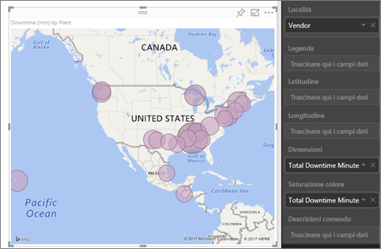
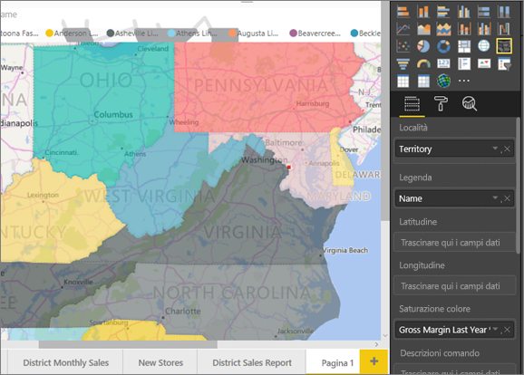
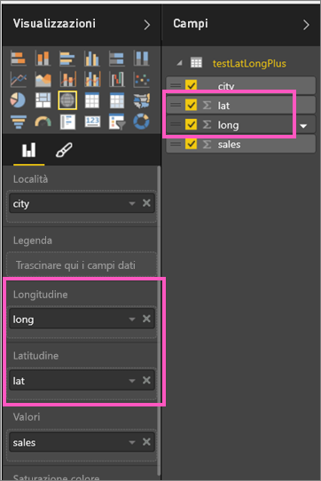
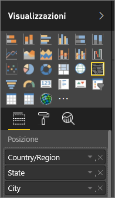

# Suggerimenti e consigli per le visualizzazioni mappa di Power BI
Power BI si integra con Bing Maps per fornire coordinate della mappa predefinite (un processo denominato geocodifica) e poter creare delle mappe. Insieme, usano algoritmi per identificare la posizione corretta, anche se in alcuni casi si tratta solo una stima. Se Power BI non riesce a creare la visualizzazione della mappa autonomamente, richiede l'aiuto di Bing Maps. 

L'utente, o l'amministratore, potrebbe dover aggiornare il firewall per consentire l'accesso agli URL usati da Bing per la geocodifica.  Questi URL sono:
* https://dev.virtualearth.net/REST/V1/Locations
* https://platform.bing.com/geo/spatial/v1/public/Geodata
* https://www.bing.com/api/maps/mapcontrol

Per aumentare la probabilità di esecuzione di operazioni di geocodifica corrette, usare i suggerimenti seguenti. Il primo set di suggerimenti serve se si ha accesso al set di dati, mentre il secondo set di suggerimenti contiene le operazioni che è possibile eseguire in Power BI se non si ha accesso al set di dati. 

## Cosa viene inviato a Bing Maps?
Il servizio di Power BI e Power BI Desktop inviano a Bing i dati geografici necessari per creare la visualizzazione mappa. Sono inclusi i dati nel bucket **Posizione**, **Latitudine**, e **Longitudine** e i campi geografici in uno dei bucket del filtro **Livello report**, **Page level** (Livello pagina) o **Visual level** (Livello oggetto visivo). Per la precisione gli elementi inviati variano in base al tipo di mappa. Per altre informazioni, vedere [Privacy di Bing Mappe](https://go.microsoft.com/fwlink/?LinkID=248686).

* Per le mappe, in particolare per le mappe a bolle, a dispersione e con tracciato a punti, se vengono indicati i valori di latitudine e longitudine non viene inviato alcun dato a Bing. In caso contrario, tutti i dati nei bucket **Posizione** e filtro vengono inviati a Bing.     

* Le mappe colorate richiedono un campo nel bucket **Posizione**, anche se vengono forniti i valori latitudine e longitudine. Qualsiasi dato incluso nel bucket **Posizione**, **Latitudine** o **Longitudine** viene inviato a Bing.
  
    Nell'esempio seguente, il campo **Fornitore** viene usato per la codifica geografica, pertanto tutti i dati del fornitore vengono inviati a Bing. I dati dei bucket **Dimensioni** e **Saturazione colore** non vengono inviati a Bing.
  
    
  
    Nel secondo esempio qui di seguito, il campo **Territorio** viene usato per la codifica geografica, quindi tutti i dati del territorio vengono inviati a Bing. I dati dei bucket **Legenda** e **Saturazione colore** non vengono inviati a Bing.
  
    

## Nel set di dati: suggerimenti per migliorare il set di dati sottostante
Se si ha accesso al set di dati usato per creare la visualizzazione della mappa, ci sono alcune operazioni da eseguire per aumentare la probabilità di geocodifica corretta.

**1. Classificare i campi geografici in Power BI Desktop**

In Power BI Desktop è possibile assicurarsi che la codifica geografica dei campi venga eseguita correttamente impostando la *categoria di dati* per i campi dati. In Vista dati selezionare la colonna desiderata. Sulla barra multifunzione selezionare la scheda **Modellazione** e impostare **Categoria di dati** su **Indirizzo**, **Città**, **Continente**, **Paese/area geografica**, **Regione**, **Codice postale**, **Stato** o **Provincia**. Queste categorie di dati consentiranno a Bing di codificare correttamente la data. Per altre informazioni, vedere [Categorizzazione dei dati in Power BI Desktop](../desktop-data-categorization.md). Se si esegue una connessione dinamica a SQL Server Analysis Services, sarà necessario impostare la categorizzazione dei dati all'esterno di Power BI usando [SQL Server Data Tools (SSDT)](https://docs.microsoft.com/sql/ssdt/download-sql-server-data-tools-ssdt).

**2. Usare più colonne di località.**     
 In alcuni casi, anche l'impostazione delle categorie di dati per la creazione di mappe non è sufficiente per consentire a Bing di individuare correttamente la posizione. Alcune designazioni sono ambigue perché la località esiste in più paesi o aree geografiche. Ad esempio, esiste una città chiamata ***Southampton*** in Inghilterra, Pennsylvania e New York.

Power BI usa il [servizio del modello URL non strutturato](https://msdn.microsoft.com/library/ff701714.aspx) di Bing per ottenere le coordinate di latitudine e longitudine, in base a un set di valori di indirizzo per qualsiasi paese. Se i dati non contengano dati sufficienti sulla posizione, aggiungere tali colonne e classificarle in modo appropriato.

 Ad esempio, se si ha solo una colonna Città, Bing potrebbe riscontrare problemi nella geocodifica. Aggiungere altre colonne geografiche per ovviare alle ambiguità della località.  A volte non serve altro che aggiungere un'altra colonna di località al set di dati, in questo caso stato/provincia. Non dimenticare poi di suddividerlo correttamente in categorie (vedere il punto 1).

Verificare che ogni campo includa una sola categoria di località. Ad esempio, il campo di posizione Città dovrebbe essere **Southampton**, non **Southampton, New York**,  e i campi di posizione Indirizzo dovrebbero essere **1 Microsoft Way** e non **1 Microsoft Way, Redmond, WA**.

**3. Usare latitudine e longitudine specifiche**

Aggiungere i valori di latitudine e longitudine al set di dati. Ciò consente di rimuovere qualsiasi ambiguità e restituire i risultati più rapidamente. I valori immessi nei campi Latitudine e Longitudine devono essere in formato *Numero decimale*. È possibile impostare questo formato nel modello di dati.

<iframe width="560" height="315" src="https://www.youtube.com/embed/ajTPGNpthcg" frameborder="0" allowfullscreen></iframe>

**4. Usare la categoria Place per le colonne con informazioni complete sulla posizione**

Nonostante gli utenti siano invitati a usare le gerarchie geografiche nelle mappe, se è necessari usare una singola colonna di posizione con informazioni geografiche complete, è possibile impostare la categorizzazione dei dati su **Place**. Ad esempio, se i dati della colonna sono indirizzi completi, ad esempio 1 Microsoft Way, Redmond Washington 98052, questa categoria di dati generalizzata funziona meglio con Bing. 

## In Power BI: suggerimenti per ottenere risultati migliori quando si usano le visualizzazioni mappa
**1. Usare i campi di latitudine e longitudine (se presenti)**

In Power BI, se il set di dati contiene già i dati relativi a latitudine e longitudine, è consigliabile usarli.  Power BI include speciali bucket per ovviare alle ambiguità dei dati delle mappe. È sufficiente trascinare il campo che contiene i dati relativi alla latitudine nell'area **Visualizzazioni > Latitudine**.  altrettanto per i dati relativi alla longitudine. In questo caso, quando si creano le visualizzazioni, è necessario compilare anche il campo *Località*. In caso contrario, i dati verranno aggregati per impostazione predefinita e, ad esempio, la latitudine e la longitudine verrebbero abbinate a livello di stato e non di città.

 

## Usare le gerarchie geografiche per eseguire il drill-down a diversi "livelli" di posizione
Quando il set di dati ha già diversi livelli di dati sulla posizione, è possibile usare Power BI per creare *gerarchie geografiche*. A tale scopo, trascinare più campi nel bucket **Posizione**. In questo modo, usati insieme, i campi diventano una gerarchia geografica. Nell'esempio seguente sono stati aggiunti campi geografici per Paese/area geografica, Stato e Città. In Power BI è possibile eseguire il drill-up o il drill-down usando questa gerarchia geografica.

  

   

Quando si esaminano le gerarchie geografiche, è importante conoscere il funzionamento di ogni pulsante di espansione e ciò che viene inviato a Bing Maps. 

* Il pulsante Modalità di espansione all'estrema destra  , consente di selezionare una posizione sulla mappa ed eseguire il drill-down in quella specifica posizione un livello alla volta. Ad esempio, se si attiva Drill-down e si fa clic su America del Nord, ci si sposta verso il basso nella gerarchia al livello successivo, cioè gli stati nell'America del Nord. Per la geocodifica, Power BI invia a Bing Maps solo i dati relativi a paesi e stati dell'America del Nord.  
* A sinistra ci sono altre due opzioni di analisi. La prima opzione,  , esegue il drill-down fino al livello successivo della gerarchia per tutte le posizioni contemporaneamente. Ad esempio, se si stanno attualmente esaminando paesi e quindi si usa questa opzione per spostarsi il livello successivo, cioè gli stati, Power BI visualizza i dati relativi agli stati per tutti i paesi. Per la geocodifica, Power BI invia a Bing Maps i dati di stato (nessun dato paese) per tutte le posizioni. Questa opzione è utile se ogni livello della gerarchia non è correlato al livello direttamente superiore. 
* La seconda opzione,  è simile al drill-down, ad eccezione del fatto che non è necessario fare clic sulla mappa,  perché si espande verso il basso fino al livello successivo della gerarchia ricordando il contesto del livello corrente. Ad esempio, se si stanno esaminando i paesi si seleziona questa icona, ci si sposta verso il basso nella gerarchia al livello successivo, cioè gli stati. Per la geocodifica, Power BI invia i dati per ogni stato e il corrispondente paese per consentire a Bing Maps di eseguire la geocodifica in modo più accurato. Nella maggior parte delle mappe, si userà questa opzione o l'opzione di drill-down a destra, per poter inviare a Bing quante più informazioni possibili con cui ottenere informazioni sul percorso accurate. 

## Passaggi successivi
[Eseguire il drill-in una visualizzazione di Power BI](../consumer/end-user-drill.md)

[Visualizzazioni di Power BI](power-bi-report-visualizations.md)

Altre domande? [Provare la community di Power BI](https://community.powerbi.com/)

