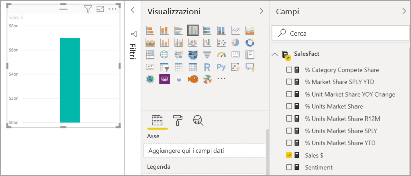
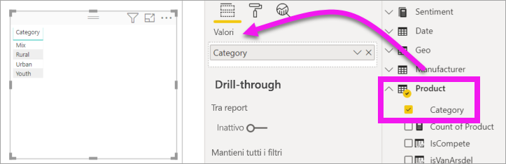
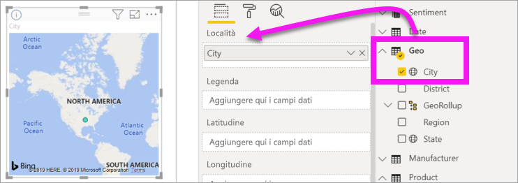
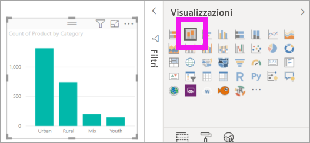
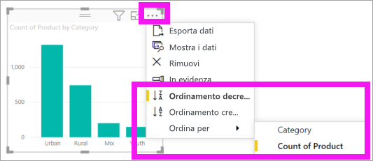

# Parte 1, Aggiungere visualizzazioni a un report di Power BI

[!INCLUDE [power-bi-visuals-desktop-banner](../includes/power-bi-visuals-desktop-banner.md)]

Questo articolo offre un'introduzione rapida alla creazione di una visualizzazione in un report. Le informazioni si applicano sia al servizio Power BI che a Power BI Desktop. Per contenuti più avanzati, [vedere la parte 2](power-bi-report-add-visualizations-ii.md) di questa serie. Nel video seguente Amanda illustra alcuni modi per creare, modificare e formattare gli oggetti visivi nell'area di disegno report. Sarà quindi possibile provare a usare l'[esempio di analisi di vendite e marketing](../sample-datasets.md) per creare il proprio report.

<iframe width="560" height="315" src="https://www.youtube.com/embed/IkJda4O7oGs" frameborder="0" allowfullscreen></iframe>

## Prerequisiti

Questa esercitazione usa il [file Sales and Marketing Sample PBIX](https://download.microsoft.com/download/9/7/6/9767913A-29DB-40CF-8944-9AC2BC940C53/Sales%20and%20Marketing%20Sample%20PBIX.pbix).

1. Nella sezione in alto a sinistra della barra dei menu di Power BI Desktop selezionare **File** > **Apri**.
   
2. Trovare la copia del **file Sales and Marketing Sample PBIX**

1. Aprire il **file Sales and Marketing Sample PBIX** nella visualizzazione report .

1. Seleziona  per aggiungere una nuova pagina.

## Aggiungere visualizzazioni al report

1. Creare una visualizzazione selezionando un campo dal riquadro **Campi**.

    Iniziare con un campo numerico, ad esempio **Sales** > **TotalSales**. Power BI crea un istogramma con una sola colonna.

    

    In alternativa, iniziare con un campo categoria, ad esempio **Name** o **Product**. Power BI crea una tabella e aggiunge tale campo nell'area **Valori**.

    

    Oppure, iniziare con un campo geografia, ad esempio **Geo** > **City**. Power BI e Bing Mappe creano una visualizzazione mappa.

    

## Modificare il tipo di visualizzazione

 Creare una visualizzazione e quindi modificarne il tipo. 
 
 1. Selezionare **Product** > **Category** e quindi **Product** > **Count of Product** per aggiungerli entrambi all'area **Valori**.

    

1. Cambiare la visualizzazione in un istogramma selezionando l'icona **Istogramma a colonne in pila**.

   

1. Per modificare la modalità di ordinamento dell'oggetto visivo, selezionare **Altre azioni** (...).  Usare le opzioni di ordinamento per modificare la direzione di questo (crescente o decrescente) e cambiare la colonna usata per l'ordinamento (**Ordina per**).

   
  
## Passaggi successivi

 Continuare con:

* [Parte 2: Aggiungere visualizzazioni a un report di Power BI](power-bi-report-add-visualizations-ii.md)

* [Interagire con le visualizzazioni](../consumer/end-user-reading-view.md) nel report.

