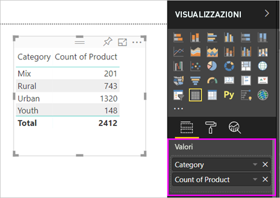

# Parte 1, Aggiungere visualizzazioni a un report di Power BI

Questo articolo offre un'introduzione rapida alla creazione di una visualizzazione in un report. Le informazioni si applicano sia al servizio Power BI che a Power BI Desktop. Per contenuti più avanzati, [vedere la parte 2](power-bi-report-add-visualizations-ii.md) di questa serie. Nel video seguente Amanda illustra alcuni modi per creare, modificare e formattare gli oggetti visivi nell'area di disegno report. Sarà quindi possibile provare a usare l'[esempio di analisi di vendite e marketing](../sample-datasets.md) per creare il proprio report.

<iframe width="560" height="315" src="https://www.youtube.com/embed/IkJda4O7oGs" frameborder="0" allowfullscreen></iframe>

## Aprire un report e aggiungere una nuova pagina

1. Aprire un [report in Visualizzazione di modifica](../service-interact-with-a-report-in-editing-view.md).

    Questa esercitazione usa l'[esempio di analisi di vendite e marketing](../sample-datasets.md).

1. Se il riquadro **Campi** non è visibile, selezionare l'icona a forma di freccia per aprirlo.

   

1. Aggiungere una pagina vuota al report.

## Aggiungere visualizzazioni al report

1. Creare una visualizzazione selezionando un campo dal riquadro **Campi**.

    Iniziare con un campo numerico, ad esempio **SalesFact** > **Sales $** . Power BI crea un istogramma con una sola colonna.

    

    In alternativa, iniziare con un campo categoria, ad esempio **Name** o **Product**. Power BI crea una tabella e aggiunge tale campo nell'area **Valori**.

    

    Oppure, iniziare con un campo geografia, ad esempio **Geo** > **City**. Power BI e Bing Mappe creano una visualizzazione mappa.

    

1. Creare una visualizzazione e quindi modificarne il tipo. Selezionare **Product** > **Category** e quindi **Product** > **Count of Product** per aggiungerli entrambi all'area **Valori**.

   

1. Cambiare la visualizzazione in un istogramma selezionando l'icona **Istogramma a colonne in pila**.

   

1. Quando si creano visualizzazioni nel report, è possibile [aggiungerle al dashboard](../service-dashboard-pin-tile-from-report.md). Per aggiungere la visualizzazione, selezionare l'icona Aggiungi .

   
  
## Passaggi successivi

 Continuare con:

* [Parte 2: Aggiungere visualizzazioni a un report di Power BI](power-bi-report-add-visualizations-ii.md)

* [Interagire con le visualizzazioni](../consumer/end-user-reading-view.md) nel report.

* [Eseguire altre operazioni con le visualizzazioni](power-bi-report-visualizations.md).

* [Salvare il report](../service-report-save.md).
