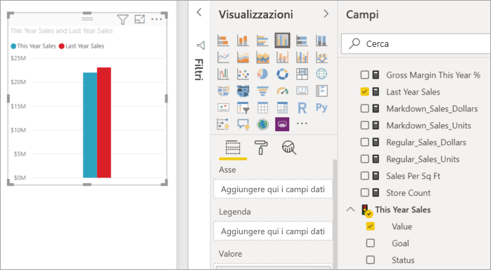
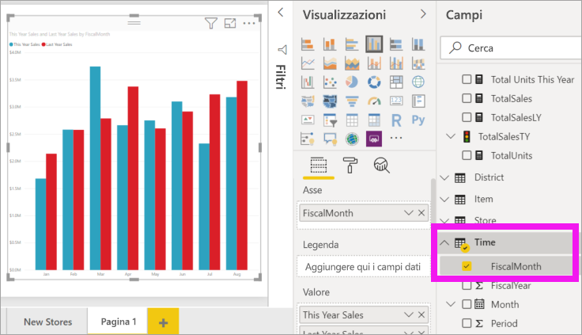
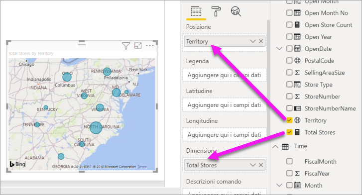
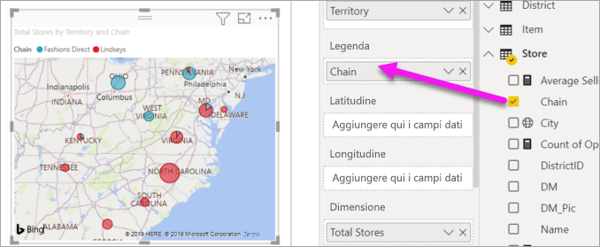

# Parte 2, Aggiungere visualizzazioni a un report di Power BI

[!INCLUDE [power-bi-visuals-desktop-banner](../includes/power-bi-visuals-desktop-banner.md)]

Nella[Parte 1](power-bi-report-add-visualizations-i.md) è stata creata una visualizzazione di base tramite la selezione delle caselle di controllo accanto ai nomi dei campi.  Nella Parte 2 si apprenderà come usare il trascinamento della selezione e sfruttare al massimo le funzionalità dei riquadri **Campi** e **Visualizzazioni** per creare e modificare le visualizzazioni.

## Creare una nuova visualizzazione
In questa esercitazione verrà esaminato in dettaglio il set di dati Retail Analysis (Analisi delle vendite al dettaglio) e verranno create alcune visualizzazioni chiave.

## Prerequisiti

Questa esercitazione usa il [file PBIX di esempio Retail Analysis](http://download.microsoft.com/download/9/6/D/96DDC2FF-2568-491D-AAFA-AFDD6F763AE3/Retail%20Analysis%20Sample%20PBIX.pbix) (Analisi delle vendite al dettaglio).

1. Nella sezione in alto a sinistra della barra dei menu di Power BI Desktop selezionare **File** > **Apri**.
   
2. Trovare la copia del **file Retail Analysis Sample PBIX**

1. Aprire il **file Retail Analysis Sample PBIX** nella visualizzazione report .

1. Seleziona  per aggiungere una nuova pagina.

## Aggiungere visualizzazioni al report

Creare una visualizzazione selezionando un campo dal riquadro **Campi**. Il tipo di visualizzazione creato dipende dal tipo di campo selezionato. Power BI usa il tipo di dati per determinare la visualizzazione da usare per visualizzare i risultati. È possibile modificare la visualizzazione usata selezionando un'icona diversa nel riquadro Visualizzazioni. Tenere presente che i dati non possono essere visualizzati in tutte le visualizzazioni. I dati geografici, ad esempio, non vengono visualizzati correttamente in un grafico a imbuto o in un grafico a linee. 

### Aggiungere un grafico ad area che visualizza il confronto tra le vendite dell'anno corrente e quelle dell'anno precedente.

1. Nella tabella **Sales** selezionare **This Year Sales** > **Value** e **Last Year Sales**. Power BI crea un istogramma.  Questo grafico è interessante ed è utile approfondire l'analisi. Come sono suddivise le vendite per mese?  
   
   

2. Dalla tabella Time trascinare **FiscalMonth** nell'area **Asse**.  
   

3. [Modificare la visualizzazione](power-bi-report-change-visualization-type.md) in un grafico ad area.  Sono disponibili molti tipi di visualizzazione. Per scegliere il tipo più appropriato da usare, vedere le [relative descrizioni, le procedure consigliate e le esercitazioni](power-bi-visualization-types-for-reports-and-q-and-a.md). Nel riquadro Visualizzazioni selezionare l'icona del grafico ad area .

4. Ordinare la visualizzazione selezionando **Altre azioni** (...) e scegliendo **Ordina per** >  **FiscalMonth**.

5. [Ridimensionare la visualizzazione](power-bi-visualization-move-and-resize.md) selezionandola e trascinando uno dei cerchi sul contorno. Ingrandirla quanto basta per eliminare la barra di scorrimento, ma lasciando spazio sufficiente per aggiungere un'altra visualizzazione.
   
   
6. [Salvare il report](../service-report-save.md).

### Aggiungere una visualizzazione della mappa in cui sono inclusi i dati sulle vendite per località

1. Nella tabella **Store** selezionare **Territory**. Trascinare **Total Stores** nell'area Dimensioni. Power BI riconosce Territory come località e crea una visualizzazione della mappa.  
   

2. Aggiungere una legenda.  Per visualizzare i dati in base al nome dell'archivio, trascinare **Store** > **Chain**.  
   

## Passaggi successivi
* Altre informazioni sulle [visualizzazioni nei report di Power BI](power-bi-report-visualizations.md).  
* Altre domande? [Provare la community di Power BI](http://community.powerbi.com/)

